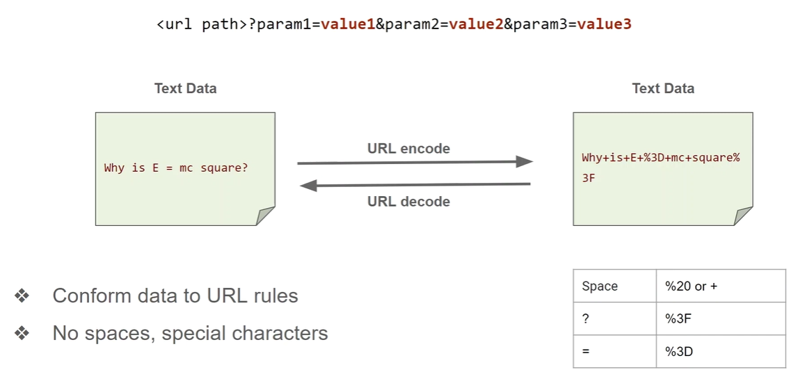

# URL Encoding 



**URL Encoding** (also called **Percent Encoding**) converts unsafe or special characters into a format that can be safely transmitted in a URL.

“URL encoding ensures safe transmission of data in URLs by converting reserved or unsafe characters into a percent-encoded format, preventing ambiguity in request parsing and enabling secure data handling.”

It replaces characters with:
```
% + hexadecimal ASCII value
```

Example:
```
space → %20  
@ → %40  
# → %23
```

---
### 🤔 Why URL Encoding is Needed?

URLs can only safely contain a limited set of characters:
- Letters (A–Z, a–z)
- Numbers (0–9)
- Some safe symbols (`- _ . ~`)

But what if you want to send:
- Spaces
- Special characters (`&`, `?`, `=`, `/`)
- Non-ASCII data (like emojis or Unicode)

👉 These can **break the URL structure** or be misinterpreted.

---

### ⚠️ Problem Without Encoding

Example:
```
https://example.com/search?name=akshit&role=admin
```

Here:
- `&` separates parameters
- `=` assigns values

Now imagine:
name=akshit&role=admin
What if `name = "akshit&role=admin"` literally?

👉 Server gets confused → **wrong parsing

---

### ✅ Solution: URL Encoding

```
akshit&role=admin  
↓  
akshit%26role%3Dadmin
```

Now the server correctly understands it as **data, not structure**

### ⚙️ How URL Encoding Works

Each character → ASCII → Hex → `%XX`

Example:
```
" " (space)  
ASCII: 32  
Hex: 20  
Encoded: %20
```

---

### 🧠 Common Encodings

|Character|Encoded|
|---|---|
|Space|%20|
|@|%40|
|&|%26|
|=|%3D|
|/|%2F|
|?|%3F|
|#|%23|

---

### 🔁 Encoding Example

Original:
```
https://example.com/search?q=hello world
```

Encoded:
```
https://example.com/search?q=hello%20world
```
# Base 64 Encoding

**Base64** is an **encoding scheme** (not encryption) used to convert **binary data → text format**.

It represents data using only:
```
A–Z, a–z, 0–9, +, /
```
(plus `=` for padding)

### 🤔 Why do we use Base64?
Because many systems only safely handle **text (ASCII)**, not raw binary.

Common use cases:
- Sending attachments in emails (MIME)
- Encoding data in APIs (JSON, REST)
- Storing binary in databases/logs
- Web tokens (JWT)
- Obfuscation in malware/phishing

### ⚙️ How Base64 Works (Core Logic)

#### Step 1: Convert data to binary

Example: `"Hi"`
H → 01001000  
i → 01101001

---
#### Step 2: Group into 6-bit chunks

Combine:
0100100001101001

Split into 6 bits:
010010 000110 1001
(If not divisible by 6 → padding added)

---

#### Step 3: Convert each 6-bit chunk → decimal → Base64 character

| Binary | Decimal | Base64 |
| ------ | ------- | ------ |
| 010010 | 18      | S      |
| 000110 | 6       | G      |
| 1001   | pad     | k=     |

Final result:
"Hi" → SGk=

---
### 🧠 Key Concept (Important for Interviews)

- Base64 uses **6 bits per character**
- Normal ASCII uses **8 bits per character**
- That’s why Base64 increases size by ~33%

