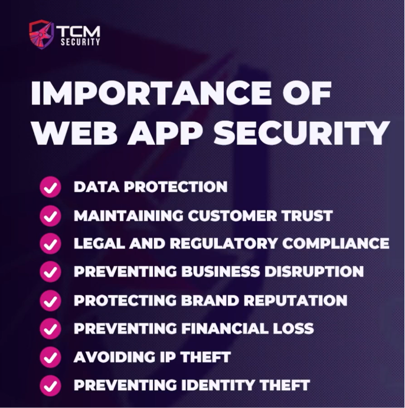

# Importance of Web Application Security

---

## What Is Web Application Security?

**Web application security** is the practice of securing web applications and ensuring they are safe from threats.

- A **web application** is essentially any website — Google, Facebook, banking portals, etc.
- Every web app has different architectures and capabilities, but **all of them need security**

---

## Why Is Web Application Security Important?

### 1. Data Protection

- Applications handle **sensitive data**: user information, payment details, confidential records
- The goal is to protect data from **unauthorized access or theft**
- Data breaches happen constantly — if you're reading this, your information has likely been part of one at some point

### 2. Maintaining Customer Trust

- Repeated breaches = **lost customers**
- When users enter their data, they're **trusting the business** to keep it safe
- Failing that trust damages the relationship — sometimes permanently

### 3. Regulatory & Legal Compliance

- Many regions and industries have **strict regulations** on data handling and protection
- Failing to secure a web app can lead to:
    - **Non-compliance**
    - **Fines and legal actions**
    - **Loss of customers**

> [!tip] Real-World Insight
> The most common pentest types are **external pentests** and **web app pentests** — largely because they are **compliance-driven**. Many clients don't want a pentest; they need one because regulations require it.

### 4. Preventing Business Disruption

- Cyberattacks can lead to **downtime and operational disruption**
- Attackers may **deface** a website or **delete backend data**, causing outages
- Outages → loss of revenue and operational capacity

### 5. Financial Loss

- Attacks cause financial damage through:
    - Business disruption
    - Fraud and theft
    - Legal fees and breach consequences

> [!important]
> The **average cost of a single data breach is ~$4 million**. Many small businesses cannot survive that kind of financial hit.

### 6. Brand Reputation

- Even a **single breach** can take **years** to recover from in terms of customer trust
- Damaged reputation → long-term financial loss

### 7. Intellectual Property (IP) Theft

- Corporations hold valuable **IP**: source code, trade secrets, patents
- IP can be the **most valuable asset** of an organization
- A significant portion of hacking is specifically aimed at **stealing IP**

### 8. Identity Theft

- Stolen personal data (SSN, name, DOB, etc.) can be used to:
    - Open **bank accounts** in the victim's name
    - Open **credit cards**
    - Commit **fraud**

---

## Summary

> [!note] The Core Goals of Web Application Security
> 1. **Protect data** from unauthorized access
> 2. **Maintain customer trust**
> 3. **Stay compliant** with regulations
> 4. **Prevent**: financial loss, business disruption, brand damage, IP theft, identity theft

As hackers (ethical), we find bugs for **good cause** — helping organizations protect themselves and their users' data. Without web application security, every item on this list becomes a real threat to the organization.