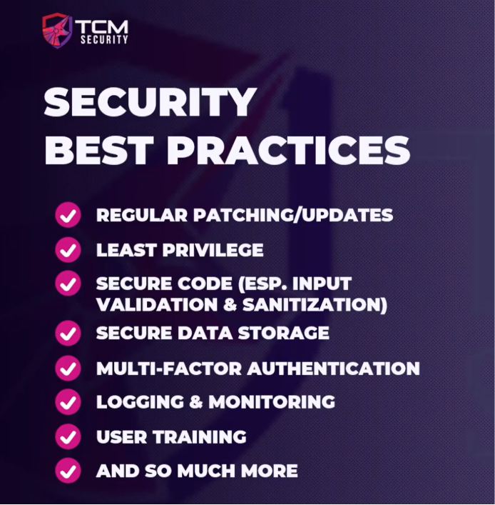
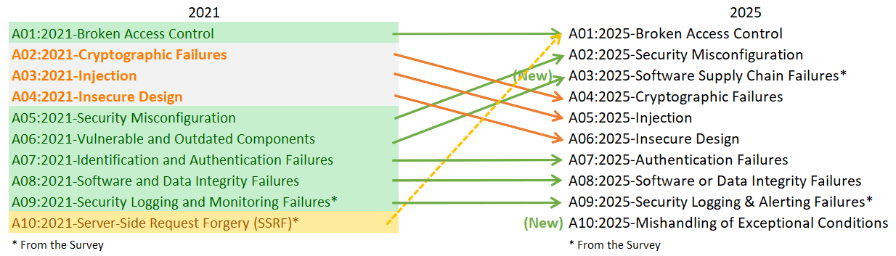
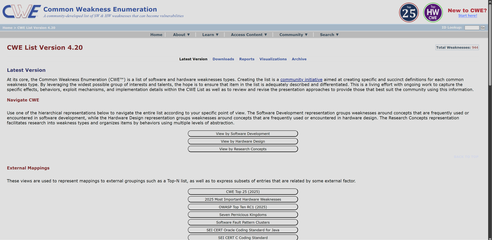
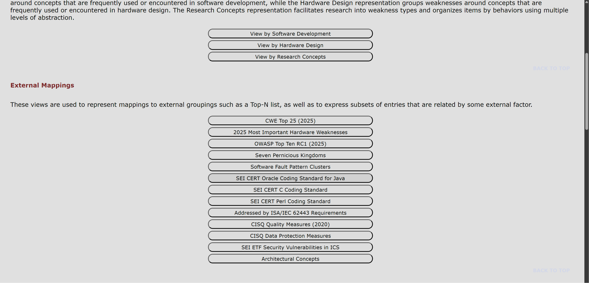
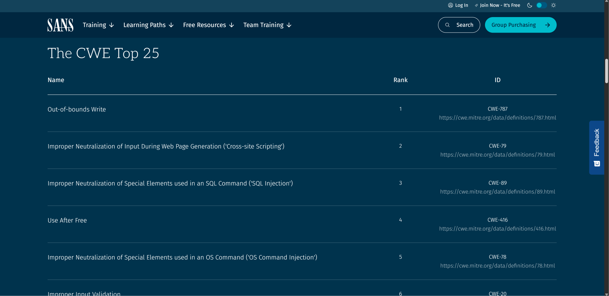
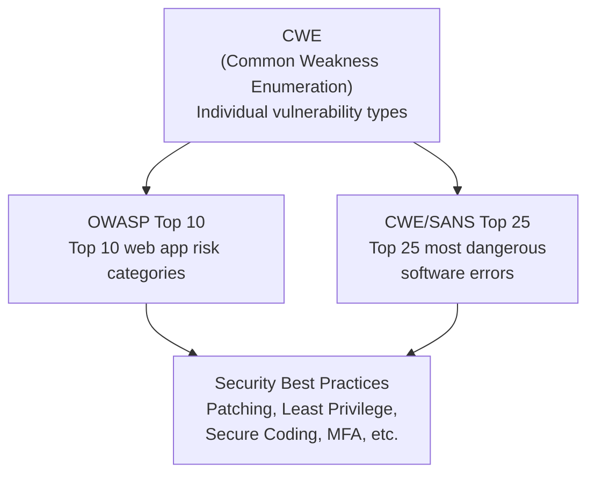

# Web Application Security Standards and Best Practices

---

## Security Best Practices

### 1. Regular Patching & Updates

- Keep all servers, software, and components **up to date** to patch known vulnerabilities
- Zero-day vulnerabilities are hard to patch (unknown), but known vulnerabilities should always be addressed
- Legacy vulnerabilities that have been around for **over a decade** are still found regularly in the wild

### 2. Principle of Least Privilege

- Only grant **necessary permissions** to those who need them
- If everyone has access to everything → compromising **any** user gives full access
- If only a select few have sensitive access → attacker must specifically target those users

### 3. Secure Coding

- Many universities and bootcamps **do not teach secure coding** — developers leave school with insecure habits
- **Input sanitization & validation** is a prime example:
    - Prevents injection vulnerabilities (SQLi, XSS, etc.)
    - Ties directly to many OWASP Top 10 and CWE entries
- Secure coding training is becoming more common but still not widespread enough

### 4. Secure Data Storage (Data at Rest)

- Encrypt all sensitive data **at rest**

### 5. Secure Data Transit

- Use protocols like **HTTPS** — yet many sites in 2023+ still use plain HTTP
- Encrypt data **in transit** to prevent interception

### 6. Multi-Factor Authentication (MFA)

- Use **at least two** authentication factors:
    - Something you **know** (password)
    - Something you **have** (phone, token)
    - Something you **are** (biometrics)
- If MFA is missing → write it up as a finding on a pentest (it's a best practice now)
- MFA forces attackers to bypass an extra layer (social engineering, etc.) — most will **move on to easier targets**

> [!tip] Attacker Mindset
> Hackers are lazy — they look for the **easiest wins**. Adding friction (like MFA) makes them move to the next target.

### 7. Logging & Monitoring

- **Monitor** applications in real time to detect and block attacks
- **Collect logs** for:
    - Real-time detection
    - Audit purposes
    - Post-breach forensics — find out **where, when, and why** it happened

### 8. User Training

- **Security awareness training** — prevent phishing, social engineering
    - AI now enables attackers to write **well-crafted phishing emails** (no more grammar mistakes)
    - AI **voice cloning** + spoofed phone numbers → much harder to detect
- **Developer training** — send developers through secure coding courses
- Keep up to date with recent vulnerabilities and defense techniques

> [!important]
> If all of these best practices were properly implemented, pentesters and bug bounty hunters would almost be out of a job.

---

## Web Security Standards & Frameworks

### OWASP Top 10

🔗 [https://owasp.org/Top10/](https://owasp.org/Top10)

The OWASP Top 10 is the most well-known web security standard. It is updated every few years and maps to **CWEs** (Common Weakness Enumerations).

#### OWASP Top 10 (2025)

| Rank | Category | Notes |
| --- | --- | --- |
| A01 | [Broken Access Control](https://owasp.org/Top10/2025/A01_2025-Broken_Access_Control/) | #1 — most serious risk. 3.73% of apps tested. SSRF rolled into this category |
| A02 | [Security Misconfiguration](https://owasp.org/Top10/2025/A02_2025-Security_Misconfiguration/) | Moved up from #5 (2021). 3.00% of apps. Config-driven behavior increasing |
| A03 | [Software Supply Chain Failures](https://owasp.org/Top10/2025/A03_2025-Software_Supply_Chain_Failures/) | Expanded from "Vulnerable & Outdated Components". Fewest occurrences but highest exploit/impact scores |
| A04 | [Cryptographic Failures](https://owasp.org/Top10/2025/A04_2025-Cryptographic_Failures/) | Fell from #2 to #4. 3.80% of apps. Leads to sensitive data exposure or system compromise |
| A05 | [Injection](https://owasp.org/Top10/2025/A05_2025-Injection/) | Fell from #3 to #5. Most tested category. Includes XSS (high freq/low impact) to SQLi (low freq/high impact) |
| A06 | [Insecure Design](https://owasp.org/Top10/2025/A06_2025-Insecure_Design/) | Dropped from #4 to #6. Industry improvements in threat modeling noted |
| A07 | [Authentication Failures](https://owasp.org/Top10/2025/A07_2025-Authentication_Failures/) | Renamed from "Identification and Authentication Failures". Standardized auth frameworks helping |
| A08 | [Software or Data Integrity Failures](https://owasp.org/Top10/2025/A08_2025-Software_or_Data_Integrity_Failures/) | Focused on trust boundaries and verifying integrity of software/code/data |
| A09 | [Security Logging & Alerting Failures](https://owasp.org/Top10/2025/A09_2025-Security_Logging_and_Alerting_Failures/) | Renamed to emphasize alerting. Logging without alerting = minimal value |
| A10 | [Mishandling of Exceptional Conditions](https://owasp.org/Top10/2025/A10_2025-Mishandling_of_Exceptional_Conditions/) | **New for 2025**. Improper error handling, failing open, logical errors |

> [!note] Bug Bounty vs Pentest — Reporting Differences
> - **Pentest**: Finding a vulnerable/outdated component is reportable even without a working exploit
> - **Bug Bounty**: Only reportable if the vulnerability **directly leads to exploitable impact** (e.g., an unpatched XSS that you can actually trigger)

> [!tip] Learning Strategy
> Don't just read the OWASP Top 10 list — **click into each category**. They provide:
> - Prevention guides
> - Attack scenarios
> - Cheat sheets (e.g., SQL Injection Prevention guide)
> - Code examples showing what the vulnerability looks like

---

### Common Weakness Enumeration (CWE)

🔗 [https://cwe.mitre.org/index.html](https://cwe.mitre.org/index.html)

- CWEs are the **building blocks** that OWASP Top 10 and SANS Top 25 map to
- Navigate via **CWE List → Software Development** category for web-relevant entries
- Each CWE entry provides:
    - **Hierarchy** — parent/child relationships (e.g., "Guessable CAPTCHA" is a child of "Weak Authentication" which is a child of "Incorrect Authorization")
    - **Code examples** showing the vulnerability
    - **CVE references** — real-world instances
    - **Mitigations** — how to fix it

> [!tip] Research Method
> When learning about a vulnerability type:
> 1. Find the CWE entry
> 2. Read the description and code examples
> 3. Look up related blogs, write-ups, and CVEs
> 4. Understand what the code looks like **under the hood** and how to fix it

---

### CWE/SANS Top 25

🔗 [https://www.sans.org/top25-software-errors/](https://www.sans.org/top25-software-errors)

| Rank | Name | CWE ID |
| --- | --- | --- |
| 1 | Out-of-bounds Write | [CWE-787](https://cwe.mitre.org/data/definitions/787.html) |
| 2 | Cross-site Scripting (XSS) | [CWE-79](https://cwe.mitre.org/data/definitions/79.html) |
| 3 | SQL Injection | [CWE-89](https://cwe.mitre.org/data/definitions/89.html) |
| 4 | Use After Free | [CWE-416](https://cwe.mitre.org/data/definitions/416.html) |
| 5 | OS Command Injection | [CWE-78](https://cwe.mitre.org/data/definitions/78.html) |
| 6 | Improper Input Validation | [CWE-20](https://cwe.mitre.org/data/definitions/20.html) |
| 7 | Out-of-bounds Read | [CWE-125](https://cwe.mitre.org/data/definitions/125.html) |
| 8 | Path Traversal | [CWE-22](https://cwe.mitre.org/data/definitions/22.html) |
| 9 | Cross-Site Request Forgery (CSRF) | [CWE-352](https://cwe.mitre.org/data/definitions/352.html) |
| 10 | Unrestricted Upload of Dangerous File | [CWE-434](https://cwe.mitre.org/data/definitions/434.html) |
| 11 | Missing Authorization | [CWE-862](https://cwe.mitre.org/data/definitions/862.html) |
| 12 | NULL Pointer Dereference | [CWE-476](https://cwe.mitre.org/data/definitions/476.html) |
| 13 | Improper Authentication | [CWE-287](https://cwe.mitre.org/data/definitions/287.html) |
| 14 | Integer Overflow or Wraparound | [CWE-190](https://cwe.mitre.org/data/definitions/190.html) |
| 15 | Deserialization of Untrusted Data | [CWE-502](https://cwe.mitre.org/data/definitions/502.html) |
| 16 | Command Injection | [CWE-77](https://cwe.mitre.org/data/definitions/77.html) |
| 17 | Improper Restriction of Memory Buffer Operations | [CWE-119](https://cwe.mitre.org/data/definitions/119.html) |
| 18 | Use of Hard-coded Credentials | [CWE-798](https://cwe.mitre.org/data/definitions/798.html) |
| 19 | Server-Side Request Forgery (SSRF) | [CWE-918](https://cwe.mitre.org/data/definitions/918.html) |
| 20 | Missing Authentication for Critical Function | [CWE-306](https://cwe.mitre.org/data/definitions/306.html) |
| 21 | Race Condition | [CWE-362](https://cwe.mitre.org/data/definitions/362.html) |
| 22 | Improper Privilege Management | [CWE-269](https://cwe.mitre.org/data/definitions/269.html) |
| 23 | Code Injection | [CWE-94](https://cwe.mitre.org/data/definitions/94.html) |
| 24 | Incorrect Authorization | [CWE-863](https://cwe.mitre.org/data/definitions/863.html) |
| 25 | Incorrect Default Permissions | [CWE-276](https://cwe.mitre.org/data/definitions/276.html) |

---

## How the Standards Relate

> [!note] Key Relationship
> - **CWEs** are the granular, individual vulnerability types
> - **OWASP Top 10** and **SANS Top 25** are curated lists built from CWEs
> - **Best practices** (secure coding, patching, MFA, etc.) are the defenses that address these vulnerabilities
