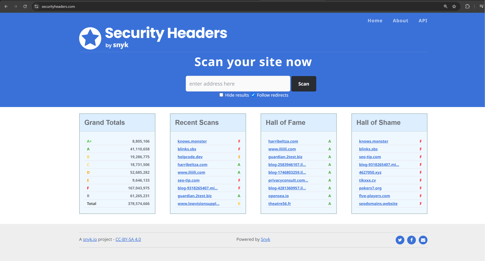
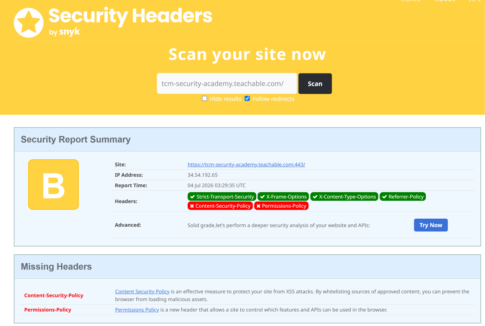
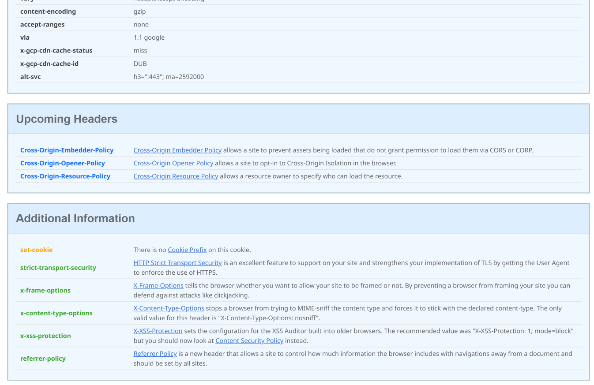
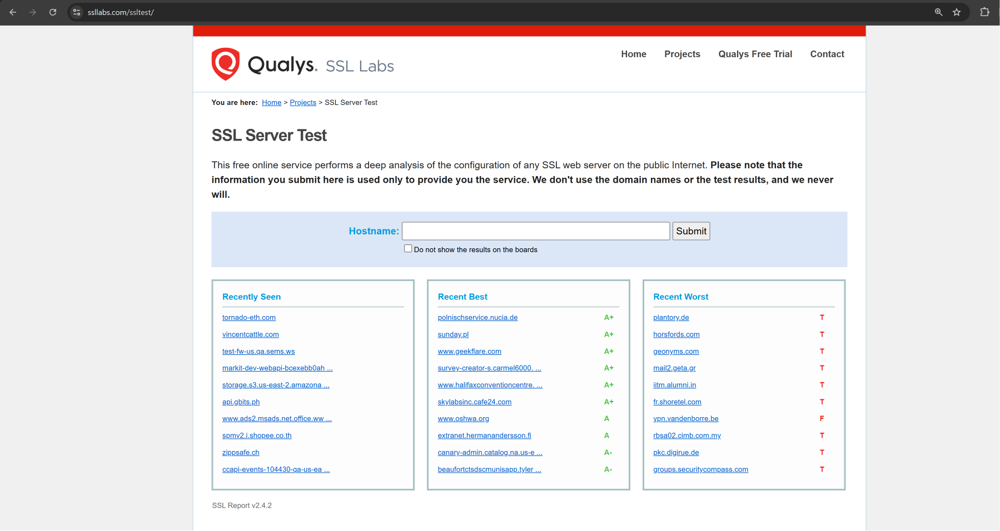
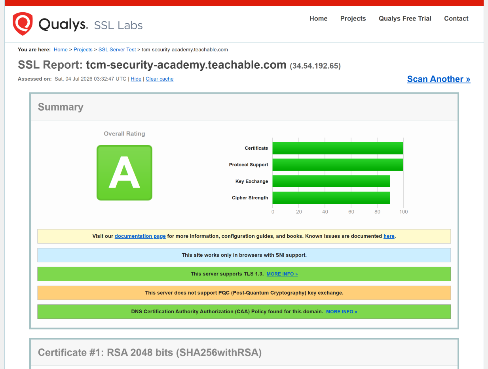
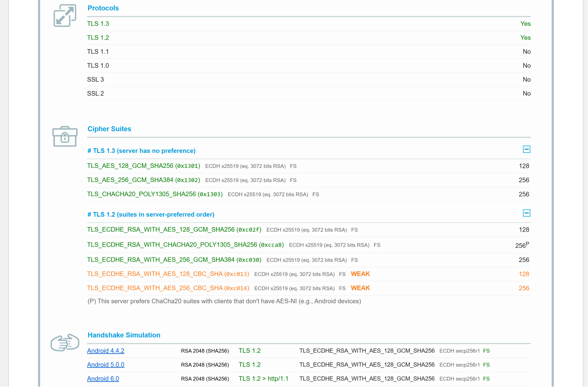
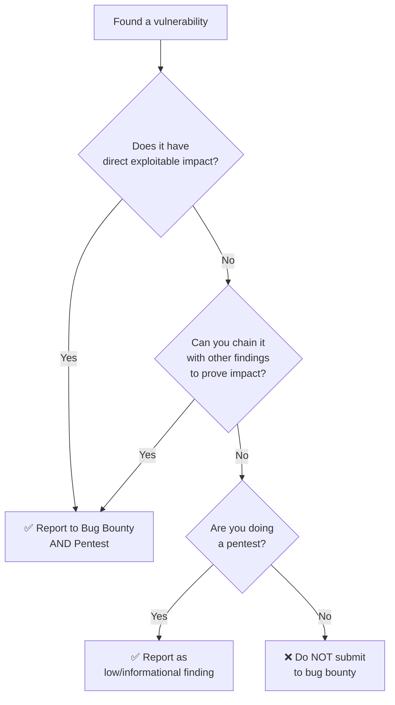

# Bug Bounty Hunting vs Penetration Testing

---

## The Core Difference

> [!important] Bug Bounty = Impact, Impact, Impact
> In bug bounty, you must **prove exploitable impact**. A low-level finding alone is worthless — you need to show it leads to actual compromise.
>
> In pentesting, **every finding matters** — from low-level informational items all the way to critical vulnerabilities.

| | Penetration Testing | Bug Bounty Hunting |
| --- | --- | --- |
| **Scope** | Entire application — all findings reported | May focus on one part of the app or one bug type |
| **Finding threshold** | Low → Critical (everything reported) | Only **high-impact, exploitable** vulnerabilities |
| **Driver** | Mostly **compliance-driven** | Impact & payout-driven |
| **Time** | Limited engagement window | Unlimited (ongoing programs) |
| **Target maturity** | Varies — many first-time assessments | Usually **more mature & secure** (already pentested) |
| **Payout model** | Fixed contract fee | Per-vulnerability bounty (higher impact = higher payout) |

---

## Example: Admin Panel Discovery

| Scenario | Pentest | Bug Bounty |
| --- | --- | --- |
| Found an admin panel accessible from the internet | ✅ Reportable finding | ❌ Rejected — "not a bug" |
| Found admin panel **+ accessed an admin account** | ✅ Critical finding | ✅ Reportable — **proven impact** |
| Found admin panel **+ exploited a vulnerability on it** | ✅ Critical finding | ✅ Reportable — **proven impact** |

> [!tip] Bug Bounty Mindset
> Always ask: *"Can I get somewhere I should not have gotten, and utilize that access to have impact?"*

---

## Non-Impact Findings (Pentest ✅ / Bug Bounty ❌)

These are common pentest findings that will get **rejected** if submitted to a bug bounty program on their own:

### 1. Weak Password Policy

- Example: 8-character minimum password requirement
- **Pentest**: Report it — an attacker with unlimited time could guess passwords
- **Bug Bounty**: Rejected on its own — where's the impact?

### 2. Chaining Low-Level Findings → Impact

Consider stacking multiple weak findings together:

| Finding | On Its Own | Chained Together |
| --- | --- | --- |
| Weak password policy | ❌ No impact | ↓ |
| No account lockout policy | ❌ No impact | ↓ |
| Unlimited login attempts (no CAPTCHA) | ❌ No impact | ↓ |
| User account enumeration | ❌ No impact | ↓ |
| **= Brute-forced into a sensitive account** | | ✅ **Now there's impact** |

> [!note] Key Lesson
> On a **pentest**, each of these is reported individually. On a **bug bounty**, you must **chain them together** and prove you actually compromised an account.
>
> Don't submit "weak password policy" alone to a bug bounty — it will be rejected.

### 3. Out-of-Date Software

- **Pentest**: Report as a patching issue regardless
- **Bug Bounty**: Only if you can **exploit** the outdated software to demonstrate impact

### 4. Missing Cookie Flags (e.g., `HttpOnly`)

- The `HttpOnly` flag ensures cookies are **not accessible by client-side scripts** (JavaScript)
- **Pentest**: Missing `HttpOnly` flag → reportable finding
- **Bug Bounty**: Missing flag alone → rejected

**But with chaining:**
- Missing `HttpOnly` flag **+ XSS vulnerability** → steal admin cookies → session hijack → **impact proven** ✅

### 5. Security Headers

🔗 [https://securityheaders.com/](https://securityheaders.com/)

- Tools like SecurityHeaders.com grade a site's HTTP security headers (A+ to F)
- Example: `tcm-sec.com` scored a **C** — missing headers like Content-Security-Policy
- **Pentest**: Report missing headers as best-practice findings (e.g., CSP protects against XSS)
- **Bug Bounty**: A bad grade alone has **zero impact** — not submittable

> [!warning]
> Just because a site scores poorly on security headers does **not** mean it should be submitted to a bug bounty or VDP program.

### 6. Weak Ciphers & Certificates

🔗 [https://www.ssllabs.com/ssltest/](https://www.ssllabs.com/ssltest/)

- SSL Labs tests cipher suites and certificate configurations
- Example: `tcm-sec.com` scored **A+** (100% certificate, ~90% key exchange) but still had some weak ciphers
- **Pentest**: Report weak/outdated ciphers — recommend removal
- **Bug Bounty**: No impact → not submittable

---

## Decision Framework

---

## Key Takeaways

- **Bug bounty** = prove impact or don't submit
- **Pentest** = report everything, low to critical
- Low-level findings can become impactful when **chained together**
- Always think: *"Did I actually get into something? Can I show damage?"*
- Common pentest-only findings: weak password policy, missing headers, weak ciphers, missing cookie flags, outdated software (without exploit)
- Bug bounty programs are typically **more mature and secure** — they've usually been pentested before
