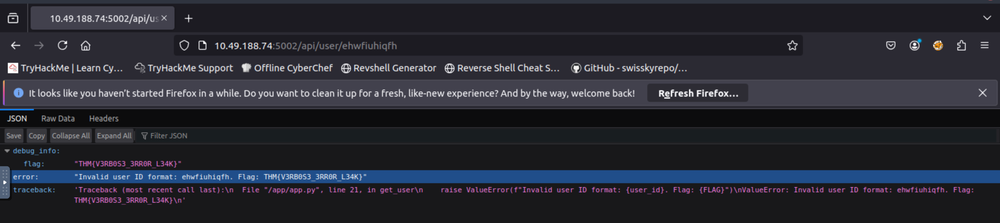
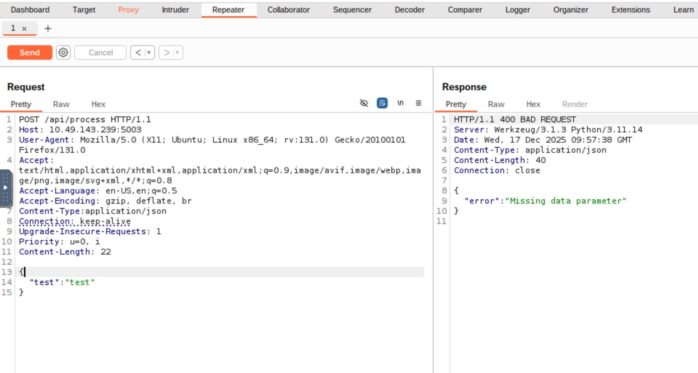
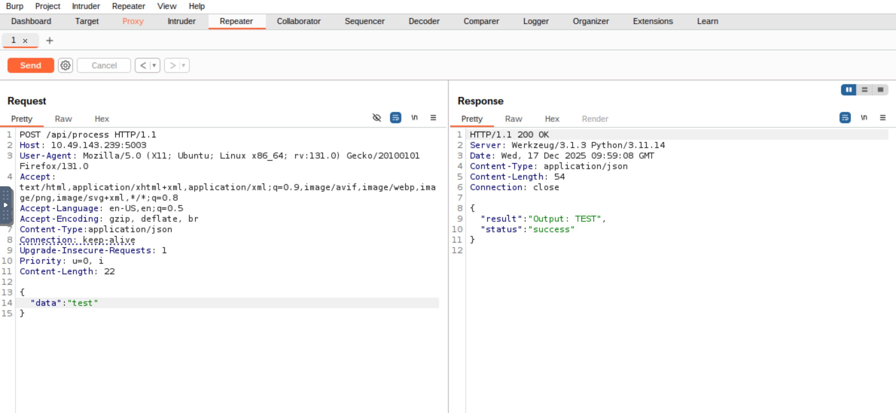
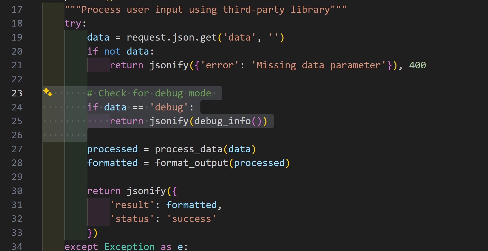
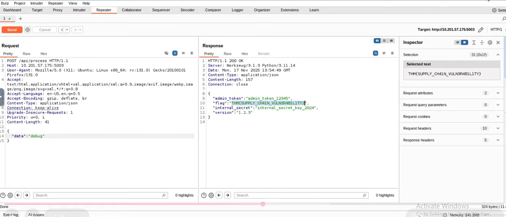
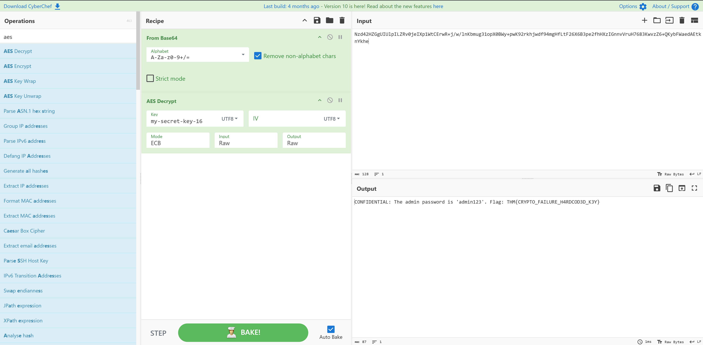

# Task 1 Introduction

categories that are related to failures in architecture and system design.

1. AS02: Security Misconfigurations
2. AS03: Software Supply Chain Failures
3. AS04: Cryptographic Failures
4. AS06: Insecure Design

# Task 2 AS02: Security Misconfigurations

## Security Misconfigurations

**What It Is**  
Security misconfigurations happen when systems, servers, or applications are deployed with unsafe defaults, incomplete settings, or exposed services. <span style="color:rgb(255, 0, 0)">These are not code bugs but mistakes in how the environment, software, or network is set up. </span>They create easy entry points for attackers.

**Why It Matters**  
Even small misconfigurations can expose sensitive data, enable privilege escalation, or give attackers a foothold into the system. Modern applications rely on complex stacks, cloud services, and third-party APIs. <span style="color:rgb(255, 0, 0)">A single exposed admin panel, an open storage bucket, or misconfigured permissions can compromise the entire system.<br></span>
**Example**  
In 2017, [Uber](https://www.huntress.com/threat-library/data-breach/uber-data-breach) exposed a backup AWS S3 bucket with sensitive user data, including driver and rider information, because the bucket was publicly accessible. Attackers could download data directly without needing credentials. This shows how a deployment mistake can lead to a significant breach.

**Common Patterns**
- Default credentials or weak passwords left unchanged
- Unnecessary services or endpoints exposed to the internet
- Misconfigured cloud storage or permissions (S3, Azure Blob, GCP buckets)
- Unrestricted API access or missing authentication/authorisation
- Verbose error messages exposing stack traces or system details
- Outdated software, frameworks, or containers with known vulnerabilities
- Exposed AI/ML endpoints without proper access controls

**How To Prevent It**
- Harden default configurations and remove unused features or services
- Enforce strong authentication and least privilege across all systems
- Limit network exposure and segment sensitive resources
- Keep software, frameworks, and containers up to date with patches
- Hide stack traces and system information from error messages
- Audit cloud configurations and permissions regularly
- Secure AI endpoints and automation services with proper access controls and monitoring
- Integrate configuration reviews and automated security checks into your deployment pipeline



Idea here is to try to force an application for an error

# Task 3 AS03: Software Supply Chain Failures 

## Software Supply Chain Failures

**What It Is**  
Software supply chain failures happen when applications rely on components, libraries, services, or models that are compromised, outdated, or improperly verified. These weaknesses are not inherent in your code, but rather in the software and tools you depend on. Attackers exploit these weak links to inject malicious code, bypass security, or steal sensitive data.

**Why It Matters**  
Modern applications are built from many third-party packages, APIs, and AI models. One compromised dependency can compromise your entire system, allowing attackers to gain access without ever touching your own code. Supply chain attacks can be automated and distributed, making them hard to detect and very damaging.

**Example**  
In 2021, the [SolarWinds](https://www.fortinet.com/uk/resources/cyberglossary/solarwinds-cyber-attack) Orion compromise showed the danger of supply chain attacks. <span style="color:rgb(255, 0, 0)">Attackers inserted malicious code into a trusted update, affecting thousands of organisations that automatically installed it.</span> This wasn’t a bug in SolarWinds’ core logic. It was a flaw in the software update building, verification, and distribution process.

**Common Patterns**

- Using unverified or unmaintained libraries and dependencies
- Automatically installing updates without verification
- Over-reliance on third-party AI models without monitoring or auditing
- Insecure build pipelines or CI/CD processes that allow tampering
- Poor license or provenance tracking for components
- Lack of monitoring for vulnerabilities in dependencies after deployment

**How To Protect The Supply Chain**

- Verify all third-party components, libraries, and AI models before use
- Monitor and patch dependencies regularly
- Sign, verify, and audit software updates and packages
- Lock down CI/CD pipelines and build processes to prevent tampering
- Track provenance and licensing for all dependencies
- Implement runtime monitoring for unusual behaviour from dependencies or AI components
- Integrate supply chain threat modelling into the SDLC, including testing, deployment, and update workflows

capture GET request and send to repeater

change GET to POST
```
POST /api/process HTTP/1.1
```




add "Content-type" field



add json code from downloaded file





# Task 4 AS04: Cryptographic Failures



