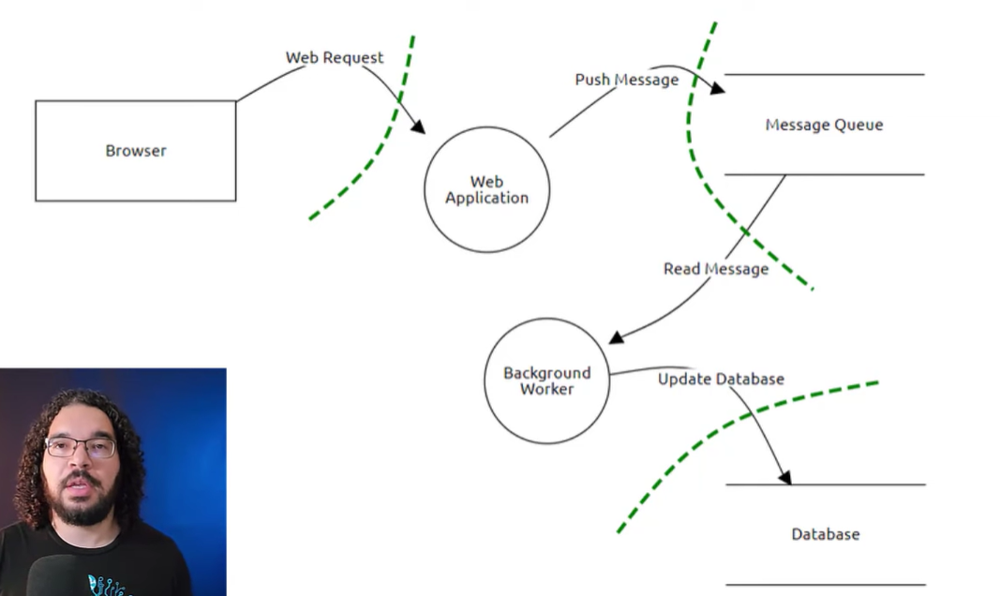
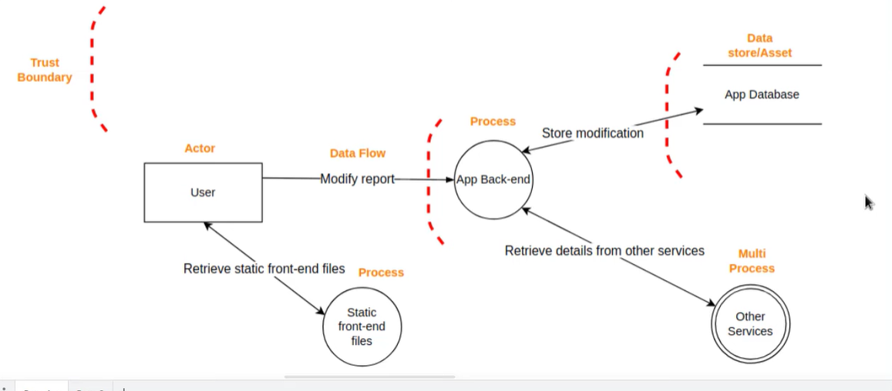
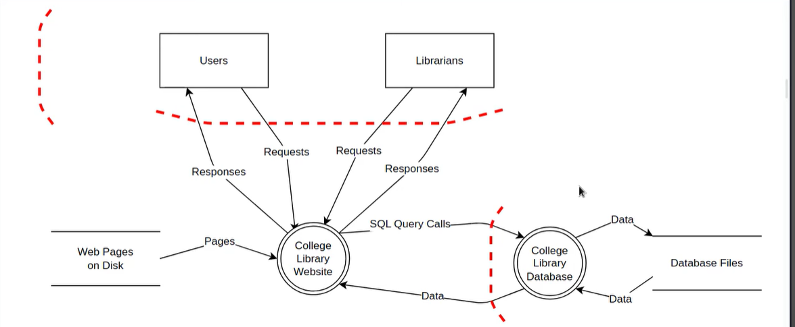
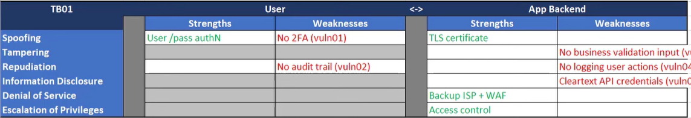
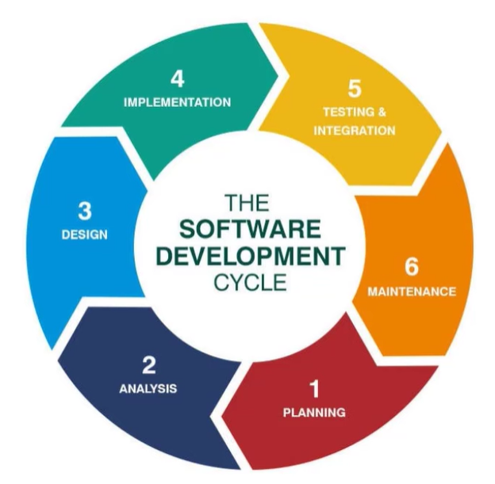

https://www.youtube.com/watch?v=rEnJYNkUde0

https://owasp.org/www-community/Threat_Modeling_Process

Dotted lines are trust boundried
unauthenticated user to authenticated user
regular user to power user to admin 

to do in step 1 itself of SLDC

Meetings with other teams
1. work with developers and architects to get an understanding of how an application works and any threat you can come up with 
2. in second meeting confirm with a developer and architect to confirm if everyone is on same page 
3. last meeting after you draft final version of threat model which includes data flow diagram and threats - add mitigations  and prioritize risks 