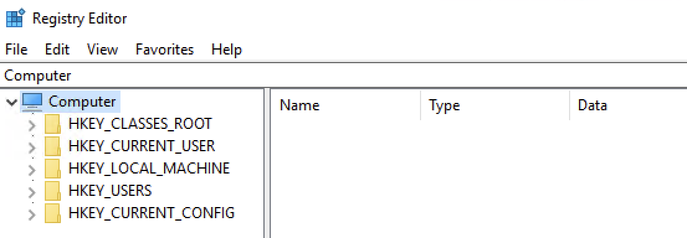

#  Windows Registry

The `dispatch-srv01` coordinates the drone-based gifts delivery. However, recently it was compromised.
investigate the registry of this compromised system.

The registry contains all the information that the Windows OS needs for its functioning.

(Registry) is not stored in one single place
It is made up of several separate files, each storing information on different configuration settings. These files are known as **Hives**.

The first column contains the hive names, the second column contains the type of configuration settings that each hive stores, and the third column contains the location of each hive on the disk. 

|Hive Name|Contains|Location|
|---|---|---|
|SYSTEM|- Services - Mounted Devices - Boot Configuration - Drivers - Hardware|`C:\Windows\System32\config\SYSTEM`|
|SECURITY|- Local Security Policies - Audit Policy Settings|`C:\Windows\System32\config\SECURITY`|
|SOFTWARE|- Installed Programs - OS Version and other info - Autostarts - Program Settings|`C:\Windows\System32\config\SOFTWARE`|
|SAM|- Usernames and their Metadata - Password Hashes - Group Memberships - Account Statuses|`C:\Windows\System32\config\SAM`|
|NTUSER.DAT|- Recent Files - User Preferences - User-specific Autostarts|`C:\Users\username\NTUSER.DAT`|
|USRCLASS.DAT|- Shellbags - Jump Lists|`C:\Users\username\AppData\Local\Microsoft\Windows\USRCLASS.DAT`|

These Registry Hives contain binary data that cannot be opened directly from the file.

there are some folders named `HKEY_LOCAL_MACHINE`, `HKEY_CURRENT_USER`, and more. But didn't we expect `SYSTEM`, `SECURITY`, `SOFTWARE`, etc., to be seen so we can view their data?

Windows organizes all the Registry Hives into these structured **Root Keys**. Instead of seeing the Registry Hives, you would always get these registry oot keys whenever you open the registry.

table below that maps the registry keys with their respective Registry Hives.

|Hive on Disk|Where You See It in Registry Editor|
|---|---|
|SYSTEM|`HKEY_LOCAL_MACHINE\SYSTEM`|
|SECURITY|`HKEY_LOCAL_MACHINE\SECURITY`|
|SOFTWARE|`HKEY_LOCAL_MACHINE\SOFTWARE`|
|SAM|`HKEY_LOCAL_MACHINE\SAM`|
|NTUSER.DAT|`HKEY_USERS\<SID> and HKEY_CURRENT_USER`|
|USRCLASS.DAT|`HKEY_USERS\<SID>\Software\Classes`|

In the table above, you can see that most of the Registry Hives are located under the `HKEY_LOCAL_MACHINE (HKLM)` key.

As you can see, the `SYSTEM`, `SOFTWARE`, `SECURITY`, and `SAM` hives are under the `HKLM` key. `NTUSER.DAT` and `USRCLASS.DAT` are located under `HKEY_USERS (HKU)` and `HKEY_CURRENT_USER (HKCU)`. 

**Note:** The other two keys (`HKEY_CLASSES_ROOT (HKCR)` and `HKEY_CURRENT_CONFIG (HKCC)`) are not part of any separate hive files. They are dynamically populated when Windows is running.

---

# Example 1: View Connected USB Devices

The registry stores information on the USB devices that have been connected to the system. This information is present in the `SYSTEM` hive. To view it:

1. Open the Registry Editor.
2. Navigate to the following path: `HKEY_LOCAL_MACHINE\SYSTEM\CurrentControlSet\Enum\USBSTOR`.
3. Here you will see the USB devices' information (make, model, and device ID).
4. Each device will have the following:
    1. A main subkey that is the identification of the type and manufacturer of the USB device.
    2. A subkey under the above (for example) that represents the unique devices under this model.

## Example 2: View Programs Run by the User

The registry stores information on the programs that the user ran using the Run dialog `Win + R`. This information is present in the `NTUSER.DAT` hive. To view it:

1. Open the Registry Editor.
2. Navigate to the following path: `HKEY_CURRENT_USER\Software\Microsoft\Windows\CurrentVersion\Explorer\RunMRU`.
3. Here you will see the list of commands typed by the user in the Run dialog to run applications.

---

## Registry Forensics

The table below lists some registry keys that are particularly useful during forensic investigations.

|Registry Key|Importance|
|---|---|
|`HKCU\Software\Microsoft\Windows\CurrentVersion\Explorer\UserAssist`|It stores information on recently accessed applications launched via the GUI.|
|`HKCU\Software\Microsoft\Windows\CurrentVersion\Explorer\TypedPaths`|It stores all the paths and locations typed by the user inside the Explorer address bar.|
|`HKLM\Software\Microsoft\Windows\CurrentVersion\App Paths`|It stores the path of the applications.|
|`HKCU\Software\Microsoft\Windows\CurrentVersion\Explorer\WordWheelQuery`|It stores all the search terms typed by the user in the Explorer search bar.|
|`HKLM\Software\Microsoft\Windows\CurrentVersion\Run`|It stores information on the programs that are set to automatically start (startup programs) when the users logs in.|
|`HKCU\Software\Microsoft\Windows\CurrentVersion\Explorer\RecentDocs`|It stores information on the files that the user has recently accessed.|
|`HKLM\SYSTEM\CurrentControlSet\Control\ComputerName\ComputerName`|It stores the computer's name (hostname).|
|`HKLM\SOFTWARE\Microsoft\Windows\CurrentVersion\Uninstall`|It stores information on the installed programs.|

It is because the Registry analysis cannot be done on the system under investigation (due to the chance of modification), so we collect the Registry Hives and open them offline into our forensic workstation. However, the Registry Editor does not allow opening offline hives. The Register editor also displays some of the key values in binary which are not readable.

To solve this problem, there are some tools built for registry forensics.

[**Registry Explorer**](https://ericzimmerman.github.io/) tool which is a registry forensics tool. It is open source and can parse the binary data out of the registry, and we can analyze it without the fear of modification.

---

## Practical

The Registry Hives have been collected and are available in the folder `C:\Users\Administrator\Desktop\Registry Hives` on the machine attached to this task.

**Step 1: Launch Registry Explorer**

Click on the Registry Explorer icon pinned to the taskbar of the target machine to launch it.

****

**Step 2: Load the Registry Hives**

Once Registry Explorer opens with an empty interface, follow these steps to load the hives:

1. Click the **File** option from the top menu
2. Select **Load hive** from the dropdown

**Step 3: Handling Dirty Hives**

While loading Registry Hives, it is important to know that these Registry Hives can sometimes be "dirty" when collected from live systems, meaning they may have incomplete transactions. To ensure clean loading:

1.On the **Load hives** pop-up, navigate to `C:\Users\Administrator\Desktop\Registry Hives   `2. Select the desired hive file (e.g., SYSTEM)  
**3. Hold SHIFT**, then press **Open** to load associated transaction log files. This ensures you get a clean, consistent hive state for analysis.

4. You'll be prompted with a message indicating successful replay for transaction logs  
5. Repeat the same process for all the other hives you want to load

**Step 4: Investigating Registry Keys**

After loading the `SYSTEM` hive, you can navigate to specific registry keys for investigation. Let's practice by finding the computer name:

- Navigate to: `ROOT\ControlSet001\Control\ComputerName\ComputerName`. Or you can also just type "ComputerName" in the search bar to quickly locate the key, as shown below.

- Alternatively, you can click the **Available Bookmarks** tab and navigate to the **ComputerName** key from there.
- Examine the values to identify the system's hostname. Under the **Data** value, you'll find `DISPATCH-SRV01`.

# HKCU -> can't be software hive. SOFTWARE would be in HKCM

## 1️⃣ What you’re confused about (in simple words)

You’re thinking:

> “`HKCU\Software\...` can’t exist because **SOFTWARE** is a hive and hives live under **HKLM** (or HKCM).”

This sounds logical, but it mixes **two different concepts**:

- **Logical registry keys** (what we see in regedit)
    
- **Physical registry hive files** (where data is stored on disk)
    

---

## 2️⃣ Key idea (MOST IMPORTANT)

👉 **`HKCU\Software` is NOT a hive**  
👉 **`SOFTWARE` is a key name, not a hive**

---

## 3️⃣ What is a registry hive, really?

A **hive** is a **physical file on disk** that stores registry data.

### Main physical hive files on disk

|Hive file|Stored at|Loaded as|
|---|---|---|
|`SOFTWARE`|`C:\Windows\System32\Config\SOFTWARE`|`HKLM\SOFTWARE`|
|`SYSTEM`|`C:\Windows\System32\Config\SYSTEM`|`HKLM\SYSTEM`|
|`NTUSER.DAT`|`C:\Users\<user>\NTUSER.DAT`|`HKCU`|

So:

- **HKLM\SOFTWARE** comes from the **SOFTWARE hive file**
    
- **HKCU** comes from **NTUSER.DAT**
    

---

## 4️⃣ Why does `HKCU\Software` exist then?

Because **`Software` is just a key name**, not a hive.

Inside the user’s hive (`NTUSER.DAT`), Microsoft created a key called:

`HKCU\Software`

This is completely valid and very common.

---

## 5️⃣ Visual mapping (this usually makes it click)

### Physical files → Logical registry view

`C:\Users\Alice\NTUSER.DAT    └── Software        └── Microsoft            └── Windows                └── CurrentVersion                    └── Run`

⬇️ Appears in regedit as:

`HKCU\Software\Microsoft\Windows\CurrentVersion\Run`

So:

- `HKCU` = user hive (NTUSER.DAT)
    
- `Software` = a **folder/key inside that hive**
    

---

## 6️⃣ What about HKCM?

You mentioned **HKCM** (HKEY_CURRENT_MACHINE) — I think you meant **HKLM**.

### HKLM (HKEY_LOCAL_MACHINE)

- System-wide settings
    
- Backed by hive files like:
    
    - `SYSTEM`
        
    - `SOFTWARE`
        
- Affects **all users**
    

### HKCU (HKEY_CURRENT_USER)

- User-specific settings
    
- Backed by:
    
    - `NTUSER.DAT`
        
- Affects **only the logged-in user**
    

---

## 7️⃣ Why attackers use `HKCU\Software\...\Run`

Because:

- It **does not require admin privileges**
    
- It persists **per user**
    
- It’s very reliable
    

That’s why malware loves:

`HKCU\Software\Microsoft\Windows\CurrentVersion\Run`

---

## 8️⃣ Final one-line explanation (memorize this)

> **HKCU is a hive loaded from NTUSER.DAT, and “Software” is just a key inside it — not a hive.**

---

## 9️⃣ Quick comparison (exam-ready)

|Path|Backed by|Scope|
|---|---|---|
|`HKCU\Software\...`|`NTUSER.DAT`|Current user|
|`HKLM\Software\...`|`SOFTWARE` hive|All users|

# explain why this is in HKCU and this is in HKLM 

"HKCU\Software\Microsoft\Windows\CurrentVersion\Explorer\UserAssist -  It stores information on recently accessed applications launched via the GUI."

"HKLM\SOFTWARE\Microsoft\Windows\CurrentVersion\Uninstall - It stores information on the installed programs."

## Core rule to remember (this explains everything)

> **HKCU = “things the _current user_ does or sees”**  
> **HKLM = “things installed on the _system_ for everyone”**

Once you keep that rule in mind, both keys make sense.

---

## 1️⃣ Why `UserAssist` is in **HKCU**

### Key:

`HKCU\Software\Microsoft\Windows\CurrentVersion\Explorer\UserAssist`

### What it stores:

- Recently executed programs
    
- Applications launched **via GUI** (Explorer, Start Menu, shortcuts)
    
- Execution count
    
- Last execution time (ROT13 encoded)
    

### 🔑 Why this MUST be in HKCU

Because **UserAssist data is per-user behavior**.

Different users on the same machine:

- Launch different programs
    
- Use different shortcuts
    
- Have different usage patterns
    

Example:

- User **Alice** opens `chrome.exe`
    
- User **Bob** never opens it
    

➡️ Windows **must store this separately per user**

That’s why:

- It lives in **HKCU**
    
- It’s backed by `NTUSER.DAT`
    
- Each user has their **own UserAssist data**
    

### 🧠 Think of it as:

> “What _this specific user_ clicked and ran in the GUI”

---

## 2️⃣ Why `Uninstall` is in **HKLM**

### Key:

`HKLM\SOFTWARE\Microsoft\Windows\CurrentVersion\Uninstall`

### What it stores:

- Installed applications
    
- Install paths
    
- Version numbers
    
- Uninstall commands
    
- Publisher info
    

### 🔑 Why this MUST be in HKLM

Because **installed programs affect the whole system**, not just one user.

When a program is installed:

- Files go into `Program Files`
    
- Registry entries affect services, drivers, shared DLLs
    
- All users can usually run the program
    

So Windows needs:

- **One central list**
    
- Visible to **all users**
    
- Managed by the system
    

➡️ That’s why it’s stored in **HKLM**, the system-wide hive.

### 🧠 Think of it as:

> “What software exists on this computer at all”

---

## 3️⃣ Side-by-side comparison (this makes it click)

|Aspect|UserAssist (HKCU)|Uninstall (HKLM)|
|---|---|---|
|Scope|Per user|System-wide|
|Who affects it|User actions|Installers|
|Backing hive|`NTUSER.DAT`|`SOFTWARE`|
|Requires admin?|No|Yes|
|Forensics use|User behavior|Software inventory|

---

## 4️⃣ Real-world forensic example

### Scenario:

- Malware runs **only when Alice logs in**
    
- It’s launched via a shortcut
    

You’ll see:

- ✔ Entry in `HKCU\UserAssist`
    
- ❌ No entry in `HKLM\Uninstall`
    

### Another scenario:

- Chrome is installed system-wide
    

You’ll see:

- ✔ Entry in `HKLM\Uninstall`
    
- ✔ Possible UserAssist entry **only for users who opened Chrome**
    

---

## 5️⃣ One-sentence takeaway (memorize this)

> **HKCU stores what a user does; HKLM stores what exists on the system.**

---

## 6️⃣ Why this matters for Blue Team / DFIR

- **UserAssist** → _who ran what, and when_
    
- **Uninstall** → _what software attackers added_
    
- Correlating both answers:
    
    - Was malware installed?
        
    - Or just executed once?
        
    - Which user was involved?

# Why you had to load **NTUSER.DAT** for UserAssist

## Big idea (this explains everything)

> **UserAssist and Uninstall live in different registry _hives_, and those hives are stored in different files on disk.**

That’s why you had to load **different files** in Registry Explorer.

---

## 1️⃣ Why you had to load **NTUSER.DAT** for UserAssist

### Registry path:

`HKCU\Software\Microsoft\Windows\CurrentVersion\Explorer\UserAssist`

### What HKCU really is

- `HKCU` (HKEY_CURRENT_USER) is **not a file**
    
- It is a **view** of the currently logged-in user’s registry hive
    

### Physical file on disk

For each user, Windows stores their registry in:

`C:\Users\<username>\NTUSER.DAT`

That file contains **all HKCU data for that user**, including:

- UserAssist
    
- Run keys
    
- Explorer settings
    
- Recently used files
    

### 🔍 So in forensics:

When you take disk copies and open them offline:

- Windows does **not** automatically know which user hive to load
    
- You must manually load:
    
    `NTUSER.DAT`
    

➡️ That’s why **UserAssist only appeared after loading NTUSER.DAT**

---

## 2️⃣ Why you had to load the **SOFTWARE** hive for Uninstall

### Registry path:

`HKLM\SOFTWARE\Microsoft\Windows\CurrentVersion\Uninstall`

### What HKLM really is

- `HKLM` (HKEY_LOCAL_MACHINE) stores **system-wide configuration**
    
- Shared by **all users**
    

### Physical file on disk

System-wide registry data is stored in:

`C:\Windows\System32\Config\SOFTWARE`

This hive contains:

- Installed applications
    
- OS configuration
    
- System-wide policies
    

### 🔍 So in forensics:

To see `HKLM\SOFTWARE\...`, you must manually load:

`SOFTWARE`

➡️ That’s why **Uninstall only appeared after loading the SOFTWARE hive**

---

## 3️⃣ Why Windows normally hides this complexity

On a live system:

- Windows automatically loads:
    
    - `NTUSER.DAT` → HKCU (for the logged-in user)
        
    - `SOFTWARE` → HKLM\SOFTWARE
        
- Registry Editor merges everything into one tree
    

You **never notice** the separation unless you do **offline analysis**.

---

## 4️⃣ Why they are separated (design reason)

### UserAssist → NTUSER.DAT → HKCU

Because:

- It tracks **user behavior**
    
- Each user needs separate data
    
- No admin privileges required
    

### Uninstall → SOFTWARE → HKLM

Because:

- It tracks **system-installed software**
    
- One authoritative list for the whole machine
    
- Controlled by installers and admins
    

---

## 5️⃣ Visual mental model (important)

`Disk (offline) │ ├── C:\Users\Alice\NTUSER.DAT │     └── Software\Microsoft\Windows\...\UserAssist │ └── C:\Windows\System32\Config\SOFTWARE       └── Microsoft\Windows\...\Uninstall`

⬇️ When loaded:

`NTUSER.DAT  → HKCU SOFTWARE    → HKLM\SOFTWARE`

---

## 6️⃣ One-sentence answer (exam / interview ready)

> **UserAssist required loading NTUSER.DAT because it is user-specific (HKCU), while Uninstall required loading the SOFTWARE hive because it is system-wide (HKLM).**

---

## 7️⃣ Why this matters in DFIR (very important)

- If you **don’t load NTUSER.DAT**, you miss:
    
    - User activity
        
    - Malware executed by a user
        
- If you **don’t load SOFTWARE**, you miss:
    
    - Installed malware
        
    - Persistence mechanisms
        

Many beginners miss indicators simply because they load the wrong hive.
