# Task 2 Important Concepts

## Encoding and Decoding

Encoding is a method to transform data to ensure compatibility between different systems.
Decoding is the process of converting encoded data back to its original, readable, and usable form.

||Encoding|Encryption|
|---|---|---|
|**Purpose**|Compatibility   Usability|Security   Confidentiality|
|**Process**|Standardized|Algorithm + Key|
|**Security**|No|Yes|
|**Speed**|Fast|Slow|
|**Examples**|Base64|TLS|

# Task 5 Third Lock - Guard House

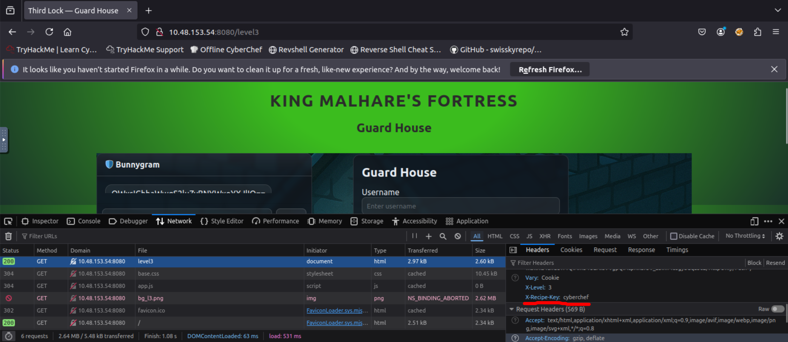

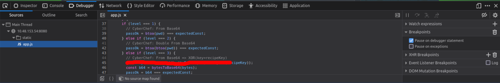

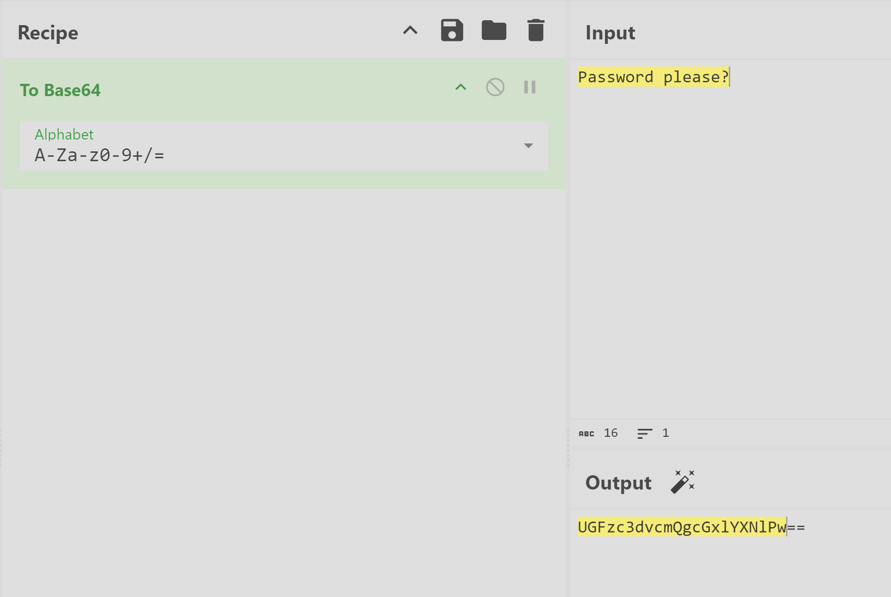

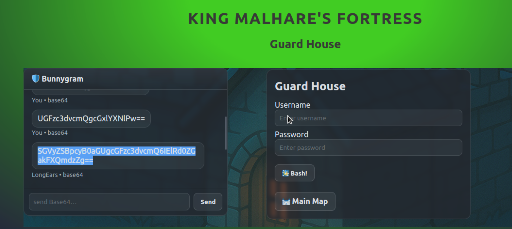

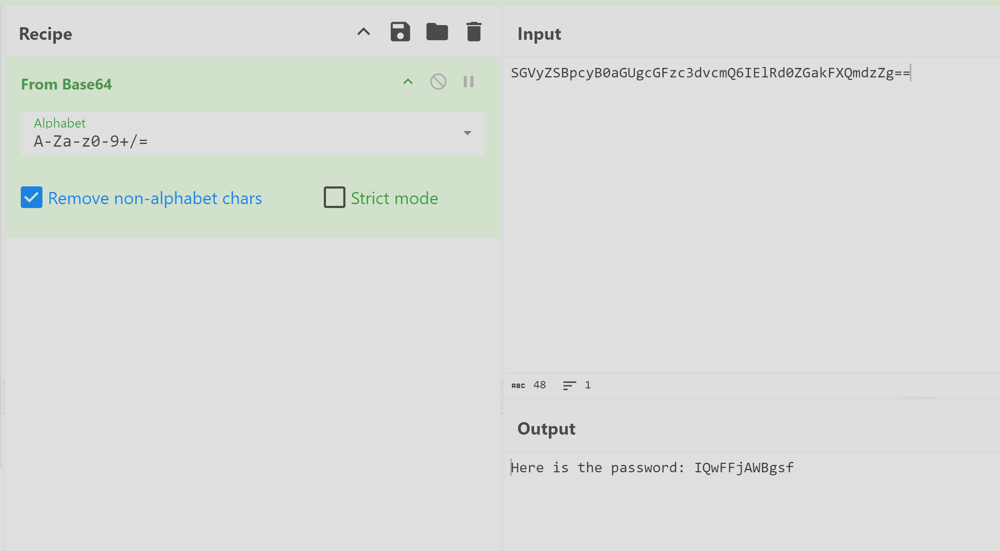

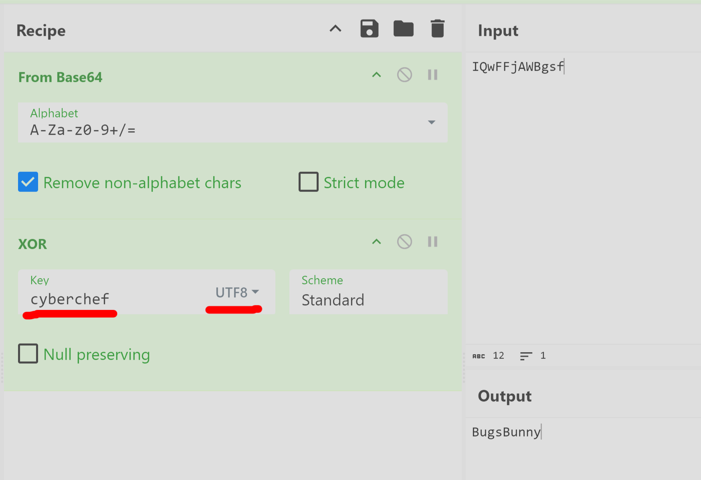

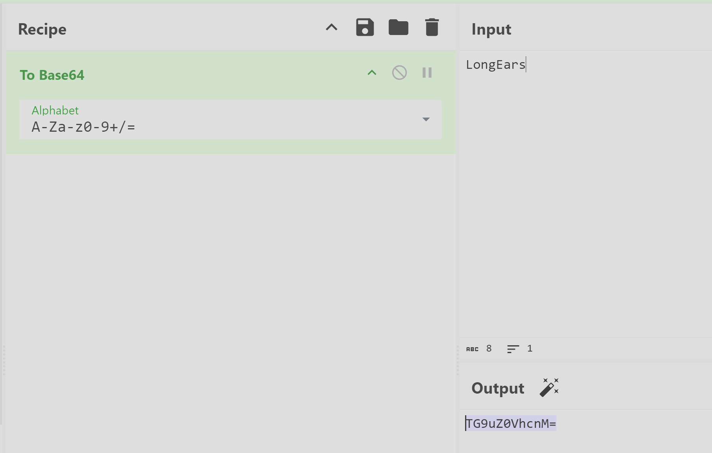

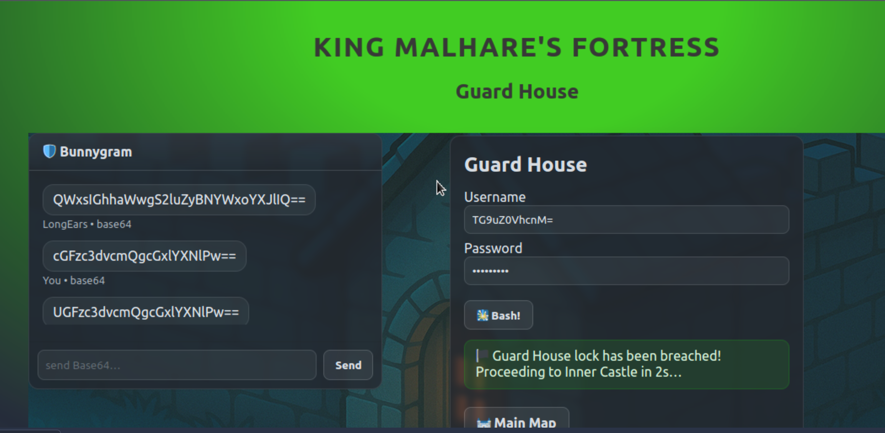

# Task 6 Fourth Lock - Inner Castle

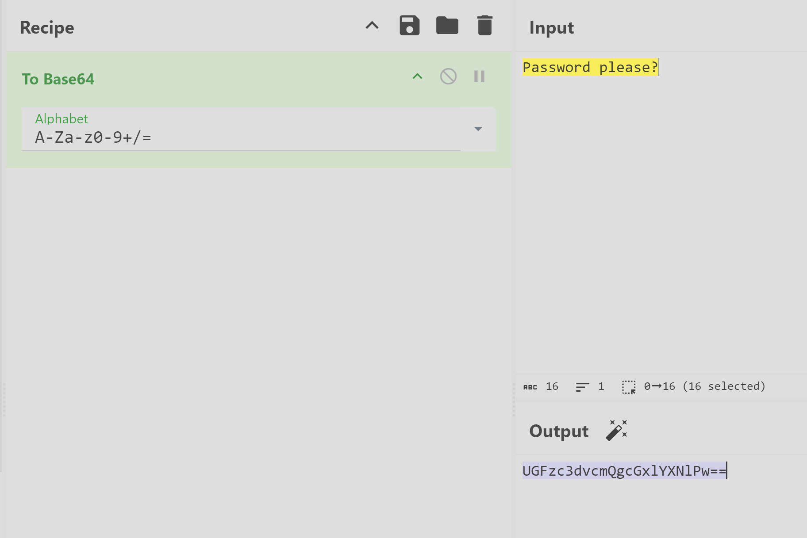

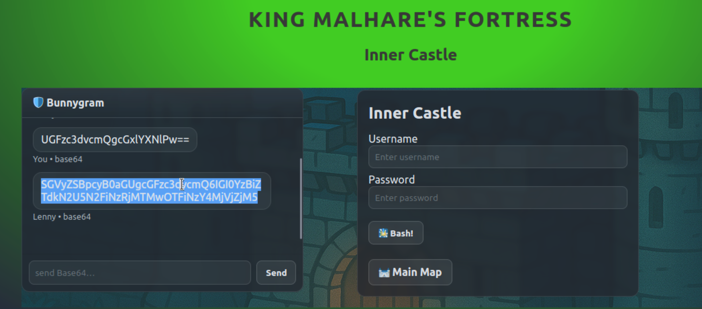

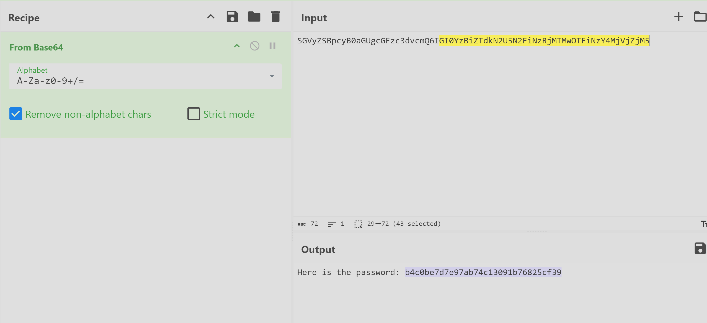

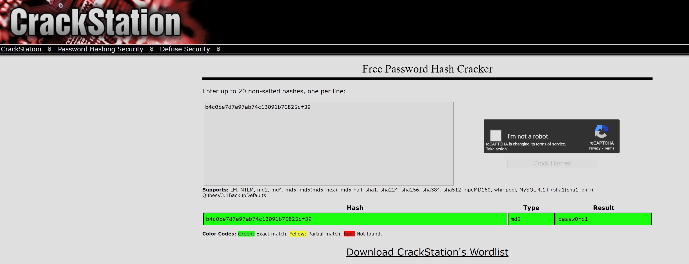

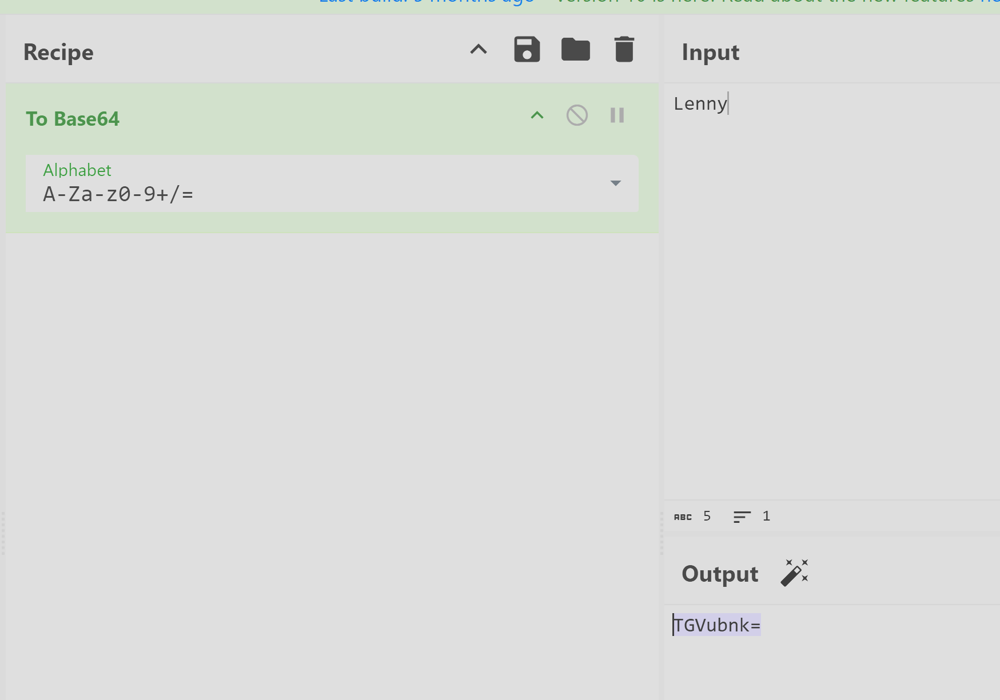

# Task 7 Fifth Lock - Prison Tower

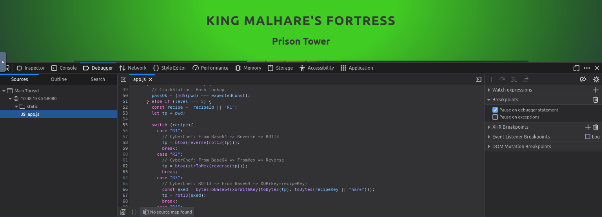

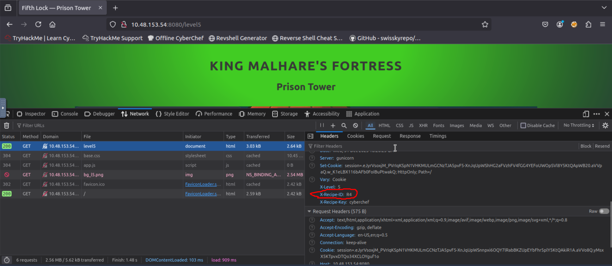

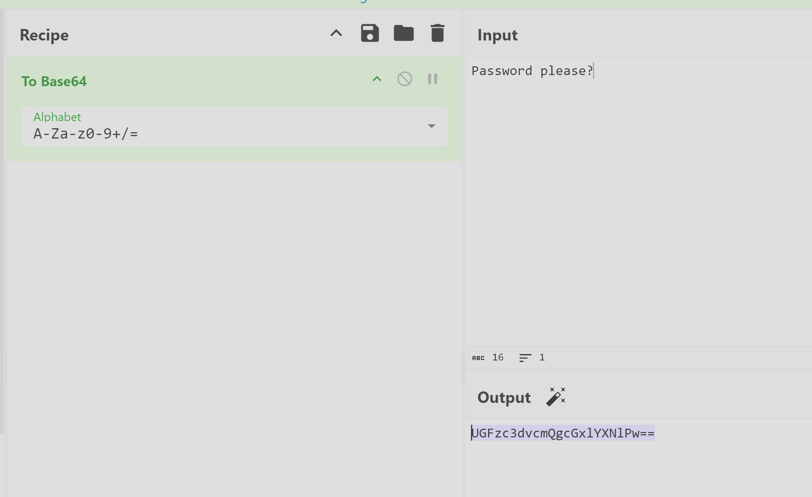

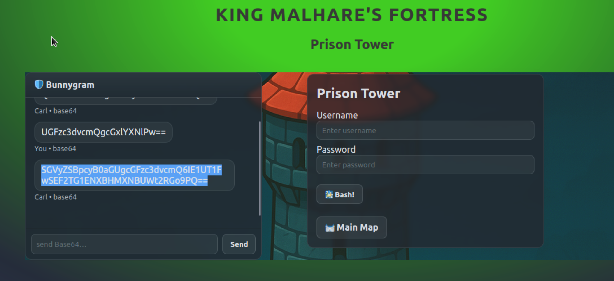

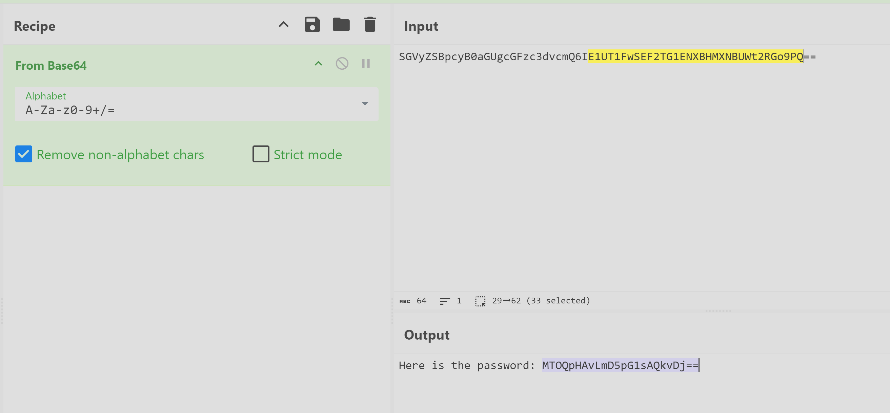

|Recipe ID|Reverse Logic|
|---|---|
|1|From Base64 ⇒ Reverse ⇒ ROT13|
|2|From Base64 ⇒ From Hex ⇒ Reverse|
|3|ROT13 ⇒ From Base64 ⇒ XOR(extracted key)|
|4|ROT13 ⇒ From Base64 ⇒ ROT47|

Encryption / Encoding → ROT13

Data Format → From Base64

Encryption / Encoding → ROT47

- **ROT13** → hides letters lightly
    
- **Base64** → hides binary / text structure
    
- **ROT47** → hides readable ASCII

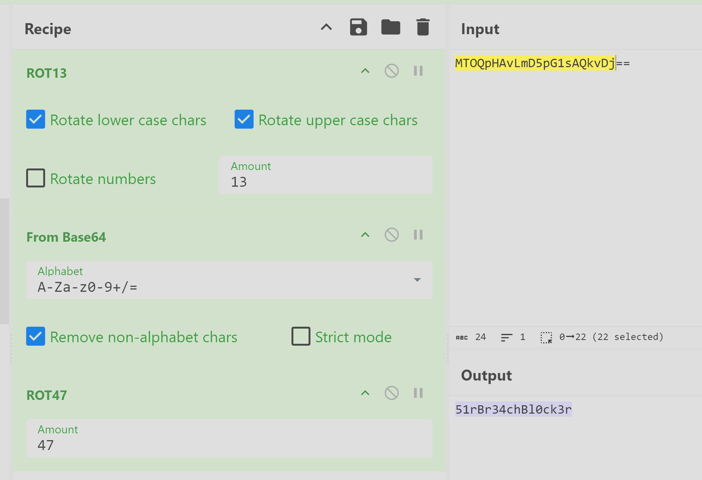

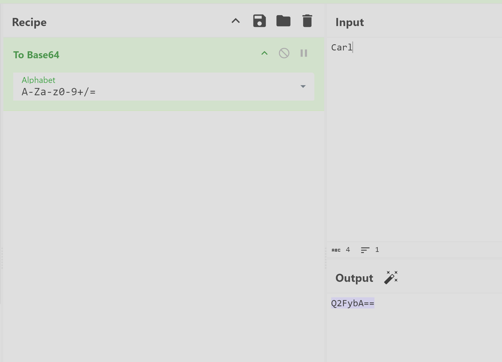

51rBr34chBl0ck3r
THM{M3D13V4L_D3C0D3R_4D3P7}