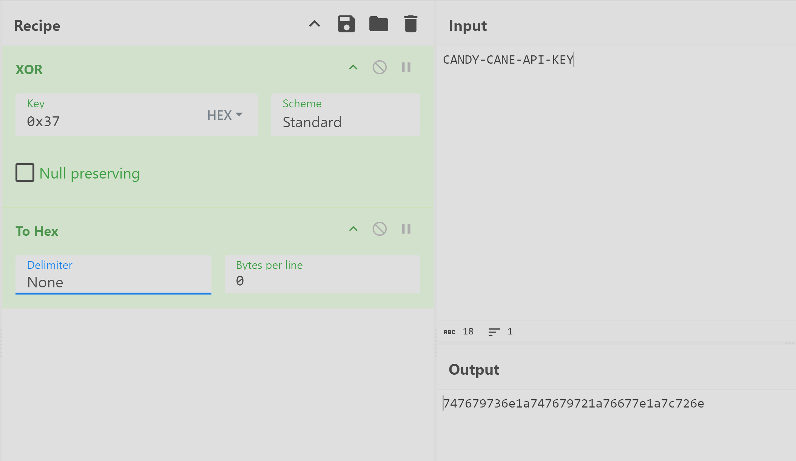

Obfuscation is the practice of making data hard to read and analyze. Attackers use it to evade basic detection and delay investigations.

Let us say, a security tool will automatically block any file that contains the word `the bandit yeti`. To evade this, attackers can use a simple cipher technique called "ROT1" to hide the string.

ROT1 is a cipher technique that shifts each letter forward by 1 in the alphabet. The letter `a` becomes `b`, `b` becomes `c`, and so on. Using this cipher, `carrot coins go brr` becomes `dbsspu dpjot hp css`.

This can be further complicated by using ROT13, which moves the characters forward by 13 spaces.

--- 

1. Open CyberChef by visiting [this link](https://gchq.github.io/CyberChef/) in your browser.
2. At the top right, you’ll see an **Input** box. This is where you paste the text you want to change/obfuscate. In our case, use `carrot supremacy`.
3. In the left pane under **Operations**, search for “XOR” and drag it into the middle under **Recipe**. This tells CyberChef to apply that technique to your **Input** text.
4. Each operation has settings you can adjust. In our case, we set the **Key** to `a`. Make sure that the dropdown next to **Key** is set to `HEX`.
5. The obfuscated result should automatically appear in the **Output** section. If it doesn’t, click **BAKE!** at the bottom of the screen.

As you can see above, the string `carrot supremacy` now becomes `ikxxe~*yzxogkis`!

---

The good thing about well-known obfuscation techniques is that it's easy to reverse it once you figure out the technique used.

You can use these quick visual clues to guess the obfuscation technique used:

- ROT1 - common words look “one letter off”, spaces stay the same. Easy enough to detect.
- ROT13 - Look for three-letter words. Common ones like  `the` become `gur`. And `and` becomes `naq`. spaces stay the same.
- Base64 - Long strings containing mostly alphanumeric characters (i.e., `A-Z`, `a-z`, `0–9`), sometimes with `+` or `/`, often ending in `=` or `==`.
- XOR - A bit more tricky. Looks like random symbols but stays the same length as the original. If a short secret was reused, you may notice a tiny repeat every few characters.

--- 

CyberChef also includes an operation called `Magic` that automatically guesses and tries common decoders for you. To use it, just add the `Magic` operation and look at the results. It will display multiple results and it's up to you to check which one ends up making sense. You can even check "Intensive mode" to make sure it tests more possibilities before giving up.

Of course, this won’t catch everything (especially custom XOR keys or unusual layers)!

---

## Layered Obfuscation

To make deobfuscation harder, threat actors would often combine multiple techniques, almost like a layered approach.

For example, a script that threat actors want hidden can be compressed with `gzip`, `XOR`'ed with a `x` key, then finally `Base64`-encoded will produce this obfuscated string: `H4sIADKZ42gA/32PT2sqQRDE7/MpitGDgrPEJJcXyOGha1xwVaLwyLvI6rbuhP3HTHswm/3uzmggIQfrUD3VzI/u7iDXljepNkFth6KDmYsWnBF2R2OoZOyrPCUDXSKB1UWdEzjZ5hQI8c9oJrU4cn1kyPXbMgRW0X/nF8WLcTSJwvFX9Jr/jUP5i1NOgPeLfjxvtKQQL8RqlOk8jZgKfGJSmTDZZWqxfacdoxFAl0814Rl6j153EyxXkR1VJSe6JNNHAzmOXiHRgnJLPk+iWeiyR63+uIm6Hb5B92NG5YGzK5sm7FnfTSxfzl3rgoJ1tWKjy0NPnpxUHKs0xXT6VBSy7zjZ3A3UY4tmOPjTAs29t4dWQu2vpwyua7niJ7iyCeZJQaIVZ/xwdy/JAQAA`

To reverse this kind of layered obfuscation, apply the operations in the opposite order: Base64-decode, XOR with x, then decompress gzip. The screenshot below shows how to chain these Operations to recover the original content.

---

THM{C2_De0bfuscation_29838}   

747679736e1a747679721a76677e1a7c726e

THM{API_Obfusc4tion_ftw_0283}