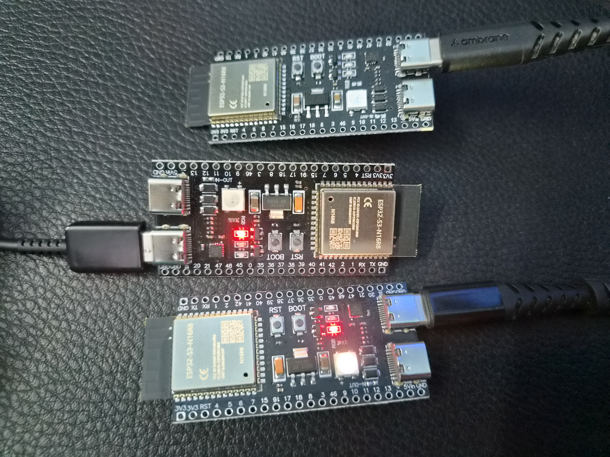
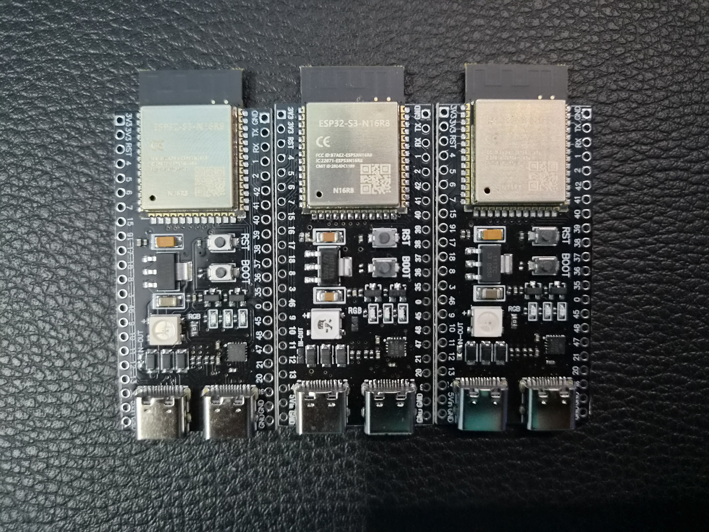

# Hardware Setup and Physical Deployment

## Overview

This document describes the hardware components, physical deployment, network configuration, and node placement used for the Multi-Node WiFi CSI Sensing Platform.

The sensing platform was deployed using two ESP32-S3 development boards configured as distributed WiFi CSI sensing nodes. Both nodes collect Channel State Information (CSI) from the surrounding wireless environment and transmit measurements to a centralized RuView sensing server.

---

# Hardware Components

## ESP32-S3 CSI Node 1

### Specifications

- ESP32-S3-WROOM-1-N16R8
    
- 16 MB Flash
    
- 8 MB PSRAM
    
- Integrated 2.4 GHz WiFi
    
- USB Programming Interface
    
- External PCB Antenna
    

### Purpose

Node 1 serves as the primary CSI sensing node and continuously captures WiFi Channel State Information from the environment.

---

## ESP32-S3 CSI Node 2

### Specifications

- ESP32-S3-WROOM-1-N16R8
    
- 16 MB Flash
    
- 8 MB PSRAM
    
- Integrated 2.4 GHz WiFi
    
- USB Programming Interface
    
- External PCB Antenna
    

### Purpose

Node 2 operates as a secondary sensing node, improving spatial coverage and increasing sensing reliability through multi-node observation.

---

# Processing Environment

## Host Machine

- Windows 11
    

## Virtualization

- VMware Workstation
    

## Guest Operating System

- Kali Linux
    

## Function

The Kali Linux virtual machine hosts:

- RuView Sensing Server
    
- UDP CSI Receiver
    
- Web Dashboard
    
- Data Processing Pipeline
    

---

# Wireless Infrastructure

## Access Point

### SSID

```text
SSID
```

### Security

```text
WPA2-Personal
```

### Frequency Band

```text
2.4 GHz
```

### Operating Channel

```text
Channel 6
```

### Purpose

The access point provides:

- WiFi connectivity
    
- CSI measurement opportunities
    
- Communication between sensing nodes and backend server
    

---

# Physical Deployment

## Deployment Strategy

The system uses a distributed sensing architecture.

Each ESP32-S3 node is placed at a different physical location within the environment to observe wireless signal variations from multiple perspectives.

This approach improves:

- Presence detection reliability
    
- Occupancy estimation accuracy
    
- Motion detection coverage
    
- Multi-path signal diversity
    

---

# Node Placement

## Node 1

### Role

Primary CSI sensing node.

### Position

Located on one side of the sensing area with direct visibility to the wireless access point.

### Purpose

Collect CSI measurements from one spatial perspective.

---

## Node 2

### Role

Secondary CSI sensing node.

### Position

Located at a separate location within the sensing area.

### Purpose

Provide additional CSI observations to improve sensing performance.

---

# Hardware Images

## Connected Nodes




### Description

The images show the deployed ESP32-S3 sensing nodes connected and operating within the sensing environment.

---

## Unplugged Hardware



### Description

The image shows the ESP32-S3 sensing hardware used throughout the project.

---

# Network Configuration

## RuView Backend

### IP Address

```text
192.168.1.10
```

### UDP Port

```text
5005
```

---

## Node Configuration

### Node 1

```text
Node ID: 1
Target IP: 192.168.1.10
Protocol: UDP
Port: 5005
```

### Node 2

```text
Node ID: 2
Target IP: 192.168.1.10
Protocol: UDP
Port: 5005
```

---

# CSI Data Flow

```text
ESP32-S3 Node 1
        \
         \
          ---> RuView Server (192.168.1.10:5005)
         /
        /
ESP32-S3 Node 2
```

Both nodes continuously stream CSI measurements to the RuView backend over UDP.

---

# Deployment Validation

The following checks were performed after deployment:

## Hardware Validation

- Power delivery verified
    
- USB communication verified
    
- Serial console access verified
    

## Network Validation

- WiFi connectivity verified
    
- IP assignment verified
    
- Node communication verified
    

## CSI Validation

- CSI collection active
    
- CSI packet generation active
    
- CSI packet transmission active
    

## Backend Validation

- UDP packet reception verified
    
- Multi-node communication verified
    
- Dashboard communication verified
    

---

# Lessons Learned

The deployment demonstrated the importance of:

- Proper node placement
    
- Stable wireless connectivity
    
- Consistent channel configuration
    
- Multi-node sensing architectures
    

Adding additional nodes can improve sensing performance by providing multiple spatial viewpoints of the wireless environment.

---

# Hardware Deployment Status

Status: Operational

ESP32 Nodes: 2

WiFi Connectivity: Operational

CSI Collection: Operational

UDP Streaming: Operational

Backend Connectivity: Operational

Deployment Validation: Successful