# RuView Dashboard, Observatory, and Visualization

## Overview

This document describes the visualization, monitoring, and sensing capabilities provided by the RuView dashboard and observatory interfaces.

After successful deployment of the ESP32-S3 sensing nodes and backend infrastructure, RuView provided a real-time interface for observing WiFi CSI activity, occupancy estimates, motion detection, pose estimation, and vital sign monitoring.

The dashboard served as the primary method for validating system functionality throughout testing.

---

# Dashboard Architecture

The dashboard communicates with the backend through:

## HTTP Interface

```text
http://localhost:8080
```

---

## WebSocket Interface

```text
ws://localhost:8765/ws/sensing
```

---

# Dashboard Landing Page

## Screenshot

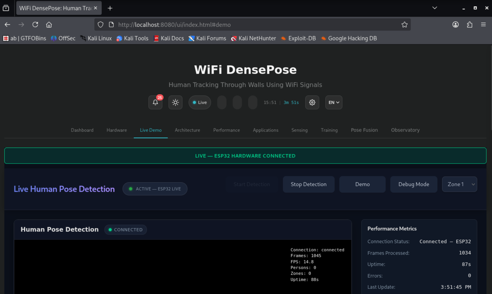

---

## Purpose

The landing page provides access to:

- Live sensing demonstrations
    
- Dashboard interfaces
    
- Observatory modules
    
- Visualization tools
    
- Application examples
    

---

# System Status Dashboard

## Screenshot


---

## Features

The system overview dashboard provides:

- Current sensing status
    
- Presence detection state
    
- Occupancy estimation
    
- Motion activity indicators
    
- Backend connectivity status
    
- Node health information
    

---

# Metrics and Statistics Dashboard

## Screenshot

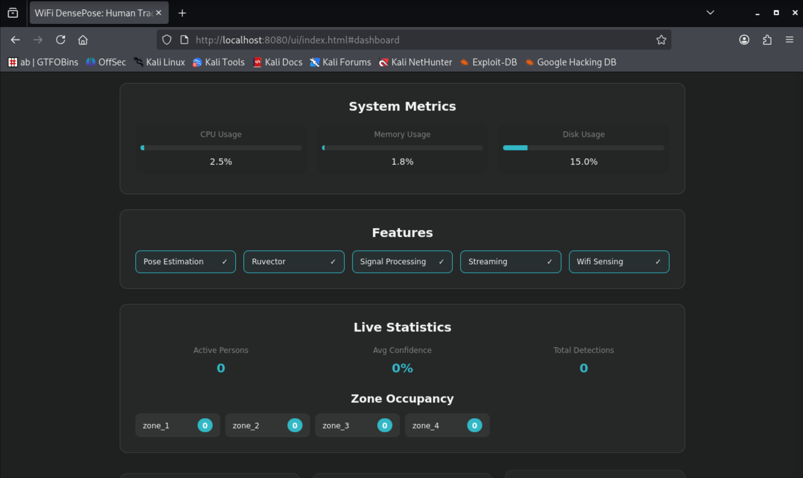

---

## Displayed Information

The metrics dashboard displays:

- Signal strength
    
- Occupancy metrics
    
- Motion metrics
    
- Detection confidence values
    
- CSI-derived analytics
    

These metrics update continuously while sensing nodes are active.

---

# Hardware Configuration View

## Screenshot

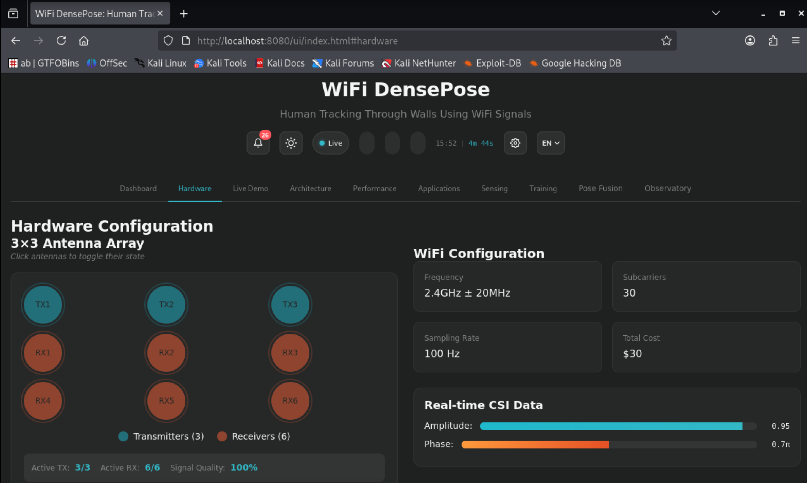

---

## Purpose

Provides a visual representation of:

- Node placement
    
- Antenna orientation
    
- Multi-node deployment architecture
    
- Signal coverage concepts
    

---

# Real-World Applications Interface

## Screenshot

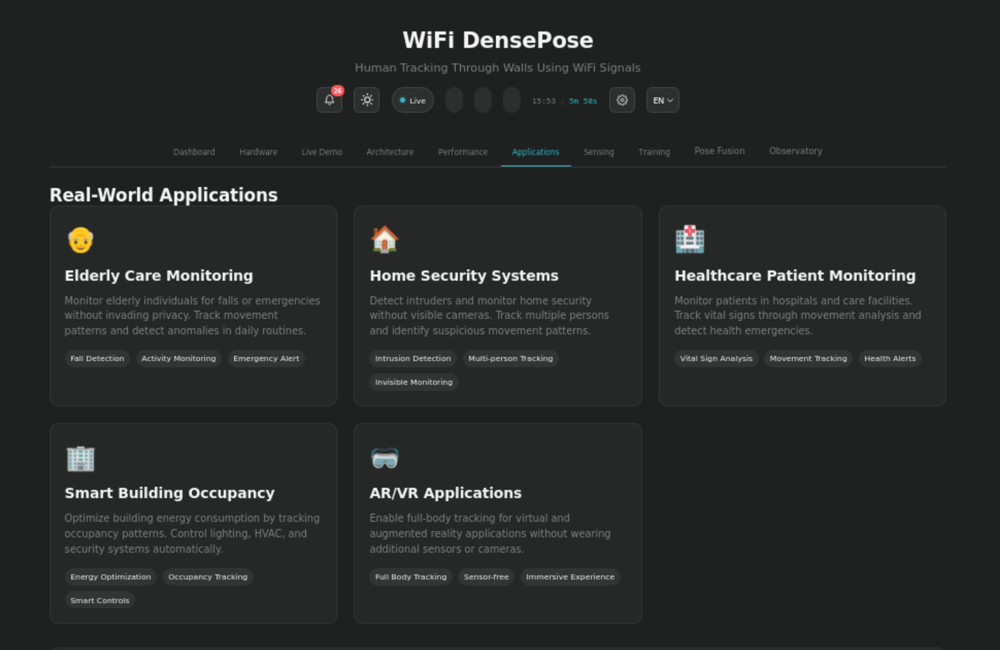

---

## Example Use Cases

Potential applications include:

### Smart Buildings

- Occupancy monitoring
    
- Room utilization
    

### Security Monitoring

- Presence detection
    
- Unauthorized movement detection
    

### Healthcare

- Vital sign monitoring
    
- Activity observation
    

### Smart Home Systems

- Automation triggers
    
- Context-aware environments
    

---

# Human Pose Detection

## Overview

RuView provides pose estimation capabilities derived from CSI signal analysis.

Rather than using optical cameras, the system estimates human presence and activity using wireless signal variations.

---

# Pose Detection – Idle State

## Screenshot

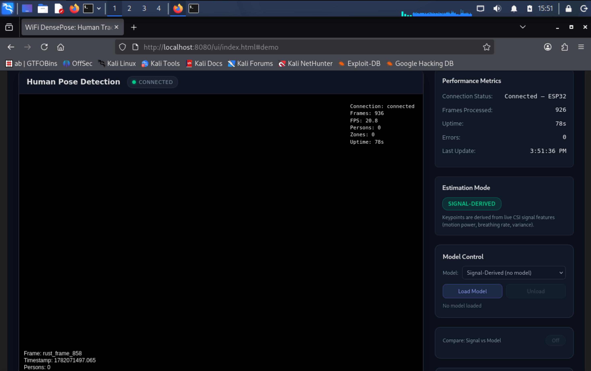

---

## Observation

System correctly identifies:

- Minimal movement
    
- Low activity environment
    
- Stable occupancy conditions
    

---

# Pose Detection – Disconnected State

## Screenshot

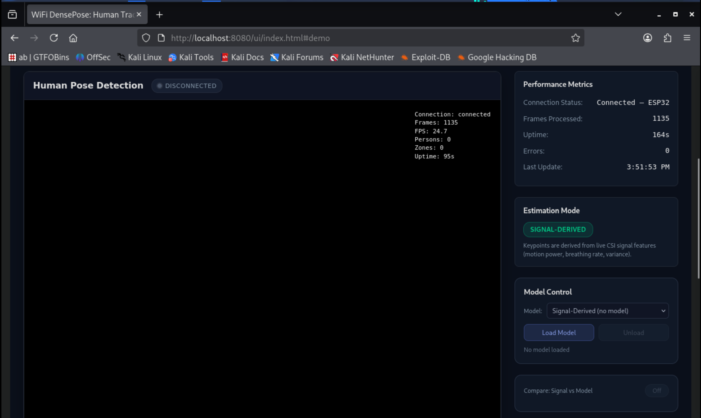

---

## Purpose

Demonstrates dashboard behavior when sensing data becomes unavailable.

Useful for:

- Fault detection
    
- Connectivity troubleshooting
    
- Deployment validation
    

---

# Multi-Person Detection

## Screenshot


---

## Observation

The system estimates occupancy and attempts to infer the number of individuals within the sensing environment.

### Notes

During testing:

- Presence detection was reliable.
    
- Motion detection was reliable.
    
- Person counting was functional but occasionally produced minor inaccuracies.
    

This behavior is expected for CSI-based occupancy estimation systems and can often be improved through calibration and additional sensing nodes.

---

# Node Scaling Visualization

## Screenshot

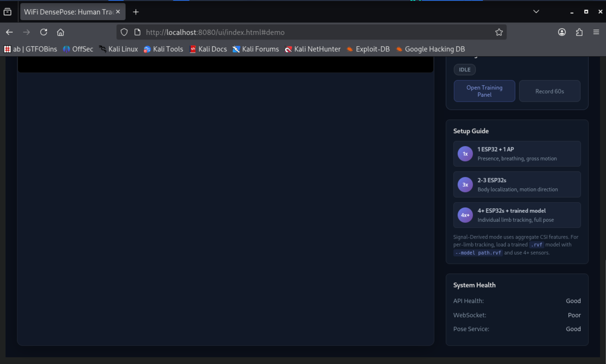

---

## Purpose

Illustrates how sensing accuracy may improve as additional sensing nodes are deployed.

Benefits include:

- Increased coverage
    
- Better signal diversity
    
- Improved occupancy estimation
    
- Improved localization capability
    

---

# CSI Heatmap Visualization

## Overview

Heatmaps provide a graphical representation of signal activity within the monitored environment.

---

# Initial Heatmap

## Screenshot

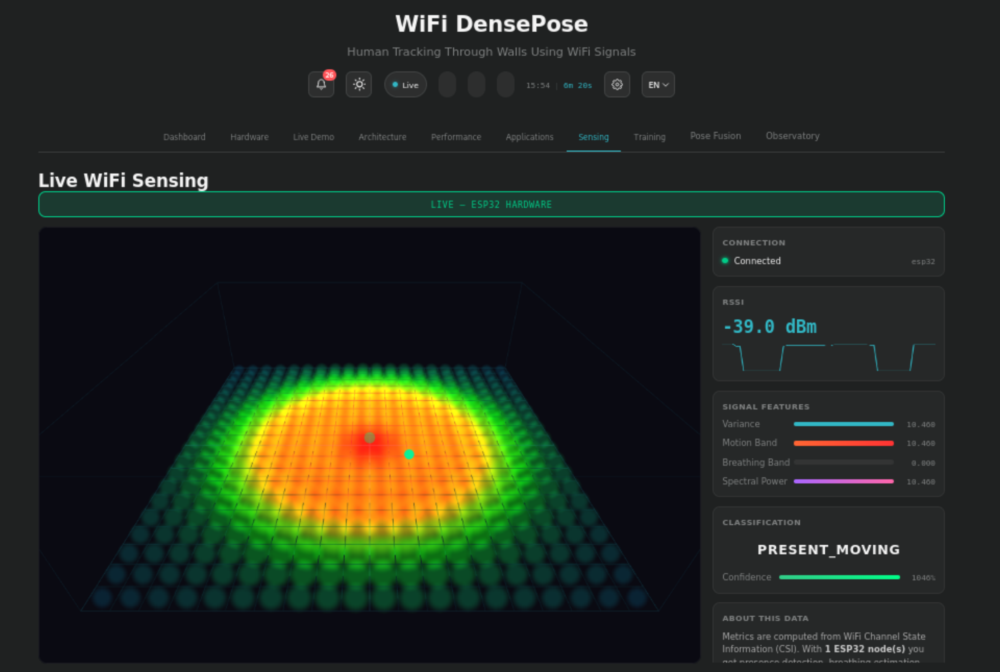

---

## Observation

Represents baseline signal conditions before significant activity occurs.

---

# Active Hotspot Heatmap

## Screenshot


---

## Observation

Demonstrates increased activity levels caused by human movement or environmental changes.

---

# Node Statistics Heatmap

## Screenshot

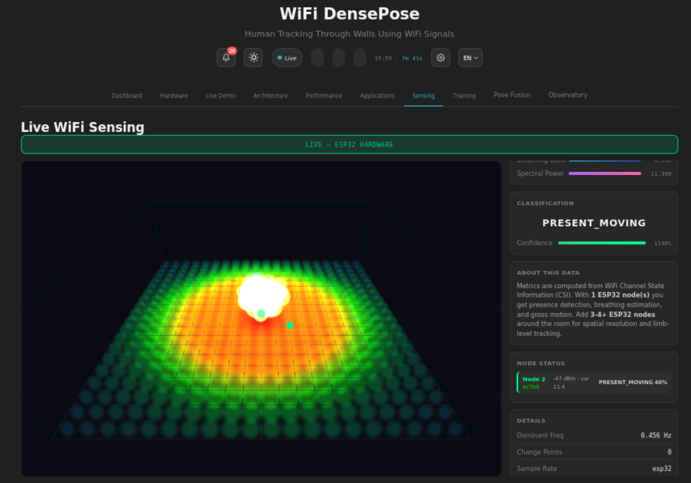

---

## Information Displayed

- Node activity
    
- Signal quality
    
- Detection metrics
    
- CSI statistics
    

---

# Model Training Interface

## Screenshot

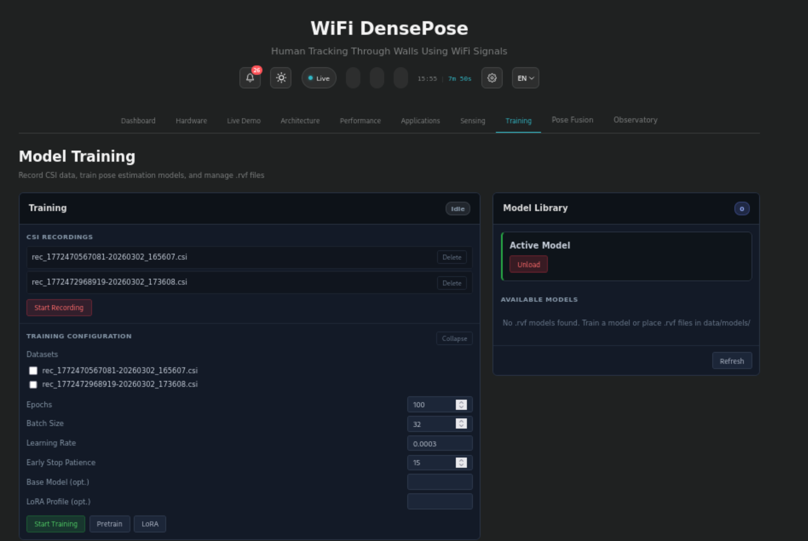

---

## Purpose

Provides access to machine-learning and model-training functionality used by the platform.

Potential future use includes:

- Activity recognition
    
- Gesture detection
    
- Occupancy classification
    
- Environment-specific calibration
    

---

# RuView Observatory

## Overview

The Observatory interface extends the dashboard by providing advanced monitoring and visualization tools.

---

# Dual-Modal Pose Estimation

## Screenshot

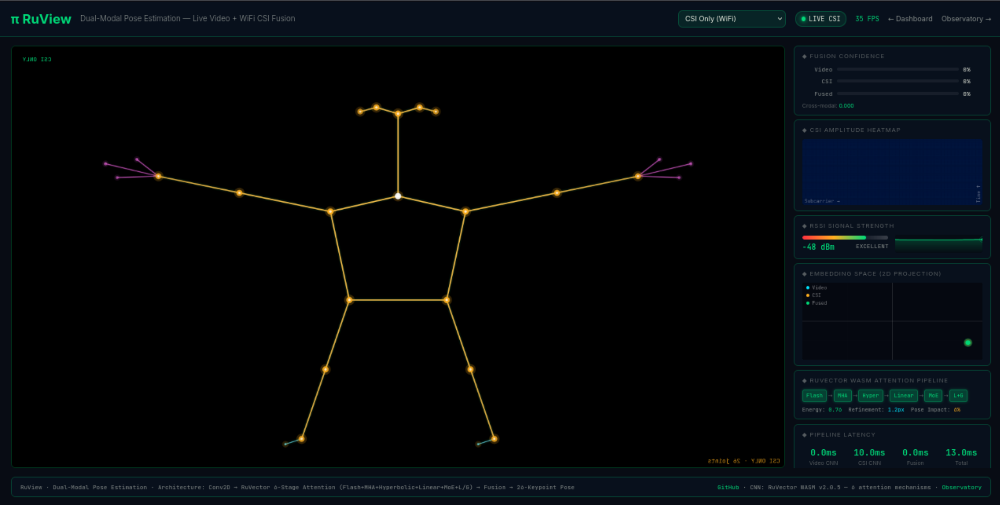

---

## Observation

Demonstrates the system's ability to visualize estimated human pose structures derived from sensing data.

---

# Observatory Controls

## Screenshot

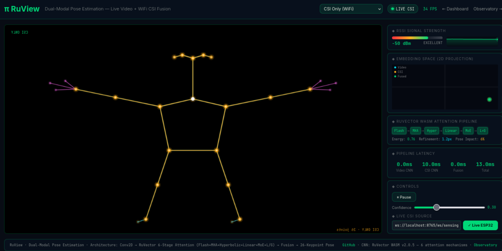

---

## Features

- Data source selection
    
- Visualization controls
    
- Monitoring configuration
    
- Display management
    

---

# Vital Sign Monitoring

## Vital Signs View A


---

## Vital Signs View B

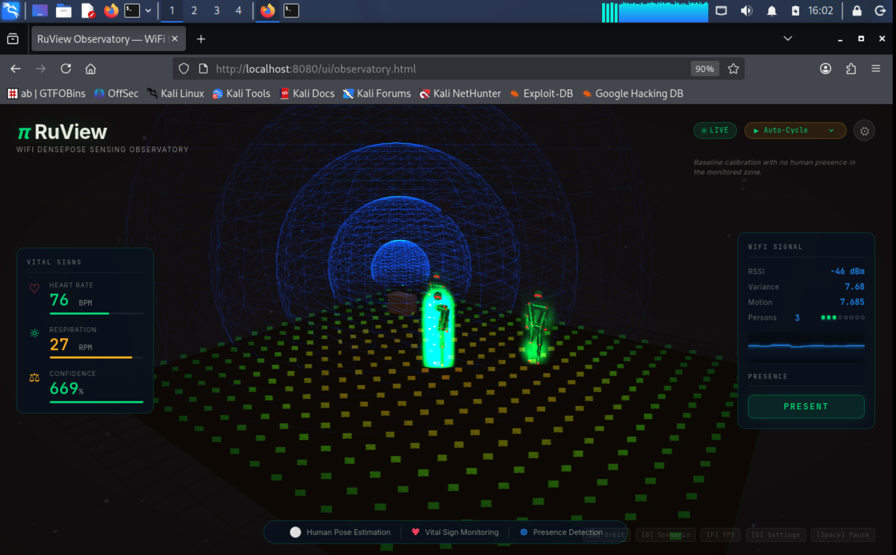

---

## Capabilities

The observatory includes visualization support for:

- Breathing patterns
    
- Heart-rate estimation
    
- Motion activity
    
- Occupancy indicators
    

These values are generated from CSI-derived signal processing pipelines.

---

# Dashboard Validation Results

The dashboard successfully demonstrated:

## Presence Detection

Operational

---

## Motion Detection

Operational

---

## Occupancy Estimation

Operational

---

## CSI Visualization

Operational

---

## Heatmap Generation

Operational

---

## Pose Estimation

Operational

---

## Vital Sign Visualization

Operational

---

## Multi-Node Integration

Operational

---

# Key Observations

Throughout testing:

- Dashboard responsiveness remained stable.
    
- Multi-node CSI streams were successfully visualized.
    
- Presence detection performed consistently.
    
- Motion detection reacted reliably to environmental changes.
    
- Occupancy estimates were generally accurate but occasionally fluctuated.
    
- Additional nodes are expected to improve sensing quality and reliability.
    

---

# Dashboard Status

Status: Operational

Backend Connectivity: Operational

WebSocket Streaming: Operational

Live Visualization: Operational

Heatmaps: Operational

Pose Estimation: Operational

Vital Sign Monitoring: Operational

Occupancy Detection: Operational

Project Outcome: Successful End-to-End Visualization of Real-Time WiFi CSI Sensing Data
