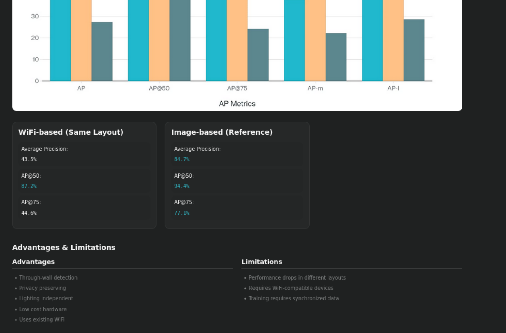

# Performance Evaluation and System Analysis

## Overview

This document evaluates the performance of the deployed multi-node WiFi CSI sensing platform and summarizes observations collected during real-world testing.

The objective of this evaluation was to assess:

- Presence detection reliability
- Motion detection responsiveness
- Occupancy estimation accuracy
- Multi-node performance improvements
- System stability
- Scalability potential

The evaluation was performed using two ESP32-S3 sensing nodes operating simultaneously and streaming CSI data to the RuView sensing backend.

---

# Test Environment

## Hardware

### Sensing Nodes

```
2 × ESP32-S3-WROOM-1-N16R8
```

---

### Backend

```
Kali Linux VM
```

---

### Network

```
Airtel(2.4)Channel 6
```

---

## Data Collection

CSI measurements were continuously streamed from both sensing nodes to:

```
192.168.1.10:5005
```

and processed by the RuView backend.

---

# Evaluation Objectives

The following capabilities were evaluated:

## Presence Detection

Determine whether a person is present within the sensing area.

---

## Motion Detection

Determine whether movement is occurring.

---

## Occupancy Estimation

Estimate the number of individuals present.

---

## System Responsiveness

Measure how quickly the system reacts to environmental changes.

---

## Multi-Node Coordination

Evaluate behavior when multiple sensing nodes operate simultaneously.

---

# Presence Detection Performance

## Observations

During testing, presence detection remained highly reliable.

The system consistently identified:

- Occupied environments
- Empty environments
- Human movement events

---

## Result

```
Presence Detection Reliability: High
```

---

# Motion Detection Performance

## Observations

Motion detection responded rapidly to:

- Walking
- Entering a room
- Leaving a room
- General body movement

The CSI heatmaps and activity indicators reflected motion almost immediately.

---

## Result

```
Motion Detection Reliability: High
```

---

# Occupancy Estimation Performance

## Observations

Occupancy estimation successfully identified:

- Empty room
- Single occupant
- Multiple occupants

The dashboard continuously updated estimated occupancy values.

---

## Observed Limitation

Occasional fluctuations occurred when estimating the exact number of people.

Examples included:

- Temporary overcounting
- Temporary undercounting
- Rapid count changes during movement

---

## Result

```
Occupancy Estimation Reliability: Moderate to High
```

The system correctly detected occupancy events but exact counts occasionally varied.

---

# Single Node vs Multi-Node Evaluation

## Single Node Deployment

### Advantages

- Simple deployment
- Lower hardware requirements
- Lower network traffic

### Limitations

- Reduced spatial awareness
- Increased blind spots
- Lower occupancy confidence

---

## Two Node Deployment

### Advantages

- Improved coverage
- Better signal diversity
- More CSI observations
- Reduced sensing ambiguity

### Observations

The two-node deployment produced noticeably more stable sensing results than a single-node configuration.

---

# CSI Data Reception Performance

## Validation

Traffic analysis confirmed simultaneous packet reception from both nodes.

Observed endpoints:

```
Node 1 → 192.168.1.10:5005Node 2 → 192.168.1.10:5005
```

---

## Result

```
Multi-Node UDP Streaming: Successful
```

---

# Backend Performance

## Sensing Server

The Rust-based backend remained stable throughout testing.

No crashes were observed.

---

## WebSocket Streaming

Dashboard updates were delivered in real time.

Observed behavior:

- Low latency updates
- Continuous telemetry
- Stable client connections

---

## Result

```
Backend Stability: Excellent
```

---

# Dashboard Performance

## Observations

Dashboard components remained responsive during operation.

Successfully displayed:

- Occupancy estimates
- Heatmaps
- Pose estimation
- Vital sign visualizations
- System metrics

---

## Result

```
Dashboard Responsiveness: Excellent
```

---

# Performance Analysis Charts

## Performance Metrics



---

## Performance Comparison


---

# System Strengths

## Non-Intrusive Sensing

The system operates without:

- Cameras
- Wearable devices
- Physical contact

---

## Low-Cost Hardware

Uses affordable ESP32-S3 hardware.

---

## Real-Time Operation

Supports continuous CSI processing and visualization.

---

## Multi-Node Architecture

Can scale beyond a single sensing node.

---

## Privacy Advantages

Unlike camera-based systems, no visual images of occupants are collected.

---

# Current Limitations

## Occupancy Accuracy

Person counting occasionally fluctuates.

---

## Environmental Sensitivity

CSI measurements can be affected by:

- Furniture
- Walls
- RF interference
- Device placement

---

## Calibration Requirements

Performance may vary across different environments.

---

## Limited Node Count

Current deployment used:

```
2 sensing nodes
```

Additional nodes were not evaluated during this phase.

---

# Scalability Assessment

The architecture is designed to support larger deployments.

---

## Four Node Deployment

Expected Benefits:

- Improved coverage
- Better localization
- Reduced blind spots

---

## Eight Node Deployment

Expected Benefits:

- Room-level sensing
- Higher occupancy confidence
- Improved signal diversity

---

## Sixteen Node Deployment

Expected Benefits:

- Dense sensing environments
- Research-grade deployments
- Enhanced spatial resolution

---

# Future Improvements

Potential enhancements include:

## Machine Learning Improvements

- Better occupancy estimation
- Activity classification
- Gesture recognition

---

## Additional Nodes

Deploy 4–8 sensing nodes for broader coverage.

---

## Calibration Tools

Develop environment-specific calibration workflows.

---

## Sensor Fusion

Combine CSI sensing with:

- BLE
- UWB
- mmWave radar
- Environmental sensors

---

# Overall Evaluation

|Category|Assessment|
|---|---|
|Presence Detection|Excellent|
|Motion Detection|Excellent|
|Occupancy Detection|Good|
|Person Counting|Moderate to Good|
|Backend Stability|Excellent|
|Dashboard Performance|Excellent|
|Multi-Node Operation|Excellent|
|Scalability Potential|High|

---

# Conclusion

The deployment successfully demonstrated a functioning multi-node WiFi CSI sensing platform capable of real-time occupancy estimation, motion detection, and wireless environment monitoring.

The system operated reliably with two ESP32-S3 sensing nodes and successfully processed live CSI streams through the RuView backend.

While occupancy estimation occasionally showed minor inaccuracies, overall sensing performance was strong and provides a solid foundation for future scaling and experimentation.
