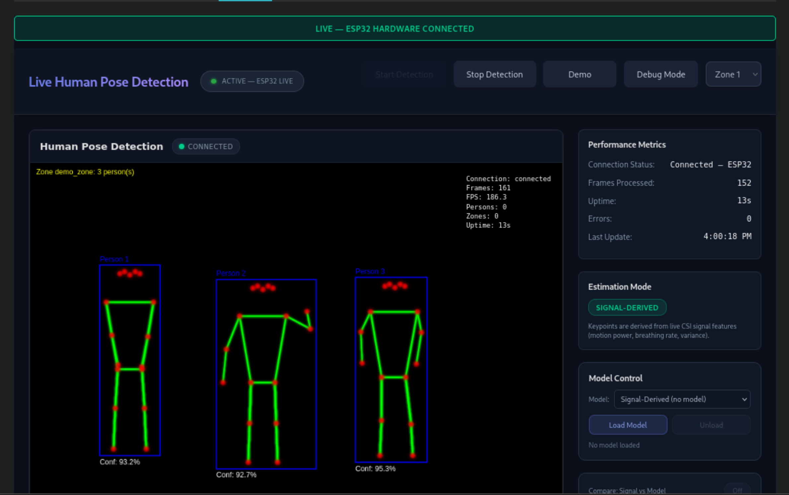
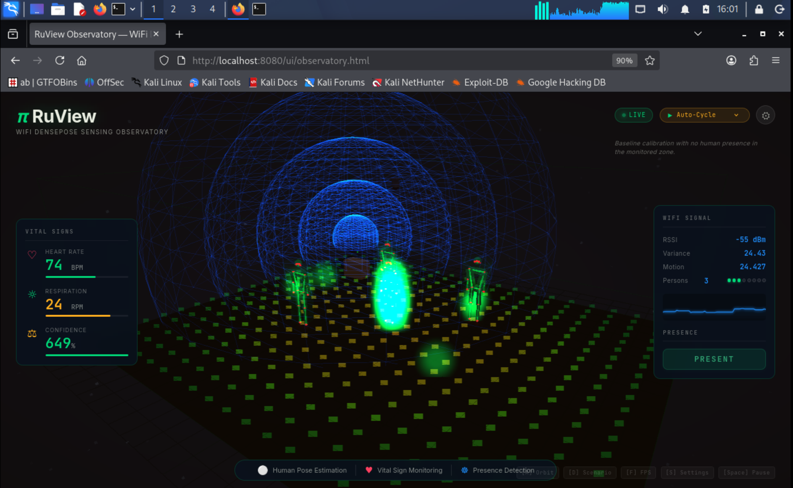

# Results and Lessons Learned

## Project Summary

This project successfully implemented and deployed a multi-node WiFi CSI sensing platform using ESP32-S3 development boards and the RuView WiFi DensePose ecosystem.

The final system demonstrated real-time wireless sensing capabilities without relying on cameras, wearable devices, or dedicated tracking hardware.

The deployment consisted of:

- Two ESP32-S3 CSI sensing nodes
- RuView sensing backend
- Real-time dashboard
- CSI visualization modules
- Occupancy estimation
- Motion detection
- Presence detection
- Multi-node CSI streaming

The project was deployed and validated within a real wireless environment.

---

# Project Objectives

## Objective 1

Deploy ESP32-S3 CSI sensing nodes.

### Status

✅ Completed

---

## Objective 2

Configure WiFi CSI collection.

### Status

✅ Completed

---

## Objective 3

Stream CSI data to RuView backend.

### Status

✅ Completed

---

## Objective 4

Deploy sensing server infrastructure.

### Status

✅ Completed

---

## Objective 5

Visualize CSI data using dashboard interfaces.

### Status

✅ Completed

---

## Objective 6

Validate multi-node operation.

### Status

✅ Completed

---

# Final System Architecture

```
ESP32-S3 Node 1
        \
         \
          ---> RuView Backend ---> Dashboard
         /
        /
ESP32-S3 Node 2
```

Both nodes streamed CSI measurements simultaneously to the backend for processing and visualization.

---

# Key Achievements

## Multi-Node Deployment

Successfully operated multiple CSI sensing nodes simultaneously.

---

## Live CSI Streaming

Real-time CSI packets successfully transmitted over WiFi and received by the backend.

---

## Automatic Source Detection

RuView automatically detected live ESP32 CSI streams and switched from simulated mode to live sensing mode.

---

## Dashboard Visualization

Real-time visualizations were successfully displayed through the RuView dashboard.

---

## Occupancy Estimation

The system continuously estimated room occupancy based on CSI measurements.

---

## Motion Detection

Human movement generated observable changes within CSI-derived sensing metrics.

---

## Presence Detection

The system consistently identified whether the monitored environment was occupied.

---

# Demonstration Results

## Live Dashboard


---

## Multi-Person Detection



---

## CSI Heatmap


---

## Observatory



---

# Performance Summary

|Capability|Result|
|---|---|
|Firmware Deployment|Successful|
|CSI Collection|Successful|
|UDP Streaming|Successful|
|Multi-Node Operation|Successful|
|Dashboard Integration|Successful|
|Motion Detection|Reliable|
|Presence Detection|Reliable|
|Occupancy Estimation|Functional|
|Person Counting|Partially Accurate|
|Backend Stability|Excellent|

---

# Technical Skills Applied

## Embedded Systems

- ESP32-S3
- ESP-IDF
- Firmware flashing
- Serial monitoring

---

## Wireless Networking

- WiFi configuration
- UDP communication
- CSI acquisition
- ESP-NOW synchronization

---

## Linux Administration

- Kali Linux
- Terminal operations
- Service deployment
- Network diagnostics

---

## Network Analysis

- tcpdump
- UDP traffic analysis
- Port verification
- Connectivity validation

---

## Software Engineering

- Rust workspace management
- Dependency troubleshooting
- Git submodules
- Cargo builds

---

## System Integration

- Hardware integration
- Backend deployment
- Dashboard deployment
- Multi-component validation

---

# Major Challenges Encountered

## Firmware Provisioning

Required installation of additional NVS tooling.

---

## Serial Device Management

ESP32 device assignments changed dynamically during testing.

---

## Rust Workspace Dependencies

Multiple workspace dependencies required manual recovery and validation.

---

## Multi-Node Configuration

Consistent configuration across nodes was required for successful deployment.

---

## CSI Validation

Network traffic inspection was necessary to confirm packet transmission and reception.

---

# Most Valuable Lessons Learned

## Lesson 1

Always verify hardware communication before debugging software.

---

## Lesson 2

Network packet captures often reveal issues faster than application-level debugging.

---

## Lesson 3

Large Rust workspaces depend heavily on correctly initialized Git submodules.

---

## Lesson 4

Distributed sensing systems require validation at multiple layers:

- Hardware
- Firmware
- Networking
- Backend
- Visualization

---

## Lesson 5

Real-world wireless sensing systems are affected by environmental factors and require calibration.

---

# What Worked Well

- Firmware deployment process
- Backend stability
- CSI packet streaming
- Dashboard responsiveness
- Multi-node communication
- Real-time visualization

---

# Areas for Improvement

- Person counting accuracy
- Occupancy estimation stability
- Node placement optimization
- Additional sensing nodes
- Environment calibration

---

# Research and Engineering Value

This project provided practical experience in:

- Wireless sensing
- CSI analysis
- Embedded systems
- Distributed sensing architectures
- Rust backend deployment
- Real-time telemetry systems
- Human presence detection using RF signals

The deployment demonstrates the feasibility of low-cost WiFi-based sensing systems using commodity hardware.

---

# Final Outcome

The project successfully achieved its primary objective of building and validating a real-time multi-node WiFi CSI sensing platform.

The final deployment demonstrated:

✅ Two operational ESP32-S3 sensing nodes

✅ Live CSI collection

✅ Real-time UDP streaming

✅ RuView backend integration

✅ Dashboard visualization

✅ Presence detection

✅ Motion detection

✅ Occupancy estimation

✅ Multi-node operation

The project serves as a strong foundation for future research into wireless sensing, occupancy analytics, activity recognition, and privacy-preserving environment awareness systems.

