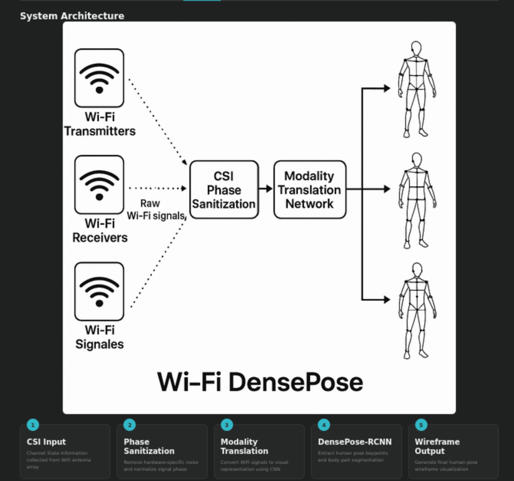
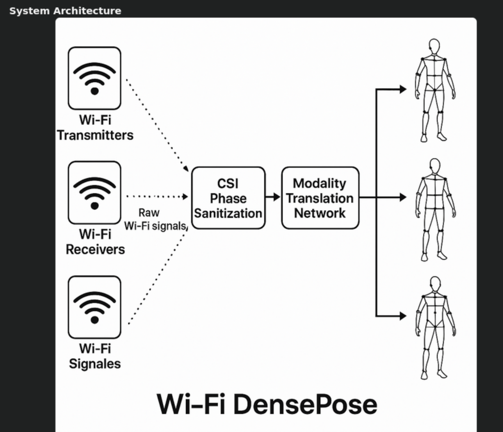
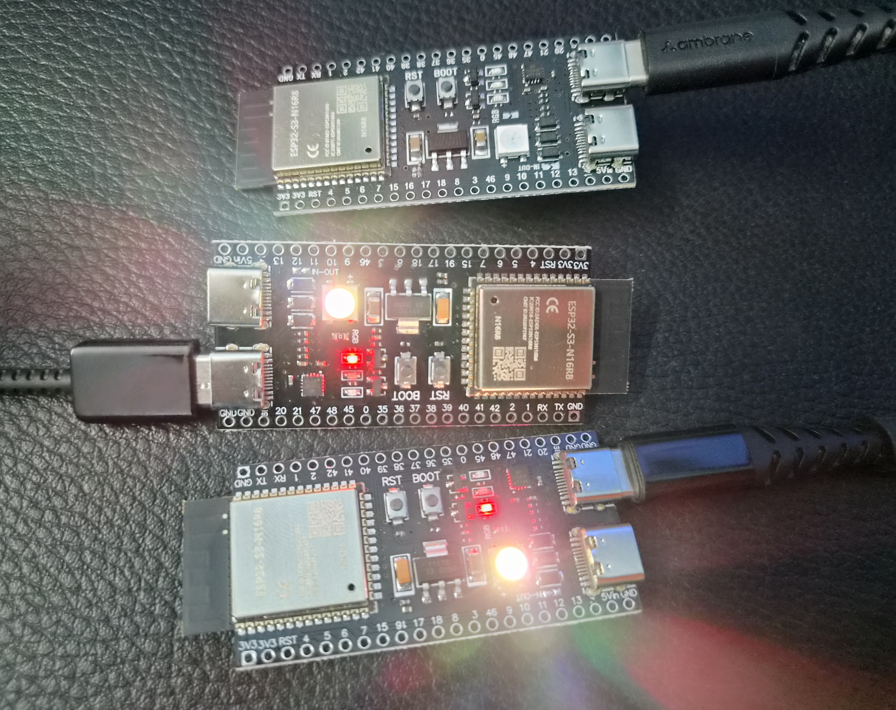
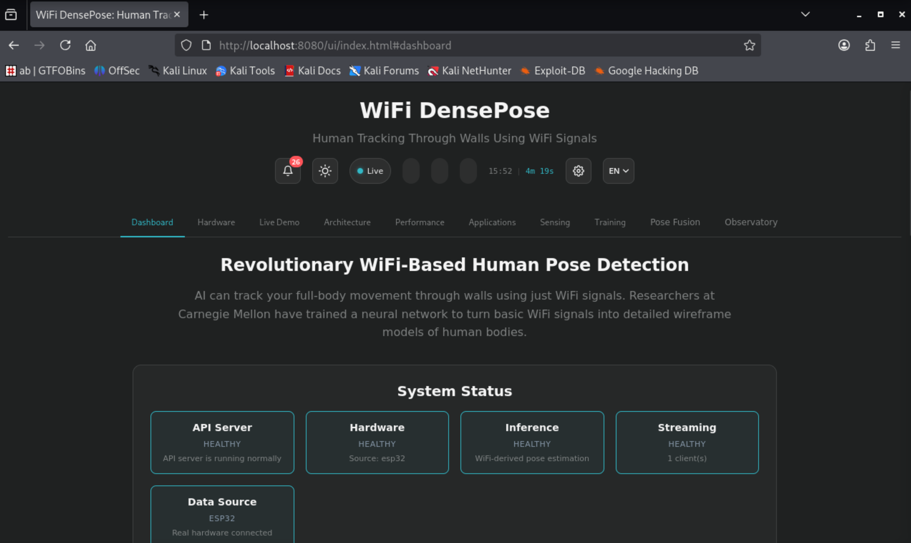
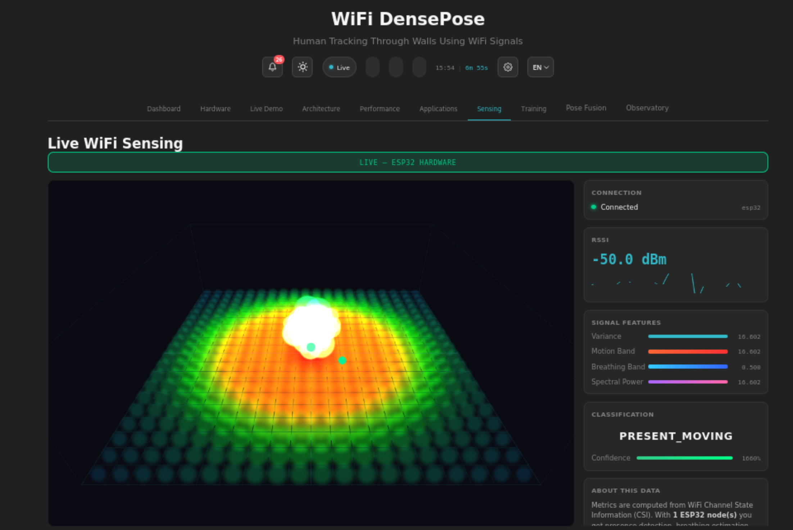

# Distributed WiFi CSI Human Sensing

> Multi-node WiFi CSI sensing platform using ESP32-S3 and RuView for real-time presence detection, motion sensing, occupancy estimation, and RF-based environment awareness.



---

## Overview

This project demonstrates a distributed WiFi sensing system built using ESP32-S3 development boards and the RuView WiFi DensePose ecosystem.

The platform captures WiFi Channel State Information (CSI) from multiple sensing nodes and processes it through a Rust-based backend to estimate human presence, motion, occupancy, and environmental activity without requiring cameras, wearable devices, or dedicated tracking hardware.

The final deployment successfully operated with two ESP32-S3 CSI sensing nodes streaming live CSI data to the RuView sensing backend.

---

## Key Features

- Multi-node ESP32-S3 deployment
- Real-time WiFi CSI collection
- UDP-based CSI streaming
- Rust sensing backend
- Live dashboard visualization
- Presence detection
- Motion detection
- Occupancy estimation
- CSI heatmap visualization
- WebSocket telemetry
- Camera-free sensing architecture

---

## System Architecture

```text
ESP32-S3 Node 1
        \
         \
          ---> RuView Backend ---> Dashboard
         /
        /
ESP32-S3 Node 2
```

### Architecture Diagram



---

## Hardware

### Sensing Nodes

- 2 × ESP32-S3-WROOM-1-N16R8
- 16 MB Flash
- 8 MB PSRAM

### Host Environment

- Windows 11
- VMware Workstation
- Kali Linux

### Wireless Network

- 2.4 GHz WiFi
- Channel 6

---

## Hardware Setup

### ESP32-S3 CSI Nodes




---

## Demonstration

### Dashboard Overview



### System Metrics


### CSI Heatmap



### Multi-Person Detection


### Vital Sign Observatory


---

## Technical Stack

### Embedded Systems

- ESP32-S3
- ESP-IDF
- WiFi CSI APIs
- ESP-NOW

### Backend

- Rust
- Cargo
- Axum
- Tokio
- WebSockets

### Networking

- UDP
- TCP/IP
- WiFi CSI Streaming

### Analysis & Diagnostics

- tcpdump
- ss
- Serial Console Monitoring

---

## Project Statistics

| Metric | Value |
|----------|----------|
| Sensing Nodes | 2 ESP32-S3 |
| Backend Language | Rust |
| CSI Transport | UDP |
| Dashboard Updates | WebSocket |
| CSI Source | WiFi Channel State Information |
| Frequency Band | 2.4 GHz |
| Deployment Model | Distributed Multi-Node |

---

## Results

### Successfully Implemented

- Live CSI collection
- Multi-node sensing
- UDP streaming
- Real-time dashboard updates
- Presence detection
- Motion detection
- Occupancy estimation
- CSI heatmap generation
- Observatory integration

### Observations

- Presence detection was reliable.
- Motion detection responded consistently to environmental activity.
- Multi-node CSI streaming operated successfully.
- Occupancy estimation was functional but could benefit from additional calibration.
- Person counting occasionally fluctuated due to environmental conditions.

---

## Technical Skills Demonstrated

- Embedded Systems Engineering
- ESP32 Development
- ESP-IDF
- Wireless Networking
- WiFi CSI Analysis
- RF Sensing
- Rust Development
- Linux Administration
- Network Diagnostics
- Distributed Systems
- Real-Time Telemetry
- System Integration

---

## Documentation

Detailed documentation is available in the `docs/` directory.

| File | Description |
|--------|-------------|
| 01_Project_Overview.md | Project overview |
| 02_Hardware_Setup.md | Hardware deployment |
| 03_ESP32_Firmware.md | Firmware configuration |
| 04_RuView_Backend.md | Backend deployment |
| 05_Dashboard_and_Observatory.md | Dashboard walkthrough |
| 06_Troubleshooting.md | Issues and fixes |
| 07_Performance_Evaluation.md | Performance analysis |
| 08_Future_Work.md | Future improvements |
| 09_Results_and_Lessons_Learned.md | Final results |
| 10_References.md | References |
| 11_Project_Timeline.md | Development timeline |

---

## Future Improvements

### Short-Term

- Deploy 4+ sensing nodes
- Improve occupancy estimation
- Optimize node placement

### Long-Term

- Activity recognition
- Gesture recognition
- Indoor localization
- Smart building integration
- Digital twin environments

---

## Lessons Learned

- Wireless sensing systems require careful node placement.
- CSI quality significantly impacts detection accuracy.
- Multi-node sensing improves environmental awareness.
- Packet-level diagnostics are critical for debugging distributed sensing systems.
- Real-world RF environments require calibration and tuning.

---

## Repository Structure

```text
.
├── README.md
├── LICENSE
├── docs/
└── images/
    ├── architecture/
    ├── hardware/
    ├── dashboard/
    ├── pose_detection/
    ├── sensing/
    ├── observatory/
    └── performance/
```


---

## Project Status

**Status:** Completed

**Deployment:** Successful

**Nodes:** 2 ESP32-S3

**Backend:** Operational

**Dashboard:** Operational

**Research Potential:** High

---

### Citation

Akshit. *Distributed WiFi CSI Human Sensing using ESP32-S3 and RuView*, 2026.