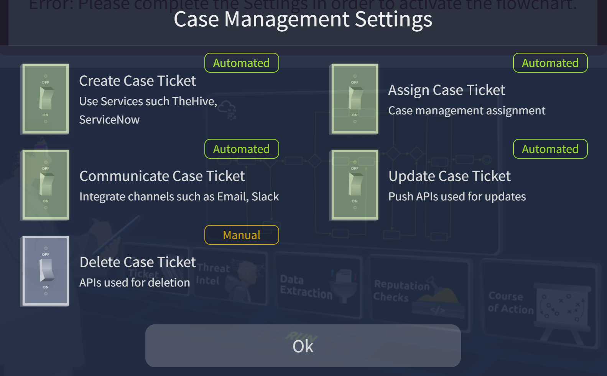
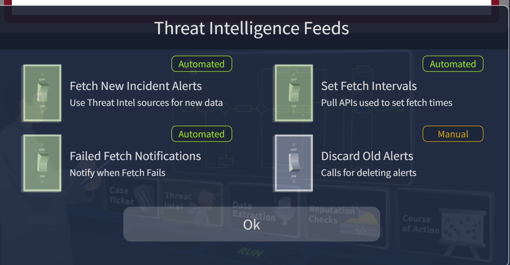
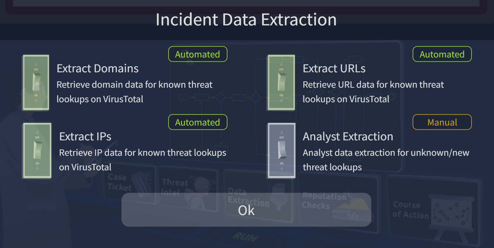
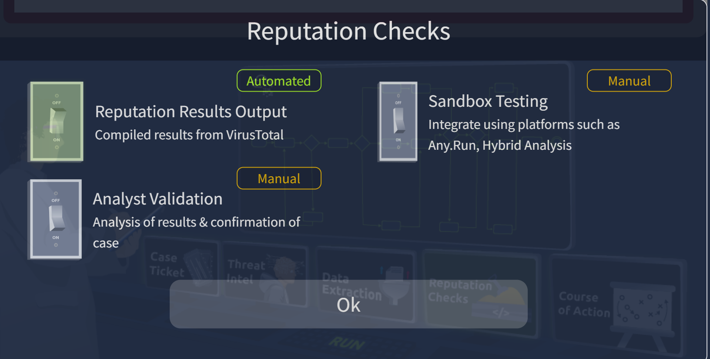
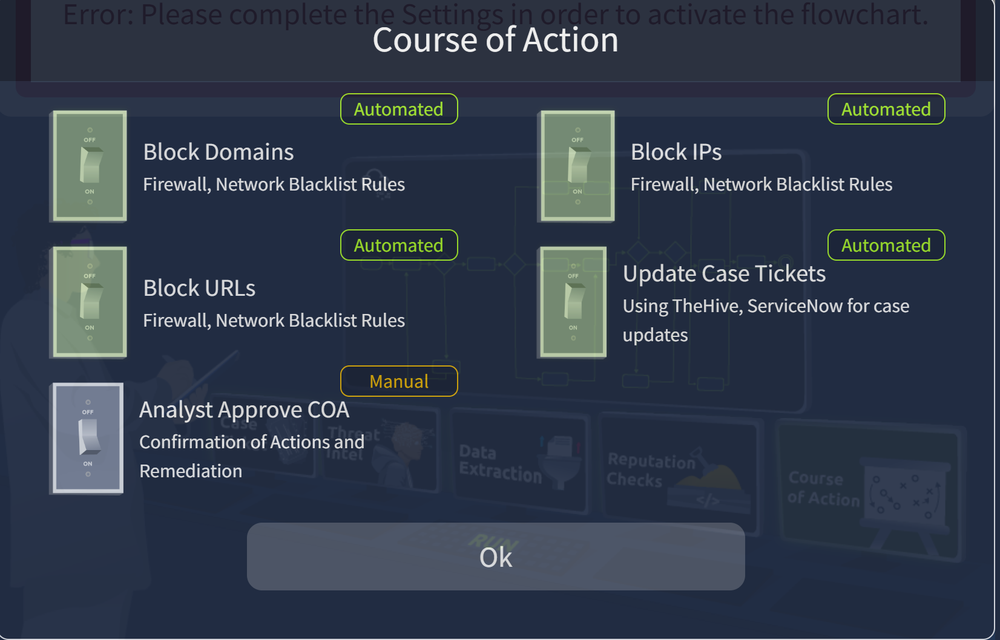

Security Orchestration, Automation, and Response (SOAR)
# Task 2 Traditional SOC and Challenges

## Challenges Faced by SOCs

- **Alert Fatigue:** Using numerous security tools triggers a large number of alerts within an SOC. Many of these alerts are false positives or insufficient for an investigation, leaving analysts overwhelmed and unable to address any serious security events.
- **Too many Disconnected Tools:** Security tools are often deployed without integration within an organisation. Security teams are tasked with navigating through firewall logs and rules, which are handled independently from endpoint security logs. This also leads to an overload of tools.
- **Manual Processes:** SOC investigation procedures are often not documented, leading to inefficient means of addressing threats. Most rely on established tribal knowledge built by experienced analysts, and the processes are never documented. This results in slowing down the investigation and increasing response times.
- **Talent Shortage:** SOC teams find recruiting and expanding their talent pool difficult to address the growing security landscape and sophisticated threats. Combining this with the alert overload teams face, security analysts become more overwhelmed with the responsibilities they have to undertake, resulting in less efficient work and extended incident response times that allow adversaries to wreak havoc within an organisation.

# Task 3 Overcoming SOC Challenges with SOAR

## What is SOAR?

Security Orchestration, Automation, and Response (SOAR) is a tool that unifies all the security tools used in a SOC. 

With SOAR, SOC analysts do not need to switch between SIEM, EDR, Firewall, and other security tools for their investigations. They can operate all these tools within a single SOAR interface. Along with unifying the security tools, it also provides ticketing and case management features to the analysts, through which they can document, track, and resolve their incidents in a structured way.

The core strength of a SOAR tool comes from the following three main capabilities:
## 1. Orchestration

Traditionally, while investigating an alert, a SOC analyst has to switch between multiple security tools for the analysis. For example, during a VPN brute force, the analyst typically switches between the following tools: 1. <b>SIEM</b> to check if the user usually uses the subject IP for logging 2. <b>Threat Intelligence (TI) platforms</b> to verify the IP's reputation 3. <b>IAM tool</b> to disable the user if there was any successful attempt 4. <b>Ticketing system</b> to open and track the incident

This manual switching between different tools slows down the process.It connects different tools from various vendors within the unified SOAR interface. 

It defines workflows for investigating various types of alerts, known as **Playbooks**. These playbooks are predefined steps that tell the SOAR how to investigate an alert.

For example, the VPN brute force alert we discussed above would have the following playbook:
1. Received alert from SIEM
2. Query SIEM to check if the User normally uses the IP
3. Check TI platforms for the IP's reputation 
4. Query SIEM for any successful logins 
5. Escalate to containment actions
The above actions are predefined in a playbook for a specific alert. These playbooks are dynamic and usually contain different paths. The result of each step determines the next action. For example, if the user normally uses the IP and the failed attempts were minimal, the playbook may stop early.

## 2. Automation

The art of coordinating with multiple tools through predefined actions (Playbooks), which we studied in Orchestration, can be automated. Automation means no more manual clicks needed from SOC analysts. SOAR will itself follow the playbooks. 

Let's resume the playbook for VPN brute force alert combined with the Automation. 1. SOAR receives the alert from SIEM 2. It automatically queries the SIEM for the user's historical logins 3. It automatically verifies the IP's reputation through TI platforms 4. If the IP is malicious, it automatically disables the user from the IAM 5. Lastly, it automatically opens a ticket in the ticketing system with all the details to initiate an investigation

This saves a tremendous amount of time for SOC analysts. They can handle hundreds of alerts without burning out.
## 3. Response

SOAR gives the ability to take actions using different tools from one unified interface. It also automates the response, as we saw earlier while looking at its Automation capability. For example, SOAR can follow the playbook of VPN Brute force and block the IP on the firewall, disable the user in the IAM, and open a ticket with all the details. 

The Orchestration, Automation, and Response capabilities of SOAR solve the major challenges a SOC team faces. With SOAR, there is no more alert fatigue, most of the processes are automated, and all the different tools are connected for coordination.

## Do We Still Need SOC Analysts?

While a SOAR tool can automate the majority of repetitive tasks, it does not replace SOC analysts. Complex investigations still require an SOC analyst. SOAR cannot give a judgment call at some critical points, but an analyst can. 

A SOC analyst understands the threats in the broader business context. 
The playbooks for different types of alerts are also made by the SOC analysts. 

So, the answer to this question is that the SOAR would ease the burden of SOC by automating repetitive tasks and organizing everything in a simplified structure, but we still need SOC analysts.

# Task 4 Building SOAR Playbooks
## Phishing Playbook

Starting from receiving the alert "Suspicious email received", you will probably tell them the next steps they should take. They should create a ticket and check if the email contains a URL or an attachment.

The next steps would further depend on whether it contains a URL or an attachment. 
So, a lot of "if this happens, do this; else, do this" instructions. This is how a plabook is made.

## CVE Patching Playbook

CVE (Common Vulnerabilities and Exposures)

This playbook will analyse the CVE details, assess its risk threshold, create a patching ticket, and test the patch before being pushed to the production environment. The following is an example of a playbook made for CVE patching.

As you can see in both the playbooks' flow diagrams, most of the steps are automated, but a SOC analyst can be seen at a few points. This highlights that while SOAR reduces repetitive manual process burden, SOC analysts' roles remain essential for crucial decisions and verifications.

#### From where is the CVE Patching playbook fetching the new CVEs?
> **Answer**_:_ Advisory lists

#### In the CVE Patching playbook, if the assets are found vulnerable even after the patch is deployed, what does the SOC develop next?
> **Answer**_:_ mitigation plan

# Task 5 Threat Intel Workflow Practical

THM{AUT0M@T1N6_S3CUR1T¥}
