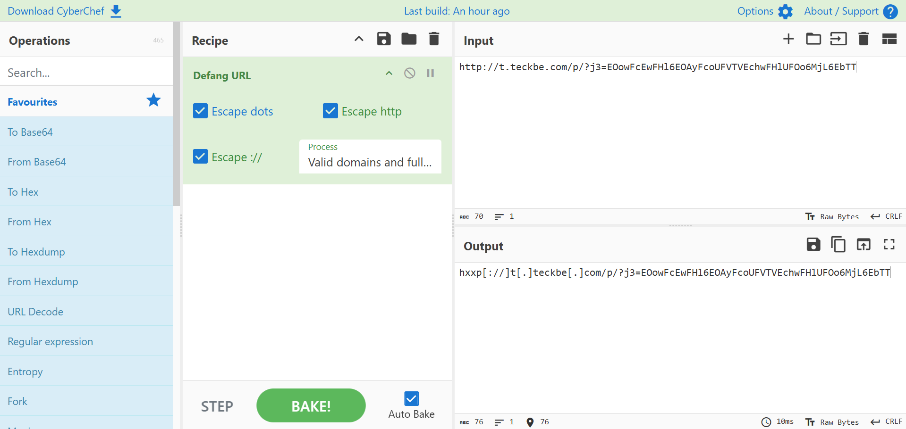
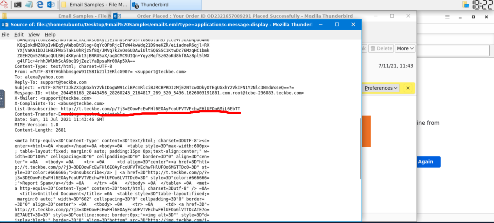

# Task 3 Email Delivery

There are 3 specific protocols involved to facilitate the outgoing and incoming email messages, and they are briefly listed below.
- **SMTP** (**Simple Mail Transfer Protocol)** - It is utilized to handle the sending of emails. 
- **POP3 (Post Office Protocol)** - Is responsible transferring email between a client and a mail server. 
- **IMAP (Internet Message Access Protocol)** - Is responsible transferring email between a client and a mail server. 

**POP3**
- Emails are downloaded and stored on a single device.
- Sent messages are stored on the single device from which the email was sent.
- Emails can only be accessed from the single device the emails were downloaded to.
- If you want to keep messages on the server, make sure the setting "Keep email on server" is enabled, or all messages are deleted from the server once downloaded to the single device's app or software.

**IMAP**
- Emails are stored on the server and can be downloaded to multiple devices.
- Sent messages are stored on the server.
- Messages can be synced and accessed across multiple devices.

  

Below is an explanation of each numbered point from the above diagram:
1. Alexa composes an email to Billy (`billy@johndoe.com`) in her favorite email client. After she's done, she hits the send button.
2. The **SMTP** server needs to determine where to send Alexa's email. It queries **DNS** for information associated with `johndoe.com`. 
3. The **DNS** server obtains the information `johndoe.com` and sends that information to the **SMTP** server. 
4. The **SMTP** server sends Alexa's email across the Internet to Billy's mailbox at `johndoe.com`.
5. In this stage, Alexa's email passes through various **SMTP** servers and is finally relayed to the destination **SMTP** server. 
6. Alexa's email finally reached the destination **SMTP** server.
7. Alexa's email is forwarded and is now sitting in the local **POP3/IMAP** server waiting for Billy. 
8. Billy logs into his email client, which queries the local **POP3/IMAP** server for new emails in his mailbox.
9. Alexa's email is copied (**IMAP**) or downloaded (**POP3**) to Billy's email client. 

**SMTP** is port 25.
What port is classified as Secure Transport (STARTTLS) for SMTP? 587
What port is classified as Secure Transport for IMAP? 993
What port is classified as Secure Transport for POP3? 995

# Task 4 Email Headers

there are two parts to an email:
- the email **header** (information about the email, such as the email servers that relayed the email)
- the email **body** (text and/or HTML formatted text)

The syntax for email messages is known as the **[Internet Message Format](https://datatracker.ietf.org/doc/html/rfc5322)** (**IMF**).

Once you find the email sender's IP address, where can you retrieve more information about the IP?
http://www.arin.net

In the below image, you can see how to view this information within Yahoo.

Below is a snippet of the raw message for the email sample.

From the above image, there are other email header fields of interest. 
1. **X-Originating-IP** - The IP address of the email was sent from (this is known as an **[X-header](https://help.returnpath.com/hc/en-us/articles/220567127-What-are-X-headers-)**)
2. **Smtp.mailfrom**/**header.from** - The domain the email was sent from (these headers are within **Authentication-Results**)
3. **Reply-To** - This is the email address a reply email will be sent to instead of the **From** email address

how to analyze email headers:
[https://web.archive.org/web/20221219232959/https://mediatemple.net/community/products/all/204643950/understanding-an-email-header](https://web.archive.org/web/20221219232959/https://mediatemple.net/community/products/all/204643950/understanding-an-email-header)

What email header is the same as "Reply-to"?
Return-Path

# Task 5 Email Body

The email body is the part of the email which contains the text (plain or HTML formatted) the sender wants you to view. 

example of a text-only email.
  

example of the HTML formatted email.

A snippet of the HTML code is shown below.

emails may contain attachments. The same premise applies; you can view an email's attachment from an email's HTML format or by viewing the source code.

attachment within the source code.

  

From the above example, we can see the headers associated with this attachment:

- **Content-Type** is **application/pdf**. 
- **Content-Disposition** specifies it's an **attachment**. 
- **Content-Transfer-Encoding** tells us it's **base64** encoded.

https://base64.guru/converter/decode/file
to convert base 64 to pdf

# Task 6 Types of Phishing

- **[Whaling](https://www.rapid7.com/fundamentals/whaling-phishing-attacks/)** - is similar to spear phishing, but it's targeted specifically to C-Level high-position individuals (CEO, CFO, etc.), and the objective is the same. 
- [**Smishing**](https://www.proofpoint.com/us/threat-reference/smishing) - takes phishing to mobile devices by targeting mobile users with specially crafted text messages. 
- [**Vishing**](https://www.proofpoint.com/us/threat-reference/vishing) - is similar to smishing, but instead of using text messages for the social engineering attack, the attacks are based on voice calls.

Below are typical characteristics phishing emails have in common:
- The **sender email name/address** will masquerade as a trusted entity (**[email spoofing](https://www.proofpoint.com/us/threat-reference/email-spoofing)**)
- The email subject line and/or body (text) is written with a **sense of urgency** or uses certain keywords such as **Invoice**, **Suspended**, etc. 
- The email body (HTML) is designed to match a trusting entity (such as Amazon)
- The email body (HTML) is poorly formatted or written (contrary from the previous point)
- The email body uses generic content, such as Dear Sir/Madam. 
- **Hyperlinks** (oftentimes uses URL shortening services to hide its true origin)
- A [malicious attachment](https://www.proofpoint.com/us/threat-reference/malicious-email-attachments) posing as a legitimate document

Hyperlinks and IP addresses should be '**defanged**'. Defanging is a way of making the URL/domain or email address unclickable to avoid accidental clicks, which may result in a serious security breach. It replaces special characters, like "@" in the email or "." in the URL, with different characters. For example, a highly suspicious domain, http://www.suspiciousdomain.com, will be changed to hxxp[://]www[.]suspiciousdomain[.]com before forwarding it to the SOC team for detection.

# Task 7 Conclusion

what **[BEC](https://www.proofpoint.com/us/threat-reference/business-email-compromise)** (Business Email Compromise) means.

A BEC is when an adversary gains control of an internal employee's account and then uses the compromised email account to convince other internal employees to perform unauthorized or fraudulent actions.

