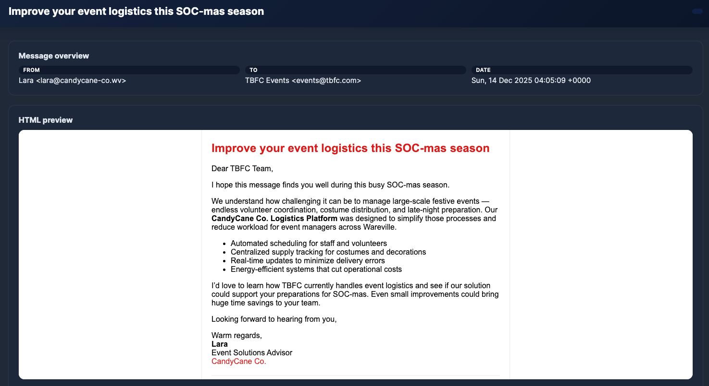
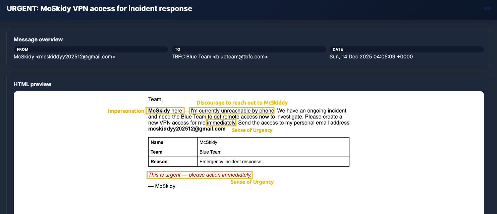
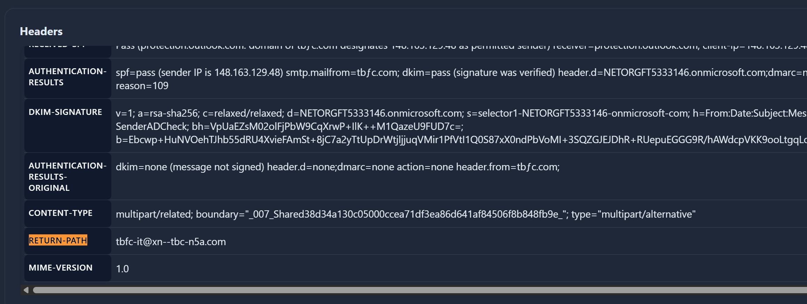

Common intentions behind phishing messages:
- **Credential theft:** Tricking users into revealing passwords or login details.
- **Malware delivery:** Disguising malicious attachments or links as safe content.
- **Data exfiltration:** Gathering sensitive company or personal information.
- **Financial fraud:** Persuading victims to transfer money or approve fake invoices.

Common intentions behind spam messages:
- **Promotion:** Advertising products, services, or events. Often unsolicited or low-quality.
- **Scams:** Spreading fake offers or “get rich quick” schemes to attract clicks.
- **Traffic generation (clickbait):** Driving users to external sites or boosting ad metrics.
- **Data harvesting:** Collecting active email addresses for future campaigns.

---

# **Typosquatting and Punycode**

Typosquatting is when an attacker registers a common misspelling of an organisation's domain. For example, `glthub.com` instead of `github.com` (note that there is an `L` instead of an `i`).                           

On the other hand, punycode is a special encoding system that converts Unicode characters (used in writing systems like Chinese, Cyrillic, and Arabic) into ASCII. When typing punycodes in the browser URL bar, this will be translated into ASCII format, which is the accepted format by DNS.  
With that resource, attackers can replace identical Latin letters; for example, a standard Latin `a` could be replaced with a Greek `α`.

Below we can see an image showing the **tryhackme.com** domain written with **тrу** instead (Cyrillic `т`, Cyrillic `г`, Cyrillic `у`):

If we pay attention to the sender of this message, we can identify a Latin letter `ƒ` instead of a normal `f`! It's a clear punycode usage for an email domain.

An easy way to identify punycodes is by looking at the field `Return-Path` in the email headers. On the opened email, go down to the headers preview, and you will see the ACE prefix and the encoded non-ASCII characters!

---

# **Spoofing**

Open the email with the subject "**New Audio Message from McSkidy**" and take a look at the `From:` field:

It looks like a real domain from TBFC, but let's check some essential fields in the email headers:

- `Authentication-Results`
- `Return-Path`

On `Authentication-Results`, SPF, DKIM, and DMARC are security checks that help confirm if an email really comes from who it says it does:

- **SPF:** Says which servers are allowed to send emails for a domain (like a list of approved senders).
- **DKIM:** Adds a digital signature to prove the message wasn’t changed and really came from that domain.
- **DMARC:** Uses SPF and DKIM to decide what to do if something looks fake (for example, send it to spam or block it).

If both SPF and DMARC fail, it’s a strong sign the email is spoofed, meaning the sender isn’t who they claim to be. In this message case, everything failed!

On the `Return-Path` we can see the real mail address `zxwsedr@easterbb.com`. This confirms the spoofing attempt on the missing calls email from TBFC!

---

# **Malicious Attachments**

The most classic way of phishing is attaching malicious files to an email. Usually, these attachments are sent using some sort of social engineering technique in the body.

In the previous email that we analysed, the body tried to trick users into thinking that the attachment was a voice message from McSkidy.  
Instead, the file is an `.html` file:

---

# **Fake Login Pages**

Above it's a Fake Microsoft Login Page sample. We can observe the fake domain `microsoftonline.login444123.com/signin` at the top.

--- 

# **Side Channel Communications**

Side-channel communication occurs when an attacker moves the conversation off email to another channel, such as SMS, WhatsApp/Telegram, a phone or video call, a texted link, or a shared document platform, to continue the social engineering in a platform without the company's control.

