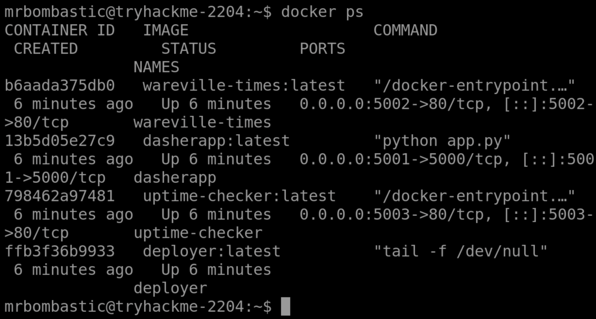
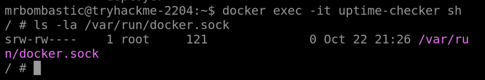

DoorDasher’s web application, which is running inside Docker containers, was compromised and modified, causing the service to display altered branding and serve unexpected/malicious content to users. An attacker then revoked or blocked normal administrative access, preventing engineers from logging directly into the host system to fix the issue. The SOC team still retains limited access through a monitoring container (an uptime-checking pod), which gives shell access inside a container but not full host privileges. The task is to use this container access to investigate the environment, escape the container, escalate privileges on the host, and restore the original, legitimate DoorDasher service.

## What Are Containers?

To understand what a container is, we first need to understand the problem it fixes. Put plainly, modern applications can be quite complex:

- **Installation**: Depending on the environment the application is being installed in, it’s not uncommon to run into “_configuration quirks_” which make the process time-consuming and frustrating. 
- **Troubleshooting**: When an application stops working, a lot of time can be wasted determining if it is a problem with the application itself or a problem with the environment it is running in.
- **Conflicts**: Sometimes multiple versions of an application need to be run, or perhaps multiple applications which need (for example) different versions of Python to be installed. This can sometimes lead to conflicts, complicating the process further.

“isolation” as a solution
Containerisation solves these problems by packing applications, along with their dependencies, in one isolated environment. This package is known as a container.

One key benefit is how lightweight they are.

**Containers vs VMs**

To illustrate container architecture, let's examine another form of virtualisation: Virtual Machines. 

A virtual machine runs on a hypervisor (software that emulates and manages multiple operating systems on one physical host). It includes a full guest OS, making it heavier but fully isolated. Virtual machines are ideal for running multiple different operating systems or legacy applications,

Containers share the host OS kernel, isolating only applications and their dependencies, which makes them lightweight and fast to start. Containers excel at deploying scalable, portable micro-services.

**Applications at Scale**
Microservices are a switch in the style of application architecture, where before it was a lot more common to deploy apps in a monolithic fashion (built as a single unit, a single code base, usually as a single executable ), more and more companies are choosing to break down their application into parts based on business function. This way, if a specific part of their application receives high traffic loads, they can scale that part without having to scale the entire application. This is where the lightweight nature of containers comes into play, making them incredibly easy to scale to meet increasing demands. They became the go-to choice for this (increasingly popular) architecture, and this is why, over the last 10 years, you have started seeing the term more and more.

You may have noticed a layer labelled “Container Engine” in the diagram. A container engine is software that builds, runs, and manages containers by leveraging the host system’s OS kernel features like namespaces and cgroups. One example of a container engine is Docker, which we will examine in more detail. Docker is a popular container engine that uses Dockerfiles, simple text scripts defining app environments and dependencies, to build, package, and run applications consistently across different systems.

**Docker**
Docker is an open-source platform for developers to build, deploy, and manage containers. Containers are executable units of software which package and manage the software and components to run a service. They are pretty lightweight because they isolate the application and use the host OS kernel.

**Escape Attack & Sockets**

A container escape is a technique that enables code running inside a container to obtain rights or execute on the host kernel (or other containers) beyond its isolated environment (escaping). For example, creating a privileged container with access to the public internet from a test container with no internet access.

Containers use a client-server setup on the host. The CLI tools act as the client, sending requests to the container daemon, which handles the actual container management and execution. The runtime exposes an API server via Unix sockets (runtime sockets) to handle CLI and daemon traffic. If an attacker can communicate with that socket from inside the container, they can exploit the runtime (this is how we would create the privileged container with internet access).

# Challenge

## 🔍 Step 1: Identify Running Docker Services

Check which containers are currently running:

`docker ps`

You should observe multiple containers running.  
The **main web service** is accessible at:

`http://10.48.143.160:5001`

Visiting the site shows the **defaced application.

---

## 🔎 Step 2: Investigate the Monitoring Container (uptime-checker)

Access the uptime-checker container:

`docker exec -it uptime-checker sh`

This container is used for **monitoring / uptime checks**.

---

## 🔐 Step 3: Check Docker Socket Access

Inside the container, check Docker socket permissions:

`ls -la /var/run/docker.sock`

### 🧠 Why this matters

- The Docker socket allows **direct communication with the Docker daemon**
    
- If a container has access to this socket, it can:
    
    - Control Docker
        
    - Create new containers
        
    - Interact with existing containers
        
- This enables a **Docker escape / privilege escalation**
    

Confirm access by running:

`docker ps`

If this works **inside the container**, you can control Docker from within the container.

---

## 🚪 Step 4: Access a Privileged Container (deployer)

Now move into the privileged container:

`docker exec -it deployer bash`

Check your current user:

`whoami`

Explore the container filesystem and locate the **recovery script**.

---

## 🛠️ Step 5: Restore the Website

You’ve reached the container that contains the recovery script.

Run the script with elevated privileges:

`sudo /recovery_script.sh`

This restores the original **DoorDasher** application.

---

## ✅ Step 6: Verify Restoration

Refresh the web application:

`http://10.48.143.160:5001`

You should now see the **original DoorDasher site**.

---

## 🏁 Step 7: Capture the Flag

After recovery:

- A flag is stored in the root directory (`/`)
    
- Read it using:
    

`cat /<flag_file>`

