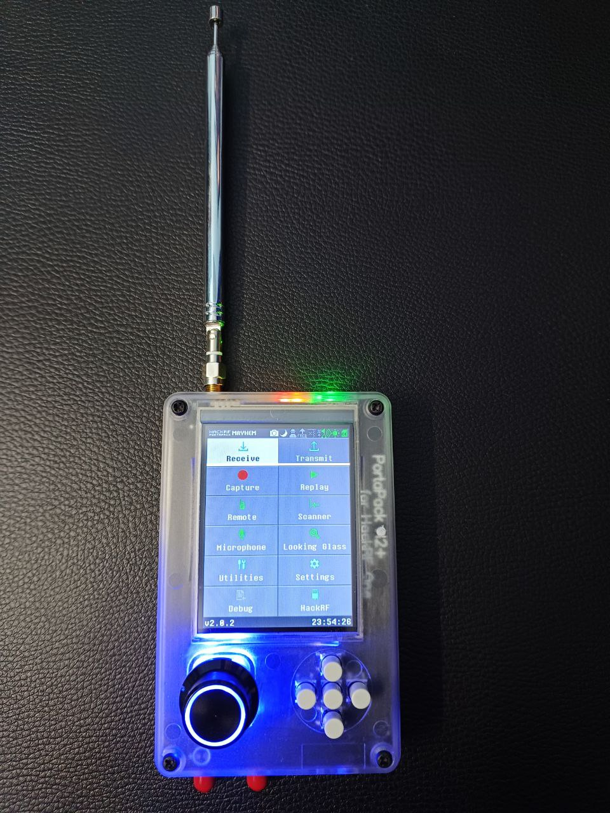
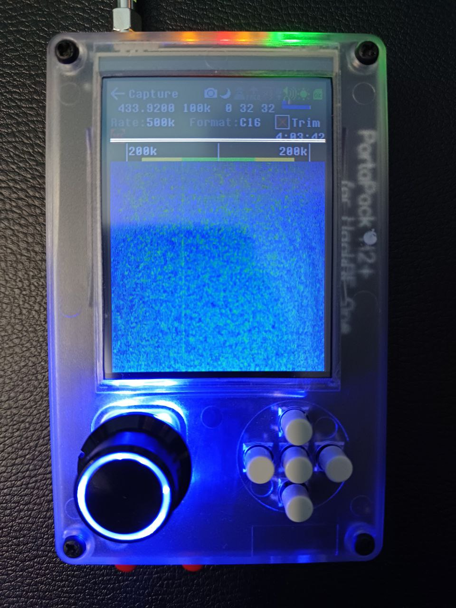
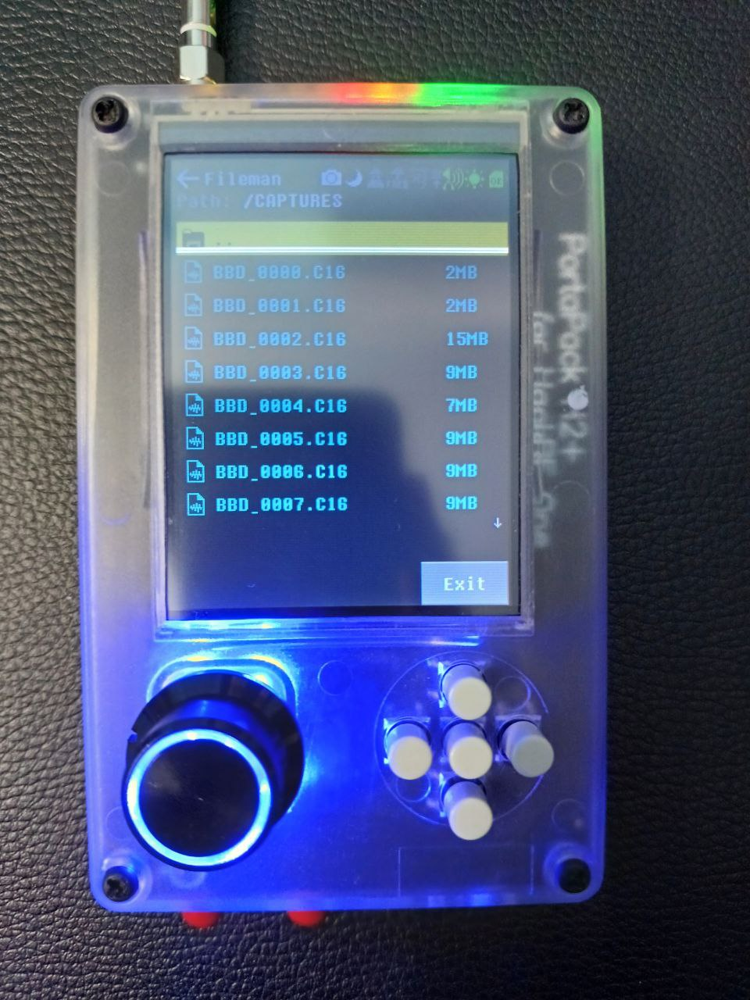
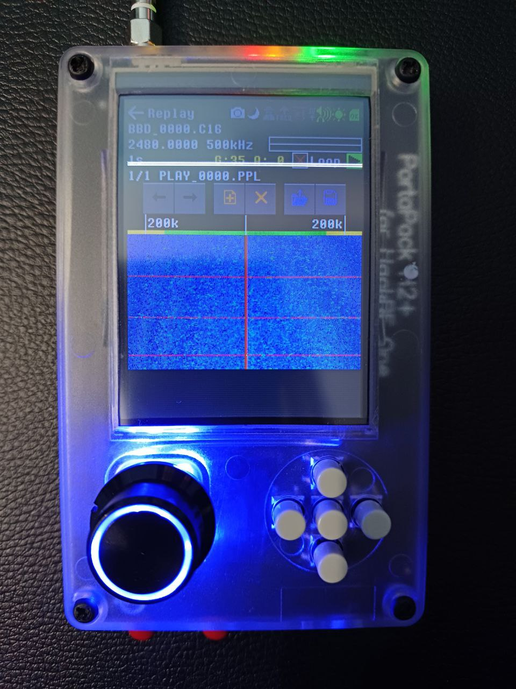
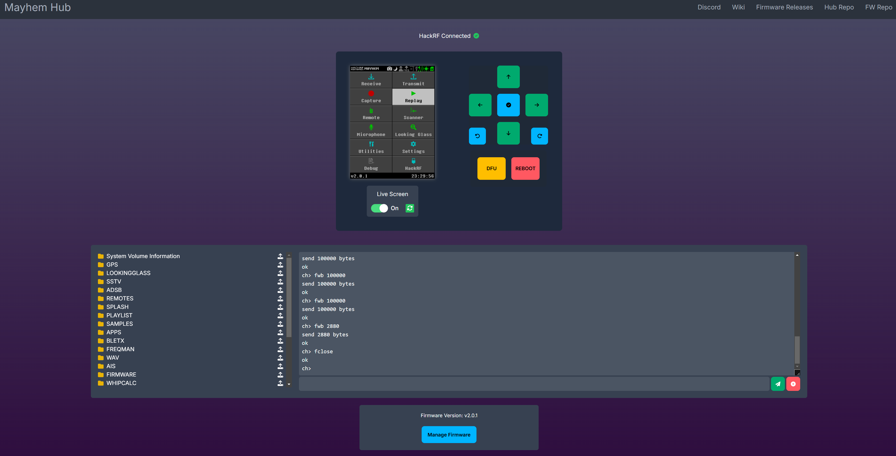

# 🚗 Car Key Fob Replay Attack Vulnerability Analysis

A practical wireless security research project analyzing the susceptibility of car key fob systems to **RF replay attacks** using a **HackRF One with PortaPack H2+**.

The project focuses on understanding how fixed-code wireless systems can be exposed to signal capture and replay attacks, demonstrating the security implications of static RF authentication mechanisms and the importance of stronger wireless security controls.

---

## 📌 Project Overview

Modern vehicles rely heavily on wireless key fobs for functions such as locking and unlocking doors. When a key fob uses a **static or fixed RF signal**, the transmitted signal may be susceptible to interception and subsequent replay.

This project investigated that security weakness using Software-Defined Radio (SDR) hardware.

The assessment involved:

- Identifying the operating frequency used by the test key fob.
    
- Capturing RF transmissions generated during lock/unlock operations.
    
- Storing captured signals for controlled analysis.
    
- Performing replay testing in an authorized test environment.
    
- Analyzing the security implications of fixed-code authentication.
    
- Examining rolling-code mechanisms as a defensive countermeasure.
    

---

## 🎯 Objectives

The primary objectives of this project were to:

1. Understand the RF communication behavior of a car key fob.
    
2. Explore wireless signal capture using SDR technology.
    
3. Analyze the security limitations of fixed-code systems.
    
4. Demonstrate the concept of an RF replay attack in a controlled environment.
    
5. Identify appropriate defensive mechanisms for mitigating replay attacks.
    
6. Develop practical knowledge of automotive wireless security.
    

---

## 🛠️ Hardware & Technologies

### Hardware

- **HackRF One**
    
- **PortaPack H2+**
    
- SD Card
    
- Test automotive key fob
    

### Software / Firmware

- Mayhem / PortaPack environment
    
- Software-Defined Radio (SDR) tooling
    
- RF signal analysis tools
    

### Key Technologies

- Radio Frequency (RF)
    
- Software-Defined Radio
    
- Automotive Wireless Security
    
- RF Signal Analysis
    
- Replay Attack Analysis
    
- Fixed-Code Authentication
    
- Rolling-Code Authentication
    

---

## 📡 Assessment Workflow

The project followed a controlled research workflow:

```text
        ┌─────────────────────┐
        │   Test Key Fob      │
        └──────────┬──────────┘
                   │
                   ▼
        ┌─────────────────────┐
        │ Identify RF Signal  │
        │   433.92 MHz        │
        └──────────┬──────────┘
                   │
                   ▼
        ┌─────────────────────┐
        │   Signal Capture    │
        │      via SDR        │
        └──────────┬──────────┘
                   │
                   ▼
        ┌─────────────────────┐
        │ Store Capture for   │
        │ Controlled Analysis │
        └──────────┬──────────┘
                   │
                   ▼
        ┌─────────────────────┐
        │ Controlled Replay   │
        │      Testing        │
        └──────────┬──────────┘
                   │
                   ▼
        ┌─────────────────────┐
        │ Security Assessment │
        └─────────────────────┘
```

---

## 🔬 Key Finding

The assessment demonstrated the security weakness associated with **static/fixed-code RF authentication**.

When the same RF authentication signal is reused, an intercepted transmission may potentially be replayed without requiring the original key fob to transmit the signal again.

This illustrates an important limitation of static wireless authentication mechanisms.

---

## 🔐 Security Implications

A fixed-code key-fob system can potentially expose several security risks:

- RF signal interception
    
- Unauthorized signal replay
    
- Unauthorized vehicle access
    
- Lack of freshness in authentication
    
- Increased exposure to wireless attacks
    

The underlying issue is that the authentication mechanism does not sufficiently distinguish between an original transmission and a previously captured transmission.

---

## 🛡️ Recommended Countermeasure

A major defensive approach against replay attacks is the use of **rolling-code authentication**.

Instead of transmitting the same authentication value repeatedly, rolling-code systems use changing authentication data between successive transmissions.

Conceptually:

```text
Fixed-Code System

Key Fob ────────► [AUTH CODE A]
Key Fob ────────► [AUTH CODE A]
Key Fob ────────► [AUTH CODE A]

              ↓

Previously captured signal
may remain reusable


Rolling-Code System

Key Fob ────────► [AUTH CODE A]
Key Fob ────────► [AUTH CODE B]
Key Fob ────────► [AUTH CODE C]

              ↓

Previously captured authentication
data becomes unsuitable for reuse
```

Additional defensive considerations include secure cryptographic authentication, protection against signal manipulation, and careful implementation of synchronization between the vehicle and key fob.

---

## 📸 Project Evidence

### HackRF + PortaPack H2+



### RF Signal Capture



### Captured Signal Files



### Replay Attack Demonstration



### PortaPack Interface



---

## 📚 Skills Demonstrated

- Software-Defined Radio (SDR)
    
- RF signal analysis
    
- Wireless security assessment
    
- Automotive cybersecurity
    
- Replay attack analysis
    
- Hardware security research
    
- Security testing methodology
    
- Vulnerability analysis
    
- Ethical hacking
    
- Security awareness and mitigation analysis
    

---

## ⚠️ Ethical Disclaimer

This project was conducted strictly for **educational, security research, and authorized testing purposes**.

The techniques and concepts documented in this repository should only be applied to systems, devices, and vehicles for which explicit authorization has been obtained.

**Do not capture, replay, or interfere with wireless signals belonging to vehicles or devices that you do not own or have permission to test.**

Raw RF capture files are intentionally **not included in this public repository**.

---

## 🚀 Future Research

Potential areas for further research include:

- Analysis of rolling-code authentication mechanisms
    
- Comparative analysis of fixed-code and dynamic-code systems
    
- RF protocol analysis
    
- Automotive wireless attack-surface research
    
- Detection mechanisms for replay attempts
    
- Secure wireless authentication architectures
    

---

## 📄 License

This project is intended for educational and security research purposes. See the repository license for applicable terms.

------

⭐ If you found this project useful, consider starring the repository.
