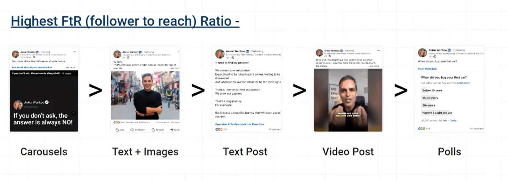
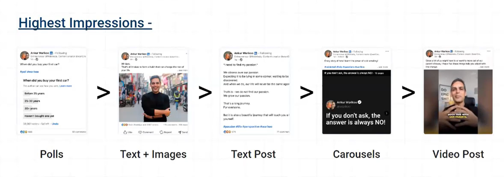
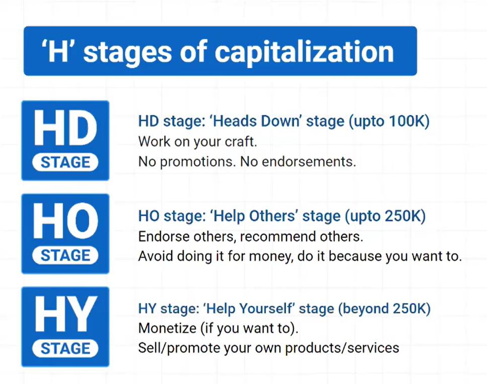
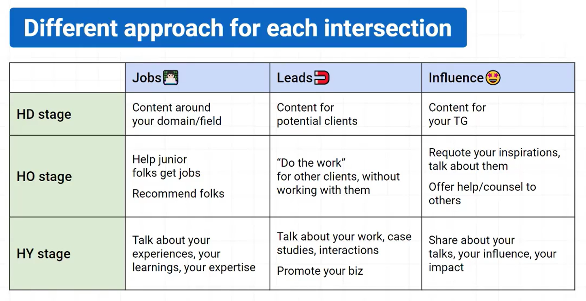
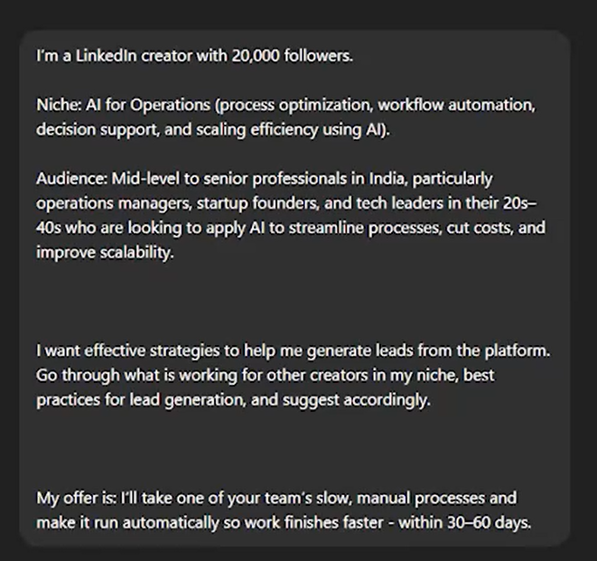

- Go with the trends , post what is going on in the world right now
- Connection cap of 30k
- atleast 2 posts a week
- Whenever you are free like on weekends , make a few posts ex 10 and then schedule them over a period of time
- post when the target audience is awake 
- Long posts (1200-1600 characters per post) received 30% higher reach than shorter posts(less than 300 characters.
- if you comment on your own posts within 1 hour of post it will give you 20% more visibility
- Reply >12 words is 50% more effective than a shorter reply. (it could be a new link added or just an extension to the post itself)
- get people to comment , ask a question in the ending of post
- Personal pictures drive 3X more engagement and 2.5X more reach. (even a group photo as long it has you)
- Hashtags don't work , no specific reason for adding (doesn't determine success or failure) Have 3 hashtags , no less , no more 
- LinkedIn ads - don't do it for promoting your content , do it for promoting your business , landing page , offering , event promotion , product
- Monday - weakest (first day of working week), Saturday and Sundays also weakest ; Tuesday , Wednesday and Thursday has the most spike
- carousels (pdfs) do work a lot - Canva 

- https://taplio.com/ - creates post based on previous posts

- Best Frequency: 14 posts(2x a day) + 3 to 4 reposts per week
- Posting Variation: Frequency of Text + Image has minimum impact on reach
- Reach and Post Length: Posts with at least 850 characters have 25% higher reach text+image.
- Image Relevance: Text post with an irrelevant image has given lower reach.
- no bold text , keep it simple , no formatting things (not algorithm friendly)
- videos : more impressions but lesser followers and engagement
- text + image based : more followers and engagement
- sharing awards , certification doesn't help **from a creator's perspective**
- consider posting in office hours - between 9am - 6pm

- when reaching the 30k connection mark , remove connections who are not engaging/ not relevant to your content
- you can send connection requests to people in your field (should we send or wait for requests)
- order of getting more impressions shares>comments>likes
- Does selectively accepting connection requests affect the content reach and audience response? (from those whom you won't get any business in future) - if you do accept , you would get recommended to their network , what if someone in their network is relevant to you ? why would you say no to that . If feed gets polluted is a problem , just engage and spend time on what you like
- Inspiration and thoughts - Find viral posts (more than 2,000 likes) and requote them with personal thoughts and a question (such as what do you think, or do you agree?). For this, image posts work the best!

- don't go on all platforms at once , only once you've cracked one , go to the next one

- pricing based on current scenario , if earning 50,000 a month , per hour cost by 3 to 5 times of that , so 250 per hour cost, charge 1000 or 1500 per hour or followers divided by 2
- to market any product , better to use a personal profile than a corporate profile

- hook(first line of post) should be something that stops the scroll and body of the post should be relevant to the hook line

---

How to get Engagement with educational content as well ?
There are 2 ways 
way number 1 , become the teacher 
- kids , here is the definition of brand management
- kids , here is what are frameworks for brand management
- here is the way to measure brand success
sure , but nobody comes to LinkedIn to learn about brand management

option number 2 
- here is the way Nike became the number 2 sports brand in the world and got defeated by somebody with half their marketing budget
- here is the way a large company created the biggest branded jewelry brand in the country when nobody bought branded jewelry
- here are 5 things that Pepsi has done to remain cool in the young mind
- here are 3 things that Asian paints did to become the absolute brand in home paints
- here is the big reason why Vistara dropped its name and chose air India instead

you're still teaching them brand management , but now its fun 
people like infotainment

The game is not to preach
the game is to connect

---

I find it difficult to post on LinkedIn thinking that my manager and others will judge me. What can be done about this?

lets say you are in quick commerce and lets say you work with blinkit
there are 2 ways you can now create content

- you can create content , around , hey , at blinkit , here is what we are doing to solve the problem of quick commerce
- here is how we are making deliveries faster and faster 
- here is how we are putting up dark stores
everything that is , not confidential can be shared in public 

Approach number 2 is 
- quick commerce has a way of reducing delivery times and here are the best practices
- quick commerce has a way of setting up dark stores very rapidly and here are the best practices 
- quick commerce has a way of expanding assortment and launching new categories and here is the thought process

dont talk about something that is too personal , coming from the context of my company ans so on
but when you talk about the industry , there isnt much to point out , to blame , to judge

make it industry specific but company agnostic

--- 

Carousel 
- 25 to 50 words max per slide
- 12 slides
- post under 500 characters
- when ? Tuesday , Thursday best at 9am