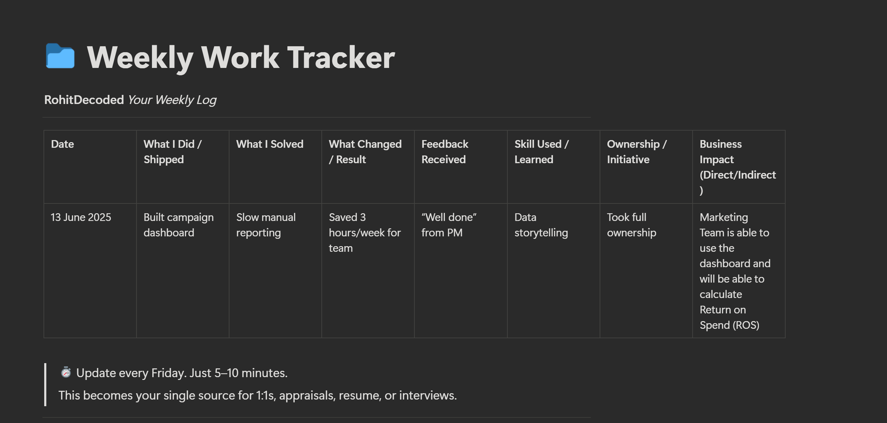
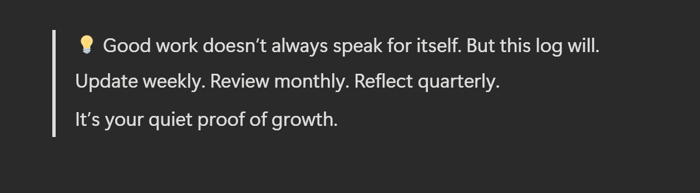

----
### 1. Weekly work log:

Every Friday, I write down:

- What I did
    
- What I solved
    
- What changed because of it
    

### 2. Outcome over effort:

Not “Created dashboard”

But “Created dashboard $\rightarrow$ reduced reporting time by 3 hours a week”

### 3. Save feedback:

Any Slack message, email, or meeting praise — I save it. These are the things that help you tell your story later.

### 4. Monthly reflection:

At the end of every month, I write a short summary for myself. Sometimes I share it with my manager, sometimes I don’t. But it’s always ready when I need it.

### 5. Keep the language clear

No fancy words. Just:

- “I helped…”
    
- “I improved…”
    
- “I took ownership…”
    

This isn’t about bragging.
It’s about not being forgotten.
If you’re serious about growth — start tracking your work.
It will change how people see you.
And how you see yourself.

----

