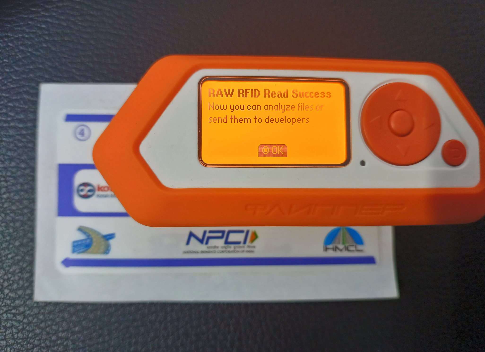
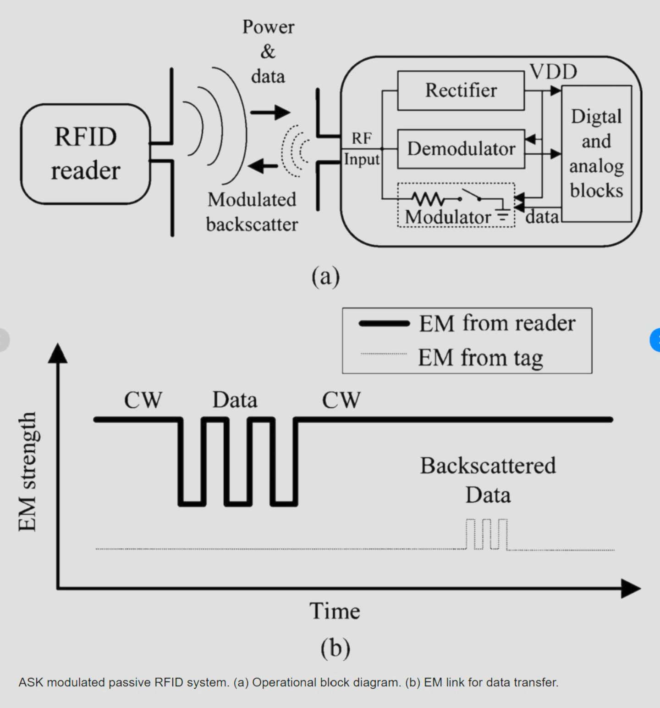
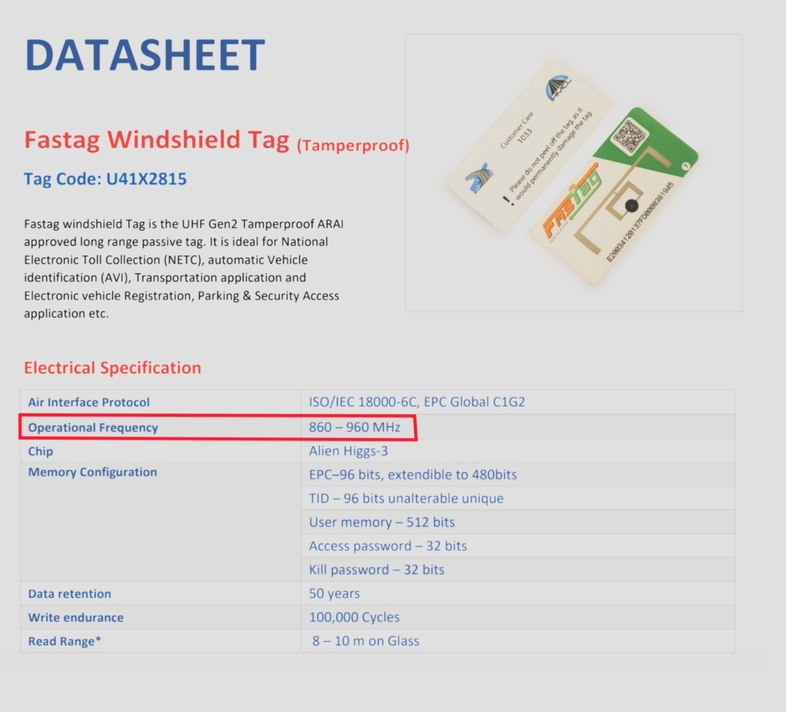
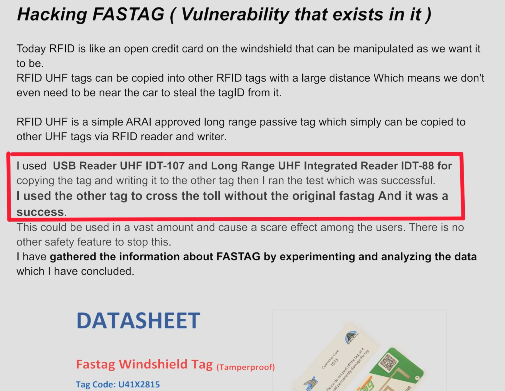
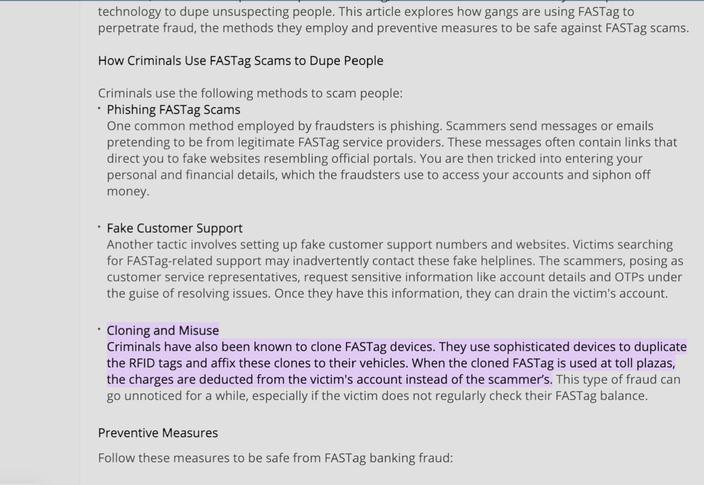
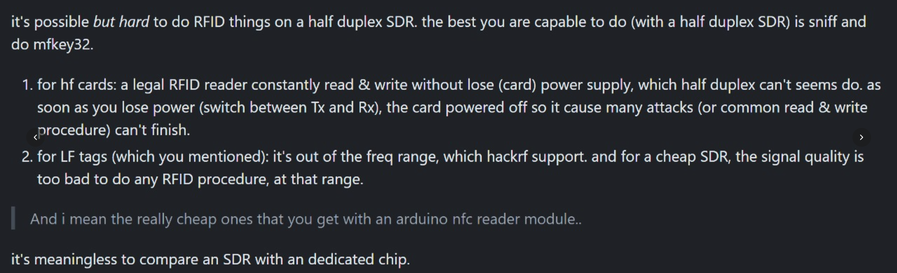
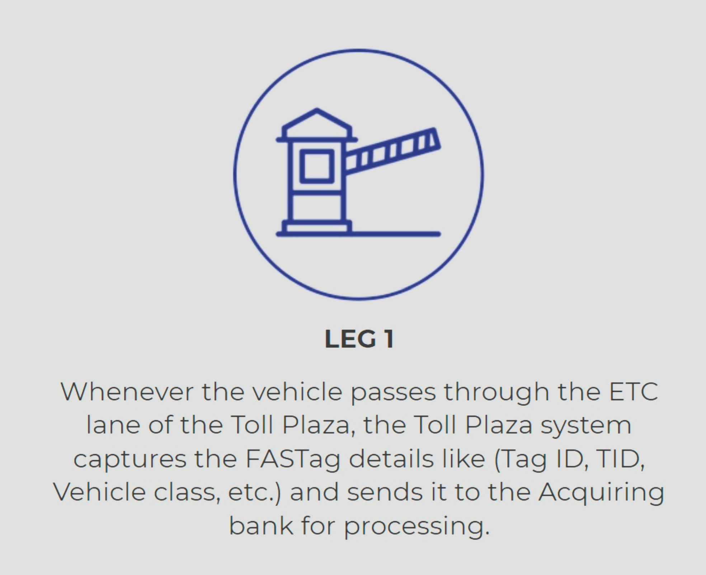
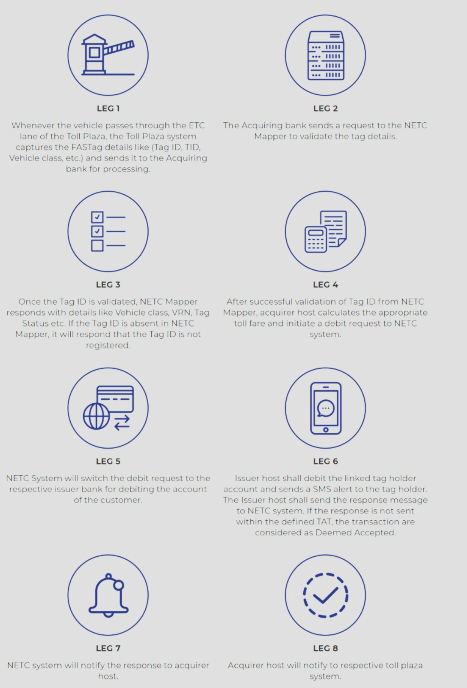
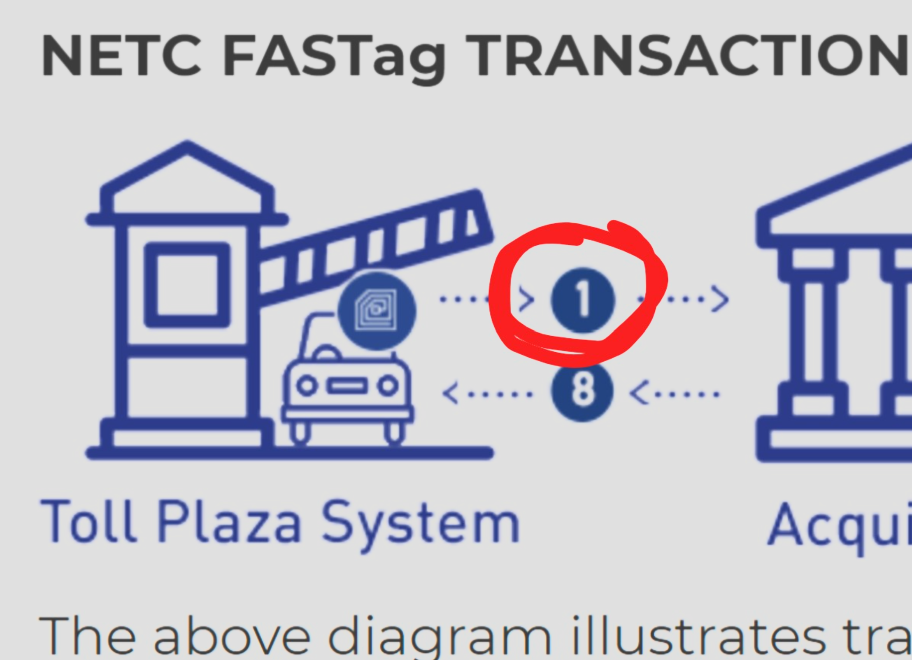

passive tags wait for a signal from an RFID reader. The reader sends energy to an antenna which converts that energy into an RF wave that is sent into the read zone. Once the tag is read within the read zone, the RFID tag’s internal antenna draws in energy from the RF waves. The energy moves from the tag’s antenna to the IC and powers the chip which generates a signal back to the RF system. This is called backscatter. The backscatter, or change in the electromagnetic or RF wave, is detected by the reader (via the antenna), which interprets the information.

UHF RFID
Work Frequency Standard ISM 865-867 MHz (IND),865-868 MHz (EU), 902-928 MHz (US)
Air Interface Protocol ISO18000-6B, EPC Class 1 Gen2 (ISO18000-6C)

UHF (Ultra-High Frequency) RFID Tags:
UHF RFID tags operate in the frequency range of 860-960 MHz, allowing for longer read ranges and faster data transfer rates. They are commonly used in logistics, supply chain management, and inventory tracking due to their ability to handle a large number of tags simultaneously.

Understanding the different types of RFID tags is vital for comprehending the intricacies of FASTag and its impact on toll collection systems. Passive, active, semi-passive, and UHF RFID tags each possess unique characteristics that make them suitable for various applications. In the context of FASTag, passive RFID tags play a central role in enabling seamless toll collection, exemplifying the efficiency and convenience of RFID technology.

----

In the datasheet given ,it was mentioned that FASTag operates on 860-960 MHz
But I found that , the entire band is not being used in FASTag specifically
The exact frequency is 865-867 MHz
So we have to listen on only this particular freq. , not the whole band

---

https://www.youtube.com/watch?v=QKi1OH8Zstk&ab_channel=HackInTheBoxSecurityConference
from 13:47 to 14:15

---

Even flipper can't do it since it needs an additional UHF module
The Flipper doesn’t have UHF capability in and of itself
Since the FASTag is encrypted, I still don't understand how it was written to another tag.

---

Can a normal RFID reader read FASTag? PS: Not for financial transactions just as another RFID tag.
https://qr.ae/pYsTat

Using a HackRF One PortaPack as a Mag Stripe Reader and Replayer
https://medium.com/@cameroncoward/using-a-hackrf-one-portapack-as-a-mag-stripe-reader-and-replayer-36690c93772a

https://www.reddit.com/r/RTLSDR/comments/ob4vqb/uhf_rfid_decoding/

https://www.idsolutionsindia.com/product/rfid-readers/desktop-reader-uhf-idt-107/

----

https://x.com/PrakashPantham/status/1823670590093582761?ref_src=twsrc%5Etfw%7Ctwcamp%5Etweetembed%7Ctwterm%5E1823670590093582761%7Ctwgr%5E4503aaa362b410e5a28ee7d9f1db24b0919ace37%7Ctwcon%5Es1_c10&ref_url=https%3A%2F%2Fwww.hindustantimes.com%2Ftrending%2Fceo-claims-money-was-deducted-from-his-fastag-while-he-was-chilling-at-home-101723702269785.html

Even though the ID tech guy said that we can't copy all 3 tracks , I don't know how the same case is coming

this is few months back only

----

I just now read the official documentation of fastag
and here it officially says that the toll gate only takes up the ID's and not the bank details

through the ID , that information is sent from the reader to the bank which has its own database of the payment methods for a specific tag id

though the official documentation has 8 legs ,
we have to just bypass the 1st leg
because the toll gate is sending only 1 leg

I am saying that we have to get these details 

And maybe not the bank data 
Because that the bank will deal with, according to the tag ID's we give them

---

---

