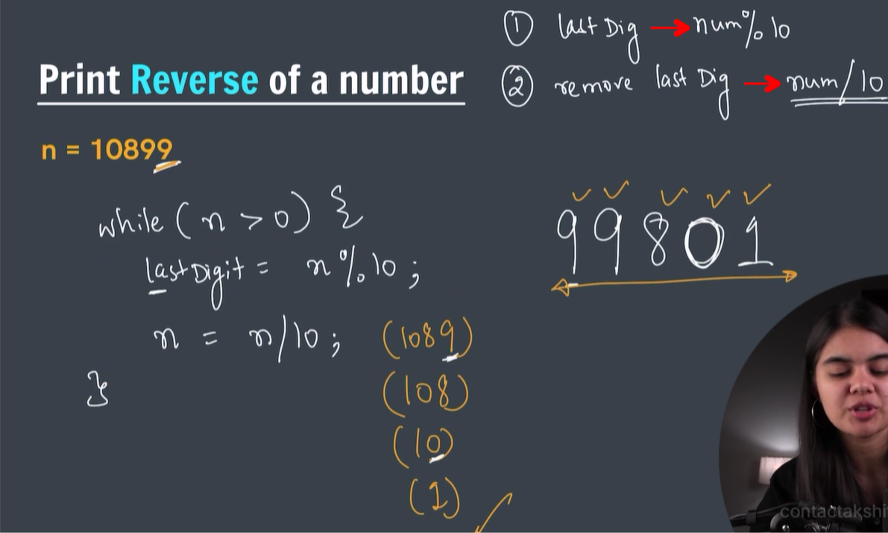

# While loop

execute the statement till the condition is true


```java
import java.util.Scanner;

public class Main {
    public static void main(String args[]) {
        int counter = 0;
        while(counter < 10){
            System.out.println("Hello world");
            counter++;
        }
        System.out.println("printed hw 10x");
        }
}
```

```java
import java.util.Scanner;

public class Main {
    public static void main(String args[]) {
        int counter = 0;
        while(true){
            System.out.println(counter);
            counter++;
        }
        }
}
```
We can write (true) to print infinitely

# Print numbers from 1 to 10

```java
public class Main {
    public static void main(String args[]) {
        int a = 1;
        while ( a <= 10) {
            System.out.println(a);
            a++;
        }
        }
}
```

```java
public class Main {
    public static void main(String args[]) {
        int a = 1;
        while ( a <= 10) {
            System.out.print(a + " ");
            a++;
        }
        }
}
```

```
1 2 3 4 5 6 7 8 9 10 
```
# Print numbers from 1 to n

```java
import java.util.Scanner;

public class Main {
    public static void main(String args[]) {
        Scanner sc = new Scanner(System.in);
        int n = sc.nextInt();
        int a = 1;
        while ( a <= n) {
            System.out.print(a + " ");
            a++;
        }
        }
}
```

```
9
1 2 3 4 5 6 7 8 9 
```
# Sum of first N natural numbers

```
import java.util.Scanner;

public class Main {
    public static void main(String args[]) {
        Scanner sc = new Scanner(System.in);
        int n = sc.nextInt();
        int i = 1;
        int sum = 0;
        while ( i <= n) {
            sum = sum + i;
            i++;
        }
        System.out.println("sum of first " + n + " natural numbers is: " + sum);
        }
}
```

```
3
sum of first 3 natural numbers is: 6
```
# For loop


```java
public class Main {
    public static void main(String args[]) {
        for(int i=1;i<=10;i++){
            System.out.println("hello world");
        }
        }
}
```

# Print a square pattern 


```
public class Main {
    public static void main(String args[]) {
        for(int i=1;i<=4;i++){
            System.out.println("****");
        }
        }
}
```

```
****
****
****
****
```

# Print reverse of a number



```
import java.util.Scanner;

public class Main {
    public static void main(String args[]) {
        int n = 10899;

        while (n > 0) {
            int lastdigit = n % 10;
            System.out.print(lastdigit);
            n = n /10; // n is getting smaller every time
        }
        }
}
```


# Reverse the given number


# Do while loop


# Break statement


# Question - break keyword


# Continue statement


# Question - continue keyword


# Check if a number is prime or not 


