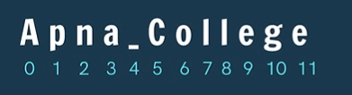
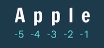
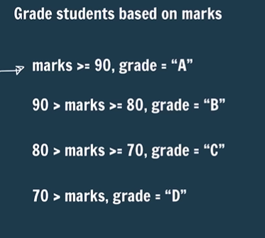
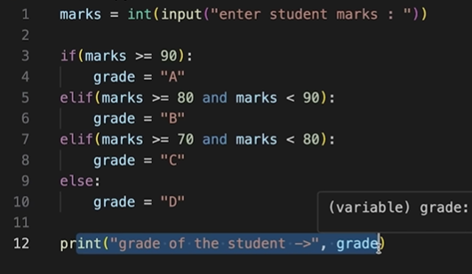

# Basics

String is data type that stores a sequence of characters.

```python
str1 = "This is a string." #recommended for ease of use
str2 = 'string2'
str3 = """string3"""
```

Escape sequence character - which means next line
"\n" - next line
"\t" - to give tab space

```python
str1 = "This is a string.\n we are creating it in python."
print(str1)
str2 = "This is a string.\t we are creating it in python."
print(str2)
```

```
This is a string.
 we are creating it in python.
This is a string.        we are creating it in python.
```

---

## Basic operations

### Concatenation

“hello” + “world” --> “helloworld”

```run-python
str1 = "apna"
str2 = " college"
final_str = str1+str2
print(final_str)
```

```
apna college
```

### length of string

len(str) -> is a function

```python
str1 = "apna"
len1 = len(str1)
print(len1)

str2 = "apna"
len2 = len(str2)
print(len2)

final_str = str1 + " " + str2
print(final_str)
print(len(final_str))
```

```
4
4
apna apna
9
```

even empty spaces will be counted

---
# Indexing

index --> position

Indexing starts with 0 


we cannot replace characters , we can only access them

```python
str = "apna college"
ch = str[1]
print(ch)
print(str[2])
```

```
p
n
```

---
# Slicing

Accessing parts of a string
to break a string into parts is know as slicing

it has 2 parts
1. starting index
2. ending index
the string between these two index gets taken out
including the entered starting and ending values

✅ Start is included, end is excluded ❌

Empty spaces (whitespace) are counted in Python string slicing.

Format:
```
str[starting_idx : ending_idx]
```

```run-python
str = "apna college"
print(str[5:4]) #will give blank output as it doesn't go in reverse
print(str[5:12])
print(str[6:12])
print(str[5:])
print(str[:4]) 
```

```

college
ollege
college
apna
```

## 1. Understand the string indexes

String:

```
str = "apna college"
```

|Character|a|p|n|a|(space)|c|o|l|l|e|g|e|
|---|---|---|---|---|---|---|---|---|---|---|---|---|
|Index|0|1|2|3|4|5|6|7|8|9|10|11|

## 2. Explanation of each slice

### ① `str[5:4]`

```
print(str[5:4])
```

Output:

```
''
```

Why?

- Start = `5`
    
- End = `4`
    
- Default step = `+1`
    

Python moves forward from index 5, but the end boundary is 4, which is already behind the starting position.

Therefore, the result is an empty string.

> Python does not automatically reverse the direction when start is greater than end.

### ② `str[5:12]`

```
print(str[5:12])
```

Output:

```
college
```

Indexes included: `5, 6, 7, 8, 9, 10, 11`

- Index 5 → `c`
    
- Index 12 → End boundary (excluded)
    

The slice extracts `"college"`.

### ③ `str[6:12]`

```
print(str[6:12])
```

Output:

```
ollege
```

Indexes included: `6, 7, 8, 9, 10, 11`

The first character `c` at index 5 is excluded.

### ④ `str[5:]`

```
print(str[5:])
```

Output:

```
college
```

This is called omitting the end index.

```
str[start:]
```

Python starts at index 5 and continues to the end of the string.

Equivalent to:

```
str[5:12]
```

### ⑤ `str[:4]`

```
print(str[:4])
```

Output:

```
apna
```

This is called omitting the start index.

```
str[:end]
```

Python starts from index 0 and stops before index 4.

Equivalent to:

```
str[0:4]
```


----

## Negative indexing 


reverse order of indexing is also possible
from rightmost it will start from -1
the ending index won't be printed i.e -1

Empty spaces (whitespace) are counted in Python string slicing.

✅ Start is included, end is excluded ❌ (the right one ending one)

```run-python
str = "apple"
print(str[0:3])
print(str[-5:-1])
```

```
app
appl
```

Great question, Akshit! The first character is not omitted in `str[-5:-1]`. The negative indexes refer to the same characters as positive indexes, and the ending index `-1` is excluded.

Let's understand it step by step. 👇

## 1. Your code

```
str = "apple"

print(str[0:3])
print(str[-5:-1])
```

Output:

```
app
appl
```

## 2. Understand positive and negative indexes

String:

```
str = "apple"
```

### a

0

-5

### p

1

-4

### p

2

-3

### l

3

-2

### e

4

-1

Positive indexes (top) · Negative indexes (bottom)

|Character|Positive index|Negative index|
|---|---|---|
|`a`|0|-5|
|`p`|1|-4|
|`p`|2|-3|
|`l`|3|-2|
|`e`|4|-1|

Important: Negative indexing starts from the end of the string.

## 3. First slice: `str[0:3]`

```
print(str[0:3])
```

- Start = `0` → `a` (included)
    
- End = `3` → `l` (excluded)
    

Characters included:

```
a p p
```

Output:

```
app
```

## 4. Second slice: `str[-5:-1]`

```
print(str[-5:-1])
```

Let's break it down:

| Negative index | Character | Included?  |
| -------------- | --------- | ---------- |
| -5             | `a`       | ✅ Yes      |
| -4             | `p`       | ✅ Yes      |
| -3             | `p`       | ✅ Yes      |
| -2             | `l`       | ✅ Yes      |
| -1             | `e`       | ❌ No (end) |

Output:

```
appl
```

### Why is `e` omitted?

Because the end index is always excluded, whether you use positive or negative indexes.

```
str[-5:-1]
```

is equivalent to:

```
str[0:4]
```

Both produce:

```
appl
```

## 5. How to include the last character?

If you want the entire string using negative indexes:

```
str[-5:]
```

Output:

```
apple
```

Or:

```
str[-5:5]
```

Output:

```
apple
```

You can also use:

```
str[:]
```

Output:

```
apple
```

## 🧠 Golden rule for your Python notes

> Negative indexes change the position, not the slicing rule.

- Start index → Included
    
- End index → Excluded
    
- `-1` → Last character
    
- `-2` → Second-last character
    
- `-5` → First character (for a 5-character string)


#### What will this print?

```
str = "apple"
print(str[-4:-1])
```

`apple`

`app`

`ppl`

`ple`

Check answer

Correct!

`-4` points to the first `p` (index 1), and `-1` points to the last `e` (index 4), which is excluded. The result is `ppl`.


---

# String Function


----

```run-python
str = "I am a coder."
print(str.endswith("er.")) #returns true if string ends with substr
```

```
True
```

```run-python
str = "I am studying python from apnacollege"
print(str.endswith("ege")) #True
print(str.endswith("app")) #False
```

```
True
False
```


---

```run-python
str.capitalize() #capitalizes 1st char
```

```run-python
str = "i am studying python from apnacollege"
str = str.capitalize()
print(str)
```

```
I am studying python from apnacollege
```

---

```run-python
str.replace(old,new) #replaces all occurrences of old with new
```

```run-python
str = "i am studying python from apnacollege"
print(str.replace("o","a"))
print(str.replace("python","javascript"))
```

```
i am studying pythan fram apnacallege
i am studying javascript from apnacollege   
```

---

```run-python
str.find(word) #returns 1st index of 1st occurrence
```

to find if a particular word exists in a string or not
it will return the index of that number

```run-python
str = "i am studying python from apnacollege"
print(str.find("o"))
print(str.find("from"))
print(str.find("Q")) #Letter doesn't exist here (will give index as -1)
```

```
18
21
-1
```

---

```run-python
str.count("am") #counts the occurrence of substr in string
```

```run-python
str = "i am studying python from apnacollege"
print(str.count("from"))
print(str.count("o"))
```

# Practice questions

## WAP to input user’s first name & print its length.

```run-python
name = input("Enter your name :")
print("length of your name is" , len(name))
```

## WAP to find the occurrence of ‘$’ in a String.

```run-python
str = "Hi , $Iam the $ symbol $99.99"
print(str.count("$"))
```

# Conditional Statements

<span style="color:rgb(255, 0, 0)">clicking "tab" key means 4 spaces</span>

if the criteria doesnt match it will print nothing

```run-python
age = 21

if (age >= 18):
    print("can vote")
    print("drive")

```

```run-python
age = 21

if (True):
    print("can vote")
    print("drive")

```
if we write "if (True)" , it will always execute

---

we can write any number of "if" and "el-if" in our code

```run-python
light = "green"

if(light == "red"):
    print("stop")
elif(light == "green"):
    print("go")
elif(light == "yellow"):
    print("look")

print("end of code")
```

---

in "if" and "if" - all statements will get executed
in "if" and "elif" only first matching one will get executes

```run-python
num = 5

if(num>2):
    print("greater than 2")
if(num > 3):
    print("greater than 3")
```

```run-python
num = 5

if(num>2):
    print("greater than 2")
elif(num > 3):
    print("greater than 3")
```

---

```run-python
light = "green"

if(light == "red"):
    print("stop")
elif(light == "green"):
    print("go")
elif(light == "yellow"):
    print("look")
else:
    print("light is broken")

print("end of code")
```

```run-python
age = 14

if(age >= 18):
    print("can vote") #indentation
else :
    print("cannot vote")
```
# Indentation

In Python we use proper spaces instead of curly braces { }
indentation is very important in python

# Question

## Grade students based on marks



```run-python
marks = int(input("Enter your marks :"))
print("your grade is : ")
if marks > 100 or marks < 0:
    print("Invalid marks")
elif (marks >= 90):
    print("A")
elif (90 > marks >= 80):
    print("B")
elif (80 > marks >= 70):
    print("C")
else:
    print("D")
```

Edge case (important) - invalid marks

or 



# Nesting

Nesting is writing one statement inside other

```
age = 90
# Nesting
if (age >= 18):
    if(age >= 80):
        print("cannot drive")
    else:
        print("can drive")
else:
    print("cannot drive")
```

# Questions

## WAP to check if a number entered by the user is odd or even.

```

```

## WAP to find the greatest of 3 numbers entered by the user.


## WAP check if a number is a multiple of 7 or not.


