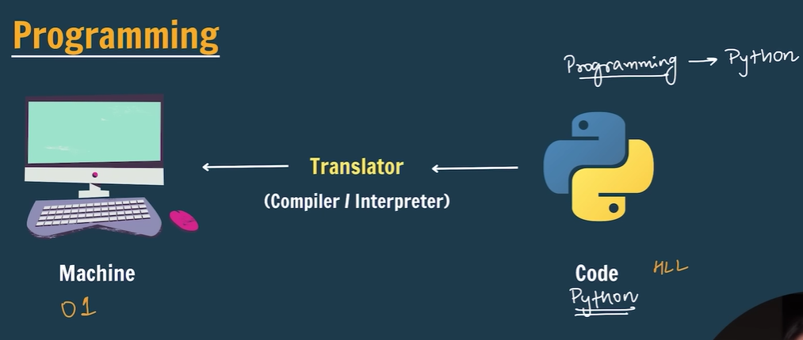
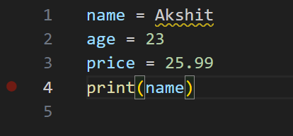
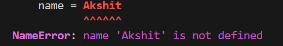
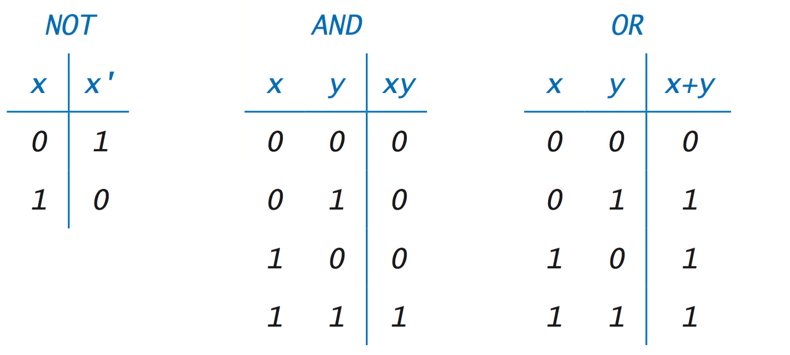
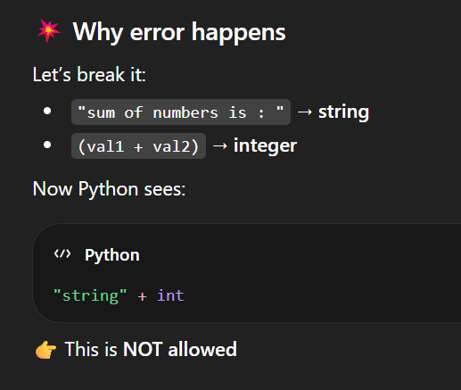

# Basics



python is a high level language
machine understands only in 0 and 1

What is Python?
- Python is simple & easy
- Free & Open Source
- High Level Language
- Developed by Guido van Rossum
- Portable

Python Character Set
- Letters – A to Z, a to z
- Digits – 0 to 9
- Special Symbols - + - * / etc.
- Whitespaces – Blank Space, tab, carriage return, newline, formfeed
- Other characters – Python can process all ASCII and Unicode characters as part of data or literals

```run-python
print("Akshit is my name.")
print("Hello World")
```
### Print is actually a Function

if we want to print on same line instead of different lines

```run-python
print("Akshit is my name." , "Hello World")
```

we can print numbers also without " "

```run-python
print(23)
print(35+23)
```

# Variables

A variable is a name given to a memory location in a program.

```run-python
name = "Shradha"
age = 23
price = 25.99

print(name)
print(age)

print("my name is: " , name)
print("my age is: " , age)

age2 = age
print(age2)
```

the values can be changed over time



This is wrong as we have defined name as a variable 
and in value we have inputted a string

variables can be float values or numbers
# Rules for Identifiers

1. Identifiers can be combination of uppercase and lowercase letters, digits or an underscore(_). So myVariable, variable_1, variable_for_print all are valid python identifiers.
2. <span style="color:rgb(255, 0, 0)">An Identifier can not start with digit. So while variable1 is valid, 1variable is not valid.</span>
3. <span style="color:rgb(255, 0, 0)">We can't use special symbols like !,#,@,%, $ etc in our Identifier.</span>
4. Identifier can be of any length.

Variable name should be short, simple and meaningfull

# Data Types


Integers can be either +ve , -ve or 0

```run-python
name1 = "sk"
name2 = 'sk'
name3 = '''sk'''
print(name1)
print(name2)
print(name3)
```
strings can be either in single , double or triple comma's

```run-python
name = "Shradha"
age = 23
price = 25.99

print(type(name))
print(type(age))
print(type(price))
```

```
<class 'str'>
<class 'int'>
<class 'float'>
```
Printing data types of variables

---
<span style="color:rgb(255, 0, 0)">Boolean values should start in capital letters ex. "True" ; not "true"</span>
<span style="color:rgb(255, 0, 0)">None has no data type</span>
```
age = 23
old = False
a = None
print(type(old))
print(type(a))
```

```
<class 'bool'>
<class 'NoneType'>
```

# Keywords

Keywords are reserved words in python.
These words cannot be used as variable names in python


python is a case sensitive 
Apple will be a different variable 
apple will be a different variable

DBMS (SQL) is not case sensitive
In that A and a makes no difference

# print sum 

```run-python
a = 1000
b = 500
sum = a + b
print(sum)
```

```
1500
```

---

```run-python
a = 1000
b = 500
diff = a - b
print(diff)
```

```
500
```

# Comments


'#' -> for single line comment
''' for multi line comment '''
""" for multi line comment """

select all lines which you want to comment out 
then ctrl + /

# Operators in Python


An operator is a symbol that performs a certain operation between operands.

Arithmetic Operators ( + , - , * , / , % , ** )

Relational / Comparison Operators ( == , != , > , < , >= , <= )

Assignment Operators ( = , +=, -= ,*= , /= , %= ,**= )

Logical Operators ( not , and , or )

AND - gives true only when both of them are True
OR - gives true when either one is True

```run-python
# Arithmetic Operators
a = 4
b = 2
print(a + b)
print(a - b)
print(a * b)
print(a / b) # integers will give value in decimal as well
print(a % b) # remainder
print(a ** b) # a^b
```

```run-python
# relational operators
# they will always give answer as either True or False only
a = 50
b = 20

print(a == b) # False
print(a != b) # True
print(a >= b) # True
print(a > b) # True
print(a <= b) # False
print(a < b) # False
```

```run-python
#assignment operators
num = 10
num += 10
print(num)
num -= 10
print(num)
num *= 10
print(num)
num /= 10
print(num)
num **= 10
print(num)
```

```run-python
# Logical operators
print(not False)
print(not True)

a = 50
b = 30
print(not (a > b))

val1 = True
val2 = True
print("AND operator:" , val1 and val2)

val3 = True
val4 = False
print("AND operator:" , val3 and val4)
print("OR operator:" , val3 or val4)
```


# Type conversion/casting

to convert one type of value to another
type conversion is automatic
type casting is done forcefully/manually

```run-python
#type conversion
a = 2
b = 4.25

sum = a + b # 2.0 + 4.25 -> 6.25
print(sum)
```

here , one value is integer and other is float
but python automatically converts to higher/bigger value i.e float here

---

you cannot add string to floating value

TypeError: can only concatenate str (not "float") to str

```run-python
a = "2"
b = 4.5
print(float(a)+b)
```

```run-pythom
a = float("2")
b = 4.5

print(type(a))
print(a+b)
```

```run-python
a = float("Akshit")
b = 4.5

print(type(a))
print(a+b)
```
ValueError: could not convert string to float

```
a = 3.14
a = str(a)

print(type(a)) #<class 'str'>
```

# Taking input 

```run-python
name = input("enter your name:")
print("Welcome", name)
```

---

input statement will ALWAYS be a STRING

```run-python
val = input("enter some value: ")
print(type(val) , val)
```

if we know that the value wil be integer , we will add int() in front of it 

```run-python
val = float(input("enter some value: "))
print(type(val) , val)
```

```
enter some value: 25
<class 'float'> 25.0
```

---

```run-python
name = input("Enter name: ")
age = int(input("enter age: "))
marks = float(input("enter marks: "))

print("welcome", name)
print("age =", age)
print("marks =", marks)
```

```
Enter name: akshit
enter age: 21
enter marks: 23.67
welcome akshit
age = 21
marks = 23.67
```

# Practice questions

## Take input 2 numbers and print sum

```run-python
val1 = int(input("enter value 1: "))
val2 = int(input("enter value 2: "))
print("sum of numbers is :" , (val1 + val2))
print("sum of numbers is : " + str(val1 + val2))
print(f"sum of numbers is : {val1 + val2}") #best one
```



---

## WAP to input side of a square & print its area.

```run-python
side = float(input("Enter side of square: "))
print(f"area of square is : {side*side}")
print("area of square is :" , side**2)
```

---

## WAP to input 2 floating point numbers & print their average.

```run-python
number1 = float(input("Enter number 1 :"))
number2 = float(input("Enter number 2 :"))
average = float(number1 + number2)/2
print("average of the two number is" , average)
```

---

## WAP to input 2 int numbers, a and b.
## Print True if a is greater than or equal to b. If not print False.

```run-python
a = int(input("Enter number 1 :"))
b = int(input("Enter number 2 :"))
print(a>=b)
```

