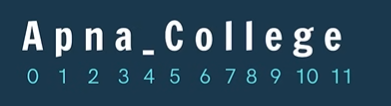
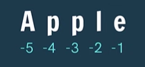

# Basics

String is data type that stores a sequence of characters.

```
str1 = "This is a string." #recommended for ease of use
str2 = 'string2'
str3 = """string3"""
```

Escape sequence character - which means next line
"\n" - next line
"\t" - to give tab space 

```run-python
str1 = "This is a string.\n we are creating it in python."
print(str1)
str2 = "This is a string.\t we are creating it in python."
print(str2)
```

---

## Basic operations

### Concatenation

“hello” + “world” --> “helloworld”

```run-python
str1 = "apna"
str2 = " college"
final_str = str1+str2
print(final_str)
```

### length of string

len(str) -> is a function

```run-python
str1 = "apna"
len1 = len(str1)
print(len1)

str2 = "apna"
len2 = len(str2)
print(len2)

final_str = str1 + " " + str2
print(final_str)
print(len(final_str))
```

```
4
4
apna apna
9
```

even empty spaces will be counted

---
# Indexing

index --> position

Indexing starts with 0 


we cannot replace characters , we can only access them

```run-python
str = "apna college"
ch = str[1]
print(ch)
print(str[2])
```

---
# Slicing

Accessing parts of a string
to break a string into parts is know as slicing

it has 2 parts
1. starting index
2. ending index
the string between these two index gets taken out
including the entered starting and ending values

- **start is included**
- **end is excluded** ❗

Format:
```
str[starting_idx : ending_idx]
```

```run-python
str = "apna college"
print(str[5:4]) #will give blank output
print(str[5:12])
print(str[5:])
print(str[:4]) 
```

```
college
college
apna
```

----

## Negative indexing 


reverse order of indexing is also possible
from rightmost it will start from -1
the ending index won't be printed i.e -1

- **start is included**
- **end is excluded** ❗

```run-python
str = "apple"
print(str[0:3])
print(str[-5:-1])
```

---

# String Function

```run-python
str = "I am a coder."
str.endswith("er.") #returns true if string ends with substr
```

```run-python
str = "I am studying python from apnacollege"
print(str.endswith("ege")) #True
print(str.endswith("app")) #False
```

---

```run-python
str.capitalize() #capitalizes 1st char
```

```run-python
str = "i am studying python from apnacollege"
str = str.capitalize()
print(str)
```

```
I am studying python from apnacollege
```

---

```run-python
str.replace(old,new) #replaces all occurrences of old with new
```

```run-python
str = "i am studying python from apnacollege"
print(str.replace("o","a"))
print(str.replace("python","javascript"))
```

```
i am studying pythan fram apnacallege
i am studying javascript from apnacollege   
```

---

```run-python
str.find(word) #returns 1st index of 1st occurrence
```

to find if a particular word exists in a string or not
it will return the index of that number

```run-python
str = "i am studying python from apnacollege"
print(str.find("o"))
print(str.find("from"))
print(str.find("Q")) #Letter doesn't exist here (will give index as -1)
```

```
18
21
-1
```

---

```run-python
str.count("am") #counts the occurrence of substr in string
```

```run-python
str = "i am studying python from apnacollege"
print(str.count("from"))
print(str.count("o"))
```

# Practice questions

## WAP to input user’s first name & print its length.

```run-python
name = input("Enter your name :")
print("length of your name is" , len(name))
```

## WAP to find the occurrence of ‘$’ in a String.

```run-python
str = "Hi , $Iam the $ symbol $99.99"
print(str.count("$"))
```

# Conditional Statements

<span style="color:rgb(255, 0, 0)">clicking "tab" key means 4 spaces</span>

if the criteria doesnt match it will print nothing

```run-python
age = 21

if (age >= 18):
    print("can vote")
    print("drive")

```

```run-python
age = 21

if (True):
    print("can vote")
    print("drive")

```
if we write "if (True)" , it will always execute

---

we can write any number of "if" and "el-if" in our code

```run-python
light = "green"

if(light == "red"):
    print("stop")
elif(light == "green"):
    print("go")
elif(light == "yellow"):
    print("look")

print("end of code")
```

---

in "if" and "if" - all statements will get executed
in "if" and "elif" only first matching one will get executes

```run-python
num = 5

if(num>2):
    print("greater than 2")
if(num > 3):
    print("greater than 3")
```

```run-python
num = 5

if(num>2):
    print("greater than 2")
elif(num > 3):
    print("greater than 3")
```

---

```run-python
light = "green"

if(light == "red"):
    print("stop")
elif(light == "green"):
    print("go")
elif(light == "yellow"):
    print("look")
else:
    print("light is broken")

print("end of code")
```

