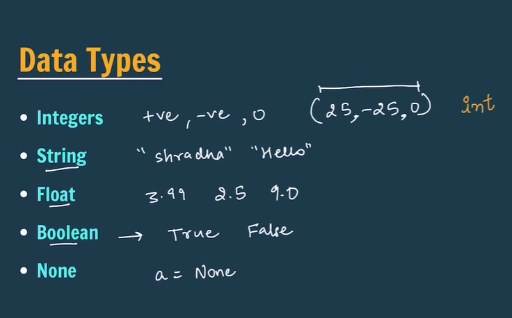
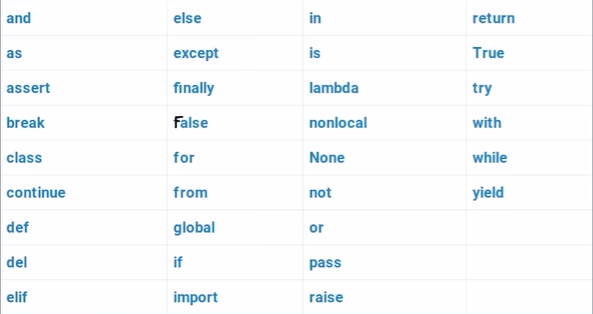
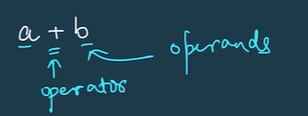

## basics


python is a high level language
machine understands only in 0 and 1

What is Python?
- Python is simple & easy
- Free & Open Source
- High Level Language
- Developed by Guido van Rossum
- Portable

Python Character Set
- Letters – A to Z, a to z
- Digits – 0 to 9
- Special Symbols - + - * / etc.
- Whitespaces – Blank Space, tab, carriage return, newline, formfeed
- Other characters – Python can process all ASCII and Unicode characters as part of data or literals

```run-python
print("Akshit is my name.")
print("Hello World")
```

if we want to print on same line instead of different lines

```run-python
print("Akshit is my name." , "Hello World")
```

we can print numbers also without " "

```run-python
print(23)
print(35+23)
```

## Variables

A variable is a name given to a memory location in a program.

```run-python
name = "Shradha"
age = 23
price = 25.99

print(name)
print(age)

print("my name is: " , name)
print("my age is: " , age)

age2 = age
print(age2)
```

the values can be changed over time

## Rules for Identifiers

1. Identifiers can be combination of uppercase and lowercase letters, digits or an underscore(_). So myVariable, variable_1, variable_for_print all are valid python identifiers.
2. An Identifier can not start with digit. So while<span style="color:rgb(255, 0, 0)"> variable1 is valid, 1variable is not valid.</span>
3. We can't use special symbols like !,#,@,%, $ etc in our Identifier.
4. Identifier can be of any length.

## Data Types



Boolean values should start in capital letters ex. "True" ; not "true"

```run-python
name = "Shradha"
age = 23
price = 25.99

print(type(name))
print(type(age))
print(type(price))
```

```
<class 'str'>
<class 'int'>
<class 'float'>
```

---

```
age = 23
old = False
a = None
print(type(old))
print(type(a))
```

```
<class 'bool'>
<class 'NoneType'>
```

## Keywords

Keywords are reserved words in python.



python is a case sensitive 
Apple will be a different variable 
apple will be a different variable

DBMS (SQL) is not case sensitive

## print sum 

```run-python
a = 1000
b = 500
sum = a + b
print(sum)
```

```
1500
```

---

```run-python
a = 1000
b = 500
diff = a - b
print(diff)
```

```
500
```

## Comments


'#' -> for single line comment
''' for multi line comment '''
""" for multi line comment """

## Operators in Python



An operator is a symbol that performs a certain operation between operands.

Arithmetic Operators ( + , - , * , / , % , ** )

Relational / Comparison Operators ( == , != , > , < , >= , <= )

Assignment Operators ( = , +=, -= ,*= , /= , %= ,**= )

Logical Operators ( not , and , or )

AND - gives true only when both of them are True
OR - gives true when either one is True

```run-python
# Arithmetic Operators
a = 4
b = 2
print(a + b)
print(a - b)
print(a * b)
print(a / b)
print(a % b) # remainder
print(a ** b) # a^b
```

```run-python
# relational operators
a = 50
b = 20

print(a == b) # False
print(a != b) # True
print(a >= b) # True
print(a > b) # True
print(a <= b) # False
print(a < b) # False
```

```run-python
#assignment operators
num = 10
num += 10
print(num)
num -= 10
print(num)
num *= 10
print(num)
num /= 10
print(num)
num **= 10
print(num)
```

```run-python
# Logical operators
print(not False)
print(not True)

a = 50
b = 30
print(not (a > b))

val1 = True
val2 = True
print("AND operator:" , val1 and val2)

val3 = True
val4 = False
print("AND operator:" , val3 and val4)
print("OR operator:" , val3 or val4)
```

## type conversion/casting

```run-python
#type conversion
a = 2
b = 4.25

sum = a + b # 2.0 + 4.25 -> 6.25
print(sum)
```

here , one value is integer and other is float
but python automatically converts to higher/bigger value i.e float here

