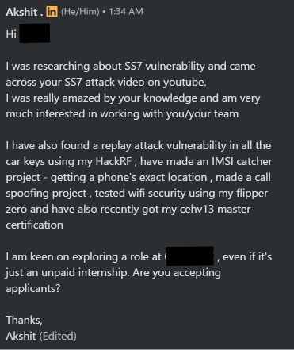

Cybersecurity carreer

Yaha pe humlog saare logo ko include karne ki koshish karenge saare fields ki

Jin logo ko man hai start karne ka 
Se leke jinke thoda aata hai 
Se leke Jo log entry level jobs ya internship me sai 
Se leke unn logo ke liye bhi jinhe lagta hai humse to aage koi nahi hai

Start with broader domains first
Ki field kya kya hai Cybersecurity me
ex. ai security , cloud , iot , network , web , fornesics , mobile , malware , soc , threat intel

---

Next is linkedin 
Same is for GitHub also 

Ab linkedin profile strong rakhna jaruri kyu hai ? 

First is talking about your passion .
Making connections 

Aap jo kaam karna chahte 
Ho 
Aur log bhi bhi wahi kaam aapse accha kar rahe hai 
To sabse seekhne ko milta hai

Warna mujhe bhi lagta tha itna important nahi hai linkedin profile maintain karna 
Until I started getting messages like these :

Show recruiter messages and emails
Redact all names and emails

Ab socho ek aisi life 
Jahan na maine jake apply Kiya kahi 
Na mera referall tha 
Par phir bhi recruiter khud saamne se reach out kar rahe hai ke

---

Think always from a skill point of view 
Not a certfition or a course
Mind map is the best way to do it

Certification useless nahi hai Going after certification spree is useless

All seminars Make 1 common order flow

Mind map is the best way to do it
And how to make mind map show step by step 
Add images

---

first see how my internships started

1. first i used to pay for internship 200rs , 300rs for certificate 
2. then i cold emailed people that i am doing this , i liked this , can you give me an internship
3. then i started winning all india govt internship
4. then i just participated for fun , just sharing exp from my previous internships
5. now even getting full time offers from fang/maang

----

