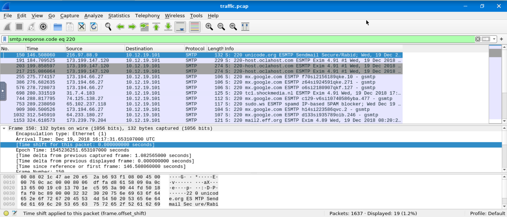

# 📧 Email Security Protocols – Simple Cheat Sheet

|Protocol|What it Checks|How it Works|Main Purpose|
|---|---|---|---|
|**SPF** (Sender Policy Framework)|Checks **which server sent the email**|Compares sender IP with allowed IPs in DNS|Prevents **fake sending servers**|
|**DKIM** (DomainKeys Identified Mail)|Checks **email signature**|Email is signed with a private key and verified with public key|Ensures **email was not modified**|
|**DMARC** (Domain-based Message Authentication Reporting and Conformance)|Combines **SPF + DKIM results**|Tells mail server what to do if checks fail|Prevents **domain spoofing**|
|**S/MIME** (Secure/Multipurpose Internet Mail Extensions)|Encrypts and signs email content|Uses public/private key encryption|Protects **email confidentiality and authenticity**|

---

## 🔍 What Each Protocol Protects

|Security Feature|Protocol|
|---|---|
|Sender verification|SPF|
|Email integrity|DKIM|
|Anti-spoofing policy|DMARC|
|Email encryption|S/MIME|

---

## 🧠 How SOC Analysts Check Emails (Quick Method)

When analyzing email headers, analysts usually look for these lines:

Example:

spf=pass  
dkim=pass  
dmarc=pass

Meaning:

✔ Sender server is allowed  
✔ Email signature valid  
✔ Domain policy passed

Email is **likely legitimate**.

---

## 🚨 Example of Suspicious Email

spf=fail  
dkim=fail  
dmarc=fail

This suggests:

⚠ Possible **spoofed or phishing email**

---

## 📊 Easy Way to Remember

Think of email security like **layers**:

SPF   → Who sent the email  
DKIM  → Was the email changed?  
DMARC → What should we do if it's fake?  
S/MIME → Can anyone read the email content?
# Task 2 Sender Policy Framework (SPF)

<span style="color:rgb(255, 0, 0)">“Sender Policy Framework (SPF) is used to authenticate the sender of an email. With an SPF record in place, Internet Service Providers can verify that a mail server is authorized to send email for a specific domain. An SPF record is a DNS TXT record containing a list of the IP addresses that are allowed to send email on behalf of your domain.”</span>


|Verification Result|Intended Action|
|---|---|
|Pass, Neutral, None|Accept (Allow and process the email)|
|SoftFail, PermError|Flag (Mark as suspicious but allow)|
|Fail, TempError|Reject (Immediately discard the email)|

## SPF Records

sample SPF record and break down its format. Further information on SPF Record Syntax can be found [here](https://dmarcian.com/spf-syntax-table/).

`v=spf1 ip4:127.0.0.1 include:_spf.google.com -all`

- `v=spf1` Signifies the start of the SPF record
- `ip4:127.0.0.1` Specifies which IP can send mail (IPv4 in this case)
- `include:_spf.google.com` Specifies which domain can send mail
- `-all` Non-authorized emails will be rejected

## Tools

The **[SPF Surveyor](https://dmarcian.com/spf-survey/)** tool from dmarcian enables us to gain a visual look at DNS records. It also helps ensure the record uses the correct syntax.

Let's take a look at **TryHackMe**'s SPF record as an example.


You may notice that no IP addresses are visibly present in the main record, but three domains are listed. In this case, all IP addresses authorized by the domains will be recognized as legitimate senders.

- `_spf.google.com`
- `email.chargebee.com`
- `7168674.spf05.hubspotemail.net`

**Google Admin Toolbox** [**Messageheader**](https://toolbox.googleapps.com/apps/messageheader/) allows you to analyze delivery details using an email's full header. It shows various record results, including SPF. 

example below, which shows the SPF record as `softfail with IP Unknown!`. A `SoftFail` means the sending mail server is not listed as an authorized sender, but the receiving server will still accept the email and flag it as suspicious. In this case, the sending IP address could not be verified.


# Task 3 Domain Keys Identified Mail (DKIM)

**DKIM (DomainKeys Identified Mail)** is a security method that **verifies that an email really came from the domain it claims to come from and was not changed during delivery.**

## 🔐 Simple Real-Life Example

Imagine this:

1️⃣ Infosys sends you an email  
2️⃣ Infosys **signs the email with a secret key**  
3️⃣ Your mail server checks the **public key published by infosys.com**

If the keys match → email is genuine.

## ⚙️ How DKIM Works (Step by Step)

### Step 1 — Email is sent

The **sending mail server** signs the email using a **private key**.

Example sender:

springboard@infosys.com

---

### Step 2 — DKIM signature is added

A special header is added to the email:

DKIM-Signature: v=1; a=rsa-sha256; d=infosys.com; s=selector;

This is the **digital signature**.

---

### Step 3 — Receiver checks DNS

The receiving mail server:

1. Looks at the domain
    

infosys.com

2. Queries DNS for the **public key**
    

Example DNS record:

selector._domainkey.infosys.com

---

### Step 4 — Signature verification

The receiver:

- Uses the **public key from DNS**
    
- Verifies the **signature created with the private key**
    

If both match:

✅ Email is authentic


## 🔑 DKIM Record Example

A DKIM DNS record looks like this:

v=DKIM1; k=rsa; p=MIIBIjANBgkqhkiG9w0BAQEFAAOCAQ8A...

Explanation:

|Tag|Meaning|
|---|---|
|v=DKIM1|DKIM version|
|k=rsa|encryption algorithm|
|p=|public key|

The **public key is stored in DNS**.

## 📩 Example DKIM Result in Email Header

In your email header you had:

dkim=pass header.i=@infosys.com

This means:

✔ DKIM verification successful  
✔ Email really came from **infosys.com**

---

## ❌ Example DKIM Failure

Example header:

dkim=permerror (no key for signature)

Meaning:

|Result|Meaning|
|---|---|
|permerror|permanent DKIM failure|
|no key|public key not found in DNS|

Possible reasons:

- DKIM record missing
    
- DNS misconfiguration
    
- email modified during forwarding
    
- fake/spoofed email
    

---

## 📊 DKIM vs SPF (Important for exams)

|Feature|SPF|DKIM|
|---|---|---|
|Checks|Sending IP|Email signature|
|Breaks on forwarding|Yes|No|
|Security|Medium|Strong|

This is why **DKIM is more reliable than SPF**.

# Task 4 Domain-Based Message Authentication, Reporting, and Conformance (DMARC)

**DMARC (Domain-Based Message Authentication, Reporting, and Conformance)** is a security rule that tells email servers **what to do if an email fails SPF or DKIM checks.**

Think of it like a **final decision maker for email security.**

Then it decides:

- allow the email
    
- send it to spam
    
- reject it completely

## ⚙️ How DMARC Works (Simple Steps)

### Step 1 — Email arrives

Example email:

From: springboard@infosys.com

---

### Step 2 — Server checks SPF and DKIM

Receiver checks:

✔ SPF → Did the sending server have permission?  
✔ DKIM → Is the email signature valid?

---

### Step 3 — Domain alignment

DMARC checks if the **domain in the email matches the domain verified by SPF/DKIM**

Example:

From: infosys.com  
SPF domain: infosys.com  
DKIM domain: infosys.com

If domains match → **aligned**

---

### Step 4 — Apply DMARC policy

If checks fail, DMARC policy tells the server what to do.

---

## 📄 Example DMARC Record

v=DMARC1; p=quarantine; rua=mailto:postmaster@website.com

Explanation:

|Tag|Meaning|
|---|---|
|v=DMARC1|DMARC version|
|p=quarantine|Send failing emails to spam|
|rua=|Send reports to this email|

---

## 📊 DMARC Policies (Very Important)

|Policy|What happens|
|---|---|
|**p=none**|Do nothing, only monitor|
|**p=quarantine**|Send email to spam|
|**p=reject**|Block the email completely|

---

## 🔐 Example

If a hacker sends:

From: microsoft.com

But SPF/DKIM fail.

DMARC policy decides:

|Policy|Result|
|---|---|
|p=none|Email still delivered|
|p=quarantine|Goes to spam|
|p=reject|Email blocked completely|

---

##⭐ Which DMARC Policy Gives Maximum Protection?

The answer is:

p=reject

Because it **completely blocks emails that fail DMARC checks.**


## 🧠 In Email Analysis (SOC Work)

When checking headers you might see:

dmarc=pass

or

dmarc=fail

If a domain uses:

p=reject

then **spoofed emails pretending to be that domain will be blocked.**

# Task 5 Secure/Multipurpose Internet Mail Extensions (S/MIME)

**S/MIME (Secure/Multipurpose Internet Mail Extensions)** is a method used to make emails **secure**.

It does two things:
1️⃣ **Proves who sent the email**  
2️⃣ **Keeps the email content private**

It uses **public key cryptography**.

---

🔑 Public Key Cryptography (Simple Idea)

Each person has **two keys**:

|Key|Purpose|
|---|---|
|Private Key|Secret key you keep|
|Public Key|Key you share with others|

These two keys work together.

---

🔐 Two Main Features of S/MIME

1️⃣ Digital Signature
The **sender signs the email using their private key**.
The receiver checks it using the **sender’s public key**.

This provides:

|Security|Meaning|
|---|---|
|Authentication|Confirms who sent the email|
|Integrity|Message was not changed|
|Non-repudiation|Sender cannot deny sending it|

2️⃣ Encryption

Encryption keeps the email **secret**.

Process:
1️⃣ Sender encrypts the email using **receiver’s public key**  
2️⃣ Receiver decrypts using **their private key**

---

# Task 6 Analyzing SMTP Responses

#### familiarity with traffic analysis using [Wireshark](https://tryhackme.com/room/wireshark) will be helpful, as well as knowledge of [SMTP Wireshark filters(opens in new tab)](https://www.wireshark.org/docs/dfref/s/smtp.html) and [status codes(opens in new tab)](https://www.mailersend.com/blog/smtp-codes).

Which Wireshark filter can you use to narrow down your results based on SMTP response codes?
smtp.response.code

How many packets in the capture contain the SMTP response code `220 Service ready`?


One SMTP response indicates that an email was blocked by `spamhaus.org`. What response code did the server return?

```
frame contains "spamhaus"
```
✔ Searches entire packet (not just SMTP)

```
smtp contains "spamhaus"
```

---

Search for response code `552`. How many messages were blocked for presenting potential security issues?

```
smtp.response.code == 552
```

# Task 7 Inspecting Emails and Attachments

utilize the **Internet Message Format** ([**IMF**(opens in new tab)](https://www.wireshark.org/docs/dfref/i/imf.html)) to examine the inner details of emails, such as sender and recipient fields, content type, and attachments.

How many SMTP packets are available for analysis?

```
smtp
```

By filtering for `imf`, which email client was used to send the message containing the attachment `attachment.scr`?

```
imf contains ".scr"
```
1. Click packet
2. Expand:
Internet Message Format
3. Look for:
X-Mailer

Which type of encoding is used for this potentially malicious attachment?
Content-Transfer-Encoding: base64

⚡ SOC Insight (important)
If you see:
- `.scr`, `.exe`, `.bat`
- - `base64 encoding`
👉 🚨 **High chance of malware**

# Task 8 How Organizations Stop Phishing

## Technical Defenses
- [**Email Filtering**(opens in new tab)](https://www.spamhaus.org/resource-hub/ip-domain-reputation/): Provides filtering based on IP and domain reputation, allowing for blocking or quarantining of suspicious messages.
- [**Secure Email Gateways**(opens in new tab)](https://www.cloudflare.com/learning/email-security/secure-email-gateway-seg/) (SEGs): Scan messages to detect impersonation attempts, spoofing, and other phishing techniques that other filters might miss.
- [**Link Rewriting**(opens in new tab)](https://learn.microsoft.com/en-us/defender-office-365/safe-links-about): Replaces suspicious or unknown URLs with safe, redirected ones, giving the system time to scan and verify the link.
- [**Sandboxing**(opens in new tab)](https://learn.microsoft.com/en-us/defender-office-365/safe-attachments-about): Isolates and tests suspicious links or attachments in a secure, virtual environment to check for malicious behavior.
## User-Facing Tools & Training
- **Trust & Warning Indicators**: Modern email platforms display visual cues to help users understand if a message is safe. A banner may read “External Sender,” “Suspicious Link,” or signify that a message is from a trusted organization or sender. 
- **Phishing Reporting**: Easy, in-email reporting options that let users quickly report suspicious messages.
- **User Awareness Training**: Train employees on identifying phishing attempts, social engineering tactics, and safe email practices.
- **Phishing Simulation Exercises**: Run controlled phishing campaigns to test and reinforce employee training.

