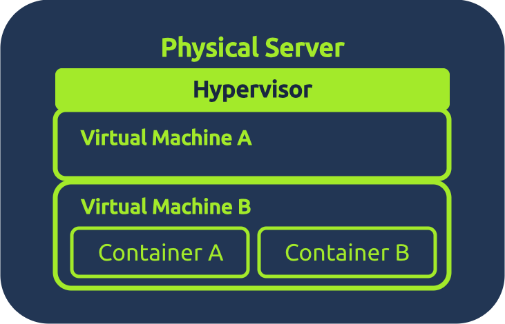

# Virtualization Overview

Before the concept of virtualization, the rule of thumb in IT was:  
**“One server = one application.”**

In the early days, digital services were run on physical machines, and each machine typically had a single, clear purpose, such as hosting a website or storing data. As businesses added more services, they naturally increased the number of physical servers, and the “one job per box” approach became the standard for building reliable systems.

This meant that if a company wanted to run a website, a database, an email service, and an internal app, they would need separate physical servers for each one.

Virtualization introduced a new idea:  
**“What if multiple applications could share the same physical server safely?”**

A virtualization layer, called a **hypervisor**, was introduced to act as a referee between virtual machines and allow each virtual computer to behave independently, like a physical computer.

Each virtual computer, known as a Virtual Machine (VM), **acts as an independent system** with its own operating system, apps, and settings, even though they all share the same physical hardware underneath.

# Virtualization Components

## Hypervisor

A **hypervisor** is the core technology behind virtualization. It's the software that creates and manages virtual machines.

It is a special piece of software that:
- Divides a physical computer into multiple virtual ones.
- Gives each virtual machine its own share of CPU, memory, and storage.
- Keeps everything isolated and safe.
- Manages the lifecycle of virtual machines (start, stop, pause, clone, delete).

Hypervisors have two main types of implementation, each of which is used for specific scenarios, from home labs to large data centers: - <b>Type 1</b> hypervisors run directly on the physical hardware, making them fast, efficient, and ideal for servers and professional environments. - <b>Type 2</b> hypervisors run within an existing operating system, making them easier to install and ideal for learning, testing, or small setups. 

|Use Case|Type 1 (Bare Metal)|Type 2 (Hosted)|
|---|---|---|
|Test Malicious Files|⚠️ Possible (lab)|✅ Best choice|
|Production Server|✅ Yes|❌ No|
|Database Server|✅ Yes|⚠️ Not ideal|
|Software Testing|⚠️ Possible|✅ Best choice|
|Kali Linux|⚠️ Possible|✅ Best choice|
|Data Center|✅ Yes|❌ No|
When using virtualization to test malicious files, care should be taken to ensure that the host machine does not become infected by the malware being tested in the guest machine. One approach is to use different operating systems for the guest and host machines, or to isolate the guest machine so that it does not communicate with the host.

## Virtual Machines

A **Virtual Machine (VM)** is a virtual computer created by the hypervisor.  
Even though it’s virtual, it behaves as a real machine:

- It has its own virtual CPU, RAM, storage, and network.
- It can run any operating system (Windows, Linux, etc.).
- It’s completely isolated from other VMs. This means that if one VM breaks, the others continue to work.

Oracle VirtualBox and VMware Workstation. This type of software acts as a type 2 hypervisor and lets you run multiple operating systems, such as Windows, Linux, and macOS.

- You need to work on a different OS like Kali Linux, but you can't buy another whole system, so you install a hypervisor and run a Kali Linux VM on it.
- You want to test whether a file is malicious, so you set up an isolated virtual machine to protect your main computer from being infected.

## Containers

A **container** is a lightweight, isolated environment that runs a single application and all the necessary components to support it. Instead of bringing a whole separate operating system, a container borrows the core of the existing system by running on the kernel, which is the part of an operating system that communicates with the hardware and manages resources such as memory and running programs.

Because containers share this kernel, they start quickly and use fewer resources than full virtual machines, but it also means they must match the host system’s type. For example, you can’t run a Windows container on a Linux machine.

Containers behave like small, self-contained spaces because:
- They package the application and its dependencies (libraries, tools, versions).
- They share the host’s operating system, so they start almost instantly.
- They remain isolated from each other, so a misbehaving container doesn’t affect the others.
- They can run consistently on any machine, making them perfect for development, testing, and scalable deployments.

The easiest way to deploy containers in a VM is using Docker.  
Docker is an open-source software platform that simplifies the process of building, deploying, and running applications using containerization.

