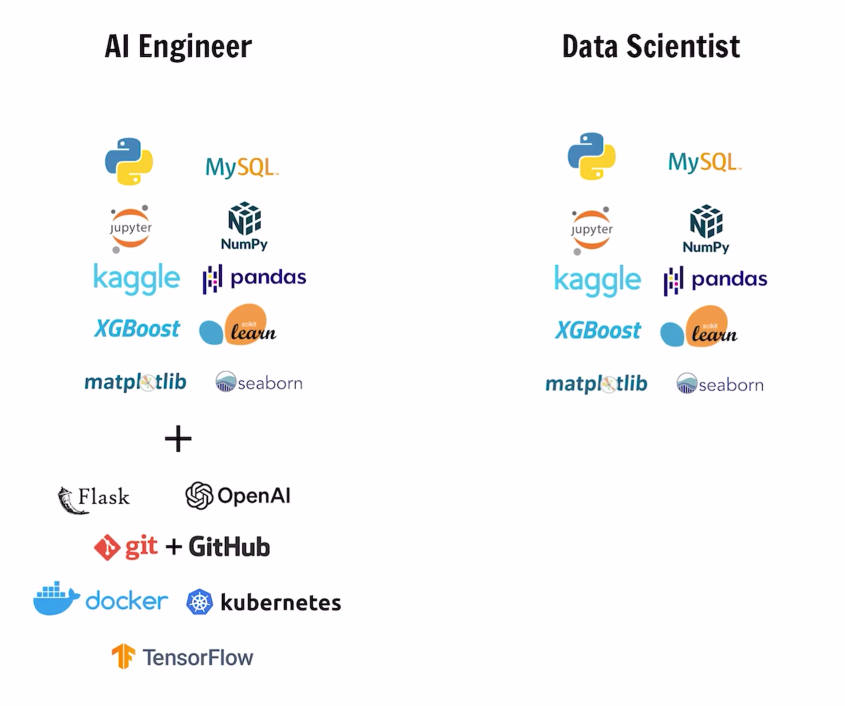

# Course Objective

> This course covers **AI/ML from a practical, job-ready perspective** over four-plus months, preparing learners for roles like **Data Scientist** and **AI Engineer**.

---
## What Is AI?

- **Artificial Intelligence (AI)** — the branch of computer science where we enable systems to perform tasks that typically require **human-level intelligence**.
- If you interact with technology today, you are already surrounded by AI-based systems.

### Everyday AI Examples

| Domain            | Example                                              |
| ----------------- | ---------------------------------------------------- |
| **Smartphones**   | Face ID for authentication                           |
| **Streaming**     | Movie recommendations on Netflix / Prime Video       |
| **Navigation**    | Travel time estimations in Uber / Google Maps        |
| **E-commerce**    | Product suggestions on Amazon / Myntra               |

### Technical AI Tasks

- **Speech translation** — speech → text, text → speech, language → language
- **Object recognition / detection** — e.g., traffic systems automatically detecting a vehicle's number plate from an image or video (a task a human could do, but a trained system performs automatically)

---
## What Is Machine Learning (ML)?

- **Machine Learning** is the most famous and widely used **subset of AI**.
- In ML, we **train systems to make decisions based on data** — specifically, **massive amounts of data**.
- The best ML algorithms and models are trained on large datasets sourced from big tech companies (Facebook, Instagram, Google, etc.).
- **Data is the fuel for Machine Learning** — the more data a model has, the better its potential to perform.

> [!IMPORTANT]
> **All Machine Learning is AI, but not all AI is Machine Learning.**
> The course will cover Artificial Intelligence, Machine Learning, Deep Learning, and Generative AI in detail.

---
## Why Learn AI/ML?

- According to the **UN**, the AI market is expected to hit **$4.8 trillion by 2030**.
- The market is expanding every year → more companies adopting AI → more lucrative roles and opportunities.
- Two of the most popular roles: **Data Scientist** and **AI Engineer**.

> [!TIP]
> **Focus on skills, not titles.** AI is an emerging field and companies are still figuring out role terminologies. The same engineer building ML models might be titled:
> - Data Scientist (Company A)
> - AI Engineer (Company B)
> - ML Engineer / Gen AI Engineer / AI-ML Engineer (other companies)
>
> The work is often identical — what matters is your **skill set**.

---
## Who Is This Course For?

### Case 1 — Freshers Targeting AI Roles

Preparing for **Data Scientist** and **AI Engineer** positions:

| Role               | Core Skills                                                                                      |
| ------------------ | ------------------------------------------------------------------------------------------------ |
| **Data Scientist** | Python, Databases, Data libraries (Pandas), Machine Learning libraries                           |
| **AI Engineer**    | Everything in Data Science **+** basic backend knowledge, working with Open APIs, DB management  |

> [!NOTE]
> AI Engineer = Software Engineer + Data Scientist. The additional backend/API skills may not be entry-level requirements at every company, but they are valuable to learn.

### Case 2 — Resume Enhancement & Upskilling

- **Students / freshers** applying for **software engineering roles** who want to stand out with AI/ML skills and projects on their resume.
- **Working professionals** (software engineers, developers) already in the industry who want to **upskill** with AI/ML.

### Case 3 — Curiosity-Driven Learners

- Anyone who wants to **learn and explore** AI/ML — no specific career goal required.

---

> Over the next four-plus months, we will **learn, implement, and practice** a wide range of AI/ML concepts and tools.