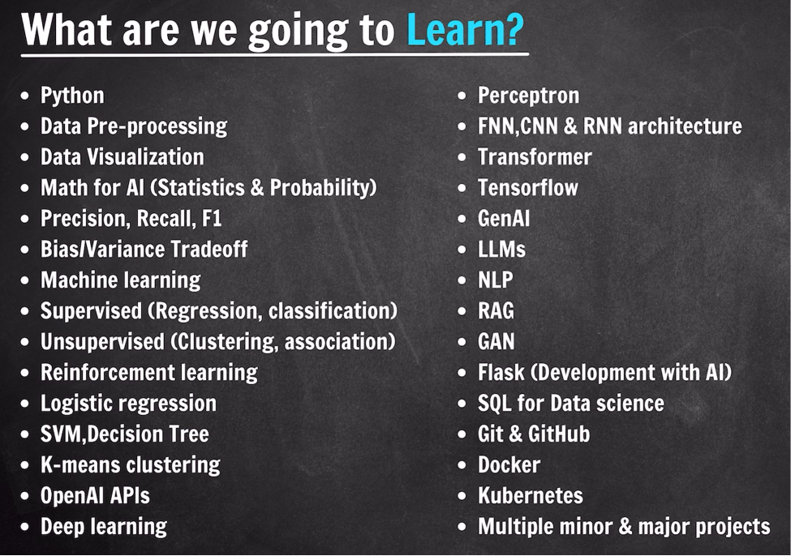

# What Will We Learn?

> A practical, **industry-focused curriculum** — every concept is taught from the perspective of implementing it on the job as a Data Scientist, not from a research angle.

---
## Curriculum Overview

### 1. Python Programming
- The core programming language used throughout the course.

### 2. Data & Preprocessing
- Understanding data, cleaning, and preparing it for ML pipelines.

### 3. Math for AI/ML
- **Statistics & Probability** (and other mathematical foundations beyond these two).

### 4. Machine Learning
All three types of learning are covered:

| Learning Type              | Topics / Algorithms                                      |
| -------------------------- | -------------------------------------------------------- |
| **Supervised Learning**    | Regression, Support Vector Machines, various tree models |
| **Unsupervised Learning**  | *(covered in detail during the course)*                  |
| **Reinforcement Learning** | *(covered in detail during the course)*                  |

### 5. Open APIs
- How to use and integrate Open APIs in AI workflows.

### 6. Deep Learning

| Concept                | Details                                                      |
| ---------------------- | ------------------------------------------------------------ |
| **CNNs & RNNs**       | Differences between architectures and where each is used     |
| **Transfer Learning**  | Leveraging pre-trained models for new tasks                  |

### 7. Generative AI & NLP

- **GenAI & LLMs** — how they are used in practice
- **NLP** — Natural Language Processing
- **RAGs** — Retrieval-Augmented Generation
- **GANs** — Generative Adversarial Networks

### 8. Engineering Stack

| Tool      | Purpose                                |
| --------- | -------------------------------------- |
| **Flask** | Python-based backend for AI apps       |
| **SQL**   | Database querying and management       |

---
## Projects — Minor & Major

| Project Type | Purpose                                                                 |
| ------------ | ----------------------------------------------------------------------- |
| **Minor**    | Built after each concept (e.g., after supervised learning) for practice |
| **Major**    | Resume-worthy projects showcasing real AI/ML skills                     |

> [!TIP]
> Learning is not just theoretical — every concept is followed by hands-on implementation through projects.

---
## Advice for Beginners

- All concepts are covered **from the fundamental level, step by step**.
- Feeling nervous when coding for the first time is **completely natural** — every programmer has felt this way at some point.
- Coding might not make much sense at first, but after **15–20 days** of practice, it starts clicking.

> [!IMPORTANT]
> **Don't give up.** If a difficult topic comes up, give it extra time. Put in **consistent, regular effort** and keep practicing — the long-term payoff is significant.