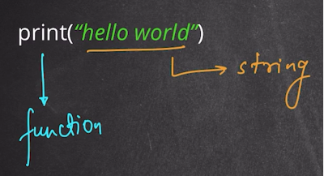
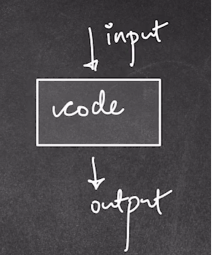
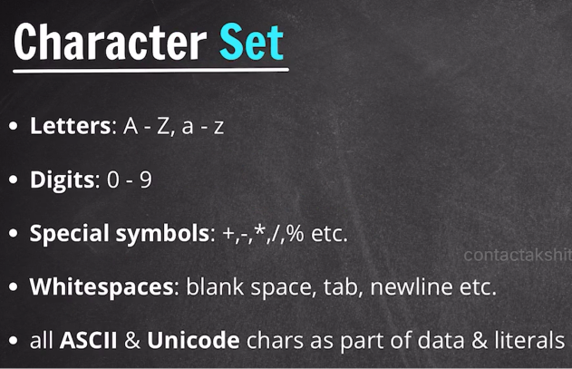

# Our First Program

> A **program** is a set of instructions we give to a computer to perform a task. Here we write, save, and run our very first Python program.

---
## Creating a Python File

1. Open your project folder in VS Code.
2. Click **New File** and name it `code.py`.
   - The name (`code`) can be anything you like.
   - The `.py` extension tells VS Code this is a **Python file**.

> [!NOTE]
> Every language has its own extension:
>
> | Language   | Extension |
> | ---------- | --------- |
> | Python     | `.py`     |
> | Java       | `.java`   |
> | C++        | `.cpp`    |
> | Text file  | `.txt`    |

---
## Hello World

Write the following in `code.py`, save with `Ctrl + S`, then run in the terminal:

```
python3 code.py
```

```python
print("hello world")
```

```
hello world
```



### Anatomy of the Statement

| Part              | What It Is                                                                                       |
| ----------------- | ------------------------------------------------------------------------------------------------ |
| `print()`         | A **function** — a reusable block that performs a task (here: display output on the terminal).    |
| `"hello world"`   | A **string** — any word, sentence, or paragraph enclosed in quotes.                              |

- Strings can be written with **double quotes** `" "`, **single quotes** `' '`, or **triple quotes** `""" """`.
- Double quotes are the most common convention.

---
## How Code Works (General Model)



> Code takes some **input**, performs **computations**, and produces **output** on the terminal. For now we are only producing output with `print`; taking input will be covered later.

---
## Multiple `print` Statements

Each `print()` outputs on its **own line**:

```python
print("hello world")
print("with python")
```

```
hello world
with python
```

---
## Printing Multiple Values on One Line

Separate values with a **comma** inside a single `print()` — Python adds a space between them automatically:

```python
print("hello world" ,"with python")
```

```
hello world with python
```

---
## Inserting a New Line with `\n`

Use the escape character `\n` to force a line break **within** a string:

```python
print("hello \nworld" ,"with python")
```

```
hello 
world with python
```

> [!TIP]
> The space before `world` in the output comes from the space after `\n` in the string. Remove it if you don't want the extra space.

---
## Python Character Set



Python allows the following characters in code and data:

| Category            | Examples                          |
| ------------------- | --------------------------------- |
| **Letters**         | `A–Z`, `a–z`                     |
| **Digits**          | `0–9`                            |
| **Special symbols** | `+  -  *  /  %` etc. (operators) |
| **Whitespaces**     | blank space, `\n` (newline), `\t` (tab) |
| **ASCII & Unicode** | All characters in the ASCII / Unicode standard can be used in data and literals |

> [!NOTE]
> **ASCII** = American Standard Code for Information Interchange. You don't need to memorize the full character set — just have a general awareness of what's allowed.