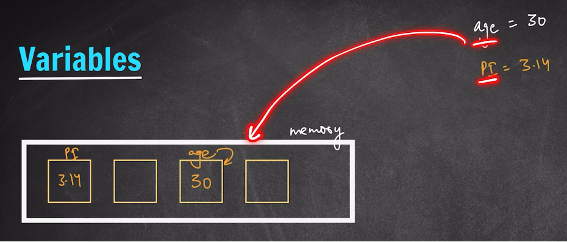

# Variables in Python

> A **variable** is a named container in the computer's memory that stores a value. You assign a value with `=` and refer to it later by name.

---
## How Variables Work in Memory



- When you write `age = 30`, the value `30` is stored in memory and that location is labelled `age`.
- Similarly `pi = 3.14` creates another labelled compartment holding `3.14`.
- Every variable occupies space in memory where its data lives.

---
## Creating & Printing Variables

```python
name = "akshit"
age = 35
PI = 3.14

print(name, age, PI)
```

```
akshit 35 3.14
```

- **Strings** (text) go inside quotes: `"akshit"`
- **Numbers** (int, float) are written directly: `35`, `3.14`

---
## Combining Strings and Variables in `print()`

```python
print("my name is: ", name)
```

```
my name is:  akshit
```

---
## Performing Operations Inside `print()`

You can do arithmetic on variables directly within the print call:

```python
print("my age is" , age-5)
```

```
my age is 30
```

---
## Identifiers

The **name** you give to a variable (or function, class, etc.) is called an **identifier**.
In the examples above, `name`, `age`, and `PI` are all identifiers.

### Identifier Rules

| Rule | Detail | Example |
| ---- | ------ | ------- |
| **Allowed first character** | Letter (`a–z`, `A–Z`) or underscore `_` | `_name` ✅, `age` ✅ |
| **Cannot start with a digit** | A digit as the first character causes a `SyntaxError` | `5age` ❌ |
| **Allowed subsequent chars** | Letters, digits, underscores | `age_1` ✅ |
| **Case sensitive** | `age`, `Age`, and `AGE` are **three different** identifiers | — |

- Can contain letters, numbers, or underscores after the first character
- Cannot use Python keywords (like `if` , `for` , `class` , `while`, `else`, `in`, `def` ) as variable names

### Valid — starts with underscore

```python
_name = "akshit"
_age = 35
_PI = 3.14

print(_name, _age, _PI)
```

```
akshit 35 3.14
```

### Invalid — starts with a digit

```python
_name = "akshit"
5age = 35
_PI = 3.14

print(_name, _age, _PI)
```

```
    5age = 35
    ^
SyntaxError: invalid decimal literal
```

---
## Indentation & One-Instruction-Per-Line

- **Indentation** (proper structuring of lines) is critical in Python — incorrect indentation causes errors &  the  general  standard  is  4 spaces per indentation level.
- Write **one instruction per line**; cramming multiple statements into a single line will produce errors.

> [!IMPORTANT]
> Python is **case sensitive** — `age` and `Age` are different variables.
> This is unlike SQL or HTML, where casing doesn't matter.
