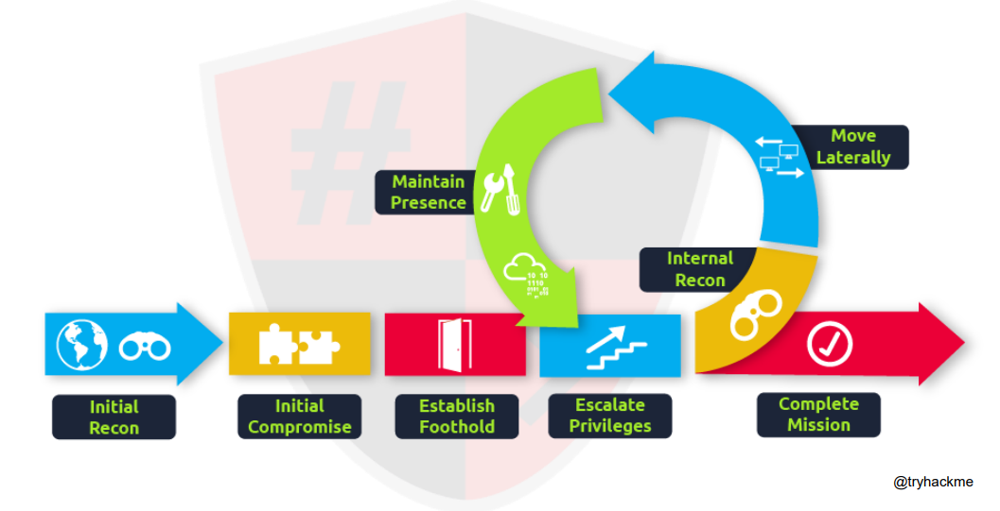

# Introduction to Cyber Security

---

## What is Information Security?

- **Data** has no context; **information** is data with meaning
  - "Computer" = data → "This is my computer" = information
- **Information Security** = protecting information from unauthorized access
- Sensitive info includes: phone numbers, birthdays, credentials, personal data
- It is a **basic need for everyone**, not just organizations

> Security is a quality of information. Security is freedom. Security is an asset.

### Information Security vs Cyber Security

| Term                     | Scope                                                              |
| ------------------------ | ------------------------------------------------------------------ |
| **Information Security** | Protecting **all** information (digital + physical)                |
| **Cyber Security**       | Protecting information specifically in **cyberspace** (digital systems, networks) |

- We live in the **information age** — information is everywhere
- When information exists in **digital systems** → its protection becomes **cyber security**
- Cyber security is a **subset** of information security

---

## Information Security Threats

A **threat** is any constant danger to an asset — it can be a person, object, or event.

| Threat Category               | Description                                        | Examples                                              |
| ----------------------------- | -------------------------------------------------- | ----------------------------------------------------- |
| **Inadvertent (human error)** | Accidental mistakes, no malicious intent            | Sending email to wrong person, clicking phishing link, weak passwords, misconfiguring a firewall |
| **Physical disasters**        | Natural or environmental events                     | Floods, fires, earthquakes                            |
| **Technical failures**        | Hardware or software malfunctions                   | Disk crash, firmware bugs                             |
| **Deliberate acts**           | Intentional attacks by adversaries                  | Hacking, espionage, sabotage                          |

> **Inadvertent = accidental threat caused by human error.** Many real security incidents happen because of ordinary human mistakes, not hackers.

### Mitigating Human Error

- Training and security awareness
- Strong policies and access controls
- Automation and backups
- Multi-factor authentication
- Principle of least privilege

### What Information Security Does **Not** Cover

InfoSec does not deal with **cyber warfare**, **information warfare**, **negative societal impacts** (cyber stalking, sexual abuse), or **IoT security** — these fall under the broader domain of **Cyber Security**.

---

## The CIA Triad

The foundational model for information security policy.

| Pillar              | Principle                                           | Key Measures                                    |
| ------------------- | --------------------------------------------------- | ----------------------------------------------- |
| **Confidentiality** | Sensitive data reaches only authorized parties       | Encryption, MFA, physical controls              |
| **Integrity**       | Data remains consistent, trustworthy, and accurate   | Backups, checksums, access control              |
| **Availability**    | Data is accessible whenever needed                   | Firewalls, patch management, disaster recovery, load balancers |

### Additional Security Objectives

| Objective            | Meaning                                                        |
| -------------------- | -------------------------------------------------------------- |
| **Non-repudiation**  | Sender cannot deny sending; receiver cannot deny receiving      |
| **Authenticity**     | Entities are verified to be who they claim to be                |

---

## Common Attack Avenues

- **Social Engineering** — manipulating people into giving up information (e.g., phishing emails)
- **Public Software Exploits** — using known vulnerabilities in unpatched software
- **Password Cracking** — breaking password hashes (especially weak algorithms like MD5)
- **Credential Stuffing** — testing a stolen password across all other services (exploits password reuse)
- **Service Misconfigurations** — exploiting improperly configured services (open ports, default credentials)
- **Web Application Attacks** — targeting vulnerabilities in web apps (SQL injection, XSS, etc.)

> **Enumeration is more important than exploitation.** — Thoroughly mapping and understanding a target before attempting to exploit it leads to better results and fewer missed opportunities.

---

## Hacking

### Origins

- Term introduced in the **1960s at MIT** for hardcore, creative programming
- Early hackers were the most intelligent and advanced programmers of their era
- Modern hacking began with the founding of **ARPANET** by the US military (late 1960s)
- There is no single standard definition — media continues to add misconceptions

### Who Is a Hacker?

A person who uses skills and knowledge to gain **unauthorized access** to software, computers, or networks. Uses custom tools and techniques. **Not always malicious** — can lead to prison or millions in earnings.

> "The quieter you become, the more you are able to hear."

### Types of Hackers

| Type          | Intent                          | Description                                                                 |
| ------------- | ------------------------------- | --------------------------------------------------------------------------- |
| **White Hat** | Ethical, authorized             | Security professionals who hack with permission to find and fix vulnerabilities. Work with governments and cyber cells. |
| **Black Hat** | Malicious, unauthorized         | Exploit undisclosed vulnerabilities for financial gain, espionage, or revenge. |
| **Grey Hat**  | No permission, no malicious intent | Hack without authorization, sometimes report findings. May demand compensation. Legality depends on the victim's response. |

---

## Ethical Hacking

Performed by a company or individual to **identify potential threats** on a computer or network, find exploitable weaknesses, and help the organization **improve system security**.

### Who Is an Ethical Hacker?

- Security professional who tests security and identifies loopholes
- Creates reports and analysis
- Authorized with proper permissions
- Earns money and respect

### Why Ethical Hackers Are Needed

- A hack attack occurs **every 39 seconds**
- Average cost of a data breach exceeds **$150 million** (2020)
- **$6 trillion** expected global cybersecurity spending (2021)
- **3.5 million** unfilled cybersecurity jobs worldwide (2021)

> Ethical hackers prevent financial waste, fix production bugs, stop black-hat activities, and ensure national and organizational security.

---

## Information Warfare

### Historical Context

- Tactical and strategic use of information to gain advantage
- Governments spent millions on secret intelligence and espionage
- Military used physical force for policy implementations

### Modern Cyber Warfare

- Information warfare has evolved into **cyber warfare** — mostly digital
- Government spends millions on IT infrastructure for offense and defense
- Revolves heavily around **terrorism**
- Common practices: viruses/malware, exploiting communication systems, unauthorized data access

---

## Key Terminologies

| Term                        | Definition                                                                    |
| --------------------------- | ----------------------------------------------------------------------------- |
| **Vulnerability**           | A weakness that can be exploited                                              |
| **Threat**                  | An entity that exploits a vulnerability                                       |
| **Risk**                    | Damage caused by exploiting a vulnerability                                   |
| **Asset**                   | A resource that needs to be protected                                         |
| **Bug**                     | Error, fault, or flaw in a program causing unexpected behavior                |
| **Hacker**                  | Gains access with or without malicious intent                                 |
| **Cracker**                 | Gains access to damage assets — always malicious                              |
| **Penetration Testing**     | Testing and reporting security loopholes                                      |
| **Vulnerability Assessment**| Testing, reporting loopholes, **and** recommending fixes                      |
| **Cyber Espionage**         | Spying to gain illicit access to confidential information (large institutions)|
| **Exploit**                 | Code designed to trigger unexpected behavior an attacker can leverage          |
| **Script Kiddie**           | Unskilled person who uses existing tools without understanding them           |
| **Zero-day**                | Vulnerability unknown to security professionals, known only to attackers      |

---

## Career Roadmap

### Foundational Knowledge

| Area               | Topics                                                          |
| ------------------ | --------------------------------------------------------------- |
| **Computer Basics** | Hardware, software, processing methodology                     |
| **Web & Internet** | HTTP, DNS, web servers, FTP, SMTP                               |
| **Networking**     | TCP/IP, ARP, devices, types, routing & switching                |
| **Operating Systems** | Linux (Kali, Parrot, Red Hat), Windows, Android, iOS, macOS  |

### Programming Skills

| Purpose               | Languages                          |
| --------------------- | ---------------------------------- |
| Reverse Engineering   | Assembly, C, C++                   |
| Script Writing        | Python, Ruby, Perl                 |
| Web App Testing       | JavaScript, PHP, SQL, JSP, Python  |
| Shell Scripting       | Bash                               |
