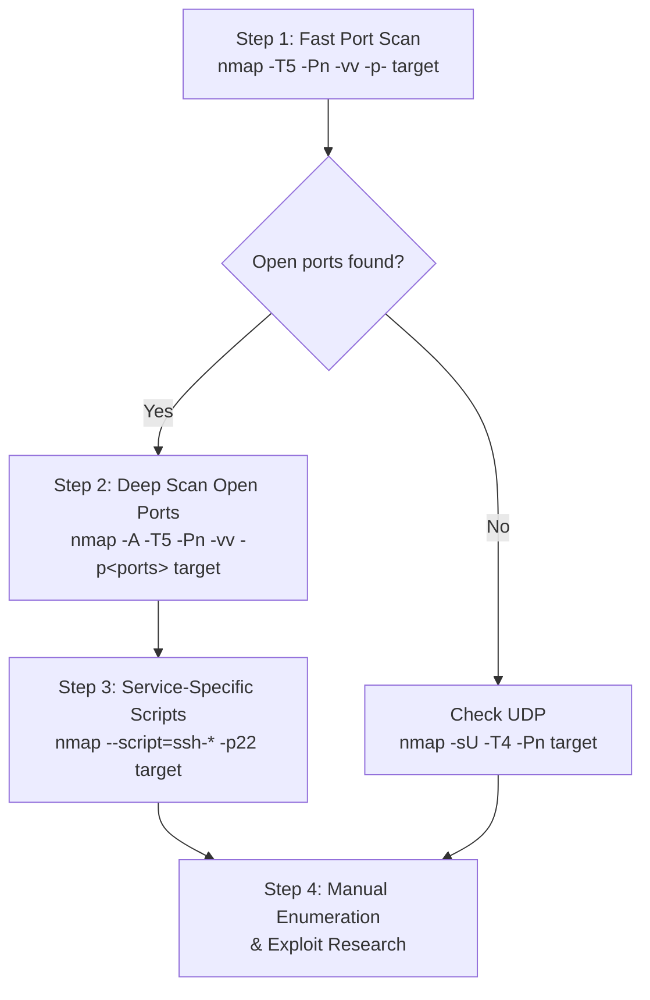

# Scanning Methodology

A practical Nmap scanning methodology for CTFs, OSCP, and real-world pentesting. This covers the efficient 2-step approach, key options, and workflow tips.

---

## TCP vs UDP — Quick Refresher

### TCP (Connection-Oriented)

Uses the **3-way handshake**: SYN → SYN/ACK → ACK

```
Client                    Server
  | ---- SYN ------------> |
  | <--- SYN + ACK -------- |
  | ---- ACK ------------> |
  |                         |
       Connection established
```

TCP has **flags**: `SYN`, `ACK`, `FIN`, `RST`, `PSH`, `URG`.

### UDP (Connectionless)

No handshake. Just sends the packet.

```
Client                    Server
  | ---- UDP packet ------> |
  |                         |
  | <---- UDP response ---- |
```

UDP has **no flags** and **no handshake**. A UDP datagram is simply:

`Source Port | Destination Port | Length | Checksum | Data`

### Comparison Table

| | TCP | UDP |
|---|---|---|
| Connection | Connection-oriented | Connectionless |
| Handshake | SYN / SYN-ACK / ACK | ❌ None |
| Reliability | Built-in | ❌ None |
| Nmap scan | `-sT` / `-sS` | `-sU` |
| Port enumeration | Faster, easier | Slower, harder |

> **Mental model:**
> - **TCP:** "Can we talk?" → SYN → SYN/ACK → ACK
> - **UDP:** "Here's my message." → sends without establishing connection

---

## The 2-Step Scanning Methodology

> [!IMPORTANT]
> **Do NOT run an aggressive scan on all 65,535 ports from the start.** It takes far too long. Use this efficient 2-step approach instead.

### Step 1: Fast Full Port Discovery

Find **which ports are open** across the entire port range — nothing more.

```bash
nmap -T5 -Pn -vv -p- <target>
```

| Flag | Purpose |
|---|---|
| `-T5` | Maximum speed timing |
| `-Pn` | Skip ping — assume host is up |
| `-vv` | Double verbose — show ports in **real-time** as discovered |
| `-p-` | Scan **all 65,535** ports |

**Why `-vv` is critical:** Without it, you wait for the entire scan to finish before seeing anything. With verbose, you see `Discovered open port 80/tcp` immediately and can start working.

### Step 2: Targeted Aggressive Scan

Run deep scans **only on the ports you found open**:

```bash
nmap -A -T5 -Pn -vv -p80,22 <target>
```

| Flag | Purpose |
|---|---|
| `-A` | Aggressive scan: OS detection + version detection + script scanning + traceroute |
| `-p80,22` | Only the open ports from Step 1 |

This completes **extremely fast** because Nmap only has 2 ports to analyze deeply.

---

## Key Nmap Options Reference

| Flag | What It Does |
|---|---|
| `-A` | Aggressive scan (OS + versions + scripts + traceroute) |
| `-sV` | Service version detection |
| `-sC` | Default script scanning |
| `-v` / `-vv` | Verbose / extra verbose output |
| `-p <ports>` | Specify ports (e.g., `-p22,80` or `-p-` for all) |
| `-T5` / `-T4` | Timing template (5 = fastest, 0 = slowest) |
| `-Pn` | Disable ping, assume host is up |
| `-sU` | UDP scanning |
| `-O` | OS fingerprinting (standalone, included in `-A`) |
| `-F` | Fast mode (scan fewer ports) |

> [!WARNING]
> **Never forget UDP scanning.** Services like DNS (53), SNMP (161), and TFTP (69) run on UDP. Many exam candidates fail because they skip UDP scans.

---

## Vulnerability Scanning with NSE

### Using the `vuln` Script Category

```bash
nmap -A -vv --script=vuln -p80 -T5 <target>
```

```
└─# nmap -A --script=vuln -p80 -T5 10.49.180.82 
Starting Nmap 7.99 ( https://nmap.org ) at 2026-09-05 07:47 -0400
Nmap scan report for 10.49.180.82
Host is up (0.034s latency).

PORT   STATE    SERVICE VERSION
80/tcp filtered http
Too many fingerprints match this host to give specific OS details
Network Distance: 3 hops

TRACEROUTE (using proto 1/icmp)
HOP RTT      ADDRESS
1   31.84 ms 192.168.128.1
2   ...
3   33.30 ms 10.49.180.82

Nmap done: 1 IP address (1 host up) scanned in 16.84 seconds
```

- `--script=vuln` is a **category**, not a single script — it loads **~150 vulnerability scripts**.
- Checks for various CVEs using the **Vulners** database.
- Only run this against **confirmed open ports** (from Step 1).

> [!CAUTION]
> **NSE vulnerability scripts are NOT 100% accurate** and often produce false positives. Nmap simply dumps a list of exploits matching the detected version — it does NOT verify if they actually work (unlike Metasploit, which performs active signature-based verification). Use NSE for hints, then **verify manually**.

### Using Service-Specific Wildcards

Instead of the broad `vuln` category, target scripts for a **specific service**:

```bash
# SSH-specific scripts
nmap <target> --script=ssh-* -p22

# SMB-specific scripts
nmap <target> --script=smb-* -p445

# FTP-specific scripts
nmap <target> --script=ftp-* -p21
```

- Much faster and yields **higher-quality results** than the `vuln` category.
- Loads fewer, more relevant scripts (e.g., ~53 for SSH vs ~150 for vuln).

---

## Complete Workflow Summary



1. **Fast scan all ports** → find what's open
2. **Aggressive scan open ports** → get versions, OS, scripts
3. **Targeted NSE scripts** → service-specific vulnerability checks
4. **Manual enumeration** → verify findings, search exploits, test

---

## Efficiency Tips

### Use Kali Workspaces

Kali Linux has **5 default workspaces**. When scanning multiple machines:
- Dedicate **one workspace per target machine**
- Run scans in separate terminals across workspaces
- Keep work **isolated and organized**

### Timing Template Selection

| Template | Speed | Accuracy | Use When |
|---|---|---|---|
| `-T5` | Fastest | Good (rarely inaccurate) | Default choice for CTFs/exams |
| `-T4` | Fast | Very good | If T5 misses ports on comparison |
| `-T3` | Moderate | Excellent | Stealth-sensitive environments |

### Nmap vs Dedicated Tools

| Task | Nmap | Better Alternative |
|---|---|---|
| Port discovery | ✅ Standard tool | **Masscan** (faster, but no version detection) |
| Brute-forcing | ⚠️ Very slow | **Hydra** (much faster) |
| Vulnerability scanning | ⚠️ High false positives | **Nessus** / **Metasploit** |
| Initial recon | ✅ Industry standard | **AutoRecon** (runs Nmap under the hood) |

---

## Core Options to Memorize

> These are the options you'll use **daily** for CTFs and exams:

| Option | Purpose |
|---|---|
| **`-A`** | Aggressive scan |
| **`-sV`** | Service version detection |
| **`-sC`** | Default script scanning |
| **`-v`** | Verbose output |
| **`-p`** | Port specification |
| **`-T5` / `-T4`** | Timing templates |
| **`-Pn`** | Disable ping |
| **`-sU`** | UDP scanning |