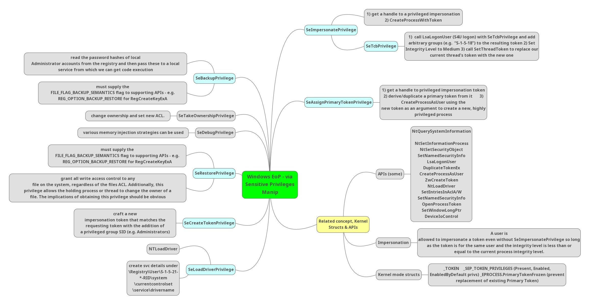

# Introduction to Windows Privileges



## Access Tokens

Every logged-in user receives an **Access Token** for that session. Every process or thread spawned by the user inherits this token.

An Access Token contains:
- **User SID** (Security Identifier)
- **User groups**
- **User privileges**

### Enumerating Tokens

```cmd
whoami /all
whoami /priv
```

### Standard User vs Administrator Tokens

| Account Type | Tokens Issued | Default Integrity Level |
| --- | --- | --- |
| Standard User | **1** — single non-privileged token | Medium |
| Administrator | **2** — normal token + elevated token | Medium (default) / High (elevated) |

- Standard users operate under a single **Medium Integrity** token with limited access.
- Administrators get **two** tokens at logon:
  1. A normal token (Medium Integrity — used by default).
  2. An elevated token (High Integrity — invoked via **UAC** / "Run as Administrator").


---

## Windows Security Privileges (`Se` Privileges)

Privileges are prefixed with **`Se`** (Security). They define what administrative actions a token can perform beyond standard user capabilities.

### Common Exploitable Privileges

| Privilege | Description |
| --- | --- |
| `SeImpersonatePrivilege` | Impersonate a client after authentication |
| `SeBackupPrivilege` | Back up files/directories — bypasses ACLs |
| `SeTakeOwnershipPrivilege` | Take ownership of any securable object |
| `SeRestorePrivilege` | Restore files/directories — write to restricted locations |
| `SeAssignPrimaryTokenPrivilege` | Replace a process-level token |
| `SeCreateTokenPrivilege` | Create an access token |

> **Privilege hierarchy:** Standard users → minimal privileges · Administrators → significantly more · `SYSTEM` → maximum privileges.

---

## Service Accounts & `SeImpersonatePrivilege`

In real-world environments, service accounts often need elevated capabilities for background tasks (analogous to `sudo` in Linux).

**Example:** An SQL Server running as `LOCAL SERVICE` may need to access network file shares or perform privileged system actions. Because it doesn't run as `LOCAL SYSTEM`, specific `Se` privileges are explicitly granted — most commonly **`SeImpersonatePrivilege`**.

### Why This Matters for Pentesting

If you obtain initial access through a **service account** (web app, SQL, IIS), it will very frequently have `SeImpersonatePrivilege` enabled.

- **Rare** on standard user accounts
- **Common** on service accounts (`LOCAL SERVICE`, `NETWORK SERVICE`, IIS AppPool accounts)

> [!IMPORTANT]
> Holding `SeImpersonatePrivilege` on a compromised service account provides a direct vector to execute **Potato family exploits** and escalate to **`NT AUTHORITY\SYSTEM`**.
