# Kali Linux Installation, Lab Setup & VM Networking

> Covers Kali installation (VMware & WSL), VMware network modes, snapshots, hostname resolution, Apache basics, VMware Tools, and critical system files.

---

## 1. Disable Sleep, Screen Lock & Display Power Off

Prevents Kali from sleeping and re-requiring a password to log in.


### 1.1 Disable Screen Lock (GUI ⭐ Recommended)

Go to:

```
Applications → Settings → Screensaver
```

Turn off:

- ✅ **Enable Screensaver** → OFF
- ✅ **Lock Screen after screensaver is active** → OFF
- ✅ **Lock Screen on Suspend** → OFF (if present)

### 1.2 Disable Display Power Management


Go to:

```
Applications → Settings → Power Manager
```

Under **System**:

```
When inactive for:
On AC → Never
On Battery → Never (optional)
```

Under **Display**:

```
Blank after → Never
Put to sleep → Never
Switch off → Never
```

### 1.3 Host Sleep Affects the VM

If you **put your Windows 11 host to sleep**, then **the VMware virtual machine also stops running**, regardless of the Kali settings.

```
Windows 11 (Host)
        │
        ▼
VMware Workstation
        │
        ▼
Kali VM
```

If the **host sleeps**, everything underneath it pauses.

| Action                     | Does Kali keep running? |
| -------------------------- | ----------------------- |
| Lock Windows (`Win + L`)   | ✅ Yes                   |
| Minimize VMware            | ✅ Yes                   |
| Run VMware in background   | ✅ Yes                   |
| Turn off Kali screen saver | ✅ Yes                   |
| Put **Windows** to sleep   | ❌ No                    |
| Hibernate Windows          | ❌ No                    |
| Shut down Windows          | ❌ No                    |

If you:

- Lock Windows → ✅ Scan continues.
- Put Windows to sleep → ❌ Scan pauses immediately.
- Wake Windows 30 minutes later → ✅ Scan resumes from where it paused (it doesn't keep progressing while the machine was asleep).

### 1.4 Recommended OSCP Setup

**Windows 11 (Host)**

Go to:

```
Settings → System → Power & battery → Screen and sleep
```

Set:

```
When plugged in:
Turn off display: 10 minutes (or your preference)
Put device to sleep: Never
```

**Kali VM**

- Auto-login ✅
- No screen lock ✅
- No display sleep ✅
- No suspend ✅

> This lets you leave long-running scans or exploits running overnight without interruption, as long as the **Windows host itself does not go to sleep**.

---

## 2. GRUB Boot Menu – Skip on Startup


This is the **GRUB boot menu**. By default, Kali waits a few seconds before booting the first entry. You can configure it to **boot immediately** without showing this menu.

Edit the GRUB configuration:

```bash
sudo nano /etc/default/grub
```

Find these lines:

```
GRUB_TIMEOUT=5
GRUB_TIMEOUT_STYLE=menu
```

Change them to:

```
GRUB_TIMEOUT=0
GRUB_TIMEOUT_STYLE=hidden
```

If `GRUB_TIMEOUT_STYLE` isn't present, add it.

Save the file (**Ctrl+O**, Enter, **Ctrl+X**), then update GRUB and reboot:

```bash
sudo update-grub
sudo reboot
```

Now Kali should boot directly without showing the menu.

---

## 3. Auto-Login (LightDM)


You can configure Kali to **automatically log in** to your account. Useful for a **dedicated OSCP lab VM**.

Edit the LightDM configuration:

```bash
sudo nano /etc/lightdm/lightdm.conf
```

If the file is mostly empty, add these lines:

```
[Seat:*]
autologin-user=kali
autologin-user-timeout=0
```

Replace `kali` with your username if it's different.

Save and exit, then restart LightDM or reboot:

```bash
sudo systemctl restart lightdm
# or
sudo reboot
```

---

## 4. Passwordless Sudo

Since this is **your own Kali VM** used for OSCP labs, you can configure **passwordless sudo**.

Run:

```bash
sudo visudo
```

At the end of the file, add:

```
kali ALL=(ALL:ALL) NOPASSWD: ALL
```

Replace `kali` with your username if different (`whoami` will tell you).

Save and exit, then test:

```bash
sudo whoami
```

Output:

```
root
```

No password prompt.

---

### Resulting Boot Flow

After all three changes above, your OSCP VM startup becomes:

```
Power On
      │
      ▼
GRUB skipped
      │
      ▼
Auto-login
      │
      ▼
Desktop
      │
      ▼
sudo commands
      │
      ▼
No password prompts
```

> [!CAUTION]
> Only do this on a **trusted personal VM**. Don't enable passwordless sudo on systems that are shared, exposed to other users, or used for general-purpose computing — it removes an important layer of protection against accidental or unauthorized privilege escalation.

---

## 5. MTU Issue – Website and Tools Load Forever Over VPN

### Symptoms

While connected to the OffSec VPN:

- VPN (`tun0`) connected successfully.
- Target responded to `ping`.
- `nmap` showed ports 22 and 80 open.
- `curl -I http://<target>` returned `HTTP/1.1 200 OK`.
- **Firefox, `curl`, and `wget` hung indefinitely when requesting the webpage.**

### Root Cause

The problem was an **MTU (Maximum Transmission Unit) / Path MTU Discovery (PMTUD)** issue.

The VPN tunnel (`tun0`) was using an MTU of **1500 bytes**. Although the TCP connection was established successfully, the network path could not reliably carry packets that large after VPN encapsulation.

Small packets (ICMP, TCP handshake, HTTP headers) reached the target successfully, but larger packets containing the webpage body were dropped.

Normally, Path MTU Discovery (PMTUD) automatically detects the correct packet size by using ICMP "Fragmentation Needed" messages. If these ICMP messages are blocked or lost, the OS continues sending oversized packets, causing connections to stall.

### Solution

Check the current MTU:

```bash
ip link show tun0
```

Reduce the MTU:

```bash
sudo ip link set dev tun0 mtu 1400
```

Retry:

```bash
curl http://<target-ip>
```

The webpage loaded immediately, confirming that the issue was caused by an MTU mismatch.

### Optional Permanent Fix

If the problem occurs every time the VPN connects, add the following to the OpenVPN configuration:

```text
tun-mtu 1400
mssfix 1360
```

or manually run after connecting:

```bash
sudo ip link set dev tun0 mtu 1400
```

### Why MTU Matters with VPNs

Think of the MTU as the **maximum packet size** your VPN interface will send.

```
Application (Gobuster)
        │
        ▼
TCP
        │
        ▼
IP
        │
        ▼
VPN (OpenVPN)
        │
        ▼
Internet
```

When using a VPN, extra headers are added to every packet:

```
Without VPN

1500-byte Ethernet frame
┌───────────────────────────────┐
│ IP + TCP + HTTP Data          │
└───────────────────────────────┘
```

```
With VPN

1500-byte Ethernet frame
┌───────────────────────────────┐
│ VPN Header                    │
│ IP + TCP + HTTP Data          │
└───────────────────────────────┘
```

Now the packet may become **larger than the network allows**.

### How PMTUD Works (and Breaks)

**Normal behavior:** Routers say _"That packet is too big. Please send smaller ones."_ This is **Path MTU Discovery (PMTUD).** Your computer learns the maximum safe packet size and everything works.

```
Maximum safe packet size = 1400
```

**When it breaks:** Some firewalls and VPNs **block those ICMP messages**. Your computer keeps sending packets that are too large. The router silently drops them.

This creates symptoms like:

- ✅ Ping works (small packets)
- ✅ HTTP headers work (small)
- ❌ Large HTTP responses hang
- ❌ Downloads stall
- ❌ Gobuster times out

### Why Lowering MTU Fixes It

Setting `mtu 1000` forces much smaller packets — no fragmentation needed, everything passes through.

```bash
sudo ip link set dev tun0 mtu 1000
```

Setting `mtu 1400` also works because it leaves room for VPN overhead. 1500 originally failed because, after VPN encapsulation, packets were too large for some part of the path.

> Many VPN providers recommend MTUs around **1400–1450** instead of 1500.

#### Why 1400 Works After Resetting from 1000

Two likely explanations:

1. **Kernel state reset (most likely):** Changing the MTU caused the kernel to **flush and rebuild** TCP connections and routing state. New TCP sessions worked correctly at 1400.
2. **Temporary network issue:** The VPN or network path had a transient problem that resolved by the time you switched back. Lab VPNs can occasionally behave this way.

---

## 6. Troubleshooting: No Mouse Inside VM

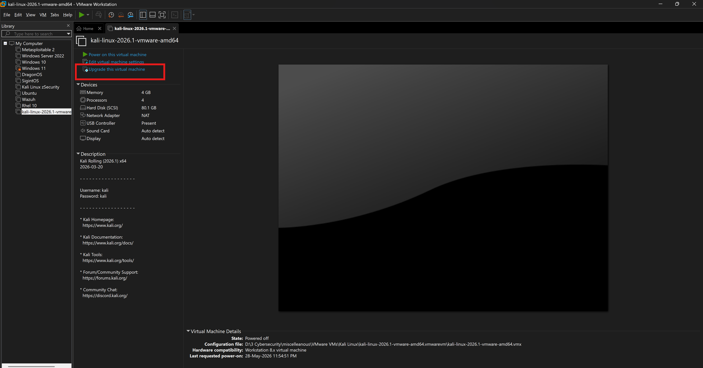

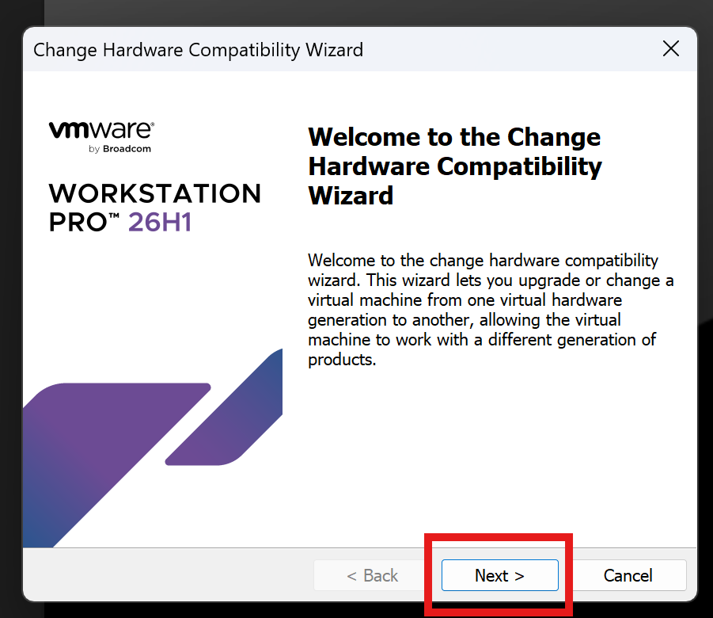

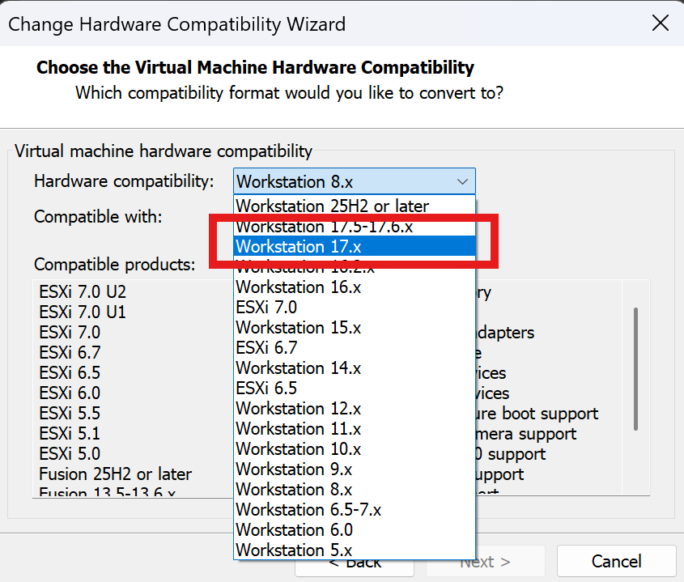

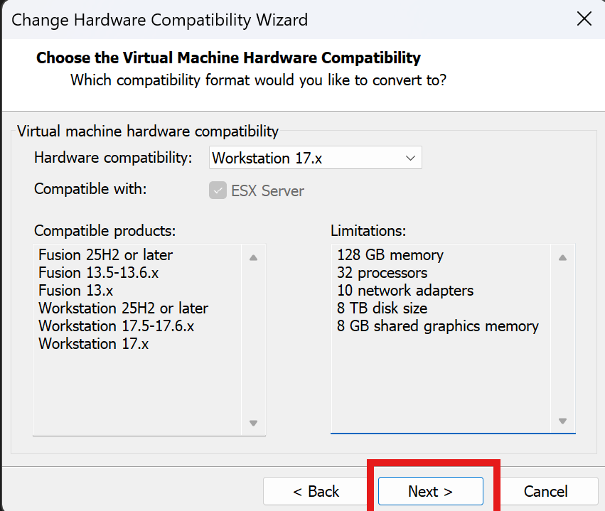

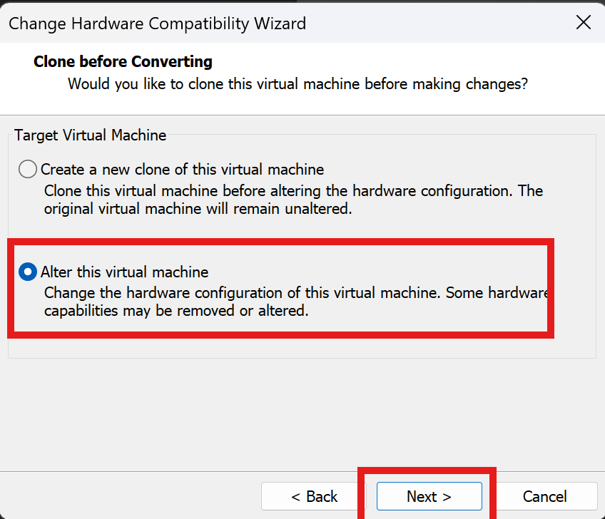

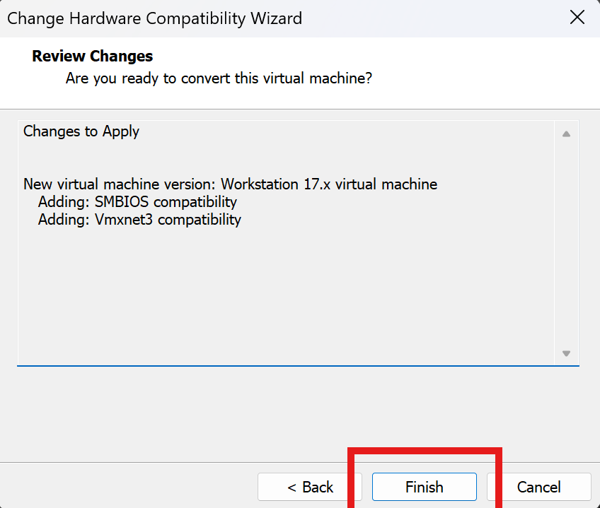

---

## 7. VMware Network Modes


### 7.1 NAT (Network Address Translation)

**VM shares the host's internet connection.** The VM gets a private IP from VMware (e.g. `192.168.174.x`) and VMware translates traffic through the host.

```
VM → VMware NAT → Your PC → Internet
```

| ✅ Works                                        | ❌ Doesn't Work                                         |
| ----------------------------------------------- | ------------------------------------------------------- |
| VM can access internet                          | Other devices on your home LAN usually can't see the VM |
| Download Windows updates / tools                |                                                         |
| Host can usually reach VM                       |                                                         |
| Multiple VMs on same NAT can talk to each other |                                                         |

> **Best for:** Learning labs with internet access, safe isolated environments, downloading tools.

### 7.2 Bridged

**VM becomes another real machine on your physical network.** It connects directly to your Wi-Fi/Ethernet. The router sees both host and VM separately.

```
VM   → Router/Switch
Host → Router/Switch
Phone → Router/Switch
```

**Example:**
- Host = `192.168.1.20`
- VM = `192.168.1.35`

| ✅ Works                   | ⚠ Risks                                                 |
| -------------------------- | -------------------------------------------------------- |
| Internet                   | VM exposed to your real LAN                              |
| Other devices can reach VM | DHCP from router may interfere with lab                  |
| VM appears as a real PC    | AD domain controller on home network can get messy       |

> **Best for:** Testing with real network, when another device needs to reach the VM.

#### "Replicate Physical Network Connection State"

Only appears under **Bridged** mode. If enabled, when the host changes from Wi-Fi → Ethernet, the VM follows automatically.

> Usually leave this **off** unless specifically needed.

### 7.3 Host-Only

**VM talks only to the host + other host-only VMs.** No internet access.

```
Host ↔ VM1 ↔ VM2
```

**Example:**
- Host = `192.168.56.1`
- DC = `192.168.56.10`
- Win11 = `192.168.56.11`

| ✅ Works                 | ❌ Doesn't Work |
| ------------------------ | --------------- |
| VMs talk to each other   | Internet        |
| Host talks to VMs        |                 |

> **Best for:** Safe AD labs, malware analysis, pentesting labs. Very common for AD lab setups.

### 7.4 Custom (Specific VMnet)

Lets you pick a VMware virtual network manually.

**Default VMnets:**
- `VMnet0` = Bridged
- `VMnet1` = Host-Only
- `VMnet8` = NAT

**Or create your own:**

```
VMnet2 = AD Lab
VMnet3 = Attacker lab
```

Then assign VMs exactly where needed.

**Example layout:**
- DC + Win10 → `VMnet2`
- Kali → `VMnet3`
- Firewall VM between them

> **Best for:** Advanced labs, separate network segments.


### 7.5 LAN Segment

**Private switch between VMs only.** Even the host can't join.

```
VM1 ↔ VM2 ↔ VM3
```

- Host **cannot** access.
- No DHCP unless you create one.
- No internet.

> **Best for:** Simulating isolated enterprise networks, red team labs.

### 7.6 Quick Comparison

| Mode        | Internet | Host Access | Other VMs | Home LAN Access |
| ----------- | -------- | ----------- | --------- | --------------- |
| NAT         | ✅       | ✅          | ✅        | Limited         |
| Bridged     | ✅       | ✅          | ✅        | ✅              |
| Host-Only   | ❌       | ✅          | ✅        | ❌              |
| Custom      | depends  | depends     | depends   | depends         |
| LAN Segment | ❌       | ❌          | ✅        | ❌              |

---

## 8. Troubleshooting: No Internet Inside VM

If you encounter no internet inside the VM at any time:

1. Go to **Edit → Virtual Network Editor**


2. Click **Change Settings**


3. Select **VMnet8** and click **Restore Defaults**


Internet should now work normally.

---

## 9. Network Discovery with `netdiscover`

```bash
netdiscover
```

Scans for other devices on the same network. **Requires Bridged mode** (not NAT) to see real LAN devices.

**On Bridged** — discovers real LAN devices:


**On NAT** — only sees VMware NAT subnet:


You can also check VMnet8 from the host's command prompt:

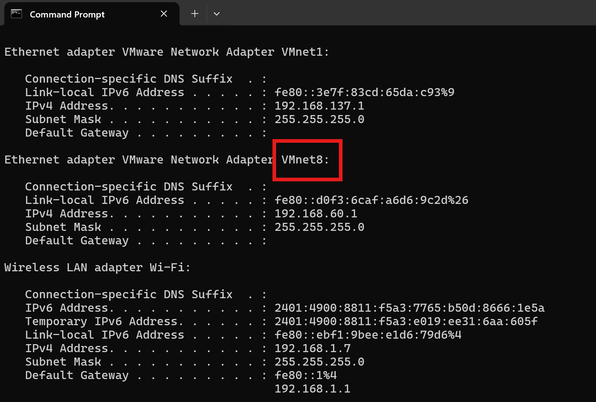

---

## 10. Apache Web Server Basics

**Start the server:**

```bash
sudo systemctl start apache2
```

**Check status:**

```bash
sudo systemctl status apache2
```

**Stop the server:**

```bash
sudo systemctl stop apache2
```

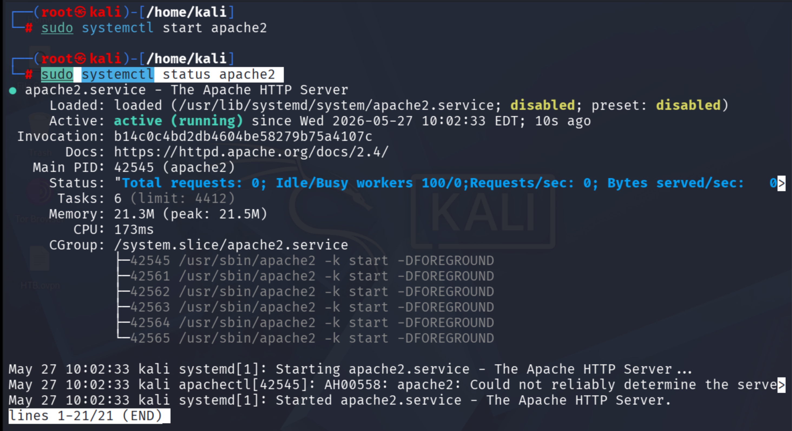

---

## 11. Hostname Resolution (`/etc/hosts`)

Linux checks `/etc/hosts` to resolve a hostname into an IP address **before** querying DNS.

```bash
nano /etc/hosts
```

**Example entry:**

```
192.168.174.10  dc.local
```

Then:

```bash
ping dc.local
```

The system reads `/etc/hosts` and resolves `dc.local` → `192.168.174.10` locally.

### 11.1 Key Concepts

| Concept                      | Explanation                                                     |
| ---------------------------- | --------------------------------------------------------------- |
| **Local DNS resolution**     | `/etc/hosts` acts like DNS but only on your machine             |
| **Static hostname mapping**  | You manually map `hostname → IP` instead of asking a DNS server |
| **Name resolution override** | `/etc/hosts` often takes **priority** over DNS                  |

**Override example:**

DNS says `dc.local = 10.0.0.5`, but `/etc/hosts` says `dc.local = 192.168.1.10` — your machine uses the `/etc/hosts` entry first.

> Editing `/etc/hosts` to add an entry is called **adding a static hostname mapping for local name resolution**.

### 11.2 Demo: Adding a Hostname Entry

The `/etc/hosts` file contents:


Adding your own IP as a hostname in `/etc/hosts`, then pinging it — the reply comes back successfully:

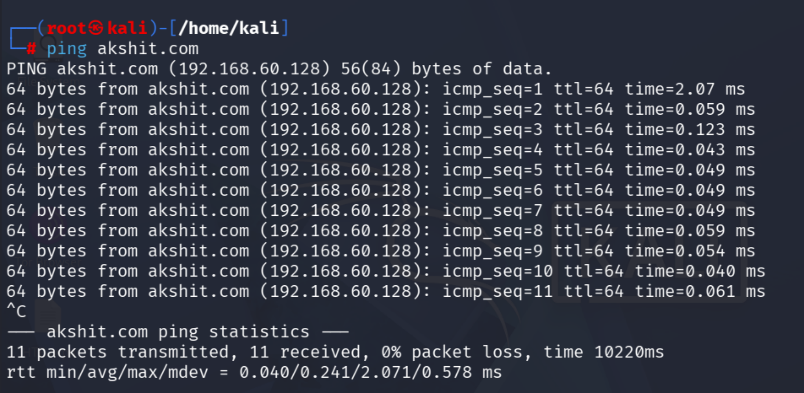

Visiting that hostname in a browser loads the local Apache server:

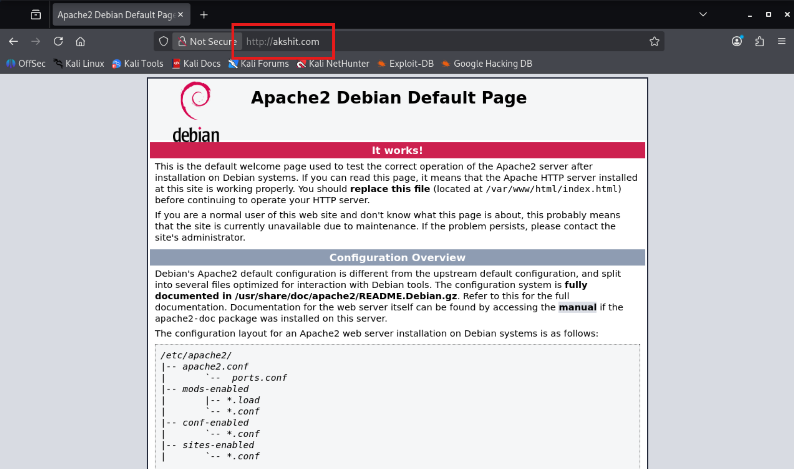

### 11.3 Hosts File: Linux vs Windows

Both Linux/Kali and Windows have a hosts file for local hostname resolution.

| OS             | Hosts File Path                                 | Edit Command                     |
| -------------- | ----------------------------------------------- | -------------------------------- |
| **Linux/Kali** | `/etc/hosts`                                    | `sudo nano /etc/hosts`           |
| **Windows**    | `C:\Windows\System32\drivers\etc\hosts`         | Edit as Administrator in Notepad |

**Example entry (both OS):**

```
127.0.0.1       localhost
192.168.174.10  dc.local
```

Then `ping dc.local` resolves locally on either OS.

### 11.4 Resolution Order (Simplified)

When you run `ping dc.local`, the OS generally tries:

1. **Hosts file** (`/etc/hosts` or `C:\Windows\System32\drivers\etc\hosts`)
2. **DNS server** (router / domain controller)
3. **Other methods** (depending on config) — LLMNR, NetBIOS

---

## 12. VMware Snapshots

### 12.1 What Is a Snapshot?

> **"Save the exact state of this VM right now so I can return to it later."**

A snapshot saves:

- ✅ **Disk state** — files, tools, configs
- ✅ **Memory/RAM state** *(if VM is running)*
- ✅ **Power state** — on/off/login session
- ✅ **VM settings** — virtual hardware config

**Example:** Install Kali + tools → take snapshot **"Fresh Kali"** → later break networking or mess up packages → **restore snapshot** → instantly back to clean state.

### 12.2 How to Take & Manage Snapshots

**Taking a snapshot:**

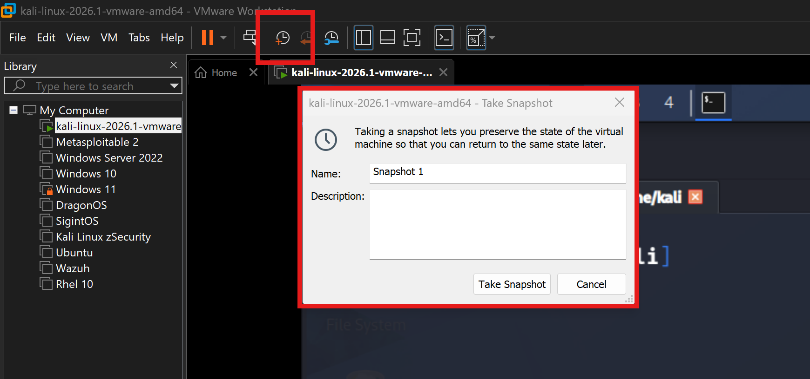

**Snapshot Manager:**

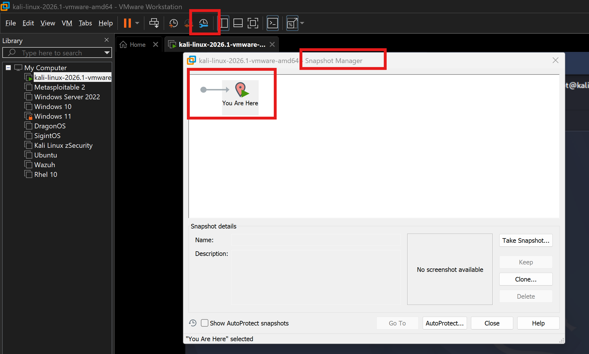

**Reverting:** `VM → Snapshot → Revert to Snapshot` (or use Snapshot Manager)

### 12.3 Snapshot Disk Usage & Delta Files

When you take a snapshot, VMware **does NOT copy the whole disk**. It freezes the current disk state and writes all new changes into a **delta file**.

```
kali.vmdk          = original disk (frozen at snapshot)
kali-000001.vmdk   = new changes only (delta)
```

#### Concrete Example

**Starting point:** Kali VM = `20 GB` on disk (`kali.vmdk`)

**After taking snapshot:**

```
Main disk (kali.vmdk)   = 20 GB
Snapshot metadata       = few MB
Total                   ≈ 20 GB       ← almost no extra space
```

**After installing 10 GB of tools** (Burp Suite, SecLists, Metasploit updates):

```
Original disk (kali.vmdk)        = 20 GB
Delta disk (kali-000001.vmdk)    = 10 GB
Total                            = 30 GB    ← NOT 50 GB
```

> VMware did **not** duplicate the original 20 GB. It only stores **changes since the snapshot**.

**If VM is running with 8 GB RAM** when snapshot is taken:

```
20 GB disk + 8 GB memory snapshot = ~28 GB immediately
Then install 10 GB more           = ~38 GB total
```

> That's why **powering off → then snapshot** is usually cleaner and smaller.

### 12.4 Deleting a Snapshot

Deleting a snapshot **does NOT delete the VM**. VMware merges the delta file back into the base disk.

**Example:** Snapshot delta = 20 GB → delete snapshot → VMware consolidates delta into base → may take minutes and needs free disk space.

### 12.5 Best Practices

- **Take snapshots when VM is OFF** — smaller and cleaner.
- **Keep only 2–4 important snapshots** and delete old ones. Too many = slower disk I/O + wasted storage.

**Recommended snapshot points:**
- Fresh Kali install
- After tools installed
- Before AD attack lab
- Before major updates

**Use descriptive names:**

```
Fresh Install
Tools Installed
Before BloodHound
Before Kerberoasting
Clean AD Lab
```

**Multiple snapshots can be chained:**

```
Fresh Install
 └── Tools Installed
      └── Before AD Lab
           └── Before Responder
```

Too many snapshots means VMware tracks many delta disks:

```
kali.vmdk
kali-000001.vmdk
kali-000002.vmdk
...
```

---

## 13. Install VMware Tools on Kali Linux

Fixes display resolution, drag & drop, and clipboard sharing.

**Step 1 — Update & upgrade:**

```bash
sudo apt-get update && apt-get upgrade -y
```

**Step 2 — Install open-vm-tools:**

```bash
sudo apt install -y open-vm-tools open-vm-tools-desktop
```

| Package                    | Purpose                                    |
| -------------------------- | ------------------------------------------ |
| `open-vm-tools`            | Core VMware Tools functionality            |
| `open-vm-tools-desktop`    | Graphical UI integration (resolution, D&D) |

**Step 3 — Reboot:**

```bash
reboot
```

**Step 4 — Verify:**

```bash
systemctl status open-vm-tools
```

---

## 14. Kali Linux via WSL (Windows Subsystem for Linux)

An alternative to VMware — run Kali directly inside Windows.

**Install Kali WSL from CMD:**

```
wsl --install kali
```

You can directly access Kali through WSL:

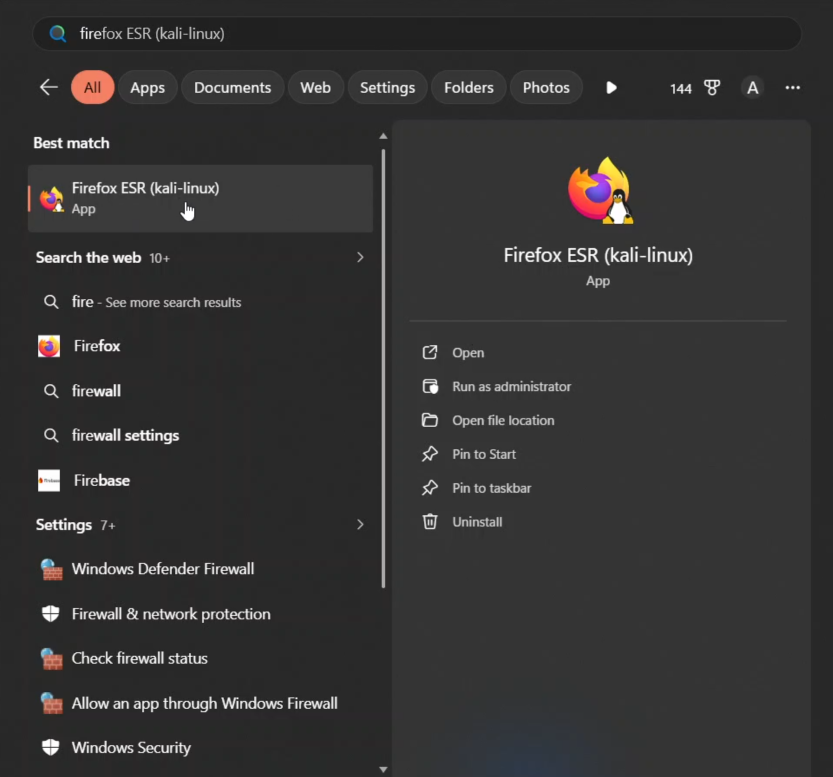

Apps installed in Kali WSL appear in the Windows search bar (e.g. Firefox):


For apps not showing in Windows search (e.g. Burp Suite), launch them from the Kali WSL terminal:

```
burpsuite
```

> [!WARNING]
> WSL is convenient but **unstable for exams**. For OSCP or any certification exam, always use VMware.