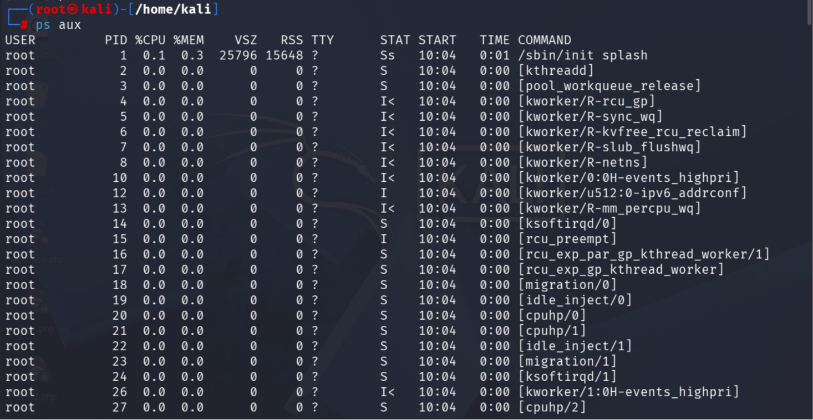

# Linux Logging

> **Core Principle:**
> The most important Linux troubleshooting skill is not memorizing commands. It's knowing **which log source contains the answer** and how to read it quickly.

---

## 1. The Linux Logging Ecosystem

Most Linux systems store logs under `/var/log` — think of it as the **central evidence locker** of the operating system.

| File / Directory       | Purpose                              |
| ---------------------- | ------------------------------------ |
| `/var/log/syslog`      | General system events                |
| `/var/log/auth.log`    | Authentication and sudo events       |
| `/var/log/kern.log`    | Kernel and hardware messages         |
| `/var/log/boot.log`    | Boot process messages                |
| `/var/log/dpkg.log`    | Package installation/removal history |
| `/var/log/nginx/`      | Nginx web server logs                |
| `/var/log/apache2/`    | Apache web server logs               |
| `/var/log/audit/`      | Auditd forensic logs                 |
| `/var/log/wtmp`        | Login history (binary)               |
| `/var/log/btmp`        | Failed login history (binary)        |

### Quickly Explore Logs

```bash
ls -lah /var/log
```

Useful commands:

```bash
cat file.log
less file.log
tail file.log
tail -f file.log       # follow live
grep keyword file.log
```

---

## 2. syslog — The General System Timeline

**Location:** `/var/log/syslog` (RHEL/CentOS uses `/var/log/messages`)

Acts as a **catch-all system log** — service starts/stops, network events, cron jobs, hardware events, application messages, kernel messages.

**Example entries:**

```
Feb 14 09:01:22 systemd: Started Daily apt download activity
Feb 14 09:01:25 CRON: (root) CMD (/usr/bin/backup.sh)
Feb 14 09:02:03 kernel: usb device attached
```

**Useful commands:**

```bash
tail /var/log/syslog              # latest entries
grep -i fail /var/log/syslog      # search for failures
grep nginx /var/log/syslog        # search for a service
tail -f /var/log/syslog           # watch live
```

> **When to check first:** You don't know what broke, a service suddenly stopped, or something happened recently and you need a timeline. Start with syslog.

---

## 3. auth.log — Authentication Evidence

**Location:** `/var/log/auth.log` (RHEL: `/var/log/secure`)

Records SSH logins, login failures, sudo commands, PAM activity, and user authentication. One of the most important logs for SOC analysts, incident responders, blue teams, and sysadmins.

**Example entries:**

```
Accepted publickey for user
Failed password for root
Invalid user admin
sudo: user ran apt update
```

### Common Investigations

```bash
grep "Accepted" /var/log/auth.log        # successful SSH logins
grep "Failed password" /var/log/auth.log  # failed SSH logins
grep "Invalid user" /var/log/auth.log     # invalid user enumeration
grep sudo /var/log/auth.log               # sudo usage (who, what, when)
```

Attackers often try usernames like: `admin`, `test`, `backup`, `oracle`, `guest`

### SOC Perspective

Repeated lines like:

```
Failed password for root
Failed password for root
Failed password for root
```

usually indicate password spraying, brute-force attack, or credential stuffing.

---

## 4. kern.log — Kernel & Hardware Diagnostics

**Location:** `/var/log/kern.log`
**Alternative:** `dmesg -T`

Records kernel-generated events: driver loading, hardware detection, disk failures, filesystem errors, network interface events, OOM killer activity.

**Example entries:**

```
EXT4-fs mounted filesystem
eth0 link up
usb device attached
Out of memory: Kill process 3120
```

### Most Important Event: OOM Killer

```
Out of memory:
Kill process 3120 (java)
```

Meaning: system RAM exhausted, Linux selected a process to kill.
Common root causes: memory leak, large Java process, container consuming RAM.

### Disk Problems

```bash
grep -i error /var/log/kern.log
dmesg -T | grep -i sda
```

May reveal bad sectors, I/O errors, or filesystem corruption.

---

## 5. journald & journalctl

Modern Linux distributions use `systemd-journald` instead of relying solely on text logs. Logs are stored in a binary journal database.

### Core Commands

```bash
journalctl                            # view all journal entries
journalctl -b                         # current boot only
journalctl -b -1                      # previous boot (useful after crashes)
journalctl -f                         # follow live (like tail -f)
```

### Service-Specific Logs

```bash
journalctl -u ssh
journalctl -u nginx
journalctl -u docker
```

### Time-Based Search

```bash
journalctl --since today
journalctl --since "1 hour ago"
journalctl --since "2026-06-05 10:00"
```

### Priority Filtering

```bash
journalctl -p err                     # errors only
journalctl -k -p err                  # kernel errors only
```

---

## 6. boot.log — Startup Troubleshooting

**Location:** `/var/log/boot.log`
**Alternative:** `journalctl -b`

Shows the startup sequence. Look for:

| Marker     | Meaning                          |
| ---------- | -------------------------------- |
| `[ OK ]`   | Service started correctly        |
| `[FAILED]` | Immediate investigation required |

**Example entries:**

```
[ OK ] Mounted /boot/efi
[ OK ] Started SSH
[FAILED] Failed to start Docker
```

After reboot if website is down, database is missing, or Docker failed — first check:

```bash
cat /var/log/boot.log
```

Then investigate the failed service:

```bash
systemctl status docker
```

---

## 7. Web Server Logs

### Nginx

```
/var/log/nginx/access.log
/var/log/nginx/error.log
```

### Apache

```
/var/log/apache2/access.log
/var/log/apache2/error.log
```

### access.log

Every HTTP request. Contains source IP, requested page, response code, timestamp.

**Example:**

```
203.0.113.5 GET /login HTTP/1.1 200
```

**Status codes:**

| Code | Meaning      |
| ---- | ------------ |
| 200  | Success      |
| 301  | Redirect     |
| 403  | Forbidden    |
| 404  | Not Found    |
| 500  | Server Error |

### Detecting Scanners

Requests to paths like `/admin.php`, `/phpmyadmin`, `/wp-login.php` often indicate automated scanners, bots, or reconnaissance.

### error.log

Shows PHP errors, missing files, backend failures, reverse proxy problems.

---

## 8. Cron Logs

Cron executes scheduled tasks.

**Check execution:**

```bash
grep CRON /var/log/syslog         # Debian/Ubuntu
cat /var/log/cron                 # RHEL
```

**Example:**

```
CRON: (root) CMD (/usr/bin/backup.sh)
```

Meaning: user `root` ran `backup.sh` at the logged timestamp.

> [!WARNING]
> Attackers often create persistence via `crontab -e`. Always check for suspicious cron entries during incident response.

---

## 9. wtmp & btmp — Binary Login History

These are **NOT text files** — do NOT use `cat` on them.

```bash
last                  # successful logins (reads wtmp)
sudo lastb            # failed logins (reads btmp)
lastlog               # last login per user
```

**Example outputs:**

```
user pts/0 still logged in                  # from `last`
root ssh:notty 203.0.113.9                  # from `lastb`
```

**Incident response uses:** determine who logged in, when, from which IP, login failures, and reboots.

---

## 10. audit.log — Digital Forensics Goldmine

**Location:** `/var/log/audit/audit.log`
**Generated by:** `auditd`

Records system calls, file access, user actions, security-sensitive operations. Used heavily for compliance, threat hunting, and forensics.

**Query executed commands:**

```bash
ausearch -m EXECVE
```

### Important Fields

| Field      | Meaning                                               |
| ---------- | ----------------------------------------------------- |
| `uid=`     | Current user                                          |
| `auid=`    | Original logged-in user (persists through `su`/`sudo`) |
| `type=PATH`| File touched (e.g. `/etc/shadow`)                     |

> Security teams value auditd for high-fidelity tracking, file modification records, process execution history, and user accountability.

---

## 11. Log Rotation

Without rotation, logs would eventually fill the disk.

**Managed by:** `logrotate`
**Configuration:** `/etc/logrotate.conf`

### Rotated File Naming

| File           | Meaning           |
| -------------- | ----------------- |
| `syslog`       | Current           |
| `syslog.1`     | Previous          |
| `syslog.2.gz`  | Older, compressed |
| `syslog.3.gz`  | Even older        |

### Searching Compressed Logs

Use `zcat` or `zgrep` instead of decompressing first:

```bash
zcat syslog.2.gz
zgrep error syslog.2.gz
zgrep ssh syslog.2.gz
```

---

## 12. Essential Log Analysis Commands

```bash
tail -20 file.log                    # last 20 lines
tail -f file.log                     # live monitoring
grep keyword file.log                # search keyword
grep -i error file.log               # case-insensitive search
grep -c ssh auth.log                 # count matches
grep -R "password" /var/log          # search recursively
zgrep ssh *.gz                       # search compressed logs
```

---

## 13. Incident Response Workflow

When a Linux server breaks, follow this flow:

| Step | Question                  | Command                                    |
| ---- | ------------------------- | ------------------------------------------ |
| 1    | What happened?            | `tail /var/log/syslog`                     |
| 2    | Was it a login issue?     | `tail /var/log/auth.log`                   |
| 3    | Hardware or memory issue? | `tail /var/log/kern.log`                   |
| 4    | Service failed?           | `journalctl -u service_name`               |
| 5    | Failed after reboot?      | `journalctl -b` or `cat /var/log/boot.log` |
| 6    | Website issue?            | `tail /var/log/nginx/error.log` or `tail /var/log/apache2/error.log` |
| 7    | Need forensic evidence?   | `ausearch` + `audit.log`                   |
| 8    | Need login history?       | `last`, `lastb`, `lastlog`                 |

> [!TIP]
> **Golden Rule:** Start broad (**syslog/journalctl**), then narrow down (**auth.log, kern.log, audit.log, application logs**). The fastest administrators and incident responders know exactly **which log file answers which question.**

---

## 14. Process Monitoring with `ps aux`

```bash
ps aux
```




### Output Columns

```
USER   PID %CPU %MEM    VSZ   RSS TTY   STAT START TIME COMMAND
root     1  0.0  0.1 168888 12288 ?     Ss   09:12 0:03 /sbin/init
```

The **STAT** column tells you the process state.

### Main Process States (First Letter)

| Code | Meaning                 | Simple Meaning                    |
| ---- | ----------------------- | --------------------------------- |
| **R** | Running                | Actively using CPU                |
| **S** | Sleeping               | Waiting for something (very common) |
| **D** | Uninterruptible sleep  | Waiting on disk/I/O               |
| **T** | Stopped                | Paused                            |
| **Z** | Zombie                 | Process finished but not cleaned up |
| **I** | Idle kernel thread     | Kernel background thread          |

### Extra Flags (Letters After the First)

| Flag  | Meaning               | Example                  |
| ----- | --------------------- | ------------------------ |
| **s** | Session leader        | Shell / login process    |
| **+** | Foreground process    | Attached to terminal     |
| **<** | High priority         | Important process        |
| **N** | Low priority          | nice'd process           |
| **l** | Multithreaded         | Browser / Java           |
| **L** | Pages locked in RAM   | Rare                     |

### Common STAT Examples

| STAT  | Breakdown                                     | Typical Processes              |
| ----- | --------------------------------------------- | ------------------------------ |
| `Ss`  | Sleeping + session leader                     | `bash`, `sshd`, `systemd`     |
| `S+`  | Sleeping + foreground terminal                | `vim`, `nano`, `bash`          |
| `Ssl` | Sleeping + session leader + multithreaded     | `chrome`, `firefox`, `dbus`    |
| `I<`  | Idle kernel thread + high priority            | Kernel worker threads          |
| `R+`  | Running + foreground terminal                 | `top`, `htop`                  |
| `Z`   | Zombie — parent didn't clean up child         | Broken/orphaned processes      |

### Memory Trick

**First letter = what it's doing** → R (Running), S (Sleeping), Z (Zombie)
**Other letters = extra info** → s (session leader), + (your terminal), l (threads), < (priority)

**Example:**

```bash
ps aux | grep firefox
```

```
kali  1234 ... Ssl ... firefox
```

> Firefox is **s**leeping, it leads its **s**ession, and is mu**l**tithreaded.

**For OSCP/AD labs, the most common ones:**
- **S** → normal
- **R** → active
- **Z** → broken
- **+** → tied to terminal
- **s** → shell/session leader