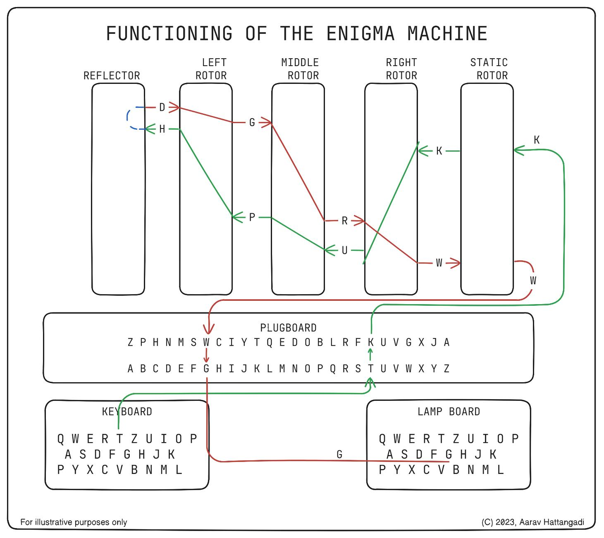

# Introduction to Information Security

> What information security means, and a deep dive into the Enigma machine as a historical case study.

---

## What is Information Security?

- **Data** has no context; **information** is data with meaning
  - "Computer" = data → "This is my computer" = information
- **Information Security** = protecting information from unauthorized access
- Sensitive info includes: phone numbers, birthdays, credentials, personal data
- It is a **basic need for everyone**, not just organizations

> Security is a quality of information. Security is freedom. Security is an asset.


### Information Security vs Cyber Security

| Term                      | Scope                                              |
| ------------------------- | -------------------------------------------------- |
| **Information Security**  | Protecting **all** information (digital + physical) |
| **Cyber Security**        | Protecting information specifically in **cyberspace** (digital systems, networks) |

- We live in the **information age** — information is everywhere
- When information exists in **digital systems** → its protection becomes **cyber security**
- Cyber security is a **subset** of information security


---

## The Enigma Machine

An **electromechanical rotor cipher machine** used by Germany during World War II to encrypt military communications.



**Video references:**
- [Enigma Machine — Numberphile](https://www.youtube.com/watch?v=G2_Q9FoD-oQ)
- [How did the Enigma Machine work?](https://www.youtube.com/watch?v=ybkkiGtJmkM)

### Core Idea

Enigma is a **polyalphabetic substitution cipher** — each letter maps to a different letter, but the mapping **changes after every keypress**.

---

### Components

| Component          | Function                                                     |
| ------------------ | ------------------------------------------------------------ |
| **Keyboard**       | Operator presses a letter                                    |
| **Plugboard**      | Swaps letter pairs before/after encryption (e.g., A ↔ T)    |
| **Rotors (×3)**    | Wired disks that scramble letters; each has a fixed internal wiring |
| **Reflector**      | Sends the signal back through the rotors in reverse          |
| **Lampboard**      | Lights up the encrypted output letter                        |

### Signal Path (Encryption Flow)

```
Keyboard → Plugboard → Rotor 1 → Rotor 2 → Rotor 3
                                                ↓
                                           Reflector
                                                ↓
Lampboard ← Plugboard ← Rotor 1 ← Rotor 2 ← Rotor 3
```

1. Key is pressed → signal enters plugboard (optional swap)
2. Signal passes through **3 rotors** (forward) — each scrambles the letter
3. **Reflector** swaps the letter to a different one and bounces the signal back
4. Signal passes through rotors again (reverse path)
5. Plugboard does a final optional swap → output letter lights up

---

### Why the Mapping Changes Every Keypress

- After each keypress, the **rightmost rotor rotates by 1 step**
- This shifts which internal wire aligns with which contact → **different output**
- Like an **odometer**: right rotor rotates every press, middle occasionally, left rarely
- The internal wiring is **fixed** — only the **alignment/position** changes

| Rotor Position | Input `A` maps to |
| -------------- | ------------------ |
| Position 1     | G                  |
| Position 2     | X                  |
| Position 3     | M                  |

> Same input, different output each time — because the rotor has physically rotated.

---

### The Reflector (Why No Letter Maps to Itself)

The reflector is a **fixed wiring board** with permanent letter pairs:

```
A ↔ Y,  B ↔ R,  C ↔ U,  D ↔ H, ...
```

**Key properties:**
- **Fixed** — no computation, no randomness, just hardwired connections
- **Symmetric** — if A → Y, then Y → A
- **No self-mapping** — no letter is ever paired with itself

**Why self-mapping is impossible (even after reverse rotors):**
1. You press `A` → rotors scramble it to `X`
2. Reflector forces `X` → `M` (never stays `X`)
3. Reverse rotors undo the scramble — but starting from `M`, not `X`
4. Result: some letter other than `A` (e.g., `G`)

> For `A` to return as `A`, the reflector would need to leave the letter unchanged — but it **always** forces a change. This makes self-mapping mathematically impossible (a **derangement** — permutation with no fixed points).

**Why use a reflector at all?**
- It makes encryption and decryption **the same process** — type ciphertext → get plaintext
- No need for a "decrypt mode" — extremely practical for field operations in wartime
- **Trade-off:** convenience at the cost of introducing a structural weakness

---

### Decryption (How the Receiver Decodes)

Both sender and receiver use **identical machine settings**:

| Setting                | Must Match             |
| ---------------------- | ---------------------- |
| Rotor order            | e.g., I, II, III       |
| Starting positions     | e.g., A-B-C            |
| Ring settings          | Internal offsets        |
| Plugboard connections  | e.g., A ↔ T, G ↔ P    |

- Both machines start in the **same state** and process letters in the **same order**
- Rotors move identically on both sides → machines stay in sync
- Settings were distributed via **daily key sheets** during WWII

**Example:**
- Sender types `HELLO` → machine outputs `XJQRT`
- Receiver sets machine to same config → types `XJQRT` → gets `HELLO`

---

### How Enigma Was Cracked

It wasn't brute force — it was **math + engineering + exploiting human mistakes**.

#### Phase 1: Polish Breakthrough (Pre-WWII)

- **Marian Rejewski** and Polish cryptanalysts figured out the mathematical structure of Enigma using **group theory**
- Built the **Bomba Kryptologiczna** — reduced the search space significantly

#### Phase 2: Bletchley Park (WWII)

- **Alan Turing** and the British built the **Bombe machine**
- Not a decryption device — a **smart elimination machine** that discarded impossible settings

#### Weaknesses Exploited

| Weakness                       | How It Helped                                  |
| ------------------------------ | ---------------------------------------------- |
| No letter maps to itself       | Instantly reject impossible crib alignments    |
| Predictable messages ("cribs") | Weather reports, "Heil Hitler" — known plaintext |
| Operator mistakes              | Reusing keys, lazy patterns, sending same message twice |
| Repeated message keys          | Early procedure sent key twice → exploitable patterns |

#### How the Bombe Worked

1. Take a guessed word (**crib**) and align it with ciphertext
2. Build logical constraint chains (if A → X, then X must → …)
3. Test rotor settings automatically
4. If a **contradiction** occurs → discard that setting
5. If consistent → possible key found

> Instead of checking ~10²³ combinations by brute force, the Bombe **cut huge chunks** at once.

---

### Complexity

Total possible configurations were enormous:

- Rotor order permutations
- Rotor starting positions (26³)
- Ring settings
- Plugboard connections

> Rough estimate: **~10²³ possible configurations**

---

### Cybersecurity Lessons from Enigma

| Lesson                             | Modern Takeaway                              |
| ---------------------------------- | -------------------------------------------- |
| No self-mapping = structural flaw  | Avoid predictable constraints in crypto      |
| Human errors broke it              | Implementation matters as much as algorithm  |
| Convenience vs security trade-off  | Reflector made it easy to use but easy to break |
| Known plaintext attacks            | Never use predictable message formats        |

> "Systems fail not because of weak algorithms, but because of implementation + human behavior."

Modern cryptography (like AES) avoids Enigma's flaws by using mathematical operations instead of mechanical patterns, and eliminating predictable structures.

---

### How the Bombe Machine Was Built

The Bombe wasn't a computer — it was an **electro-mechanical elimination machine** designed to rapidly discard impossible Enigma key settings.

#### Design Principle

> "Don't try every possibility — eliminate impossible ones quickly."

The Bombe converted Enigma's logic into **electrical circuits**:
- **Rotating drums** simulated Enigma rotors
- **Wires** simulated plugboard/rotor connections
- **Current flow** tested logical consistency — if it hit a contradiction, that setting was rejected

#### The 5-Step Process

| Step | What Happened |
| ---- | ------------- |
| 1. **Crib selection** | Choose a likely word in the message (e.g., "WETTER" for weather reports) |
| 2. **Alignment** | Align the guessed plaintext with the ciphertext (e.g., H→X, E→J, …) |
| 3. **Menu building** | Turn crib alignment into a **network of logical constraints** (loops of letter dependencies) |
| 4. **Electrical testing** | Bombe spins through rotor positions, sends current through the constraint network |
| 5. **Elimination** | Contradiction (circuit breaks) → reject. Consistent (circuit completes) → possible key |

- The Bombe had **dozens of rotating drums** testing many rotor positions simultaneously
- It tested **thousands of possibilities per minute**
- It did **not** directly output plaintext — it narrowed settings to a shortlist, which humans then tested on real Enigma machines

> The Bombe was **not** brute force. It exploited Enigma's structural flaws (no self-mapping, predictable messages) to cut the ~10²³ search space down to something manageable daily.

#### Typex: The British Improvement

The British built their own machine, **Typex**, based on Enigma's design but with the critical flaw removed — in Typex, a letter **could** encrypt to itself, eliminating the weakness that enabled crib-based attacks.

#### Video References

- [Flaw in the Enigma Code — Numberphile](https://www.youtube.com/watch?v=V4V2bpZlqx8)
- [Bombe Machine Demonstration](https://www.youtube.com/watch?v=6178TGqHkH0)
