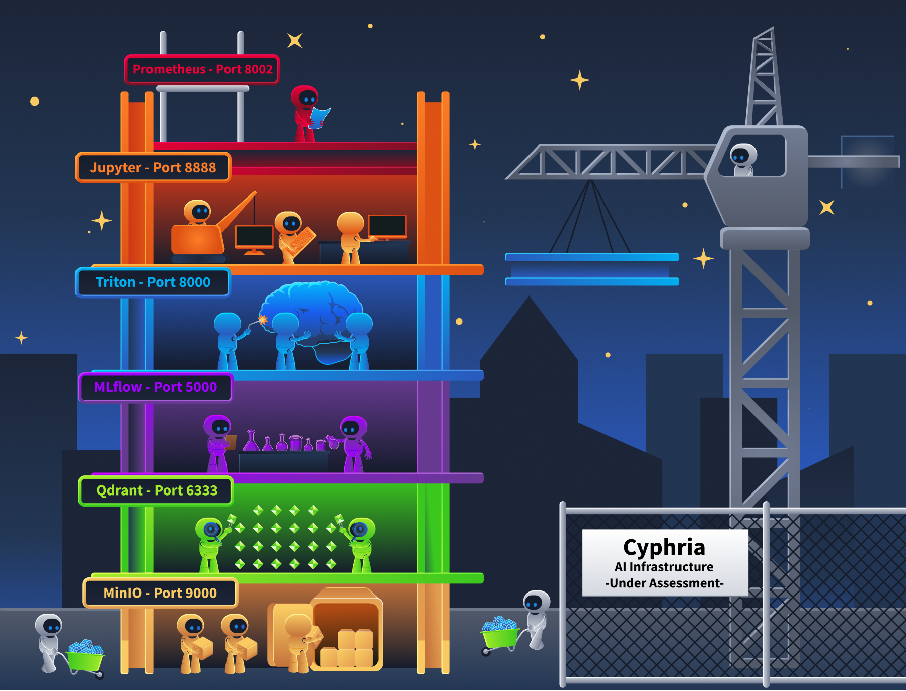

This room takes a different angle. Instead of modelling threats, we go looking for the actual AI systems on a live network. The two skills are complementary but distinct: threat modelling works with assumptions about what exists, while reconnaissance confirms what is actually deployed and exposed.

When organisations add AI capabilities, their networks change in ways that most security teams never see. New services appear on unfamiliar ports. APIs respond in formats that standard scanners do not recognise. ML platforms, model registries, and experiment-tracking servers are deployed with default configurations that prioritise ease of use over security.

**What is AI Reconnaissance**

AI reconnaissance is the practice of identifying these components, understanding what they are, and what they expose. You still use tools like Nmap and curl, but the targets are different. Standard scanning wordlists and service detection miss AI infrastructure entirely because they were not built to find it.

**Why This Matters Right Now**

In January 2026, security researcher Maor Dayan ran a targeted Shodan scan and found [42,665 exposed AI agent instances(opens in new tab)](https://www.clawctl.com/blog/42665-exposed-agents-what-we-learned) on the public internet. 93.4% were vulnerable, and many were leaking API keys through unauthenticated connections. Around the same time, GreyNoise captured over 91,000 attack sessions targeting AI deployments in three months. Attackers are already scanning for AI infrastructure at scale. Traditional tools miss it entirely.

By the end of this room, you will be able to find, fingerprint, and enumerate AI components in any target environment, and you will understand exactly what each one exposes.

This room answers:

- What does AI infrastructure look like on a network, and which ports and protocols give it away?
- How do you tell a Triton inference server from a regular API, or an MLflow tracker from a Flask app?
- What sensitive information can you pull from exposed AI services using nothing more than curl?
- How do attackers scan for these systems at scale, and what does that look like from the defensive side?

By the end, you will be able to find, fingerprint, and enumerate AI components in any target environment.

## Scenario

You are a security engineer at Cyphira, a mid-size fintech company that deployed several AI-powered features over the past year without a security review. Your CISO read a threat report about attackers hijacking exposed AI infrastructure and wants answers: which AI systems do we have, what they expose, and how an attacker could find them? Your job is not to break anything. It is to find everything.

## Learning Objectives

This room focuses on AI infrastructure reconnaissance.

ere, we stick to discovery and enumeration. By the end, you will be able to:

- Identify the common components of a production AI/ML system and the ports, protocols, and API paths each one exposes
- Fingerprint AI and ML services by analysing HTTP headers, API response structures, error messages, and endpoint naming conventions
- Enumerate model metadata, experiment histories, and deployment configurations from exposed tracking servers and inference endpoints
- Map how AI components expand the traditional network attack surface, including new data flows, internal APIs, and supply chain dependencies
- Apply a structured AI reconnaissance methodology using existing security tools with AI-specific configurations
- Recognise the logging and monitoring signatures that indicate AI-focused reconnaissance activity against your infrastructure

### 

Task 2The AI Infrastructure Stack


Now that we know what this room is about, let's talk about what you are actually looking for. When you scan a traditional network, you know what to expect. Web servers on ports 80 and 443. SSH on 22. Databases on 3306 or 5432. You have seen these a hundred times. AI infrastructure looks nothing like that. It runs on ports most security professionals have never targeted, speaks protocols that standard HTTP scanners misinterpret, and exposes APIs that return data formats you will not find in any conventional web application.

Before we start probing anything, we need a mental map of the components. Think of this task as building your target list.

## The AI Infrastructure Stack



# 🏢 🧠 Big Idea

> The whole structure = **AI system (Cyphria) under assessment**

Each floor = **a different component of ML/AI pipeline**

---

# 🧩 Bottom → Top Explanation

---

## 🟫 1. MinIO (Port 9000) — Storage Layer

- Stores:
    - datasets
    - model files
    - artifacts

👉 Think:

> “Warehouse for all data”

---

## 🟩 2. Qdrant (Port 6333) — Vector Database

- Stores embeddings (for RAG)
- Used for:
    - semantic search
    - retrieval

👉 This is:

> where AI “searches meaning”

---

## 🟪 3. MLflow (Port 5000) — Model Registry / Tracking

- Tracks experiments
- Stores model versions

👉 This is your:

> **Model Registry (from earlier)**

---

## 🟦 4. Triton (Port 8000) — LLM Inference Server

- Runs the model
- Serves predictions

👉 This is:

> **LLM Inference (live AI brain)**

---

## 🟧 5. Jupyter (Port 8888) — Development Layer

- Used by data scientists
- for:
    - training
    - experimentation

👉 This is:

> where models are built

---

## 🟥 6. Prometheus (Port 8002) — Monitoring

- Tracks:
    - performance
    - metrics
    - system health

👉 This is:

> observability layer

---

# 🏗️ What the crane means

- Represents:
    
    > system is being **built / tested / assessed**
    

---

# 🔥 Security Insight (very important)

Each layer = attack surface

|Layer|Risk|
|---|---|
|MinIO|Data leakage / poisoning|
|Qdrant|RAG injection|
|MLflow|Model tampering|
|Triton|prompt injection / model abuse|
|Jupyter|code execution|
|Prometheus|info leakage|

---

# 🧠 One-line takeaway

**This image represents a full AI pipeline stack—from data storage to model serving—highlighting how multiple components work together (and where security risks exist).**

# 🎯 Even simpler

> It’s a “building of AI”—each floor does one job, and together they run the whole system.

A production AI system is not a single server. It is a collection of specialised services that handle different parts of the machine learning lifecycle. Here is what you will encounter during reconnaissance.

**Model Serving Endpoints**

These are the frameworks that load trained models into memory and expose prediction APIs. They are the front door of any AI deployment.

- NVIDIA Triton Inference Server is one of the most common. It exposes HTTP on port 8000, gRPC on port 8001, and Prometheus metrics on port 8002. Three ports for one service.
- TensorFlow Serving uses gRPC on 8500 and HTTP on 8501.
- TorchServe exposes inference on 8080, a management API on 8081, and metrics on 8082.
- For LLM-specific deployments, Ollama runs on port 11434, and vLLM typically serves on port 8000. Both expose OpenAI-compatible API formats.

Why do many of these expose both HTTP and gRPC at the same time? gRPC is faster for streaming large tensor payloads between internal services. HTTP/REST is easier for client applications to consume. So they run both.

**Orchestration and Experiment Tracking**

These platforms manage the entire ML lifecycle, from experiment design through to model deployment. They are the **highest-value targets** during reconnaissance because they contain everything.

- MLflow Tracking Server runs on port 5000.
- It records every experiment, every hyperparameter configuration, every training metric, and every model artifact the organisation produces.
- If you find an open MLflow instance, you have found their complete ML research history.
- Kubeflow runs on Kubernetes (ports 80/443) and orchestrates training pipelines, notebook servers, and model deployments.
- Ray exposes a dashboard on port 8265 and a server endpoint on port 8000.

The ShadowRay campaign we mentioned in Task 1 targeted exactly this dashboard.

**Vector Databases**

These store embeddings (numerical representations of documents) and power semantic search for RAG pipelines. If an organisation has an AI chatbot or knowledge assistant, there is almost certainly a vector database behind it.

- Qdrant runs on port 6333 for HTTP and 6334 for gRPC.
- Weaviate runs on port 8080 and includes a GraphQL endpoint. Milvus uses port 19530.
- Chroma runs on port 8000.

What makes these interesting from a recon perspective is that their schema endpoints reveal which embedding model the system uses and what kind of data it contains. A collection called "internal-hr-policies" with 768-dimensional vectors tells you quite a lot about what that RAG system is doing.

**Model Registries**

A model registry stores the actual model files. Serialised **.pkl, .pt, .onnx**, and **.mar** files, along with version history, stage transitions (staging, production, archived), artifact URIs pointing to cloud storage, and the identity of who created each version. An unsecured registry is the single highest-value reconnaissance target. It maps the organisation's entire ML product portfolio in one place.


**Supporting Infrastructure**

- Jupyter notebooks (port 8888) often run with `--ip=0.0.0.0` and no authentication. That **gives direct terminal access to anyone who reaches the port**. Data scientists also routinely store cleartext credentials in notebook cells.
- MinIO (ports 9000 and 9001) provides S3-compatible object storage for model artifacts. Bucket listing is frequently enabled.
- Prometheus metrics endpoints on model servers (Triton on 8002, TorchServe on 8082) leak model names, batch sizes, GPU utilisation, and inference latency. You can map the entire deployment topology without ever touching the inference API.

## Port and Protocol Reference

Here is the reference table you will use for the rest of this room. Keep it handy.

|   |   |   |   |
|---|---|---|---|
|**Component**|**Default Port(s)**|**Protocol(s)**|**Recon Endpoints**|
|NVIDIA Triton  <br>_(Loads models into memory and serves predictions at scale)_|8000, 8001, 8002|HTTP, gRPC, Prometheus|/v2/health/ready, /v2/models|
|TensorFlow Serving  <br>_(Google's model serving framework for TensorFlow models)_|8500, 8501|gRPC, HTTP|/v1/models/<name>|
|TorchServe  <br>(_PyTorch's official model serving framework_)|8080, 8081, 8082|HTTP|/ping, /models|
|Ollama  <br>(_Local runtime for running LLMs on your own hardware_)|11434|HTTP|/api/tags, /api/show|
|vLLM  <br>_(High-throughput LLM serving engine with OpenAI-compatible API)_|8000|HTTP|/v1/models|
|MLflow  <br>_(Tracks experiments, stores models, and manages the ML lifecycle)_|5000|HTTP|/api/2.0/mlflow/experiments/search|
|Kubeflow  <br>_(Kubernetes-native platform for orchestrating ML pipelines)_|80, 443|HTTP|/pipeline/apis/v1beta1/pipelines|
|Ray  <br>_(Distributed compute framework for scaling AI workloads)_|8265, 8000|HTTP|/api/jobs/, Ray Dashboard|
|Qdrant  <br>(_Vector database for semantic search and RAG pipelines_)|6333, 6334|HTTP, gRPC|/collections|
|Weaviate  <br>_(Vector database with built-in GraphQL and module system)_|8080|HTTP, GraphQL|/v1/schema, /v1/meta|
|Milvus  <br>(_Distributed vector database for large-scale embedding storage_)|19530|gRPC|Port 19530 connection|
|Jupyter Notebook  <br>_(Interactive coding environment used by data scientists)_|8888|HTTP|/api/kernels, /api/contents|
|MinIO  <br>_(S3-compatible object storage often used for model artifacts)_|9000, 9001|HTTP (S3-compatible)|Bucket listing|
|Prometheus metrics  <br>_(Not a standalone AI service; exposed by Triton on 8002, TorchServe on 8082, and other ML servers as a built-in monitoring endpoint)_|8002, 8082|HTTP|/metrics|

That is 14 components across 20+ ports. Compare that to a traditional web application, which might add 3 to 5 ports to a network. Adding an AI stack roughly triples the attack surface at the network layer alone.

# 🔌 Protocols (simple)

|Protocol|Meaning|
|---|---|
|HTTP|Normal web communication|
|gRPC|Faster API communication|
|GraphQL|Flexible query API|
|Prometheus|Metrics/monitoring data|

---

# 🧩 Components Explained

---

# 🔵 1. NVIDIA Triton

## 💡 What it does

> Runs AI models in production

- Loads models into memory
- Handles requests
- Returns predictions

👉 Like:

> “AI engine server”

---

## 🔥 Risk

- Exposed inference APIs
- model abuse
- prompt injection
- model extraction

---

# 🟠 2. TensorFlow Serving

## 💡 What it does

> Serves TensorFlow models live

Similar to Triton but specifically for:  
👉 TensorFlow models

---

# 🔴 3. TorchServe

## 💡 What it does

> Runs PyTorch models in production

Official serving framework for:  
👉 PyTorch

---

# 🟢 4. Ollama

## 💡 What it does

> Runs LLMs locally on your own machine

Used for:

- local ChatGPT-like systems
- offline AI

---

## 🔥 Risk

- local model exposure
- prompt injection
- weak auth

---

# 🟣 5. vLLM

## 💡 What it does

> High-speed LLM serving engine

Optimized for:

- large-scale inference
- OpenAI-style APIs

---

# 🟡 6. MLflow

## 💡 What it does

> Tracks ML experiments + stores models

Handles:

- model versions
- metrics
- registry

👉 Like:

> “GitHub + dashboard for ML”

---

## 🔥 Risk

- model tampering
- malicious model upload

---

# 🔷 7. Kubeflow

## 💡 What it does

> Automates ML pipelines on Kubernetes

Used for:

- training
- deployment
- orchestration

---

## 🔥 Risk

- cluster compromise
- pipeline abuse

---

# ⚡ 8. Ray

## 💡 What it does

> Distributed computing for AI

Splits workloads across machines

👉 Makes AI scale horizontally

---

## 🔥 Risk

- remote job execution
- cluster abuse

---

# 🟩 9. Qdrant

## 💡 What it does

> Vector database for RAG

Stores:

- embeddings
- semantic search data

Used in:  
👉 Retrieval-Augmented Generation

---

## 🔥 Risk

- RAG poisoning
- malicious document retrieval

---

# 🟢 10. Weaviate

## 💡 What it does

> Another vector database

Like Qdrant but includes:

- GraphQL
- built-in modules

---

# 🔵 11. Milvus

## 💡 What it does

> Large-scale vector database

Handles huge embedding datasets

---

# 🟧 12. Jupyter Notebook

## 💡 What it does

> Interactive coding environment

Used by:

- data scientists
- researchers

---

## 🔥 Risk

VERY HIGH

Because:

- executes arbitrary Python code
- often weakly secured

👉 Common attack target

---

# 🟫 13. MinIO

## 💡 What it does

> Object/file storage

Stores:

- datasets
- models
- artifacts

Like:

> private AWS S3

---

## 🔥 Risk

- exposed buckets
- data leaks

---

# 🟥 14. Prometheus Metrics

## 💡 What it does

> Monitoring & metrics

Tracks:

- CPU
- requests
- model stats

---

## 🔥 Risk

- information leakage
- infrastructure recon

---

# 🔍 Recon Endpoints (important)

These endpoints help:

- admins monitor services
- attackers discover info

Examples:

```
/models/metrics/ping/health
```

👉 They reveal:

- running models
- versions
- system health

---

# 🔥 Big Security Insight

Traditional web app:

```
3–5 ports
```

AI stack:

```
20+ ports
```

👉 More services = more attack surface

---

# 🧠 One-line takeaway

**Modern AI systems are not just “one chatbot”—they are many interconnected services for storage, inference, vector search, orchestration, and monitoring, each adding new network attack surfaces.**


## Case Study: What Exposed AI Infrastructure Actually Looks Like

In Task 1, we mentioned that a January 2026 Shodan scan found 42,665 exposed AI agent instances. Let's break down what those instances actually were, because the number alone does not tell you much. The detail does. The most commonly exposed services included MLflow dashboards sitting on port 5000 with no authentication. Unauthenticated Jupyter notebooks on port 8888, some already compromised with cryptomining malware (Monero miners like peer2profit), deployed by earlier attackers who found them first. Open Ray dashboards on port 8265. Triton inference endpoints on port 8000.

These were not isolated findings. They were connected systems. IBM X-Force documented this pattern in their [2025 research on ML training infrastructure attacks(opens in new tab)](https://www.ibm.com/think/x-force/becoming-the-trainer-attacking-ml-training-infrastructure). In one case, they mapped a complete chain: a Jupyter notebook running on Azure ML contained cleartext MLflow credentials in a notebook cell. Those credentials pointed to an MLflow tracking server. The MLflow server's model registry contained artifact URIs pointing to S3 storage buckets holding the actual model files. Every component trusted the network boundary, so compromising one compromised the rest.

## 🧠 Simple explanation

This means:

> The AI infrastructure components were all connected together, so breaking into one system gave access to the others.

---

# 🔗 Step-by-step attack chain (simple)

---

## 1️⃣ Jupyter Notebook was exposed

A data scientist notebook contained:

```
username/password or API keys
```

for MLflow.

👉 Credentials stored in plain text (“cleartext credentials”)

---

## 2️⃣ Attacker uses those credentials

Now attacker logs into:

👉 **MLflow server**

---

## 3️⃣ MLflow contained model locations

Inside MLflow:

- model registry entries
- artifact URIs

These pointed to:

👉 S3 storage buckets

---

## 4️⃣ S3 buckets contained actual models

Now attacker can access:

- model files
- artifacts
- datasets

---

# 🔥 Core problem

Every component trusted:

> “If request comes from inside network, it must be safe”

👉 No strong internal security

---

# 💥 Result

Compromising:

```
Jupyter
```

eventually led to:

```
MLflow → S3 buckets → model files
```

👉 One weak point compromised entire ML pipeline.

The Shodan dorks that found these services were not complicated:

- `port:5000 "MLflow"` for exposed MLflow instances
- `port:8888 title:"Home Page - Select or create a notebook"` for unauthenticated Jupyter notebooks
- `http.title:"Ray Dashboard"` for exposed Ray cluster dashboards
- `port:8001 "triton"` for Triton gRPC endpoints

Simple queries. Massive results. That is why the port reference table above matters. If you know the ports and the service banners, finding AI infrastructure is not hard. The hard part is knowing to look in the first place.

## 🧠 Simple explanation

This is saying:

> AI infrastructure is often easy to discover on the internet because many services expose recognizable ports and web pages.

---

# 🔍 What is a Shodan dork?

👉 Shodan is like:

> “Google for exposed servers/devices”

Instead of websites, it indexes:

- ports
- banners
- dashboards
- services

---

# 💡 Example

This query:

```
port:5000 "MLflow"
```

means:

> “Show me internet systems exposing MLflow on port 5000”

---

# 🔗 Why this works

Every service has:

- default ports
- recognizable titles/banners

Example:

|Service|Port|Detectable Banner|
|---|---|---|
|MLflow|5000|“MLflow”|
|Jupyter|8888|Notebook homepage|
|Ray|8265|“Ray Dashboard”|
|Triton|8001|Triton service response|

---

# 🔥 Real problem

Admins expose these services publicly:

- no auth
- weak auth
- internal dashboards reachable from internet

👉 Then Shodan indexes them automatically

---

# 💥 Why this is dangerous

An attacker can quickly find:

- ML servers
- notebooks
- vector DBs
- inference APIs

without hacking anything initially.

---

# 🧩 Example attack flow

1. Search:

```
port:8888 Jupyter
```

2. Find exposed notebook
3. Access credentials/API keys
4. Pivot into ML infrastructure

---

# 🧠 Important insight

The attack wasn’t sophisticated.

👉 The exposure itself was the vulnerability.

---

# 🔥 Meaning of the last line

> “The hard part is knowing to look in the first place.”

Means:

- Most defenders think about:
    - web servers
    - databases

BUT:

- attackers now search specifically for:
    - AI infrastructure

---

# 🧠 One-line takeaway

**AI services often expose predictable ports and banners, making them easy to discover with tools like Shodan if they are publicly accessible.**

---

# 🎯 Even simpler

> AI systems leave many “open doors” on the internet, and Shodan helps attackers find them quickly.

## Agent Exercise

Now let's put what you learned into practice. Open the **Cyphira Network Scanner** agent.

You are starting the Cyphira AI Audit. The internal subnet is 10.10.45.0/24. Your job is to find every AI component on this network.

**Step 1: Scan for AI services.**

- Run the following Nmap command against the subnet, targeting the AI-specific ports from the reference table:

- - `nmap -p 5000,6333,6334,8000,8001,8002,8888,9000,9001 -sV 10.10.45.0/24`

- Review the results.
- Note which hosts have open ports and what service strings Nmap reports for each one.

nmap -p 5000,6333,6334,8000,8001,8002,8888,9000,9001 -sV 10.10.45.0/24
23:48
User profile photo.
Starting Nmap 7.94SVN ( https://nmap.org ) at 2023-10-01 12:00 Eastern Daylight Time

Nmap scan report for web-prod.cyphira.internal (10.10.45.10)
Host is up (0.10s latency).
PORT     STATE SERVICE
5000/tcp closed
6333/tcp closed
6334/tcp closed
8000/tcp closed
8001/tcp closed
8002/tcp closed
8888/tcp closed
9000/tcp closed
9001/tcp closed

Nmap scan report for db-prod.cyphira.internal (10.10.45.11)
Host is up (0.12s latency).
PORT     STATE SERVICE
5000/tcp closed
6333/tcp closed
6334/tcp closed
8000/tcp closed
8001/tcp closed
8002/tcp closed
8888/tcp closed
9000/tcp closed
9001/tcp closed

Nmap scan report for mlflow-tracker.cyphira.internal (10.10.45.12)
Host is up (0.15s latency).
PORT     STATE SERVICE VERSION
5000/tcp open  http    Werkzeug/3.0.1 Python/3.11.7
6333/tcp closed
6334/tcp closed
8000/tcp closed
8001/tcp closed
8002/tcp closed
8888/tcp closed
9000/tcp closed
9001/tcp closed

Nmap scan report for triton-inference.cyphira.internal (10.10.45.15)
Host is up (0.18s latency).
PORT     STATE SERVICE VERSION
5000/tcp closed
6333/tcp closed
6334/tcp closed
8000/tcp open  http
8001/tcp open  grpc
8002/tcp open  http    Prometheus metrics
8888/tcp closed
9000/tcp closed
9001/tcp closed

Nmap scan report for qdrant-vectordb.cyphira.internal (10.10.45.18)
Host is up (0.20s latency).
PORT     STATE SERVICE VERSION
5000/tcp closed
6333/tcp open  http
6334/tcp open  grpc
8000/tcp closed
8001/tcp closed
8002/tcp closed
8888/tcp closed
9000/tcp closed
9001/tcp closed

Nmap scan report for jupyter-ds.cyphira.internal (10.10.45.20)
Host is up (0.22s latency).
PORT     STATE SERVICE VERSION
5000/tcp closed
6333/tcp closed
6334/tcp closed
8000/tcp closed
8001/tcp closed
8002/tcp closed
8888/tcp open  http    Tornado/6.4
9000/tcp closed
9001/tcp closed

Nmap scan report for minio-store.cyphira.internal (10.10.45.22)
Host is up (0.25s latency).
PORT     STATE SERVICE VERSION
5000/tcp closed
6333/tcp closed
6334/tcp closed
8000/tcp closed
8001/tcp closed
8002/tcp closed
8888/tcp closed
9000/tcp open  http    MinIO
9001/tcp open  http    MinIO Console

Nmap done: 256 IP addresses (7 hosts up) scanned in 5.50 seconds
Service detection performed.

Good work. Five AI hosts, two traditional. Save these IPs and ports, you will need them for fingerprinting in your next task.

**Step 2: Identify the AI components.**

- Now check for standard services to get the full picture: 

- - `nmap -p 22,80,443,5432 -sV 10.10.45.0/24`
- Compare these results against Step 1.
- Which hosts are running only traditional services? Which are running AI infrastructure?

nmap -p 22,80,443,5432 -sV 10.10.45.0/24
23:49
User profile photo.
Starting Nmap 7.94SVN ( https://nmap.org ) at 2023-10-01 12:05 Eastern Daylight Time

Nmap scan report for web-prod.cyphira.internal (10.10.45.10)
Host is up (0.10s latency).
PORT     STATE SERVICE VERSION
22/tcp   open  ssh     OpenSSH 8.9p1 Ubuntu 3ubuntu0.6
80/tcp   open  http    nginx 1.24.0
443/tcp  open  ssl/http nginx 1.24.0
5432/tcp closed

Nmap scan report for db-prod.cyphira.internal (10.10.45.11)
Host is up (0.12s latency).
PORT     STATE SERVICE VERSION
22/tcp   open  ssh     OpenSSH 8.9p1 Ubuntu 3ubuntu0.6
80/tcp   closed
443/tcp  closed
5432/tcp open  postgresql PostgreSQL 15.2

Nmap scan report for mlflow-tracker.cyphira.internal (10.10.45.12)
Host is up (0.15s latency).
PORT     STATE SERVICE
22/tcp   closed
80/tcp   closed
443/tcp  closed
5432/tcp closed

Nmap scan report for triton-inference.cyphira.internal (10.10.45.15)
Host is up (0.18s latency).
PORT     STATE SERVICE
22/tcp   closed
80/tcp   closed
443/tcp  closed
5432/tcp closed

Nmap scan report for qdrant-vectordb.cyphira.internal (10.10.45.18)
Host is up (0.20s latency).
PORT     STATE SERVICE
22/tcp   closed
80/tcp   closed
443/tcp  closed
5432/tcp closed

Nmap scan report for jupyter-ds.cyphira.internal (10.10.45.20)
Host is up (0.22s latency).
PORT     STATE SERVICE
22/tcp   closed
80/tcp   closed
443/tcp  closed
5432/tcp closed

Nmap scan report for minio-store.cyphira.internal (10.10.45.22)
Host is up (0.25s latency).
PORT     STATE SERVICE
22/tcp   closed
80/tcp   closed
443/tcp  closed
5432/tcp closed

Nmap done: 256 IP addresses (7 hosts up) scanned in 3.20 seconds
Service detection performed.

Standard services found. But have you checked the full AI port range from your reference table?


**Step 3: Spot the non-obvious ones.**

Using the port reference table from this task, match each open AI port to the component it likely belongs to. Note down the IP address, port, and your best guess at the component. You will confirm your identification in Task 3.

# 🧠 Traditional vs AI Hosts

## 🟩 Traditional Infrastructure

|Host|Why|
|---|---|
|`10.10.45.10` web-prod|nginx + SSH = normal web server|
|`10.10.45.11` db-prod|PostgreSQL + SSH = normal database server|

---

# 🧠 AI Infrastructure Hosts

|IP|Open Ports|Component|
|---|---|---|
|`10.10.45.12`|5000|MLflow|
|`10.10.45.15`|8000,8001,8002|Triton Inference|
|`10.10.45.18`|6333,6334|Qdrant Vector DB|
|`10.10.45.20`|8888|Jupyter Notebook|
|`10.10.45.22`|9000,9001|MinIO|

---

# 🔍 What each means simply

---

## 🔷 10.10.45.12 → MLflow

Port:

```
5000
```

Meaning:

- model tracking
- model registry
- experiment management

👉 Stores model versions

---

## 🔷 10.10.45.15 → Triton

Ports:

```
8000 = HTTP API8001 = gRPC8002 = Prometheus metrics
```

Meaning:

- production inference server
- runs AI models live

👉 “AI brain in production”

---

## 🔷 10.10.45.18 → Qdrant

Ports:

```
6333 = HTTP6334 = gRPC
```

Meaning:

- vector database
- used for RAG retrieval

👉 Stores embeddings

---

## 🔷 10.10.45.20 → Jupyter

Port:

```
8888
```

Meaning:

- data science notebook
- code execution environment

👉 Usually high-risk if exposed

---

## 🔷 10.10.45.22 → MinIO

Ports:

```
9000 = storage API9001 = admin console
```

Meaning:

- object storage
- datasets/models/artifacts

👉 Like private S3 bucket

---

# 🔥 Why the system says:

> “Have you checked the full AI port range?”

Because your first scan only checked:

```
5000,6333,6334,8000,8001,8002,8888,9000,9001
```

BUT the reference table also included:

- 11434 (Ollama)
- 8080/8081/8082 (TorchServe/Weaviate)
- 8500/8501 (TensorFlow Serving)
- 8265 (Ray)
- etc.

👉 Meaning:

> there COULD still be hidden AI services

---

# 🧠 Big lesson of the exercise

Traditional recon:

```
80,443,22
```

AI recon:

```
many specialized ports
```

👉 AI dramatically expands attack surface.

---

# 🎯 Likely expected findings

|Component|IP|Ports|
|---|---|---|
|MLflow|10.10.45.12|5000|
|Triton|10.10.45.15|8000,8001,8002|
|Qdrant|10.10.45.18|6333,6334|
|Jupyter|10.10.45.20|8888|
|MinIO|10.10.45.22|9000,9001|

---

# 🧠 One-line takeaway

**The exercise demonstrates that AI infrastructure introduces many specialized network services, and knowing their default ports makes reconnaissance and discovery much easier.**

Task 3Fingerprinting AI Services


