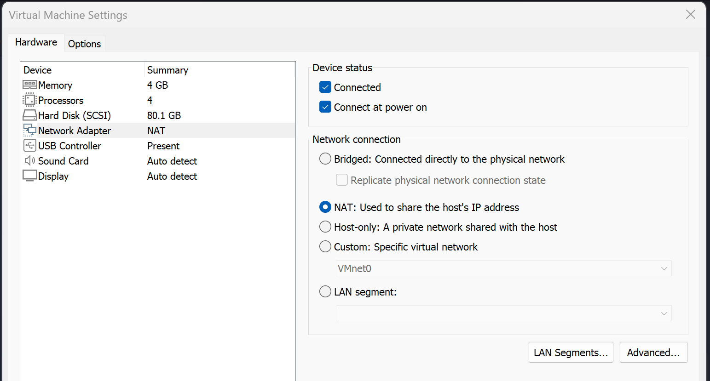
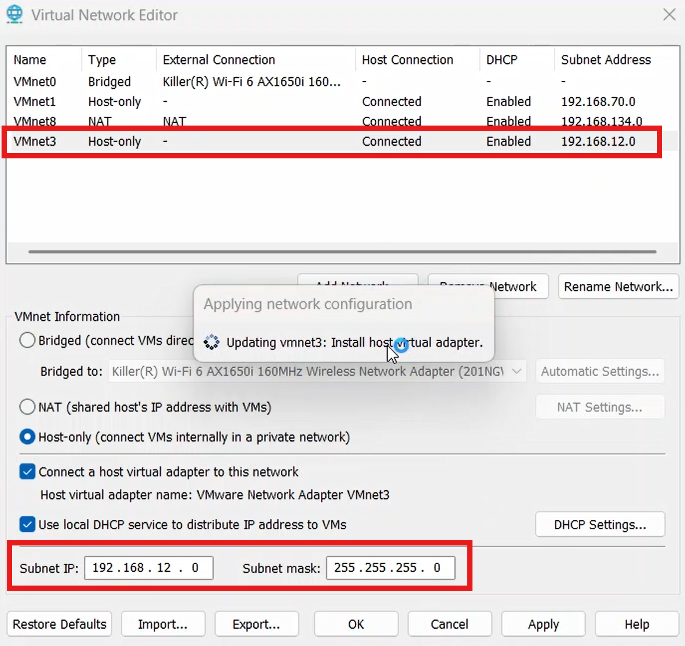
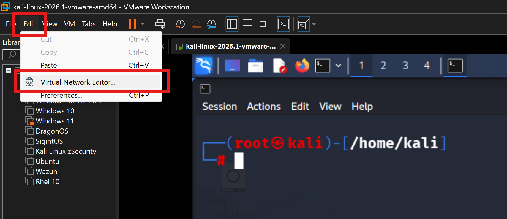
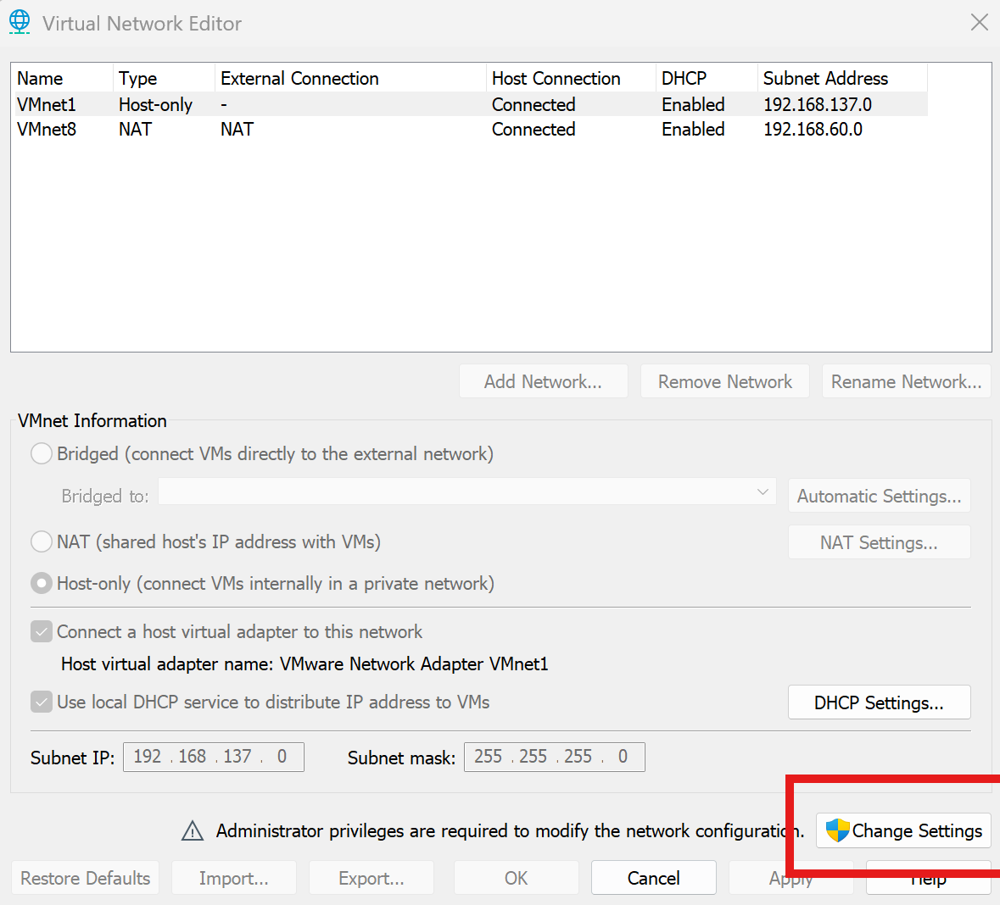
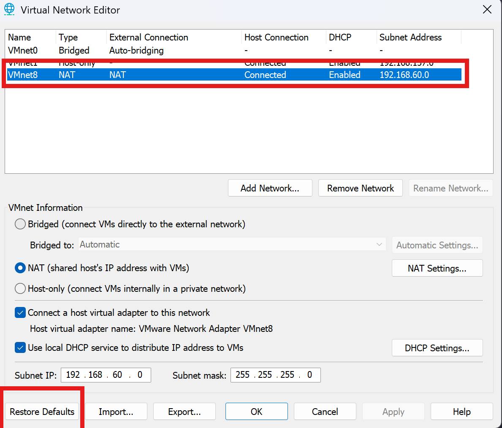
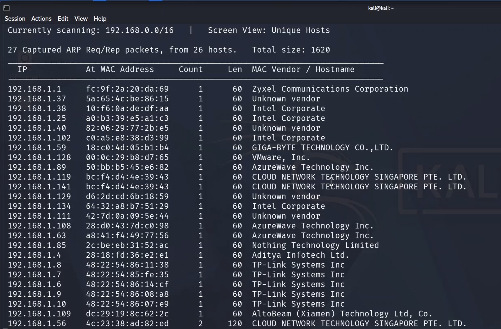
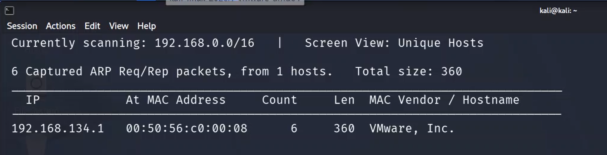
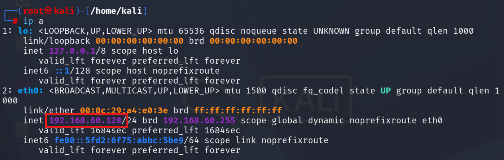
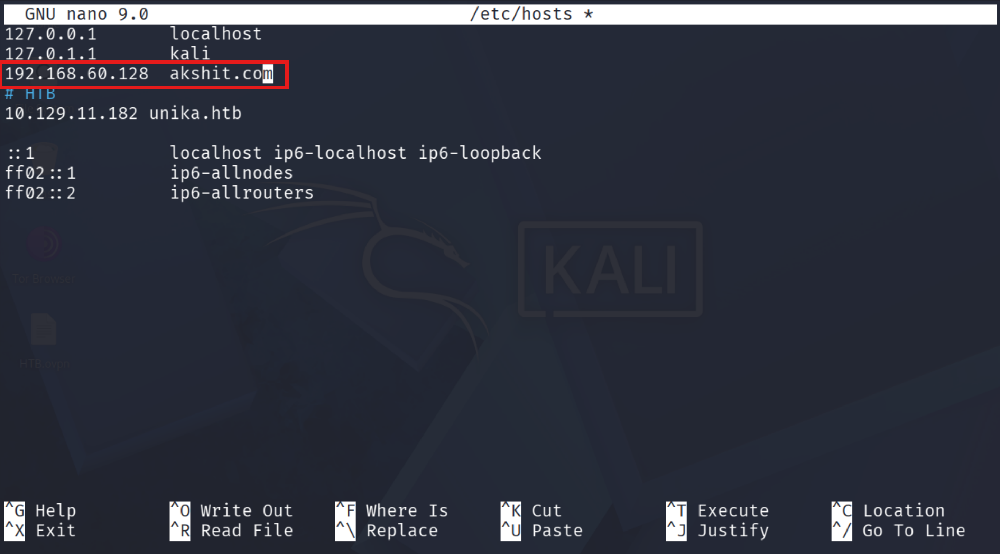
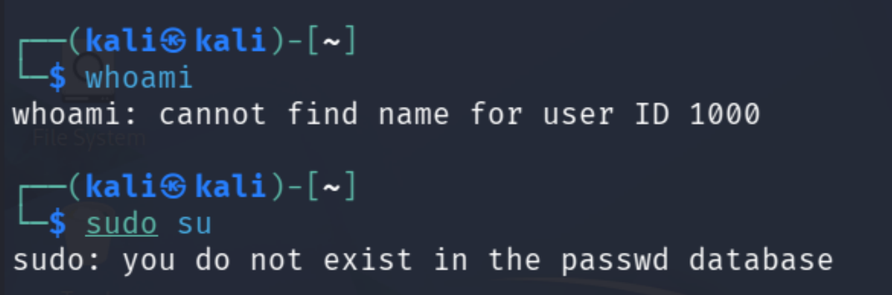

# Linux VM Networking & Lab Essentials

> Covers VMware network modes, hostname resolution, snapshots, Apache basics, and critical system files.

---

## VMware Network Modes



### 1. NAT (Network Address Translation)

**VM shares the host's internet connection.** The VM gets a private IP from VMware (e.g. `192.168.174.x`) and VMware translates traffic through the host.

```
VM → VMware NAT → Your PC → Internet
```

| ✅ Works                                        | ❌ Doesn't Work                                          |
| ----------------------------------------------- | -------------------------------------------------------- |
| VM can access internet                          | Other devices on your home LAN usually can't see the VM |
| Download Windows updates / tools                |                                                          |
| Host can usually reach VM                       |                                                          |
| Multiple VMs on same NAT can talk to each other |                                                          |

**Best for:** Learning labs with internet access, safe isolated environments, downloading tools.

---

### 2. Bridged

**VM becomes another real machine on your physical network.** It connects directly to your Wi-Fi/Ethernet.

```
VM  → Router/Switch
Host → Router/Switch
Phone → Router/Switch
```

Everyone is on the same network. Router sees both host and VM separately.

**Example:**
- Host = `192.168.1.20`
- VM = `192.168.1.35`

| ✅ Works                    | ⚠ Risks                                         |
| --------------------------- | ------------------------------------------------ |
| Internet                    | VM exposed to your real LAN                      |
| Other devices can reach VM  | DHCP from router may interfere with lab          |
| VM appears as a real PC     | AD domain controller on home network can get messy |

**Best for:** Testing with real network, when another device needs to reach the VM.

---

### 3. Host-Only

**VM talks only to the host + other host-only VMs.** No internet access.

```
Host ↔ VM1 ↔ VM2
```

**Example:**
- Host = `192.168.56.1`
- DC = `192.168.56.10`
- Win11 = `192.168.56.11`

| ✅ Works              | ❌ Doesn't Work |
| --------------------- | --------------- |
| VMs talk to each other | Internet        |
| Host talks to VMs      |                 |

**Best for:** Safe AD labs, malware analysis, pentesting labs. Very common for AD lab setups.

---

### 4. Custom (Specific VMnet)

Lets you pick a VMware virtual network manually.

**Default VMnets:**
- `VMnet0` = Bridged
- `VMnet1` = Host-Only
- `VMnet8` = NAT

**Or create your own:**

```
VMnet2 = AD Lab
VMnet3 = Attacker lab
```

Then assign VMs exactly where needed.

**Example layout:**
- DC + Win10 → `VMnet2`
- Kali → `VMnet3`
- Firewall VM between them

**Best for:** Advanced labs, separate network segments.



---

### 5. LAN Segment

**Private switch between VMs only.** Even the host can't join.

```
VM1 ↔ VM2 ↔ VM3
```

- Host **cannot** access.
- No DHCP unless you create one.
- No internet.

**Best for:** Simulating isolated enterprise networks, red team labs.

---

### Quick Comparison Table

| Mode        | Internet | Host Access | Other VMs | Home LAN Access |
| ----------- | -------- | ----------- | --------- | --------------- |
| NAT         | ✅       | ✅          | ✅        | Limited         |
| Bridged     | ✅       | ✅          | ✅        | ✅              |
| Host-Only   | ❌       | ✅          | ✅        | ❌              |
| Custom      | depends  | depends     | depends   | depends         |
| LAN Segment | ❌       | ❌          | ✅        | ❌              |

---

### "Replicate Physical Network Connection State"

Only appears under **Bridged** mode. If enabled, when the host changes from Wi-Fi → Ethernet, the VM follows automatically.

> Usually leave this **off** unless specifically needed.

---

## Troubleshooting: No Internet Inside VM

If you encounter no internet inside the VM at any time:

1. Go to **Edit → Virtual Network Editor**



2. Click **Change Settings**



3. Select **VMnet8** and click **Restore Defaults**



Internet should now work normally.

---

## Network Discovery with `netdiscover`

```bash
netdiscover
```

Scans for other devices on the same network. **Requires Bridged mode** (not NAT) to see real LAN devices.

**On Bridged** — discovers real LAN devices:



**On NAT** — only sees VMware NAT subnet:



You can also check VMnet8 from the host's command prompt:


---

## Apache Web Server Basics

**Start the server:**

```bash
sudo systemctl start apache2
```

**Check status:**

```bash
sudo systemctl status apache2
```

**Stop the server:**

```bash
sudo systemctl stop apache2
```


---

## Hostname Resolution (`/etc/hosts`)

Linux checks `/etc/hosts` to resolve a hostname into an IP address before querying DNS.

```bash
nano /etc/hosts
```

**Example entry:**

```
192.168.174.10  dc.local
```

Then:

```bash
ping dc.local
```

The system reads `/etc/hosts` and resolves `dc.local` → `192.168.174.10` locally.

### Key Concepts

| Concept                       | Explanation                                                     |
| ----------------------------- | --------------------------------------------------------------- |
| **Local DNS resolution**      | `/etc/hosts` acts like DNS but only on your machine             |
| **Static hostname mapping**   | You manually map `hostname → IP` instead of asking a DNS server |
| **Name resolution override**  | `/etc/hosts` often takes **priority** over DNS                  |

**Override example:**

DNS says `dc.local = 10.0.0.5`, but `/etc/hosts` says `dc.local = 192.168.1.10` — your machine may use the `/etc/hosts` entry first.

> Editing `/etc/hosts` to add an entry is called **adding a static hostname mapping for local name resolution**, or simply **hostname resolution via `/etc/hosts`**.

### Demo: Adding a Hostname Entry

The `/etc/hosts` file contents:





Adding your own IP as a hostname in `/etc/hosts`, then pinging it — the reply comes back successfully:


Visiting that hostname in a browser loads the local Apache server:


---

### Hosts File: Linux vs Windows

Both Linux/Kali and Windows have a hosts file for local hostname resolution.

| OS            | Hosts File Path                                    | Edit Command                    |
| ------------- | -------------------------------------------------- | ------------------------------- |
| **Linux/Kali** | `/etc/hosts`                                       | `sudo nano /etc/hosts`         |
| **Windows**    | `C:\Windows\System32\drivers\etc\hosts`            | Edit as Administrator in Notepad |

**Example entry (both OS):**

```
127.0.0.1       localhost
192.168.174.10  dc.local
```

Then `ping dc.local` resolves locally on either OS.

### Resolution Order (Simplified)

When you run `ping dc.local`, the OS generally tries:

1. **Hosts file** (`/etc/hosts` or `C:\Windows\System32\drivers\etc\hosts`)
2. **DNS server** (router / domain controller)
3. **Other methods** (depending on config) — LLMNR, NetBIOS

---

## VMware Snapshots

### What Is a Snapshot?

> **"Save the exact state of this VM right now so I can return to it later."**

A snapshot saves:

- ✅ **Disk state** — files, tools, configs
- ✅ **Memory/RAM state** *(if VM is running)*
- ✅ **Power state** — on/off/login session
- ✅ **VM settings** — virtual hardware config

**Example:** Install Kali + tools → take snapshot **"Fresh Kali"** → later break networking or mess up packages → **restore snapshot** → instantly back to clean state.

### How to Take & Manage Snapshots

**Taking a snapshot:**


**Snapshot Manager:**


**Reverting:** `VM → Snapshot → Revert to Snapshot` (or use Snapshot Manager)

---

### How Much Space Does a Snapshot Take?

#### Understanding Delta Files

When you take a snapshot, VMware **does NOT copy the whole disk**. It freezes the current disk state and writes all new changes into a **delta file**.

```
kali.vmdk          = original disk (frozen at snapshot)
kali-000001.vmdk   = new changes only (delta)
```

#### Concrete Example

**Starting point:** Kali VM = `20 GB` on disk (`kali.vmdk`)

**After taking snapshot:**

```
Main disk (kali.vmdk)   = 20 GB
Snapshot metadata       = few MB
Total                   ≈ 20 GB       ← almost no extra space
```

**After installing 10 GB of tools** (Burp Suite, SecLists, Metasploit updates):

```
Original disk (kali.vmdk)        = 20 GB
Delta disk (kali-000001.vmdk)    = 10 GB
Total                            = 30 GB    ← NOT 50 GB
```

> VMware did **not** duplicate the original 20 GB. It only stores **changes since the snapshot**.

**If VM is running with 8 GB RAM** when snapshot is taken:

```
20 GB disk + 8 GB memory snapshot = ~28 GB immediately
Then install 10 GB more           = ~38 GB total
```

> That's why **powering off → then snapshot** is usually cleaner and smaller.

---

### Deleting a Snapshot

Deleting a snapshot **does NOT delete the VM**. VMware merges the delta file back into the base disk.

**Example:** Snapshot delta = 20 GB → delete snapshot → VMware consolidates delta into base → may take minutes and needs free disk space.

---

### Snapshot Best Practices

**Take snapshots when VM is OFF** — smaller and cleaner.

**Recommended snapshot points:**
- Fresh Kali install
- After tools installed
- Before AD attack lab
- Before major updates

**Use descriptive names:**

```
Fresh Install
Tools Installed
Before BloodHound
Before Kerberoasting
Clean AD Lab
```

**Multiple snapshots can be chained:**

```
Fresh Install
 └── Tools Installed
      └── Before AD Lab
           └── Before Responder
```

**Keep only 2–4 important snapshots** and delete old ones. Too many snapshots = slower disk I/O + wasted storage, because VMware tracks many delta disks:

```
kali.vmdk
kali-000001.vmdk
kali-000002.vmdk
...
```

---

## Critical System Files: `/etc/passwd`

The `/etc/passwd` file is a **real configuration file** that the system depends on — it is **not** just a text file.

```bash
nano /etc/passwd
```

**Example entries:**

```
_gvm:x:118:121::/var/lib/openvas:/usr/sbin/nologin
kali:x:1000:1000::/home/kali:/usr/bin/zsh
_dhcpcd:x:972:972:DHCP Client Daemon:/var/lib/dhcpcd:/sbin/nologin
```

### Demo: What Happens If You Delete User Entries

Removing the last lines (including `kali` and `root` entries) from `/etc/passwd`:


Testing commands after the edit:


Running `whoami` or `sudo su` fails because the users no longer exist in the system:



> **Lesson:** `/etc/passwd` is an active configuration file that directly affects the machine. Always **take a snapshot before** making dangerous changes so you can revert.
