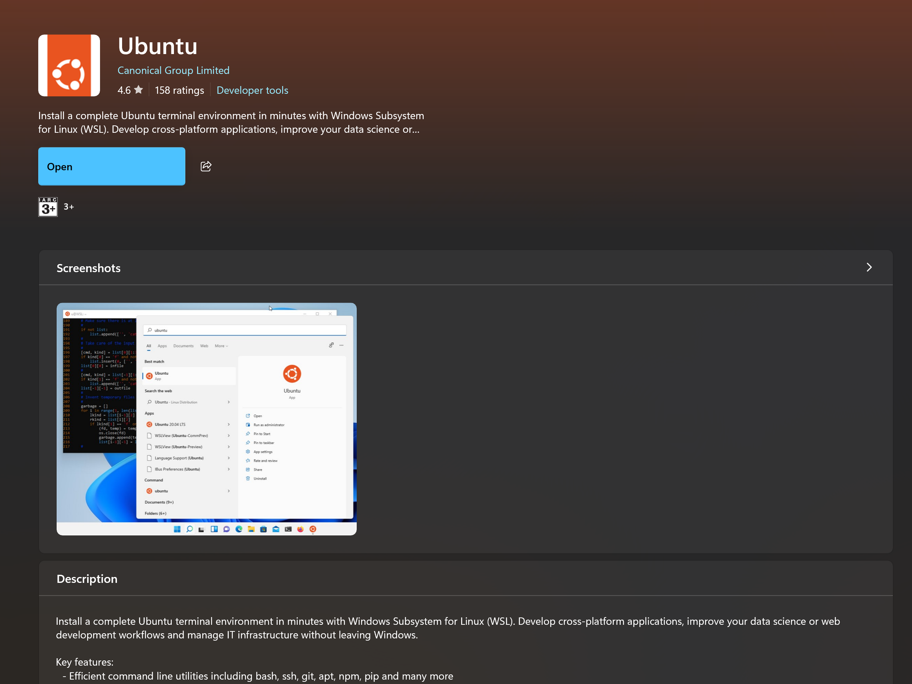

Kerner is the heart ofoperating system
it is othe one who undertsnad the machine lnagauge 
it deals with nertwork and shell

when so we talk to 

linux or os/utlities  talks to shell shell talk to kernel 

centos is discountinued now 

is linux an actual operating system ?
answer is partilaly correct now fully correct 

ubuntu is one distrtibution 

linus is a kernel 
its not a full fledged operating system 

linux torvals origninally built it for managing cpu reosurces ,s ecurity etc 

but for normal users , it tough to undertsnad 

what is kenrel 
hisroty and ocncept of kernel 
core part of os 
only part of os allowed to directly communicate with hardware

harwadre cannot undetsnad what the user wants 

kerner then think how reosurces hsould be handled to complete tthe taslk

kenrel undetnad only 0 and 1 
it canot undertsnad hwat we are syaing 

so in 

Linux doesn't come with recycle bin concpet concept

Ctrl + l to clear

steps to recover files or folders accidentally deleted using the `rm -rf` command, as well as methods to prevent such incidents in the future:

**Immediate Action and Core Concept** If you have accidentally deleted important data, the first rule is to **stop writing any new data** to the drive immediately. In Linux, a file is not physically removed from the disk the moment it is deleted; instead, the **pointer is removed** while the data remains until it is overwritten by new information.

**Step-by-Step Recovery Process**

1. **Terminal Management:** Close the terminal window where the deletion command was executed and open a new one.
2. **Install Recovery Tools:** Install **testdisk** by running `sudo apt install testdisk`. This is a free, open-source tool used by many companies to recover various file types, including photos, code, and documents.
3. **Run Photorec:** Initiate the recovery process by running `sudo photorec`. You must select the path from which the files were deleted and choose the specific file types you wish to recover (such as PDFs). It is critical to **select an output folder on a different drive** for the recovered files. The disk scan can take anywhere from five minutes to an hour depending on the size of the disk.

**Prevention Strategies** To avoid accidental deletions in the future, the source suggests two primary methods:

- **Command Aliasing:** Open your `.bashrc` file and add the line `alias rm='rm -i'`. This forces the system to ask for **confirmation** (Yes or No) every time you use the `rm` command.
- **Using Trash-CLI:** On production servers, consider using **trash-cli** instead of the standard `rm` command. This moves deleted files to a trash folder rather than permanently erasing them immediately.

----

Stop guessing where Linux puts things.  
  
Quick test: do you know the difference between /root and /? Where /var/log lives in incident response? Why /tmp is dangerous?  
  
Most Linux tutorials skip the filesystem. So I built the reference I wish I had when I started.  
  
14 essential directories, each explained with real commands and the files you'll actually find inside:  
  
· /etc → passwords, configs, the keys to the kingdom  
· /var/log → your incident response starts here  
· /tmp → world-writable, sticky bit, malware playground  
· /proc → live kernel state, generated on the fly  
· /sys → modern hardware interface  
· /root → root's home, NOT the filesystem root  
· /opt → where Chrome and IntelliJ actually live  
· /dev · /bin · /lib · /boot · /usr · /home · /mnt → all explained inside

---

how the Linux filesystem is organized, explaining the purpose and key contents of each.

--------------------------------------------------------------------------------

**1. /etc (System Configuration Files)**

- **Overview:** This directory holds plain-text configuration files for the system and most installed services. Changes made here affect the system globally. It is recommended to back up and validate files (using tools like `visudo` or `sshd -t`) before reloading services.
- **Key Files:**
    - **passwd:** User accounts (UID, GID, shell).
    - **shadow:** Hashed user passwords (accessible by root only).
    - **sudoers:** Privilege escalation rules.
    - **crontab:** System-wide scheduled jobs.

**2. /var (Variable Data)**

- **Overview:** `/var` contains files whose contents frequently change as the system runs, such as logs, queues, and databases. Logs in `/var/log` are critical for debugging and incident response.
- **Key Directories:**
    - **log/:** System and application logs.
    - **mail/:** Mail queues and mailboxes.
    - **spool/:** Print, mail, and cron queues.
    - **cache/:** Application cache data.

**3. /home (User Home Directories)**

- **Overview:** Contains a separate directory for each regular user, owned by that user. It stores per-user configurations ("dotfiles") and personal data.
- **Key Files/Dirs:**
    - **.bashrc:** Per-user shell configuration.
    - **.ssh/:** SSH keys, authorized_keys, and config.
    - **.gnupg/:** GPG keys and trust database.
    - **Documents/:** User personal data.

**4. /tmp (Temporary Files)**

- **Overview:** A world-writable scratch space that is cleared upon every reboot. It uses a "sticky bit" (permission 1777), which ensures only the owner of a file can delete it.
- **Key Concepts:**
    - **Sticky bit:** Only file owners can delete their files.
    - **/tmp clean:** Cleared on every reboot.
    - **Watch list:** Often used by attackers as a "drop zone" for malware.

**5. /proc (Virtual Kernel & Process State)**

- **Overview:** A virtual filesystem generated on the fly by the kernel. It contains numbered directories (PIDs) for every running process and files that reveal the live system state.
- **Key Files:**
    - **cpuinfo:** CPU vendor, model, and cores.
    - **meminfo:** Total, free, and cached memory.
    - **mounts:** Currently mounted filesystems.
    - **[PID]/:** Per-process kernel data.

**6. /sys (Kernel and Device Interface)**

- **Overview:** A modern interface for kernel and hardware data, replacing many older `/proc` files. Reading these files reflects the current device state, while writing to certain files allows for kernel tuning.
- **Key Directories:**
    - **class/:** Devices grouped by category.
    - **devices/:** Hardware tree (PCI, USB, etc.).
    - **kernel/:** Kernel internals and parameters.
    - **module/:** Currently loaded kernel modules.

**7. /usr (User Programs and Resources)**

- **Overview:** The secondary hierarchy where most installed software lives. In hardened systems, `/usr` is often read-only. `/usr/local` is specifically for software you compile or install manually.
- **Key Directories:**
    - **bin/:** Most user binaries (commands).
    - **lib/:** Libraries used by `/usr/bin`.
    - **share/:** Architecture-independent data.
    - **local/:** Manually installed software.

**8. /root (Root User Home Directory)**

- **Overview:** The home directory for the root account. It is distinct from the filesystem root (`/`). It is kept under mode 700 permissions to prevent regular users from accessing it.
- **Key Contents:**
    - **Permissions:** Mode 700 (only root can read).
    - **.bash_history:** Root command log (highly valuable for audits).
    - **Admin scripts:** Often stored here on hardened hosts.

**9. /opt (Optional/Third-Party Software)**

- **Overview:** Used for optional, self-contained third-party packages installed outside the standard package manager. Each vendor (e.g., Google, JetBrains) gets its own subdirectory with its own libs and bins.
- **Key Examples:**
    - **google/:** Chrome and other Google software.
    - **jetbrains/:** IntelliJ, PyCharm, etc.
    - **Self-contained:** Each vendor is isolated.

**10. /dev (Device Files)**

- **Overview:** Contains special files that the kernel exposes as devices. Interacting with these files (reading or writing) allows communication with hardware or specific kernel features.
- **Key Files:**
    - **null:** Discards anything written to it.
    - **zero:** Provides an endless stream of null bytes.
    - **urandom:** A cryptographic random source.
    - **sda, sdb:** Block devices representing physical disks.

**11. /boot (Kernel and Bootloader Files)**

- **Overview:** Holds the essential files needed to boot the system. Removing files from this directory can make the system unbootable.
- **Key Files:**
    - **vmlinuz-*:** Compressed Linux kernel.
    - **initrd.img-*:** Initial ramdisk for early boot.
    - **grub/:** GRUB bootloader configuration.
    - **config-*:** Kernel build configuration.

**12. /bin (Essential System Binaries)**

- **Overview:** Contains the most essential commands available to all users. On modern distributions, this is often a symbolic link to `/usr/bin`.
- **Key Commands:**
    - **Shells:** `bash`, `sh`.
    - **File operations:** `ls`, `cat`, `cp`, `mv`, `rm`.

**13. /lib (Essential Shared Libraries)**

- **Overview:** Holds the libraries required by binaries in `/bin` and `/sbin`. The `ld-linux` tool loads these libraries at startup.
- **Key Contents:**
    - **libc.so.6:** The C standard library (glibc).
    - **ld-linux-*:** Dynamic linker/loader.
    - **modules/:** Loadable kernel modules (often a target for rootkits).

**14. /mnt (Manual Mount Points)**

- **Overview:** The conventional location for mounting filesystems manually, such as USB drives or network shares. In contrast, `/media` is typically reserved for automatic, system-managed mounts.
- **Key Directories:**
    - **usb/:** Manual external device mounts.
    - **backup/:** Network shares or extra disks.
    - **Custom dirs:** Anything mounted by the user.

----

